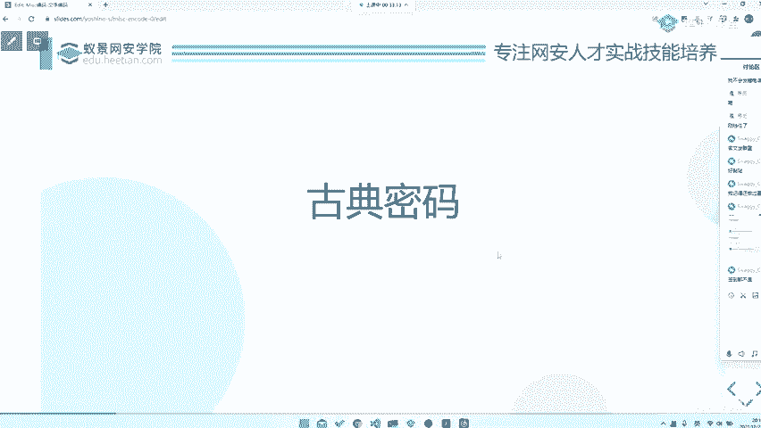
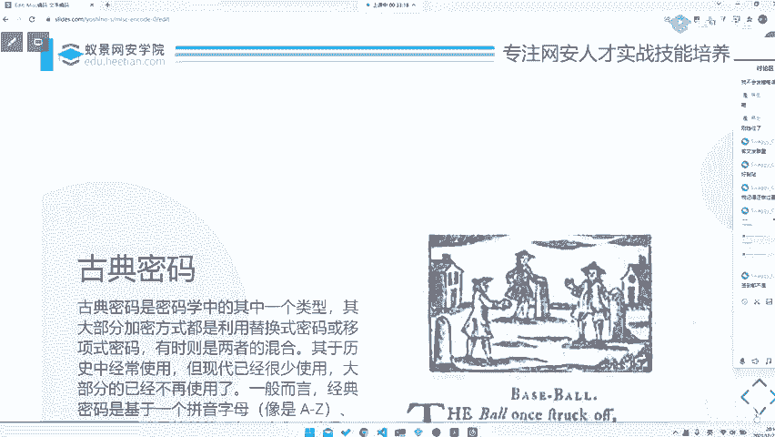

# CTF入门教程：P56：misc文字古典密码 🔐

在本节课中，我们将要学习CTF比赛中Misc（杂项）类别下的一个基础且常见的题型——古典密码。古典密码通常是比赛中的“签到题”，旨在考验选手对基础密码的快速识别和破解能力。

---

## 古典密码概述

上一节我们介绍了Misc题型的多样性，本节中我们来看看其中一种经典类型：古典密码。

古典密码是密码学中的一个历史类型，属于现代密码学发展前的古典密码学部分。它主要基于**替换**或**移位**操作对文本进行加密。

这种加密方式会导致密文具有**可区分性**，即密文会保留原始明文的一些统计特征（如字母频率）。这部分涉及密码学中的可区分性与不可区分性概念，但本教程不会深入探讨。

需要注意的是，古典密码通常针对**单个字母**进行操作。例如，对字母进行位置上的替换（如凯撒密码的移位），或直接替换为另一个字母（如单表替换密码）。

古典密码是一种相对简单的密码学形式，历史上多基于手动操作。这导致其**可破解性非常高**。通过一些简单的方法，如词频分析，或更复杂一点的暴力破解（爆破），通常可以快速解密。

以下是古典密码的几个核心特点：
*   **操作基础**：基于替换或移位。
*   **目标单位**：通常针对单个字母。
*   **安全性低**：因其规律性明显，易于通过分析或暴力手段破解。

---

## 比赛中的古典密码题

在CTF比赛中，古典密码题常作为“签到题”出现。签到题的意义在于让选手快速得分，活跃比赛气氛。

这类题目主要考验选手的**手速**和**敏感度**。你需要非常快速地对题目进行分析，识别出所使用的古典密码类型，并应用相应的工具或方法进行解密。因此，熟悉常见的古典密码及其特征是至关重要的。

---

## 总结

本节课中我们一起学习了CTF中Misc类型的古典密码题。我们了解到古典密码基于替换或移位，安全性较低，常作为比赛的签到题出现，解题关键在于快速识别和运用基础破解方法（如词频分析、暴力破解）。掌握这些基础知识，将帮助你在比赛中迅速拿下这类题目的分数。