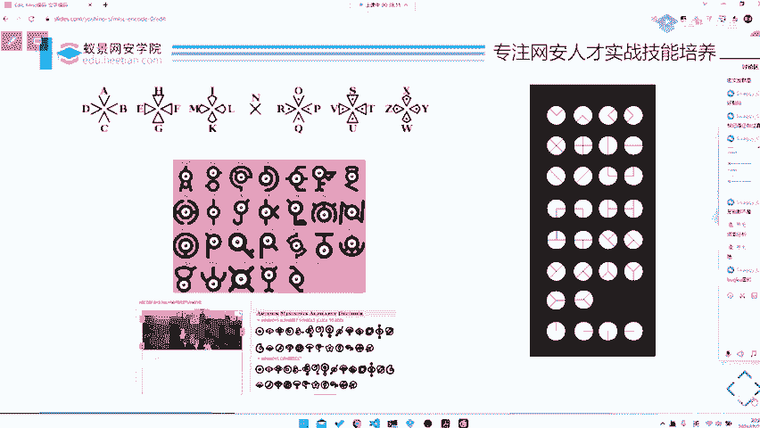
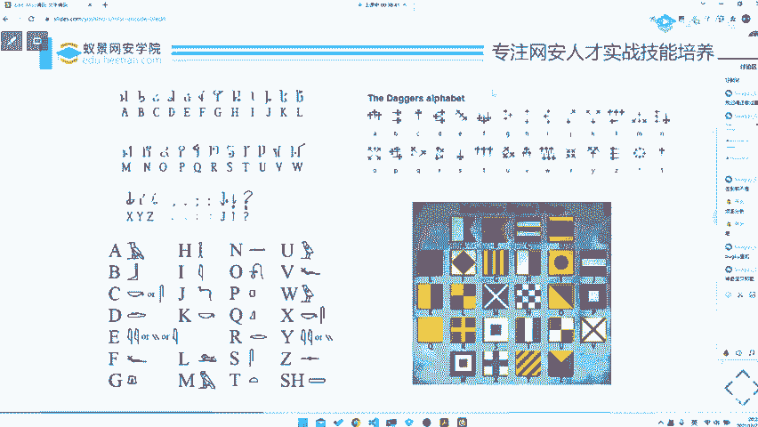
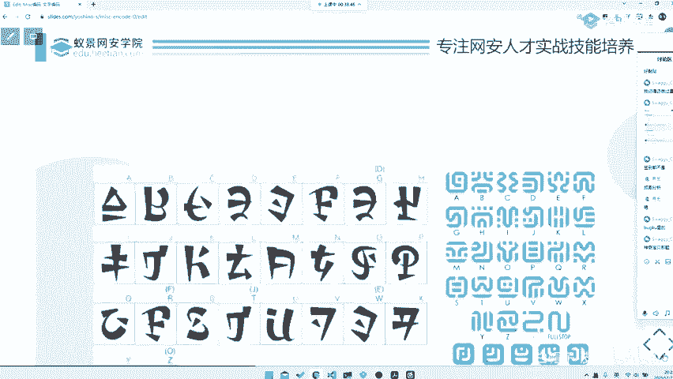
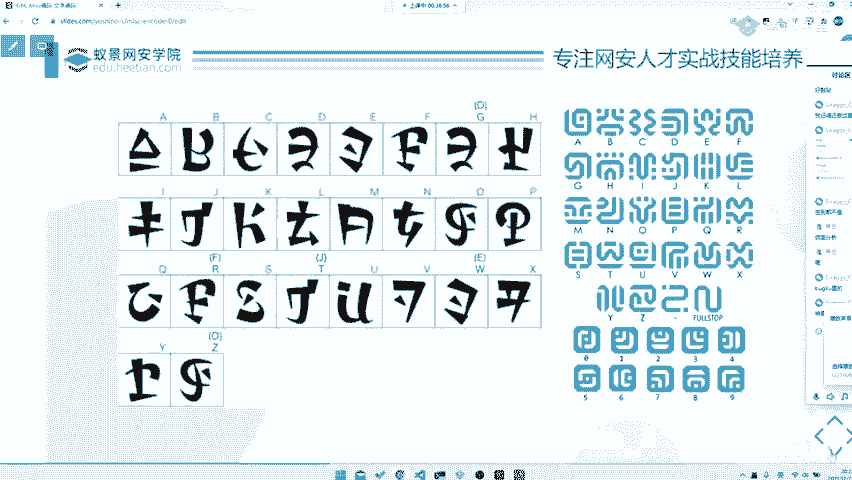
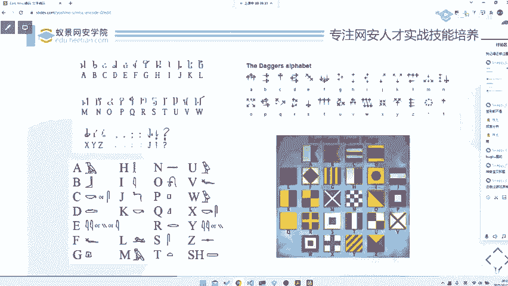
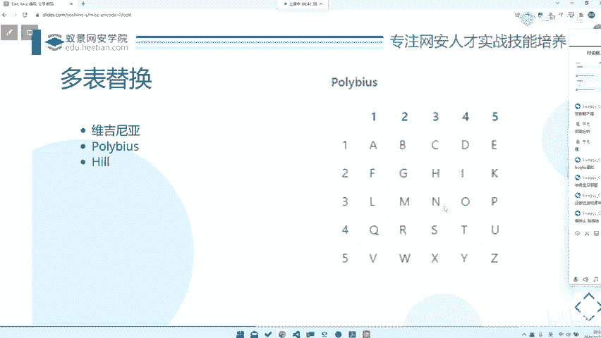

# CTF入门教程：P57：misc替换式编码 🔐


在本节课中，我们将要学习CTF杂项（Misc）题目中常见的“替换式编码”。这是一种基础的密码学概念，理解它将帮助你解决许多入门级的CTF题目。

## 什么是替换式编码？ 🔄

上一节我们介绍了编码的基本概念，本节中我们来看看替换式编码。替换式编码是最常见的密码形式之一，其核心是将明文中的字母或符号按照特定规则替换为其他字母或符号。

一个经典的例子是凯撒密码。凯撒密码本质上是ROT3，即将字母表中的每个字母向后移动三位。例如，字母A被替换为D，B被替换为E，以此类推。

**公式示例：**
对于凯撒密码（ROT-n），加密过程可以表示为：
`C = (P + n) mod 26`
其中，`C`是密文字母，`P`是明文字母，`n`是位移量（如ROT3中n=3）。

## 单表替换密码 📋

单表替换密码使用一个固定的密码表进行一一对应替换。例如，猪圈密码就是一种典型的图形化单表替换密码。

以下是猪圈密码的典型特征和解题思路：

*   **固定密码表**：这类密码依赖于一个预先定义好的、固定的对照表。例如，猪圈密码用特定的网格和点组合来代表字母。
*   **解题关键**：解题的核心在于识别出密码的特征并找到对应的密码表。
*   **图形变体**：出题人通常不会改变密码表本身（那会导致题目无解），但可能会在图形的样式上做手脚，例如改变边框形状（方框变圆框）或将密码表隐藏在图片的LSB（最低有效位）隐写中。
*   **记忆与识别**：对于初学者，不需要死记硬背所有密码表，但需要熟悉常见替换密码（如跳舞小人密码、银河密码、圣殿骑士密码等）的**图形特征**。这样在遇到时才能快速联想到对应的解密方法。



## 对替换编码题目的看法 💭

我认为，纯粹依赖记忆图形密码表的题目，不应出现在高质量的CTF比赛中。这类题目主要考察信息搜集和记忆力，而非真正的分析与解题技巧，意义有限。





真正优秀的题目可能会将替换编码与其他技巧（如隐写）结合，增加题目的深度和趣味性。



## 多表替换密码 🗂️

多表替换密码是为了克服单表替换易受词频分析攻击的弱点而设计的。在单表替换中，密文里出现频率最高的符号通常对应明文中的字母‘E’。多表替换使用多个密码表，打乱了这种固定的频率关系。



常见的多表替换密码包括弗吉尼亚密码和希尔密码。

*   **弗吉尼亚密码**：使用一个关键词来决定在不同位置使用哪个位移的凯撒密码。
*   **希尔密码**：基于矩阵乘法的加密算法，将明文分组转换为密文。
    **代码概念示例（希尔加密核心思想）：**
    ```
    C = (P * K) mod 26
    ```
    其中，`C`是密文向量，`P`是明文向量，`K`是密钥矩阵。
*   **挑战**：多表替换加密后的输出仍然是一串普通字符，没有明显的特征符号，这给识别和破解带来了更大挑战。通常需要结合上下文、尝试已知的密钥或使用更复杂的分析方法。

## 关于“套娃”题 ❌

在CTF题目中，有时会遇到“套娃”题，即一层解密后得到的仍是密文，需要再次甚至多次使用不同的密码进行解密。

我个人非常不赞同这种出题方式。许多高质量的赛事也明令禁止此类题目。层层套娃并不能体现题目的质量，反而会让解题过程变得冗长和乏味，对锻炼解题思维帮助不大。建议初学者优先选择参与高质量的比赛，接触更有启发性的题目。

---



**本节课中我们一起学习了：**
1.  **替换式编码**的基本原理，包括凯撒密码（ROT-n）的公式。
2.  **单表替换密码**，如猪圈密码，其关键在于识别图形特征并找到密码表。
3.  **多表替换密码**，如弗吉尼亚密码和基于矩阵的希尔密码，它们旨在对抗词频分析。
4.  对单纯考察记忆的图形密码题以及“套娃”式题目进行了讨论，强调了在CTF学习中追求题目质量的重要性。