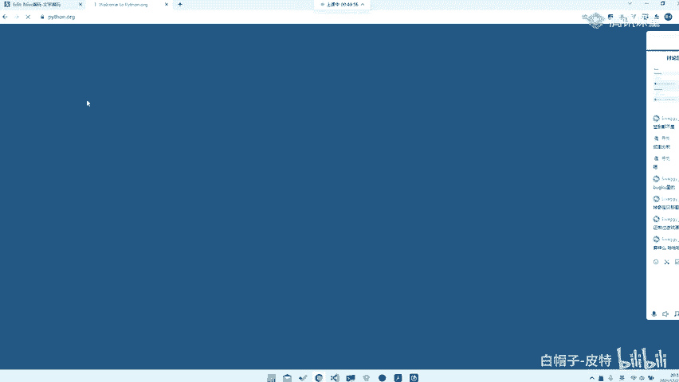
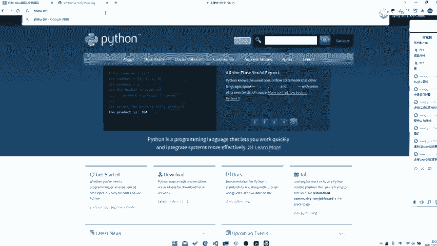
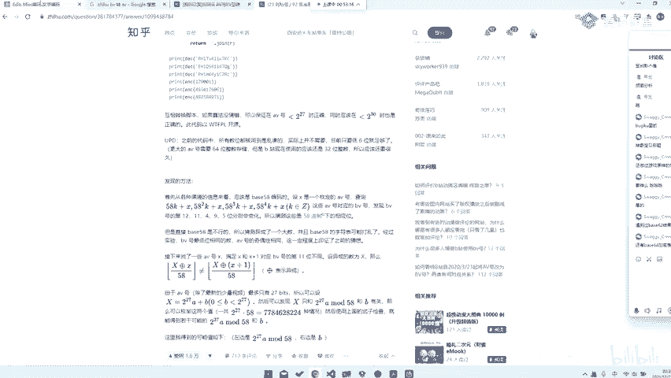
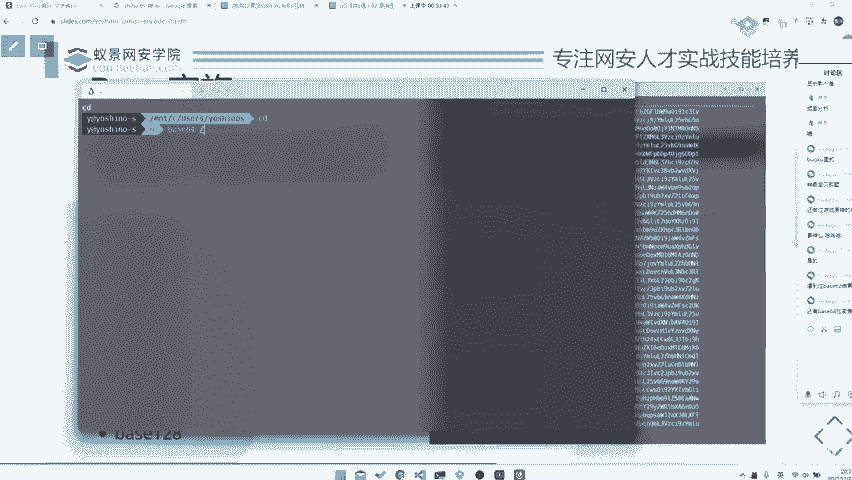

# CTF入门教程：P59：misc base家族编码 🧩

在本节课中，我们将要学习CTF比赛中Misc（杂项）类别中一个非常基础且重要的概念：Base家族编码。我们将了解什么是Base编码，它的常见类型、特征以及在实际解题中的应用和注意事项。

## 什么是Base编码？🔍

Base编码是一种将二进制数据（如文件）用特定字符集表示出来的编码方式。例如，Base64编码就是使用64个字符的字符集来表达数据。

## Base家族的种类 📚

Base家族有很多成员，最常见的是Base32和Base64。此外，还有Base16、Base58、Base91、Base92、Base36等。基本上，你能想到的数字都可能对应一种Base编码。

## 编码不一致的问题与解题思路 ⚠️

在实际的CTF题目中，你可能会遇到一个棘手的问题：不同库或不同定义下的同一种Base编码（如Base58）可能产生不同的结果。出题人可能使用某个特定网站或自定义的编码表。

**核心应对策略**：
1.  题目通常会提示编码类型。
2.  若无提示，则需要根据特征进行尝试或爆破。
3.  了解编码原理有助于应对“换表”等变种题型。

## Base编码的特征识别 🕵️

识别编码特征是解题的关键第一步。以下是两种常见编码的特征：

**Base64特征**：
*   编码后的字符串通常由大小写字母、数字以及 `+` 和 `/` 组成。
*   为了对齐，字符串**末尾常有一个或两个等号 `=` 作为填充（padding）**。
*   但需要注意的是，没有等号的Base64字符串也是可能存在的，并且可以被正确解码。

**Base32特征**：
*   编码后的字符串通常**全部由大写字母和数字2到7组成**。
*   同样，也可能使用 `=` 进行填充。

> **提示**：等号的作用是填充（padding），使数据长度符合编码要求。从原理上讲，没有等号时，解码程序通常也能通过计算还原数据。

## 学习建议与工具 🛠️

为了更有效地解决CTF题目，特别是涉及编码转换和脚本编写的题目，掌握Python是非常必要的。

以下是给初学者的学习建议：
*   **务必提前学习Python**。后续课程会大量使用Python编写解题脚本。
*   熟练程度要求：**非常熟练**。至少能使用Python进行基本的编码解码、文件操作和逻辑处理。
*   本节课会有一道题目涉及Python，我们将一起尝试使用它来解题。

## 总结 📝

本节课我们一起学习了Base家族编码的基础知识。我们了解了Base编码的本质，认识了Base64和Base32等常见类型的特征，并讨论了实际解题中可能遇到的编码表不一致等问题的应对思路。记住，识别编码特征是第一步，结合题目提示和工具（如Python脚本）进行尝试是解题的关键。在接下来的课程中，我们将学习更多Misc类别的技巧和实战方法。