# CTF入门教程：P5：Web-Hackerbar的安装及使用 🔧

在本节课中，我们将要学习第二个重要的浏览器插件——Hackerbar。这是一个功能强大的工具，主要用于Web安全测试，能够方便地修改和重发HTTP请求，对于CTF-Web方向的题目实战非常有帮助。

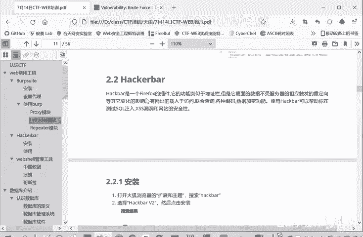

上一节我们介绍了SwitchyOmega代理插件的安装与配置，本节中我们来看看如何安装和使用Hackerbar。

## 工具简介与选择

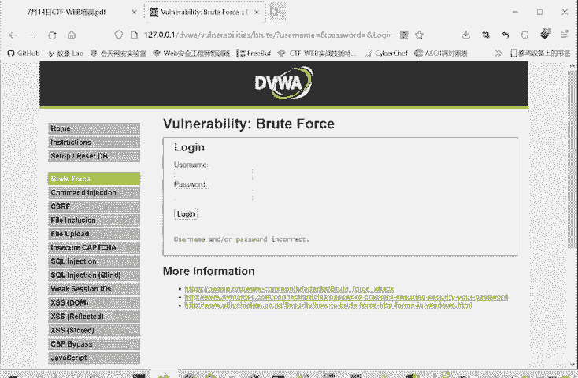

Hackerbar是Firefox浏览器的一个插件。这里推荐使用Firefox，因为它安装插件非常方便。虽然谷歌浏览器也能使用，但经常需要“挂梯子”，这对部分同学来说可能不具备条件。

因此，我们选择在Firefox浏览器中进行安装。

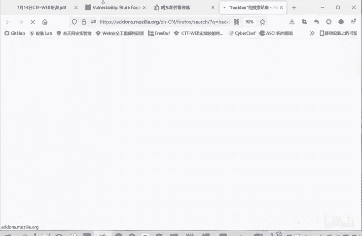

## 安装Hackerbar插件

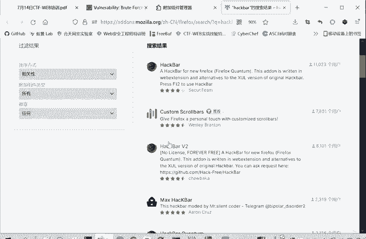

安装方法与安装SwitchyOmega类似，都是在浏览器的扩展管理页面进行操作。

以下是安装步骤：
1.  打开Firefox浏览器，进入扩展管理板块。
2.  在搜索框中输入“Hackerbar”进行搜索。
3.  在搜索结果中，请注意区分版本。通常，“Hackerbar”可能需要收费，而“Hackerbar V2”是免费版本。请根据自身情况选择。
4.  点击进入你选择的插件页面，然后点击“添加”按钮进行安装。
5.  如果想删除该插件，只需在扩展管理页面找到它，点击“移除”即可。

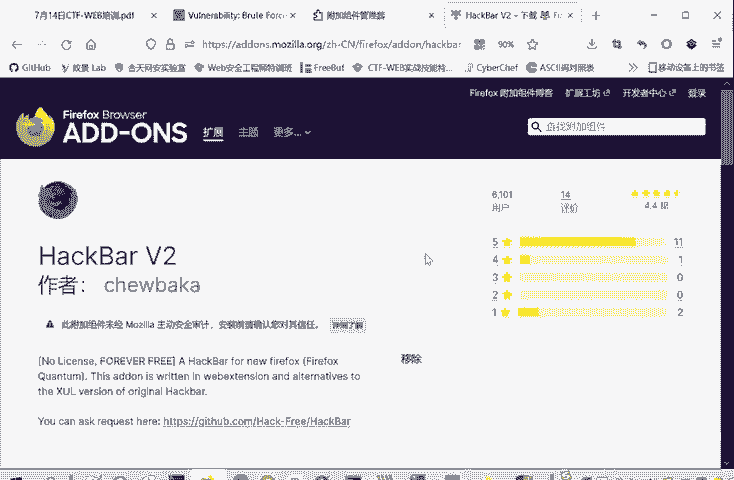

## 启用与界面介绍

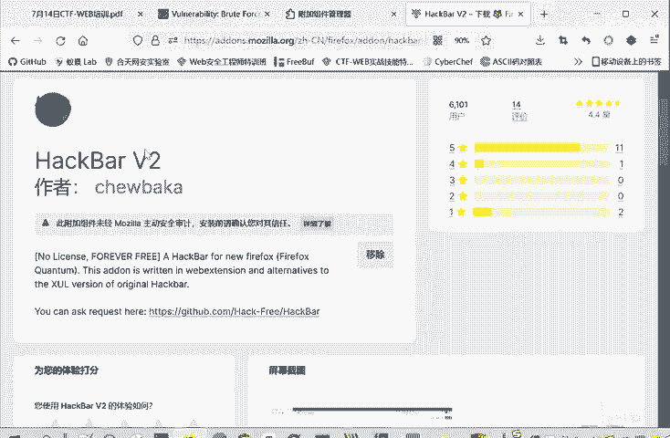

安装完成后，Hackerbar不会像SwitchyOmega那样直接显示在浏览器工具栏上。

启用它的方法是：
1.  在网页任意位置点击鼠标右键，选择“检查元素”，或者直接按键盘上的 `F12` 键，打开开发者工具。
2.  在开发者工具的面板中，会出现一个名为“Hackerbar”的选项卡，点击它即可打开Hackerbar的主界面。

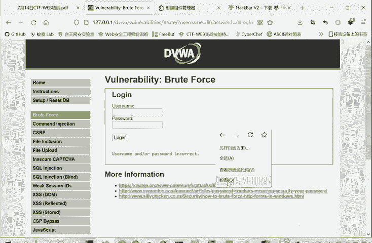

## 基本功能与使用

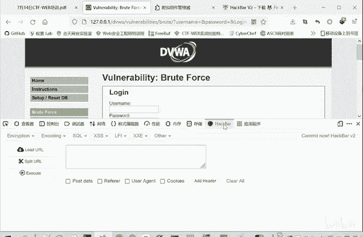

Hackerbar的核心功能是拦截、查看和修改HTTP请求。

例如，当我们测试一个页面的访问口令时，可以点击 `Load URL` 按钮，将当前页面的URL地址导入到Hackerbar中。

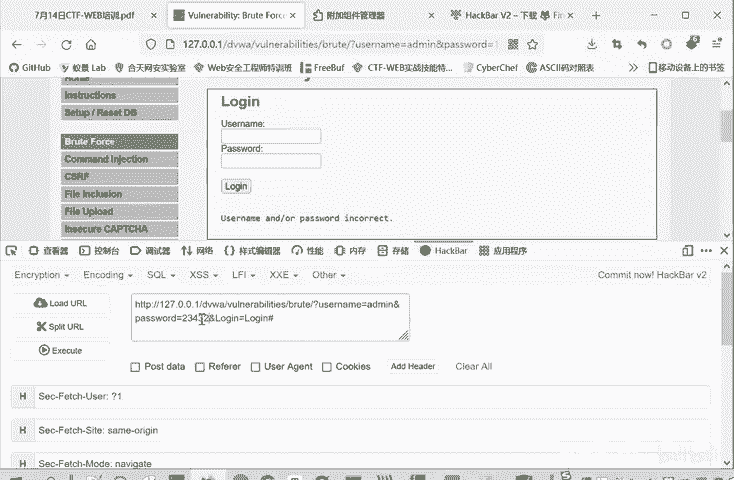

如果我们想手动测试不同的参数，可以直接在Hackerbar的输入框中进行修改。

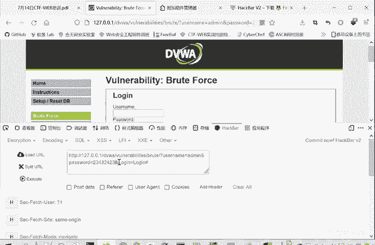

修改完成后，点击 `Execute` 按钮，Hackerbar就会使用修改后的参数重新访问这个URL。

虽然直接在浏览器地址栏修改URL也能达到类似效果，但使用Hackerbar修改后，浏览器地址栏的URL会保持稳定不变，这更方便我们进行多次、系统的参数修改测试。

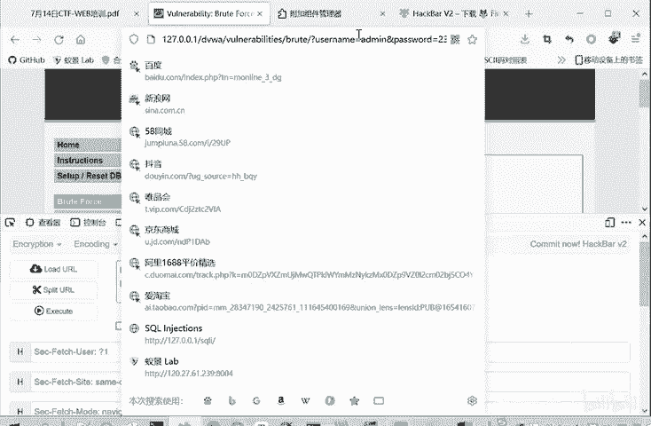

## 高级请求修改

除了修改URL参数，Hackerbar还支持修改更复杂的HTTP请求内容。

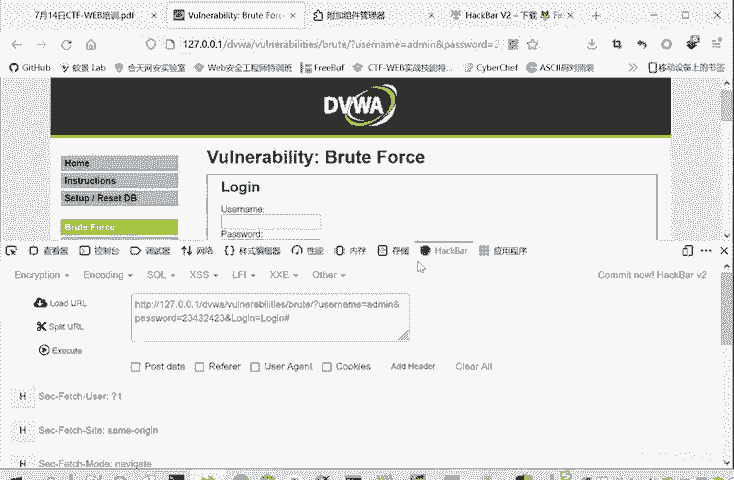

以下是它可以修改的部分内容：
*   **POST Data**：修改通过POST方法提交的数据。
*   **Referer**：修改请求头中的来源页面信息。
*   **User-Agent**：修改客户端浏览器的标识信息。
*   **Cookies**：修改请求携带的Cookie信息。

这些功能使得Hackerbar成为一个在Web安全测试中非常有用的插件，强烈推荐大家安装并使用它。

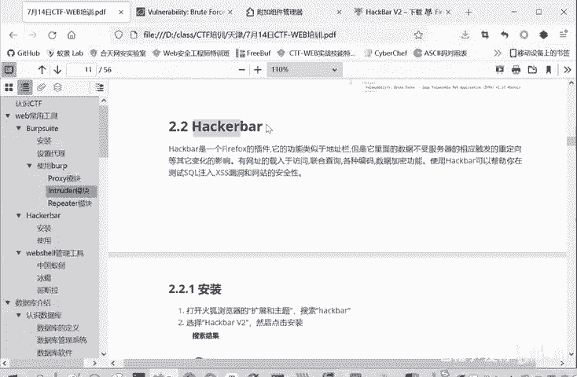

本节课中我们一起学习了Hackerbar插件的安装与基本使用方法。它作为一个强大的请求修改工具，能极大地提升我们在CTF-Web题目以及日常Web安全测试中的效率。请务必动手实践，熟悉其各项功能。