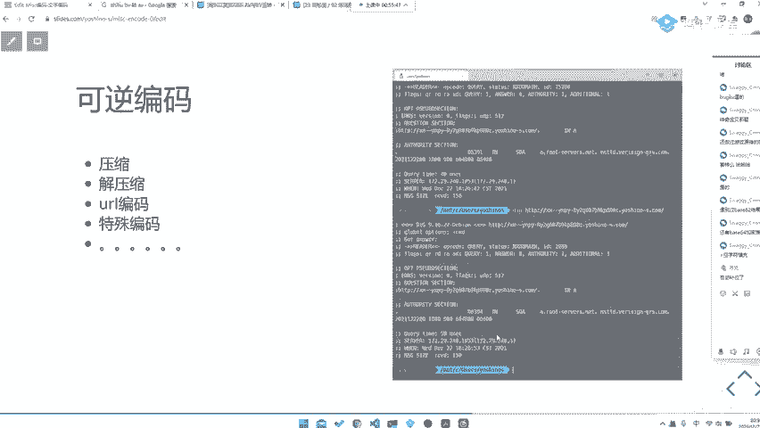
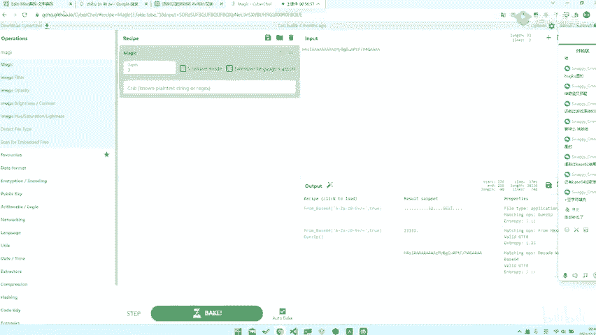
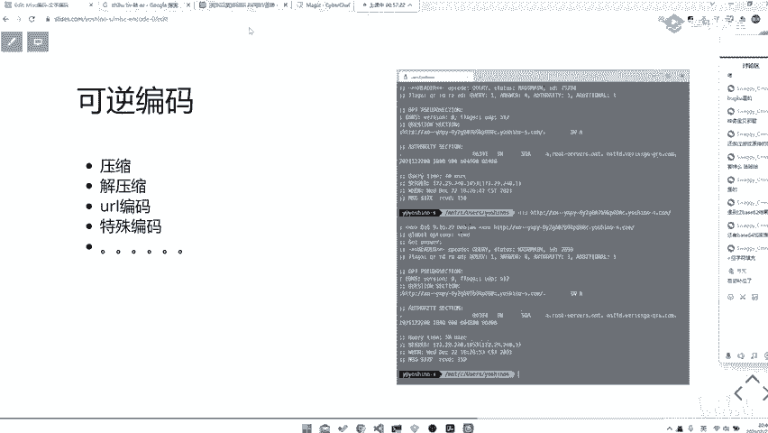
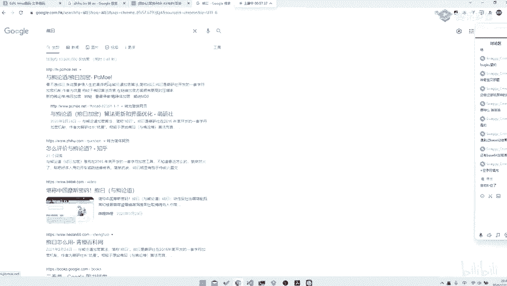
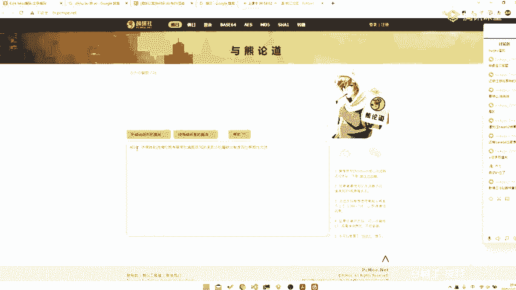
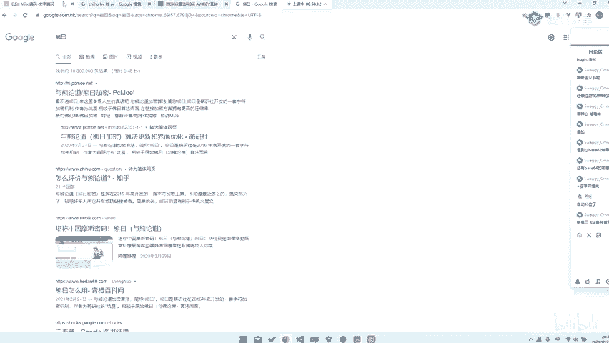
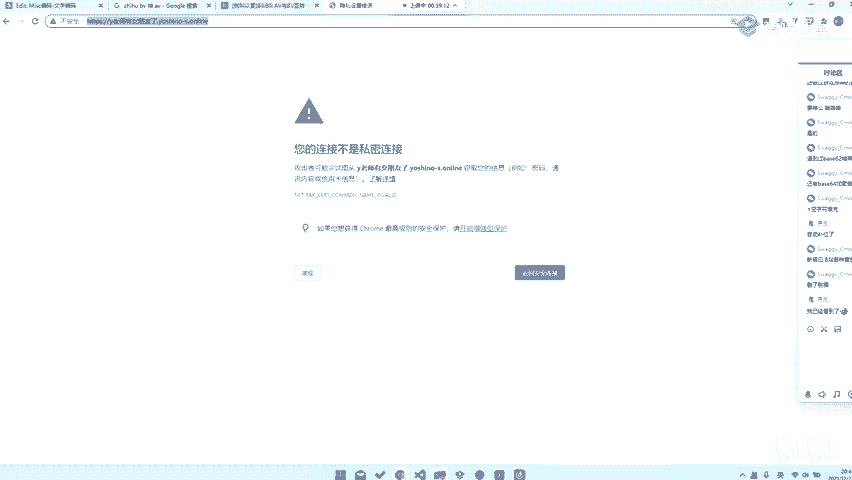
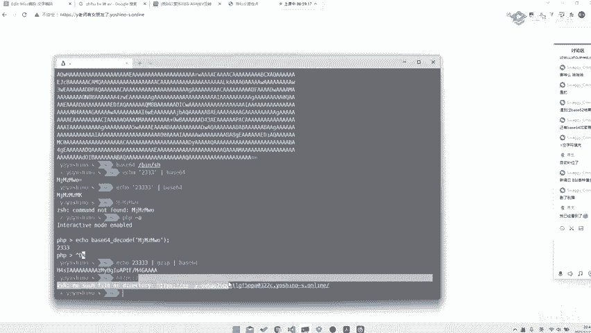
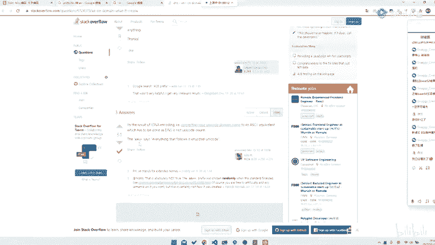

# CTF系列教程：P60：misc 可逆编码 🧩

在本节课中，我们将学习CTF杂项（Misc）题目中常见的几种可逆编码。这些编码形式多样，识别并正确解码它们是解题的关键。我们将从基础编码形式入手，逐步介绍一些特殊和复合的编码类型，并演示如何使用工具进行自动化分析。

## 常见编码形式

上一节我们介绍了基础编码，本节中我们来看看一些更复杂的表现形式。

有时编码后的数据不以可读字符形式出现，而是以十六进制值（0x00到0xFF）的形式呈现。例如，你可能会遇到 `e233` 这样的形式，它可能是Gzip压缩后的数据，又经过了Base64编码。

对于这种复合编码的数据，直接解码可能会得到乱码。此时，它可能隐含了其他形式的编码，例如AES加密等。

## 使用工具进行自动化解码

面对未知或复合编码，使用自动化工具是高效的方法。

以下是使用 CyberChef 工具进行解码的示例：
1.  将编码后的字符串（如 `e233...`）放入 CyberChef 的输入框。
2.  尝试使用“Magic”功能进行自动识别和解码。
3.  工具可能会自动应用一系列解码操作（如 `From Base64` -> `Gunzip`），并最终输出可读结果。

`CyberChef` 的 `Magic` 功能非常强大，有时甚至无需手动选择任何操作，它就能自动识别并解码出正确内容。我们将在后续课程中详细介绍 CyberChef 的使用。

## 其他特殊编码

除了标准的Base64、Hex等，CTF中还会出现许多特殊的编码形式。

以下是几种常见的特殊编码及其特征：
*   **URL编码**：特征为大量 `%XX` 形式的字符，其中XX为十六进制数。
*   **与佛论禅/熊曰/熊约编码**：特征为以特定中文词语开头（如“熊曰”），后面跟随一段由“呋、嘶、咯”等字组成的密文。遇到此类编码，可直接搜索“熊约解码”等关键词在线解码。
*   **Punycode编码**：常用于国际化域名，特征为以 `xn--` 开头。例如，`xn--vi8hiv.ws` 解码后可能是中文或其他语言内容。

## 如何识别未知编码

当遇到无法识别的编码时，可以遵循以下步骤：

1.  **观察特征**：查看编码字符串是否有明显前缀（如 `xn--`）、特定开头词汇（如“熊曰”）或固定模式（如全是 `%XX`）。
2.  **搜索特征**：将特征字符串（如“熊曰 呋 嘶 咯”）直接放入搜索引擎，通常能找到对应的解码工具或说明。
3.  **使用通用工具**：将字符串放入 `CyberChef` 并使用 `Magic` 功能，或使用 `ciphey` 等自动化解码工具进行尝试。
4.  **查询编码类型**：对于像 `xn--` 这类编码，可以将其放入搜索引擎查询“xn-- what encoding”，结果会指出这是Punycode编码，进而引导你找到解码方法。

本节课中我们一起学习了CTF杂项题目中常见的几种可逆编码，包括其表现形式和识别方法。我们了解到，面对复合或特殊编码时，观察特征、善用搜索引擎以及利用 `CyberChef` 等工具的自动化功能是解决问题的有效途径。掌握这些方法将帮助你更从容地应对编码类题目。