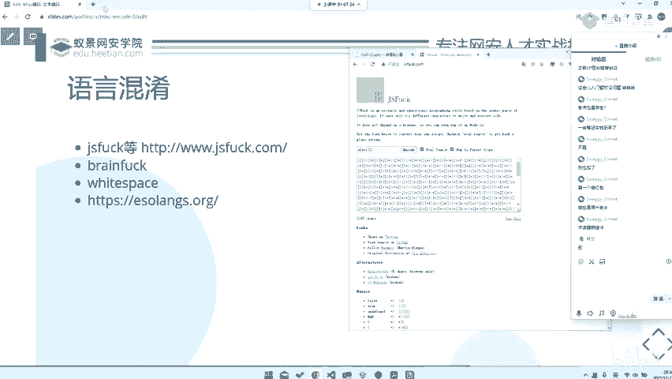
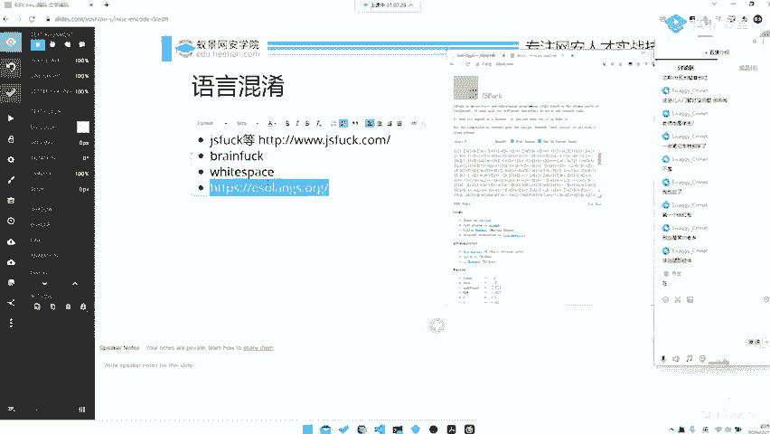
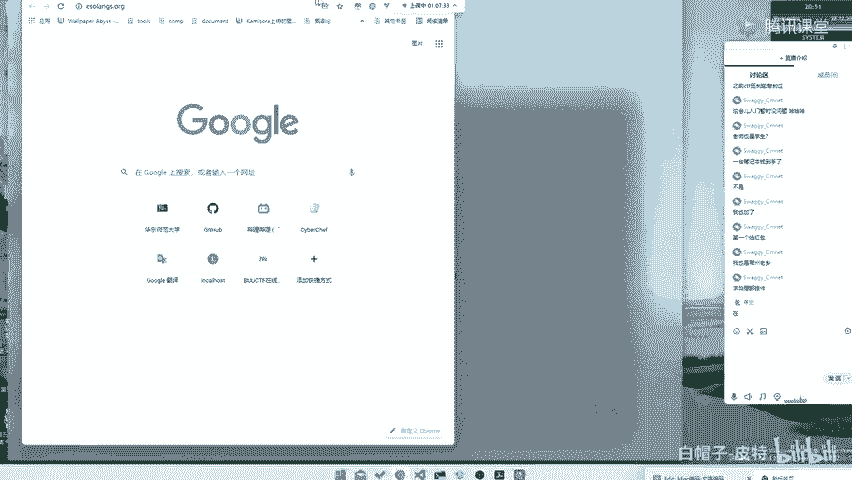
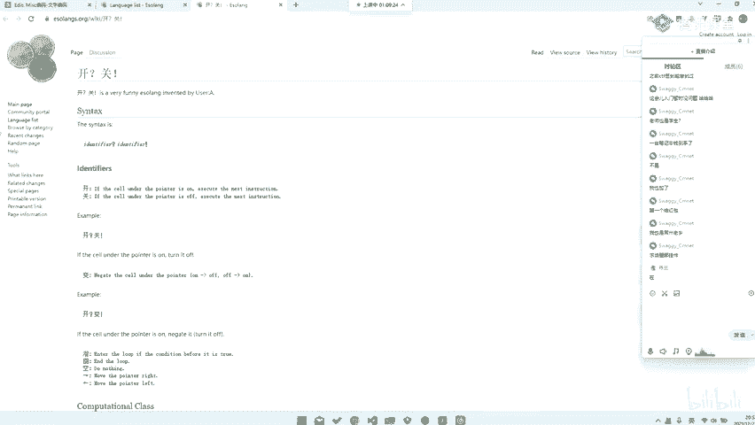
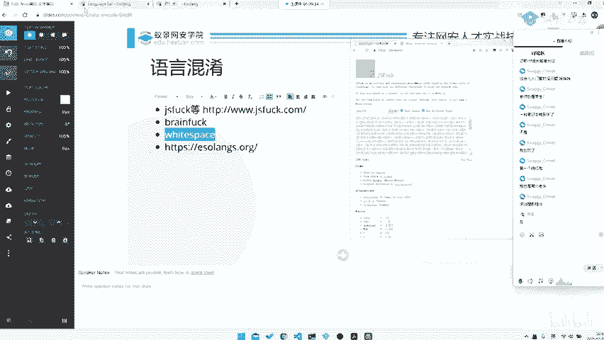
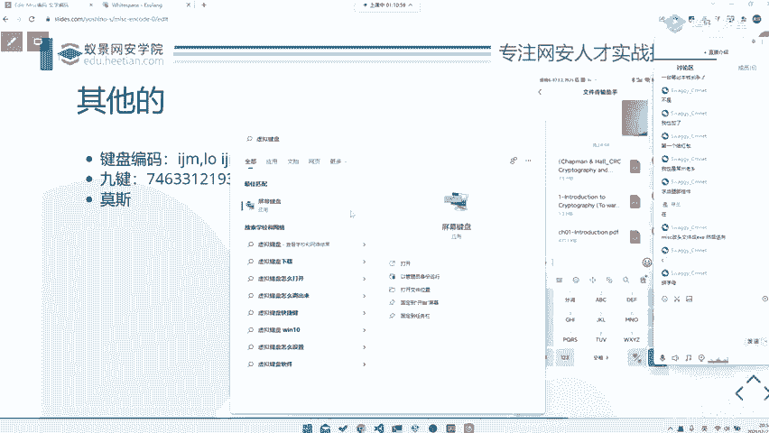
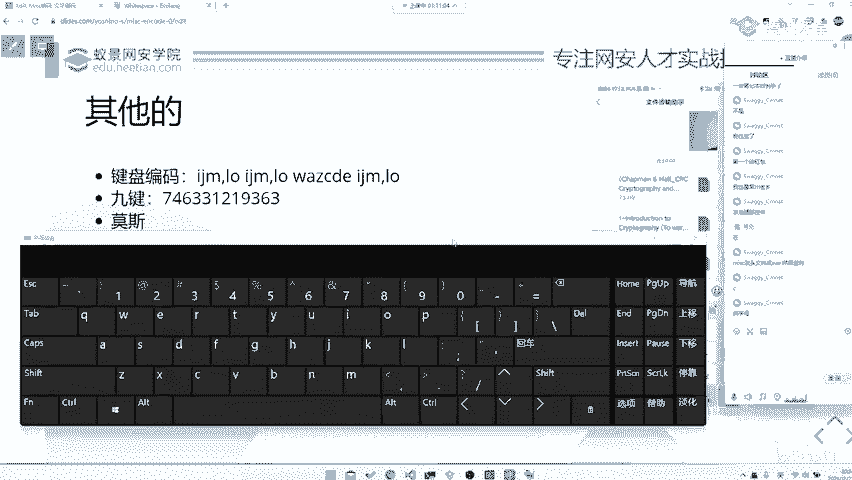
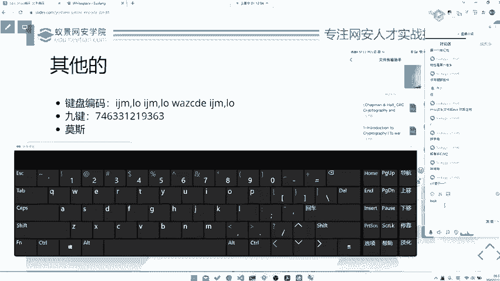
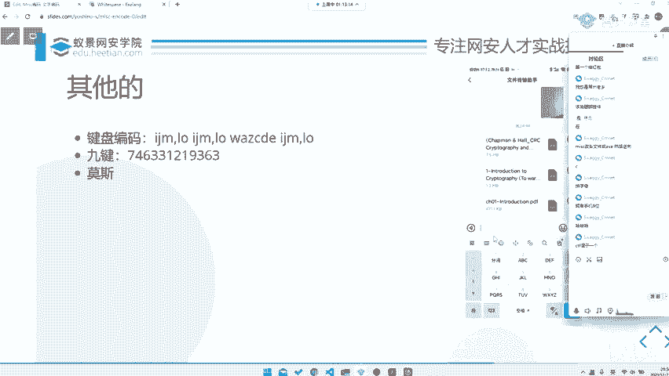

# CTF系列教程：P61：misc 其他语言混淆 🔤


在本节课中，我们将学习CTF杂项（misc）中一类有趣的题目：其他语言混淆。这类题目通常会将信息隐藏在如JSFuck、Brainfuck等使用极简字符集编写的代码中，考验选手识别和“解密”这些特殊语言的能力。

## 认识混淆语言

上一节我们介绍了常见的编码，本节中我们来看看那些使用特殊字符集构成的“混淆语言”。这类语言的特点是仅使用极少数符号（如括号、加号等）就能实现图灵完备的编程功能。

### JSFuck 示例与原理

JSFuck是一种仅使用六个字符 `[`、`]`、`(`、`)`、`+`、`!` 来编写有效JavaScript代码的编码方式。

以下是其工作原理的简单演示。例如，原始的JavaScript代码 `alert(23333)` 可以被编码成如下形式：

```javascript
[][(![]+[])[+[]]+([![]]+[][[]])[+!+[]+[+[]]]+(![]+[])[!+[]+!+[]]+(!![]+[])[+[]]+(!![]+[])[!+[]+!+[]+!+[]]+(!![]+[])[+!+[]]][([][(![]+[])[+[]]+([![]]+[][[]])[+!+[]+[+[]]]+(![]+[])[!+[]+!+[]]+(!![]+[])[+[]]+(!![]+[])[!+[]+!+[]+!+[]]+(!![]+[])[+!+[]]]+[])[!+[]+!+[]+!+[]]+(!![]+[][(![]+[])[+[]]+([![]]+[][[]])[+!+[]+[+[]]]+(![]+[])[!+[]+!+[]]+(!![]+[])[+[]]+(!![]+[])[!+[]+!+[]+!+[]]+(!![]+[])[+!+[]]])[+!+[]+[+[]]]+([][[]]+[])[+!+[]]+(![]+[])[!+[]+!+[]+!+[]]+(!![]+[])[+[]]+(!![]+[])[+!+[]]+([][[]]+[])[+[]]+([][(![]+[])[+[]]+([![]]+[][[]])[+!+[]+[+[]]]+(![]+[])[!+[]+!+[]]+(!![]+[])[+[]]+(!![]+[])[!+[]+!+[]+!+[]]+(!![]+[])[+!+[]]]+[])[!+[]+!+[]+!+[]]+(!![]+[])[+[]]+(!![]+[][(![]+[])[+[]]+([![]]+[][[]])[+!+[]+[+[]]]+(![]+[])[!+[]+!+[]]+(!![]+[])[+[]]+(!![]+[])[!+[]+!+[]+!+[]]+(!![]+[])[+!+[]]])[+!+[]+[+[]]]+(!![]+[])[+!+[]]]((![]+[])[+!+[]]+(![]+[])[!+[]+!+[]]+(!![]+[])[!+[]+!+[]+!+[]]+(!![]+[])[+!+[]]+(!![]+[])[+[]]+(![]+[][(![]+[])[+[]]+([![]]+[][[]])[+!+[]+[+[]]]+(![]+[])[!+[]+!+[]]+(!![]+[])[+[]]+(!![]+[])[!+[]+!+[]+!+[]]+(!![]+[])[+!+[]]])[!+[]+!+[]+[+[]]]+[+!+[]]+(!![]+[][(![]+[])[+[]]+([![]]+[][[]])[+!+[]+[+[]]]+(![]+[])[!+[]+!+[]]+(!![]+[])[+[]]+(!![]+[])[!+[]+!+[]+!+[]]+(!![]+[])[+!+[]]])[!+[]+!+[]+[+[]]])()
```

**如何执行与解密？**
其核心原理是使用JavaScript的 `eval()` 函数来执行这些构造出来的字符串。在浏览器的开发者工具控制台（Console）中直接粘贴并运行这段代码，即可弹出内容为“23333”的警告框。

如果代码不是简单的 `alert`，而是包含逻辑判断（例如 `if(f0==1){alert(“black”)}`），同样可以通过 `eval()` 来执行。有时，为了便于观察输出，可以将 `alert` 替换为 `console.log`。





### 其他混淆语言



除了JSFuck，CTF中还会遇到其他“极简”或“混淆”语言。

以下是几种常见的类型：
*   **Brainfuck**： 一种仅使用8个字符 `> < + - . , [ ]` 的编程语言。
*   **Whitespace**： 一种仅使用空格、制表符和换行符作为有效字符的语言。
*   **Ook!**： 一种仅由“Ook.”、“Ook?”、“Ook!”三种单词组合而成的语言。

对于这类题目，通常的解题思路是寻找在线的解释器（Interpreter）或IDE来直接运行代码，获取输出结果。

> **注意**： 杂项（misc）题目的边界有时很模糊。一个题目可能同时涉及编码、逆向甚至Web知识。作为misc选手，知识面越广，解决综合性题目的能力就越强。

## 另类“编码”形式



混淆语言是编码的一种特殊形式。除此之外，CTF中还存在一些基于日常工具的“脑洞”编码。



### 键盘编码

键盘编码是一种基于键盘布局的简单替换密码。

以下是一个例子，密文为：
```
Ijm, lo k
Wa zxcd e
```

**解密方法**： 观察你的键盘。密文中的每个字母，都对应其所在键位**正上方**的字母。
*   `I` 上方是 `U`
*   `J` 上方是 `M`
*   `M` 上方是 `J`
*   `,` 上方是 `K`
*   `L` 上方是 `O`
*   `O` 上方是 `I`
*   `K` 上方是 `I`
*   `W` 上方是 `Q`
*   `A` 上方是 `S`
*   `Z` 上方是 `A`
*   `X` 上方是 `Z`
*   `C` 上方是 `X`
*   `D` 上方是 `S`
*   `E` 上方是 `W`

依次解码后，可以得到明文：`You look at the keyboard`。





### 九键编码

九键编码基于传统手机T9键盘的布局，用数字和序号表示字母。

以下是一个例子，密文为：
```
74 63 31
```



**解密方法**： 参照九宫格键盘图。每个数字代表按键，其后的数字代表该键上的第几个字母。
*   `7` 键上的第4个字母是 `S`
*   `6` 键上的第3个字母是 `O`
*   `3` 键上的第1个字母是 `D`

因此，明文是：`SOD`（或根据上下文理解为其他含义）。

## 总结

本节课中我们一起学习了CTF杂项中“其他语言混淆”类题目的常见形式。
1.  我们认识了 **JSFuck** 等极简字符集语言，理解了其通过 `eval()` 执行的核心原理，并掌握了在浏览器控制台运行解密的基本方法。
2.  我们了解了 **Brainfuck、Whitespace** 等其他混淆语言，知道可以通过寻找在线解释器来解题。
3.  我们探讨了两种有趣的“脑洞”编码：**键盘编码**和**九键编码**，学会了通过观察日常工具布局来解密的方法。



这类题目往往需要一些联想和知识积累，知道了原理就觉得有趣，不知道则可能毫无头绪。多见识、多练习是应对它们的最好方式。