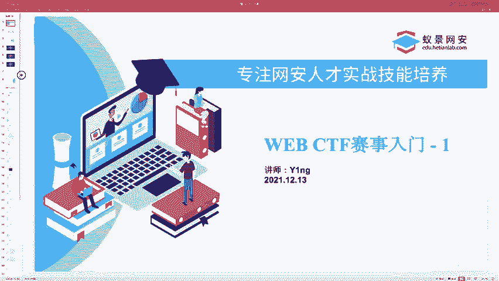
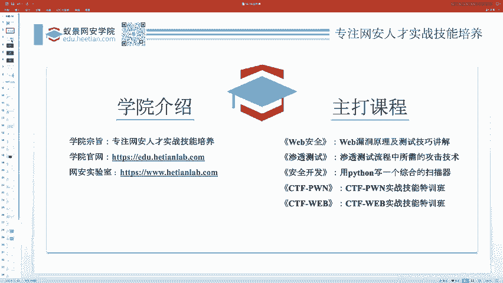
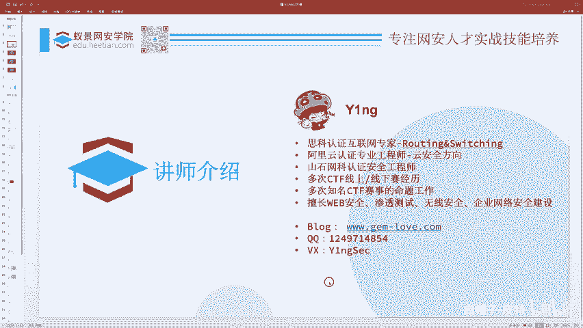
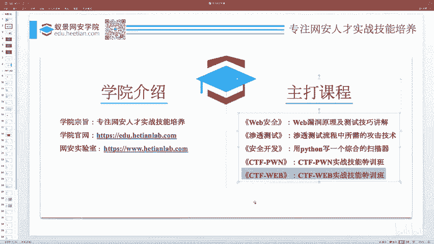
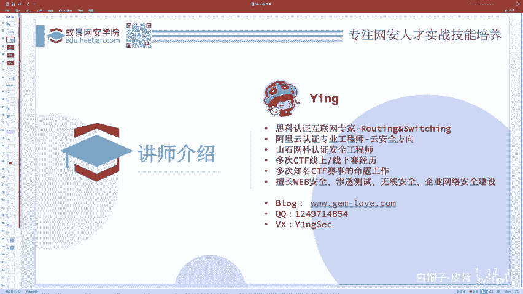
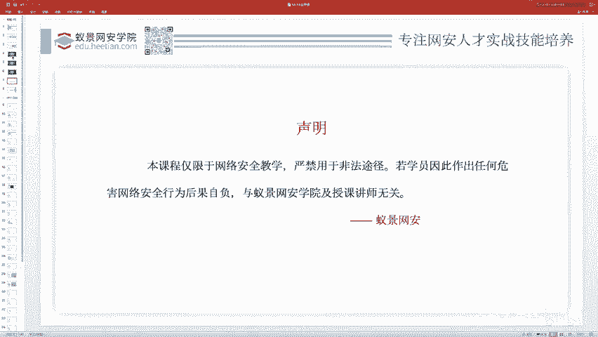
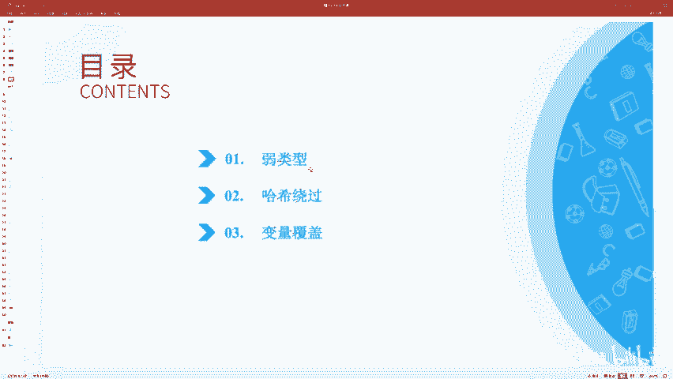

# CTF Web赛事基础：P64：简介及课程类别 🎯

在本节课中，我们将要学习CTF Web赛事的基础知识，并了解课程的整体结构。课程内容设计简单，旨在帮助初学者轻松入门，并掌握一些实用的技巧。

## 学院与讲师介绍

首先介绍一下我们的学院。这是我们学院的官网和网络安全实验室。学院专注于网络安全人才实践技能的培养，提供众多重要课程。大家可以在腾讯课堂首页或官网查看。除了CTF Pwn和Web课程，我们还有Misc课程。

我是今天和明天两天的讲师。关于我的个人介绍，大家简单浏览即可。下方是我的个人联系方式。我们学院的主打课程之一是“CTF Web实战技能特训班”，我是该班的主讲讲师。

同时，我也负责讲授一些Web CTF相关的公开课。无论您是否报名课程，只要是与CTF、Web安全等我所研究的方向相关的问题或交流，都欢迎通过联系方式与我沟通。

## 课程须知与法律声明

我们的课程在某些地方会涉及攻击行为演示，这些内容仅用于教学目的。请勿将其用于其他用途，否则后果自负。希望大家遵守相关的法律法规。

## 今日课程目录概述

以下是今天课程的三个部分，内容均较为简单，属于Web CTF范畴：
1.  弱类型问题
2.  哈希绕过问题
3.  变量覆盖问题

CTF比赛有不同的水平，有针对新生的、企业的，也有世界级的高难度比赛。无论你是什么水平，想要涉足这个领域，都需要从零开始，从最简单的内容学起，逐步成长。每个人都是如此。

我们今天要讲的内容，就是一些比较简单的比赛中（例如学校招新赛、新生赛）经常考察的知识点，比如弱类型问题等。

## 总结

本节课中，我们一起了解了课程的基本信息、讲师背景、重要的法律声明，并预览了今天将要学习的三个核心知识点。接下来，我们将逐一深入探讨这些内容。