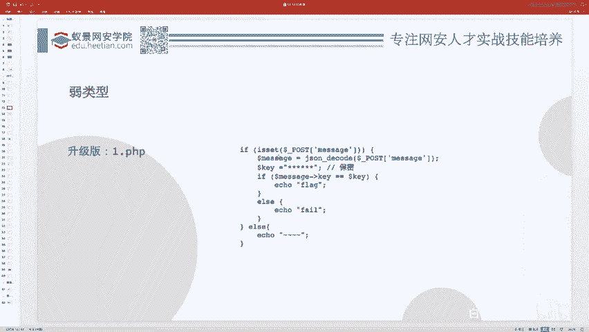
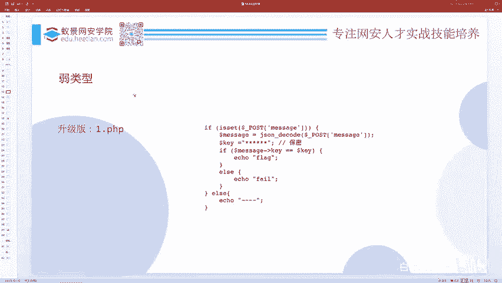
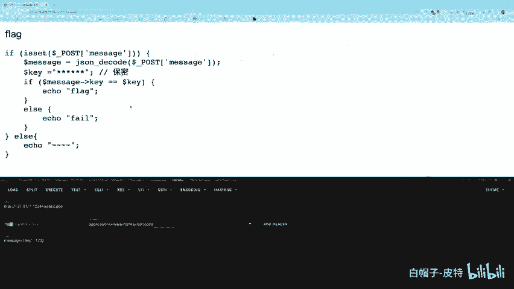

# CTF Web赛事基础：P65：弱类型漏洞详解 🧩


在本节课中，我们将要学习CTF Web方向中一个非常经典且基础的安全问题——PHP弱类型漏洞。我们将从PHP语言的特性讲起，理解其原理，并通过实战题目来掌握如何利用和防御此类漏洞。

## 弱类型问题的本质

上一节我们介绍了CTF Web赛题的基本构成，本节中我们来看看PHP弱类型问题到底是什么。

PHP语言在Web CTF中占有很大比重，也是新手比较容易上手的方向，因为其语法相对简单。首先需要明确的是，PHP在判断两个值是否相等时，有两种方式：
*   **严格比较 (`===`)**：会同时判断**值**和**数据类型**是否完全相同。
*   **松散比较 (`==`)**：在比较前会尝试进行**类型转换**，然后再比较值。

松散比较（弱类型比较）会将某些“差不多”的值视为相等。例如，布尔值 `true` 和整型 `1` 在松散比较下是相等的，因为它们都代表“真”。

```php
var_dump(1 == true);   // 输出: bool(true)
var_dump(1 === true);  // 输出: bool(false)
```

弱类型安全问题就源于此：当开发者使用不严格的 `==` 进行比较时，在某些情况下，两个本不应相同的值会被判断为相等，从而可能绕过安全逻辑。

**核心概念**：`==` 与 `===` 的区别。`==` 会进行类型转换，`===` 不会。

需要强调的是，松散比较本身并非为制造漏洞而生，它是为了给开发者提供便利而设计的特性。问题在于**使用不当**，才导致了安全漏洞。

## PHP弱类型比较规则

理解了弱类型的本质后，我们来看看PHP在进行松散比较时，具体的类型转换规则是什么。

当使用 `==` 进行比较时，如果涉及字符串与数字的比较，PHP会尝试将**字符串转换为数值**，再进行比较。

字符串转数字的规则如下：
1.  从字符串**起始位置**开始读取。
2.  如果起始字符是数字，则读取直到第一个非数字字符为止，这部分被转换为整数。
3.  如果起始字符不是数字，则转换结果为 **0**。

以下是规则示例：

```php
var_dump("123admin" == 123); // true， “123admin” -> 123
var_dump("admin" == 0);      // true， “admin” -> 0
var_dump("1admin" == 1);     // true， “1admin” -> 1
var_dump("0e123" == "0e456");// true， 科学计数法均视为0
```

**核心概念**：字符串转数字公式。对于字符串 `S`，其数值 `N` 的转换可表示为：`N = intval(S)`，其中 `intval` 函数遵循上述读取规则。

最后一种情况 (`“0e123” == “0e456”`) 比较特殊，当字符串是科学计数法格式（如 `0e123` 表示 0×10^123）时，即使两个字符串不同，它们也会被当作数字进行比较，结果都为0，因此相等。

## 实战演练：弱类型漏洞利用

掌握了基本规则，本节我们通过一道CTF题目，来看看如何在实际中利用弱类型漏洞。

题目提供了以下PHP源码：

```php
<?php
$key = "此处为未知密钥";
$data = json_decode($_POST[‘message‘]);
if ($data->key == $key) {
    echo ‘flag{this_is_flag}‘;
} else {
    echo ‘fail‘;
}
?>
```

**题目分析**：
1.  我们需要通过POST传递一个名为 `message` 的参数。
2.  该参数应是JSON格式，会被 `json_decode` 解码成一个对象。
3.  程序会检查解码后对象的 `key` 属性值是否等于一个未知的变量 `$key`。
4.  判断使用的是**松散比较 (`==`)**。
5.  如果相等，则输出flag。

我们的目标是让一个未知的字符串 `$key` 与我们构造的值相等。利用弱类型特性，我们可以让 `$data->key` 为一个**数字**，而 `$key` 是一个字符串。在比较时，字符串 `$key` 会被转换为数字。



**解题思路**：
1.  假设 `$key` 不是以数字开头（如 `“secret”`），那么它被转换成数字后结果为 **0**。
2.  因此，我们构造 `message` 参数，使其解码后对象的 `key` 属性值为数字 `0`。

**构造Payload**：
我们提交的 `message` 参数值为：`{"key":0}`

**结果**：字符串 `$key` 被转为数字0，与我们的数字0相等，成功获取flag。

## 进阶：应对未知的密钥

上一节的题目我们幸运地猜对了，但如果密钥 (`$key`) 是以数字开头的字符串（如 `“123secret”`），直接传 `{"key":0}` 就会失败。

此时，我们无法直接猜出转换后的准确数字，但可以利用**爆破（Brute Force）** 的方法。

**解题思路**：
1.  既然 `$key` 以数字开头，其转换后的数字必然是该开头的数字部分（如 `“123secret”` -> `123`）。
2.  我们不知道具体数字是多少，但可以遍历一个可能的范围（例如0-10000），逐个尝试。

**自动化脚本示例（Python）**：

```python
import requests
import json

url = ‘http://target.com/challenge‘


for i in range(10000): # 假设密钥转换后的数字在0-9999之间
    data = {‘message‘: json.dumps({‘key‘: i})}
    response = requests.post(url, data=data).text
    if ‘flag‘ in response:
        print(f‘Found key: {i}‘)
        print(response)
        break
```

通过脚本，我们可以快速尝试所有可能的数字，直到匹配成功，获取flag。这种方法简单有效，通常在几秒到几十秒内即可完成。

## 弱类型比较对照表总结

本节课我们一起学习了PHP弱类型漏洞的原理与利用。最后，我们通过一张经典的弱类型比较对照表来总结哪些值在 `==` 比较下会意外相等。


下表展示了各种数据类型之间使用 `==` 比较的结果，其中**标色部分**表示结果为 `true`（相等），这揭示了大量可能被利用的“等价”关系。



（此处应插入弱类型比较对照表图片，图中对角线为自身比较相等，其余标色单元格为松散比较下相等的值）



例如：
*   `false == “0”` 为真
*   `“0e123” == “0e456”` 为真
*   `NULL == false` 为真


这张表是CTF选手和安全研究员的宝贵参考资料，理解它有助于快速识别和利用潜在的弱类型漏洞。

**本节课总结**：在本节课中，我们一起学习了PHP弱类型漏洞的核心知识。我们理解了 `==` 与 `===` 的区别，掌握了字符串在松散比较中转换为数字的规则，并通过两道由浅入深的CTF题目，实践了如何利用该漏洞绕过判断获取flag，以及当面对未知情况时如何使用爆破技巧。牢记这些原理和技巧，是攻克Web类CTF赛题的重要基础。