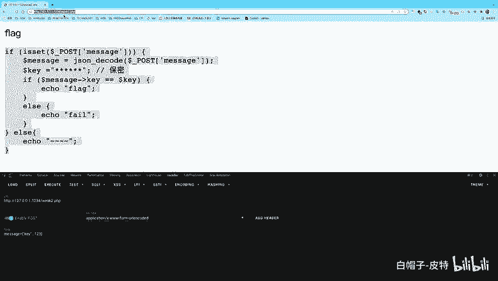
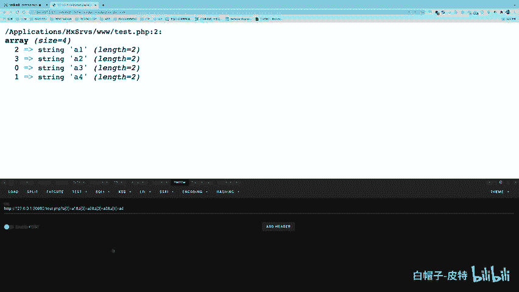
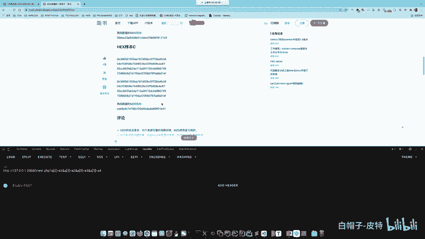
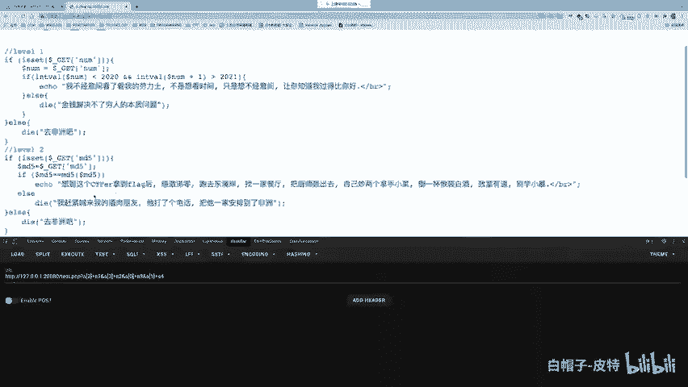

# CTF Web赛事基础：P66：哈希绕过问题 🧩

在本节课中，我们将要学习CTF Web题目中一个经典且重要的考点——哈希绕过问题。我们将以MD5哈希函数为例，深入探讨如何利用PHP的弱类型比较、数组特性以及哈希碰撞来实现绕过，从而满足题目中看似矛盾的条件。

---

## 哈希绕过问题的本质

上一节我们介绍了PHP的弱类型比较问题，本节中我们来看看哈希绕过问题。哈希绕过问题本质上是弱类型问题的一个应用与延伸。理解了弱类型，哈希问题就迎刃而解。

哈希绕过问题通常表现为：需要提交两个不相等的字符串（变量A和变量B），但要求它们的MD5哈希值满足某种相等条件。

---

## 第一层：弱相等绕过（`==`）

首先，我们来看最简单的情况：要求 `$a != $b`，但 `md5($a) == md5($b)`。这里使用的是弱相等比较（`==`）。




**核心思路**：利用弱类型比较的特性。在PHP中，当两个字符串以 `0e` 开头，后面跟随纯数字时，它们在进行弱比较时会被视为科学计数法，并都被当作数字 `0` 处理，从而满足 `0 == 0` 的条件。


因此，我们需要寻找两个不同的字符串，它们的MD5值恰好都是 `0e` 开头后跟纯数字的形式。

以下是满足此条件的字符串示例（部分）：

*   `240610708` 的MD5值为 `0e462097431906509019562988736854`
*   `QNKCDZO` 的MD5值为 `0e830400451993494058024219903391`
*   `s878926199a` 的MD5值为 `0e545993274517709034328855841020`
*   `s155964671a` 的MD5值为 `0e342768416822451524974117254469`

**解题公式**：
```
提交：$a = ‘240610708’; $b = ‘QNKCDZO’;
满足：$a != $b 且 md5($a) == md5($b)
```

---

## 第二层：强相等绕过（`===`）与数组技巧

接下来，我们将问题升级：要求 `$a != $b`，但 `md5($a) === md5($b)`。这里使用的是强相等比较（`===`），上述的 `0e` 技巧将不再适用。


**核心思路**：利用MD5函数处理非字符串参数（如数组）时的行为。当 `md5()` 函数的参数是一个数组时，函数会报出一个警告（Warning），但会继续执行并返回 `NULL`。

因此，如果我们提交 `$a` 和 `$b` 为两个不同的数组，`md5($a)` 和 `md5($b)` 的返回值都是 `NULL`。在强比较下，`NULL === NULL` 成立，从而成功绕过。

**代码演示**：
```php
$a = array(‘abc’);
$b = array(‘def’);
var_dump(md5($a)); // 输出：NULL
var_dump(md5($b)); // 输出：NULL
var_dump(md5($a) === md5($b)); // 输出：bool(true)
```

**如何通过URL传递数组参数？**
在GET请求中，可以通过在参数名后添加 `[]` 来传递数组。
*   单个元素：`?a[]=123`
*   多个元素：`?a[]=123&a[]=456`
*   指定键名：`?a[x]=hello&a[y]=world`

**一个进阶技巧**：有时题目会检查数组的特定下标（如 `$a[0]` 和 `$a[1]`），但实际使用的是数组的前几个元素。我们可以通过调整传参顺序来绕过检查。
例如，题目检查 `$a[0]` 和 `$a[1]`，但拼接 `$a[0].$a[1]` 执行命令。我们可以这样传参：`?a[2]=payload&a[3]=payload&a[0]=harmless&a[1]=harmless`。这样，被检查的是无害的 `a[0]` 和 `a[1]`，而被拼接使用的却是 `a[2]` 和 `a[3]`。

---

## 第三层：强相等与字符串的终极方案——哈希碰撞

最后，我们考虑最严格的情况：要求 `$a` 和 `$b` 必须是字符串，且 `md5($a) === md5($b)`。此时，数组技巧失效。



**核心思路**：寻找真正的MD5哈希碰撞，即两个完全不同的原始信息（字符串），经过MD5计算后，得到完全相同的哈希值。


MD5算法已被证明存在碰撞漏洞，我们可以利用工具生成这样的碰撞对。这在CTF赛题中时有出现。

**解题步骤**：
1.  使用专门的哈希碰撞生成工具（如 `fastcoll`）生成两个内容不同但MD5值相同的文件。
2.  将文件内容作为字符串 `$a` 和 `$b` 提交。
3.  由于它们的MD5值严格相等，因此满足条件。



---


## 实战例题解析

让我们分析一个综合性的例题，其部分代码如下：
```php
$md5 = $_GET[‘md5’];
if ($md5 == md5($md5)) {
    // 通关
}
```
题目要求：提交一个参数 `md5`，使得它自身与它自身的MD5值满足弱相等。


**不要被变量名迷惑**：`$md5` 只是一个变量名，它本质上是一个字符串。我们需要的就是一个字符串，其MD5值也是字符串，并且两者满足 `0e… == 0e…` 的弱相等条件。

这恰好回到了我们的第一层解决方案。我们可以直接使用现成的“魔术字符串”。

**例如**：
提交 `md5=0e215962017`，其MD5值为 `0e291242476940776845150308577824`。
计算 `‘0e215962017’ == ‘0e291242476940776845150308577824’`，在弱比较下结果为 `true`。

---

## 总结

本节课中我们一起学习了CTF Web中哈希绕过问题的三种主要场景和解决方案：

1.  **弱相等绕过**：利用 `0e` 开头的科学计数法字符串，使MD5值在弱比较下相等。
2.  **强相等绕过（数组）**：利用 `md5(数组)` 返回 `NULL` 的特性，使两个不同的数组产生相同的MD5结果（`NULL`）。
3.  **强相等绕过（字符串）**：通过寻找或生成MD5哈希碰撞对，使两个不同字符串的MD5值严格相同。




理解这些技巧的核心在于掌握PHP的语言特性（弱类型、函数行为）和密码学哈希函数的基本知识（碰撞概念）。在解题时，务必仔细审题，识别比较方式（`==` 还是 `===`）和参数类型限制，从而选择正确的绕过方法。