# CTF入门教程：P67：CTF web赛事基础 - 远程代码执行与命令执行 🚀


## 概述
在本节课中，我们将学习CTF Web方向中两个重要的漏洞类型：**命令执行**与**远程代码执行**。我们将了解它们的基本概念、产生原因、利用方式以及相关的权限问题，并通过简单的例子帮助初学者理解。

---

## 命令执行漏洞

上一节我们介绍了课程的整体内容，本节中我们来看看**命令执行漏洞**。

命令执行是一种攻击，其目标是通过存在漏洞的应用程序，在主机操作系统上执行任意命令。这个漏洞的本质就是在操作系统上执行操作系统的命令。

### 漏洞产生原因
这种情况的发生，通常是因为应用程序需要调用外部程序来处理某些内容，从而使用了一些能够执行系统命令的函数。

例如，在PHP中，开发人员可能需要创建一个目录。如果他对PHP的文件操作函数不熟悉，但知道系统命令`mkdir`可以创建目录，他可能会选择调用系统命令来实现。

**代码示例：安全的写法**
```php
system('mkdir abc');
```
这段代码没有问题，因为要执行的命令`mkdir abc`是写死的，用户无法控制，因此不存在漏洞。

**漏洞的产生**在于，**命令执行函数中的参数（即要执行的命令）的一部分是用户可控的**。这使得攻击者可以将恶意命令注入到正常的命令中，造成命令注入攻击。

**代码示例：存在漏洞的写法**
```php
$username = $_GET['username']; // 用户输入
system("mkdir $username");
```
这段代码根据用户输入的用户名创建目录。正常情况下，用户输入`abc`，则执行`mkdir abc`。但如果用户输入恶意的内容，例如`abc; cat /flag`，那么最终执行的命令将变为：
```bash
mkdir abc; cat /flag
```
这里的**分号 `;`** 在Linux中用于分隔同一行中的多个命令。因此，系统除了创建目录`abc`，还会执行`cat /flag`命令，从而泄露敏感文件内容。

以下是另一个命令注入的例子：
```php
$file = $_GET['file'];
system("cp $file /var/www/html/");
```
如果用户输入`test.txt; ls -la`，最终执行的命令将是`cp test.txt; ls -la /var/www/html/`，从而执行了额外的`ls`命令。

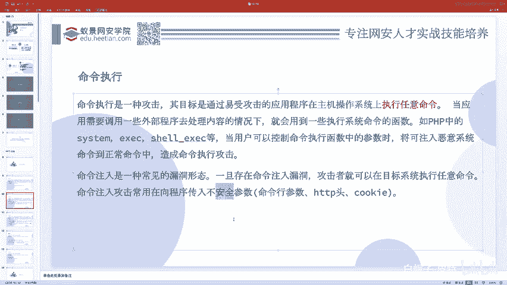

### 命令注入发生的条件
从以上例子可以看出，命令注入漏洞的发生需要两个条件：
1.  程序使用了可以执行系统命令的函数。
2.  执行的命令不是完全写死的，其中包含用户可控的部分（通常通过传参实现）。

因此，**向程序传入不安全参数的地方**是命令注入攻击的常见发生点。

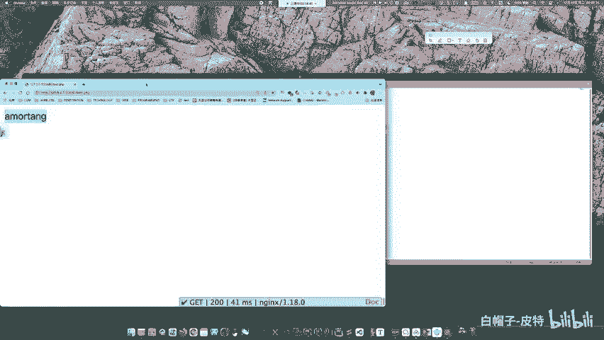

---

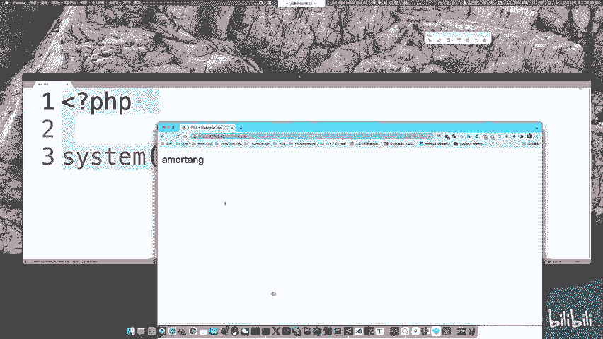

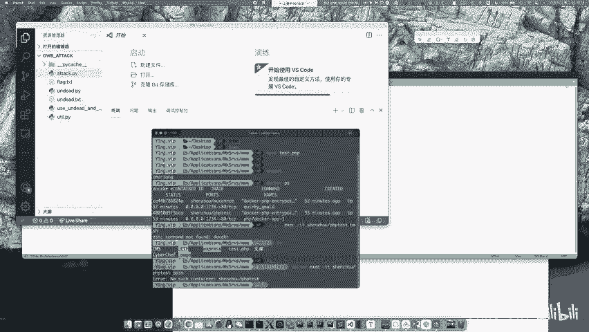

## 命令执行的权限问题

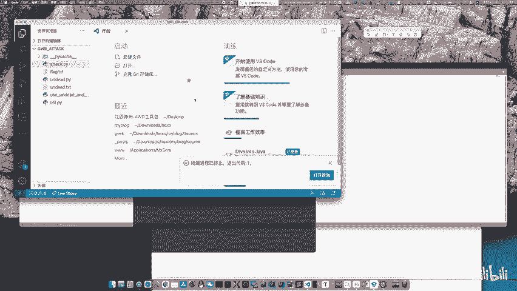

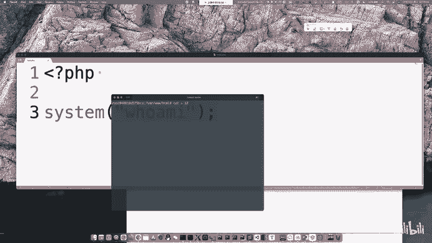

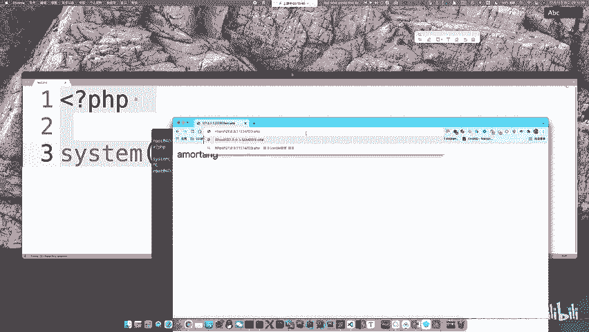

上一节我们了解了命令注入如何发生，本节中我们来看看执行命令时的**权限问题**。

命令是由谁执行的呢？它是由PHP调用`system`等函数去执行的。而PHP是由Web服务器（如Apache、Nginx）运行的。因此，**最终执行命令的实体是Web服务器进程**，它拥有自己的系统用户身份和权限。

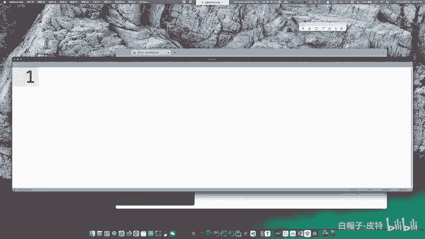

在Linux系统中，不同的用户拥有不同的权限。最高权限用户是`root`。但Web服务器通常不以`root`身份运行，而是以一个权限较低的用户运行，例如`www-data`。

**权限的影响**：
*   **限制操作**：以`www-data`用户权限无法执行关机、关闭关键服务、删除或修改属于`root`或其他高权限用户的文件等操作。
*   **允许操作**：尽管权限有限，但攻击者仍然可以：
    *   读取许多文件（查看源代码、配置文件、数据库凭证、Flag等）。
    *   在Web服务器有写入权限的目录（如上传目录、临时目录）中写入文件（例如Webshell）。
    *   进行内网探测或反弹Shell。

**理解Linux文件权限**：
使用`ls -l`命令可以查看文件详细信息。
```
-rw-r--r-- 1 root root 1234 Jan 1 10:00 example.txt
drwxr-xr-x 2 www-data www-data 4096 Jan 1 10:00 webdir/
```
*   第一个字符：`-`表示文件，`d`表示目录。
*   后续9个字符：每3位一组，分别代表**文件所有者**、**所属组**、**其他用户**的权限。
*   权限字符：`r`=读(4)，`w`=写(2)，`x`=执行(1)。
*   例如`rw-r--r--`对应数字`644`（所有者可读可写，组和其他用户只可读）。

在CTF的AWD（攻防对抗）比赛中，常会遇到因权限问题无法删除对手Webshell的情况。因为对手的Webshell是`www-data`用户写入的，文件属于`www-data`。而选手通过SSH连接进行维护时，使用的可能是`ctf`用户。由于用户不同且文件权限设置（如`644`），`ctf`用户可能没有删除权限。

**解决方案**：给自己写入一个Webshell（以`www-data`权限），然后通过这个Webshell去删除对手的Webshell，因为此时操作双方都是`www-data`用户。

---

## 常见的危险函数

以下是PHP中与代码执行和命令执行相关的一些危险函数。

**代码执行函数**：这些函数可以执行PHP代码。
*   `eval()`：将字符串作为PHP代码执行。
*   `assert()`：检查一个断言是否为`false`，早期版本可执行代码。
*   `preg_replace()` + `/e`修饰符：在替换时执行PHP代码（PHP 5.5+已废弃）。
*   `create_function()`：创建匿名函数。
*   `call_user_func()` / `call_user_func_array()`：回调函数。
*   `array_map()`等：配合回调函数。

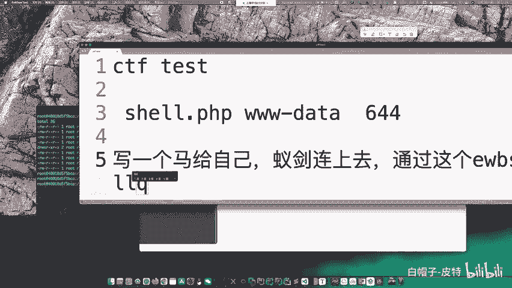

**命令执行函数**：这些函数可以执行系统命令。
*   `system()`：执行外部程序并显示输出。
*   `exec()`：执行外部程序。
*   `shell_exec()`：通过Shell执行命令，并将完整输出以字符串返回。
*   `passthru()`：执行外部程序并显示原始输出。
*   `popen()` / `proc_open()`：打开进程文件指针。
*   **反引号 ``**：这是`shell_exec()`的别名，例如 `` `ls -la` `` 会执行`ls -la`命令。

---

## 漏洞利用实例

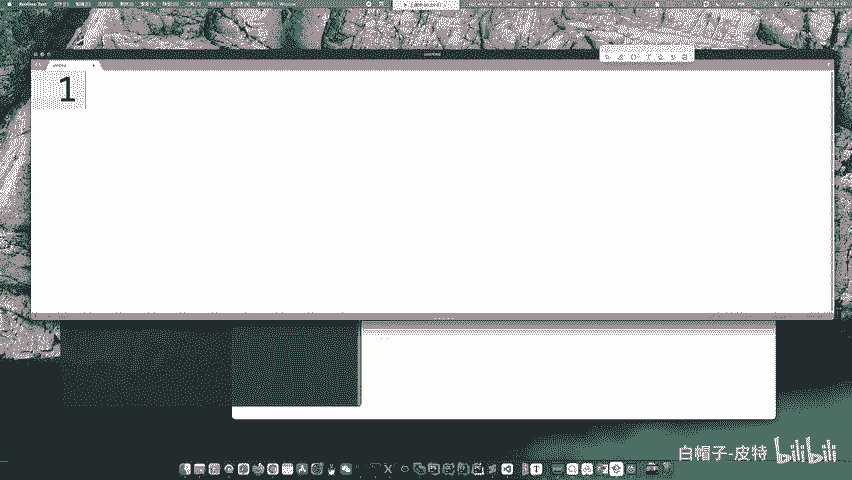

现在，我们通过一个简单的实例来看如何利用命令注入漏洞。

假设存在以下PHP代码（`cmd.php`）：
```php
<?php
if (isset($_GET['ip'])) {
    $ip = $_GET['ip'];
    system("ping -c 4 " . $ip);
} else {
    highlight_file(__FILE__);
}
?>
```
这段代码接收一个`ip`参数，并拼接成`ping -c 4 [用户输入的IP]`命令来执行。

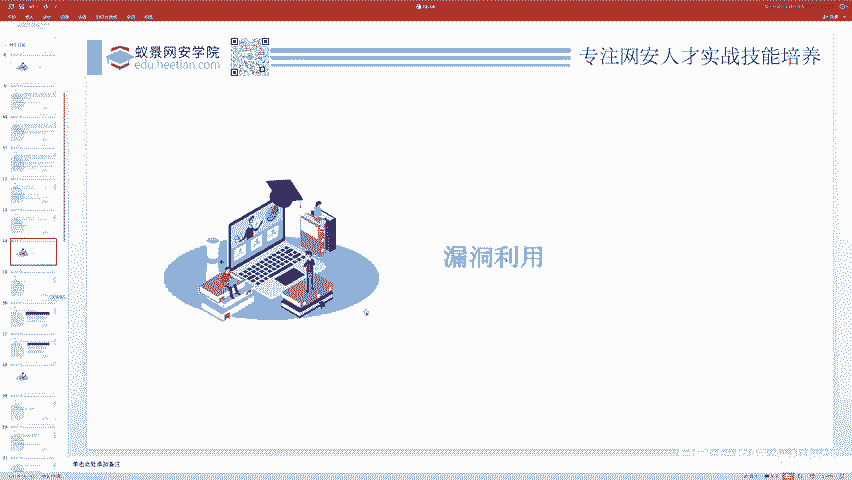

**正常请求**：
```
http://target.com/cmd.php?ip=127.0.0.1
```
执行命令：`ping -c 4 127.0.0.1`

**攻击利用**：
由于`ip`参数未经严格过滤就直接拼接进命令，我们可以注入其他命令。
```
http://target.com/cmd.php?ip=127.0.0.1; ls -la
```
最终执行的命令变为：`ping -c 4 127.0.0.1; ls -la`
*   `ping`命令执行后，会继续执行`ls -la`命令，列出当前目录下的文件。

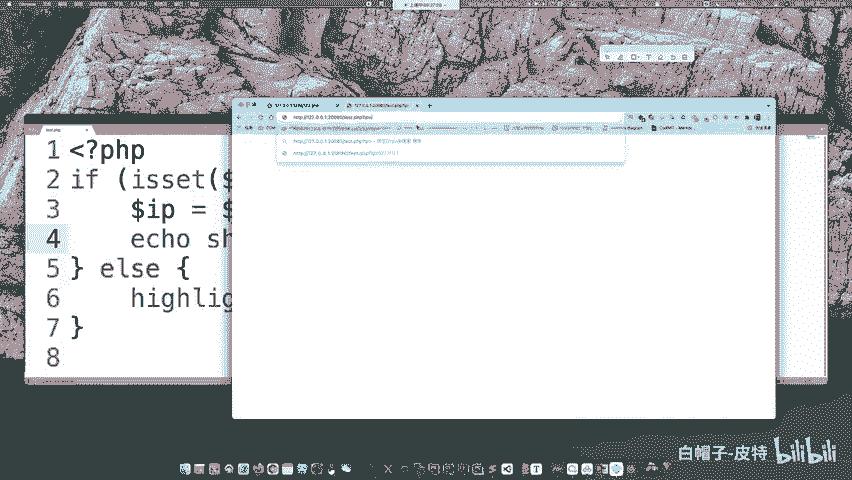

通过这种方式，攻击者可以执行任意系统命令，例如读取文件、探测内网、反弹Shell等。

---

## 总结
本节课我们一起学习了CTF Web中的命令执行与远程代码执行漏洞。
1.  **命令执行**：通过应用程序在操作系统上执行任意命令。漏洞产生的关键是**用户输入被拼接到了系统命令中**。
2.  **权限认知**：理解执行命令的权限取决于Web服务器的运行用户（如`www-data`），这限制了攻击者可进行的操作范围。
3.  **危险函数**：识别`eval()`、`system()`、`shell_exec()`等可能引入代码/命令执行风险的函数。
4.  **利用方式**：通过注入命令分隔符（如`;`、`&&`、`|`）将恶意命令拼接到正常命令中。

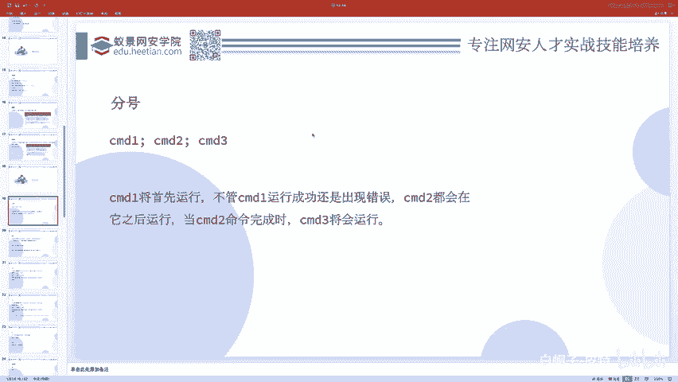

掌握这些基础知识，是进一步学习复杂漏洞利用和防御的前提。