# CTF入门教程：P6：Webshell管理工具 🛠️

在本节课中，我们将要学习CTF-Web方向中一个至关重要的概念：Webshell及其管理工具。我们将了解什么是Webshell，如何利用它，以及三种主流的管理工具：中国蚁剑、冰蝎和哥斯拉。最后，我们将介绍如何搭建本地Web服务器环境，为后续的实战练习做好准备。

## 什么是Webshell？

上一节我们介绍了CTF的基本概念和常用工具，本节中我们来看看Webshell。攻击者在入侵网站时，通常会通过各种方式写入Webshell，也就是我们常说的网络木马，从而获取服务器的控制权限。

为了方便对这些Webshell进行管理，出现了各种各样的Webshell管理工具。例如，常见的一句话木马。

以下是一个PHP一句话木马的示例代码：

```php
<?php @eval($_POST['password']); ?>
```

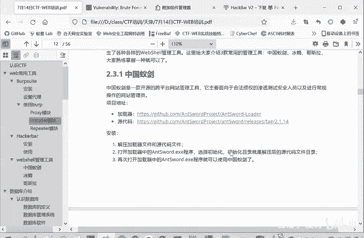

这是一个一句话木马。如果将其上传到目标服务器且服务器能够解析该文件，攻击者就可以通过管理软件控制目标服务器。

我们来解释一下这句话的含义。`<?php ?>`是PHP语言的开始和结束标记。我们真正需要关注的是中间这一句代码：`@eval($_POST['password']);`。

*   `$_POST[‘password’]`：表示以POST形式传递参数。`password`是变量名，其值是POST请求中传递过来的数据。这类似于我们在BurpSuite中抓包时看到的参数传递。
*   `eval()`：这是一个PHP函数，其作用是将传入的字符串当作PHP代码来执行。
*   `@`：符号的作用是抑制错误信息显示。攻击者通常不希望在自己的攻击机器上看到目标服务器的报错信息。

## 主流Webshell管理工具

如果一句话木马上传成功，我们如何进行利用呢？主要有三种工具可以进行利用，分别是中国蚁剑、冰蝎和哥斯拉。我们将重点讲解中国蚁剑。

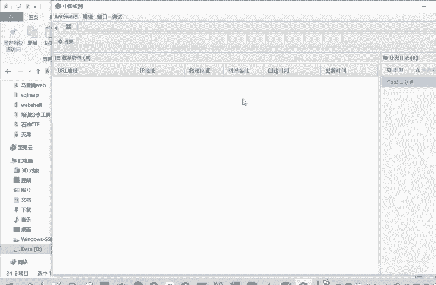

### 中国蚁剑 🐜

中国蚁剑是一款功能强大的Webshell管理工具。

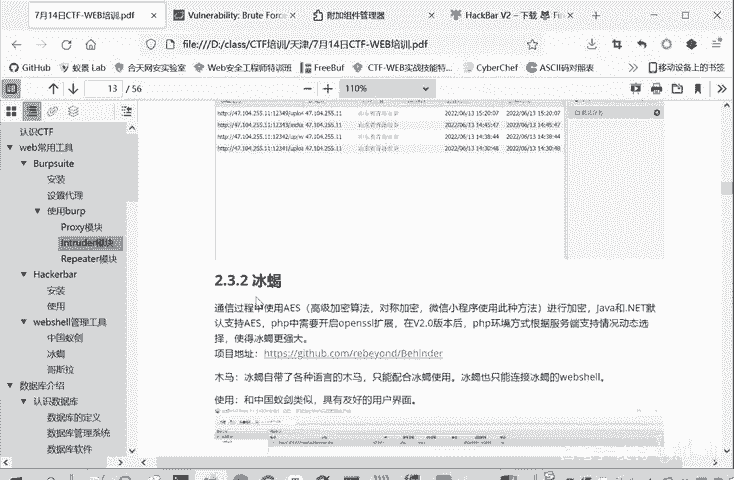

以下是使用中国蚁剑的步骤：

1.  解压工具包中的“蚁剑”压缩文件，得到源代码目录。
2.  源代码目录中的`loader`文件夹是加载器。要使用蚁剑，需要运行`loader`目录下的`AntSword.exe`程序。
3.  首次运行时，程序会提示选择工作目录进行初始化。这个工作目录就是刚才解压得到的源代码目录（例如`antSword`文件夹）。
4.  选择正确的文件夹完成初始化后，再次打开`AntSword.exe`即可正常使用。
5.  在软件界面中，可以添加目标（填写网址、连接密码等）。我们将在后续的文件上传漏洞实战中具体讲解如何连接和管理Webshell。

成功添加并连接目标后，你就可以控制目标服务器，进行查看文件、执行命令等操作。

### 冰蝎 🦂

冰蝎是另一款Webshell管理工具，它在通信过程中使用了AES高级加密算法，因此加密性能更好。

冰蝎的使用方法如下：

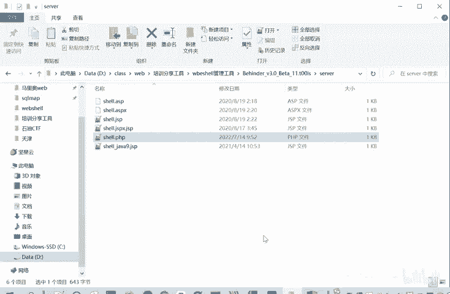

1.  解压工具包中的“冰蝎”压缩文件。
2.  冰蝎是一个基于Java的程序，因此需要Java运行环境。
3.  直接运行主程序即可使用。

冰蝎有一个特殊之处：它不能管理普通的“一句话木马”，必须使用它自己专用的木马。冰蝎为ASP、ASPX、JSP、PHP等不同语言提供了专用的木马文件。冰蝎工具和它的专用木马是一一对应的关系。

冰蝎连接密码的设置方式也略有不同。在木马文件中，密码不是明文，而是对应密码字符串的32位MD5值的前16位。例如，默认密码`rebeyond`对应的MD5前16位是`e45e329feb5d925b`。如果你想将密码改为`test`，就需要计算`test`的32位MD5值，并取其前16位填入木马文件中，连接时密码则填写`test`。

### 哥斯拉 🦖

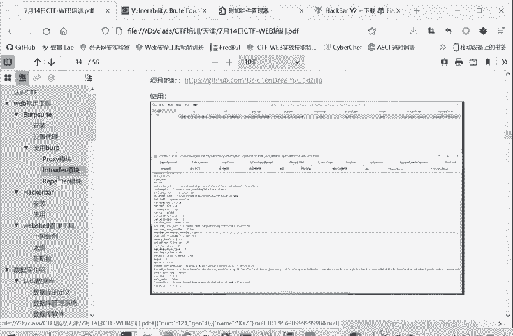

哥斯拉是第三种主流的Webshell管理工具。它的利用方式也是直接打开程序，上传木马后进行连接。哥斯拉通常使用通用的木马，而非专用木马。

我们介绍这三种功能类似的工具，是因为在实际的CTF比赛或安全研究中，可能会遇到某种工具被防护软件拦截的情况。了解多种主流工具可以让你有更广泛的适应性，确保在一种工具失效时，仍有其他方法可以管理上传的Webshell。否则，即使成功上传了木马，也无法利用，等于前功尽弃。

## 搭建本地Web环境

前面我们介绍了一些CTF基础知识和常用工具。最后，再给大家介绍一个非常重要的基础工具：PHPStudy。

PHPStudy是一个集成的服务器环境搭建工具，可以快速在本地创建Web服务器（Apache/Nginx）和数据库（MySQL）。

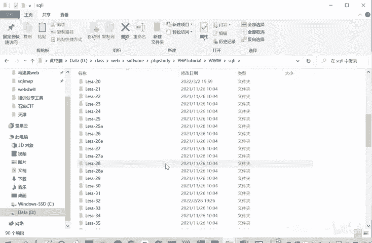

以下是使用PHPStudy的步骤：

1.  解压工具包中的“PHPStudy”压缩文件。
2.  运行解压后的安装程序进行安装。**注意：安装路径不能包含中文和空格**。
3.  安装完成后启动PHPStudy，点击界面上的“启动”按钮，即可运行Apache和MySQL服务（显示为绿色圆点表示启动成功）。
4.  成功启动后，你的本机就成为了一个Web服务器。默认访问地址是`http://127.0.0.1`或`http://localhost`。
5.  网站的根目录通常位于PHPStudy安装目录下的`www`文件夹中。例如，里面的`index.php`文件默认输出“Hello World”。你可以修改这个文件，刷新浏览器页面即可看到变化。

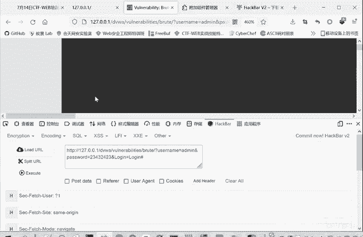

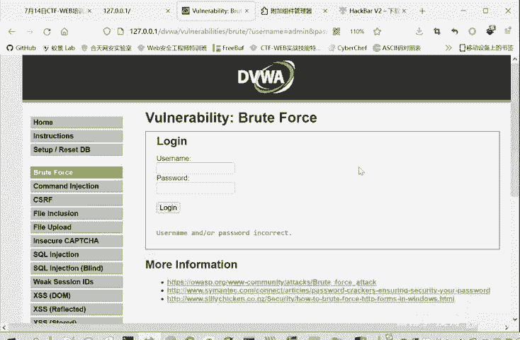

有了PHPStudy搭建的本地环境，我们后续就可以非常方便地搭建各种漏洞靶场进行练习，例如：
*   DVWA（Damn Vulnerable Web Application）综合靶场
*   专门用于文件上传漏洞练习的Upload-labs靶场
*   用于SQL注入漏洞练习的Sqli-labs靶场

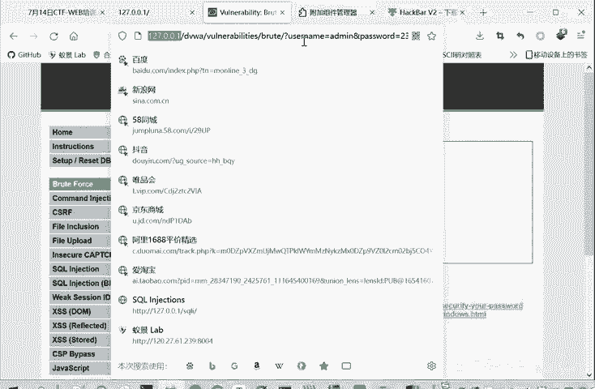

只需将这些靶场的文件放入`www`目录，即可通过浏览器访问。同时，PHPStudy也安装了MySQL数据库，为我们后续学习SQL注入等需要数据库交互的知识点提供了便利。

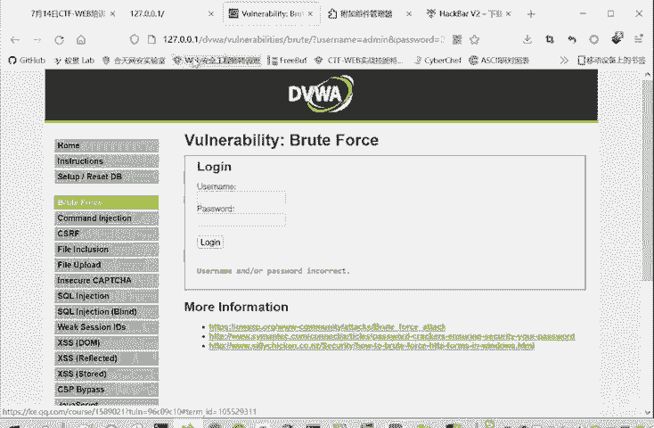

---

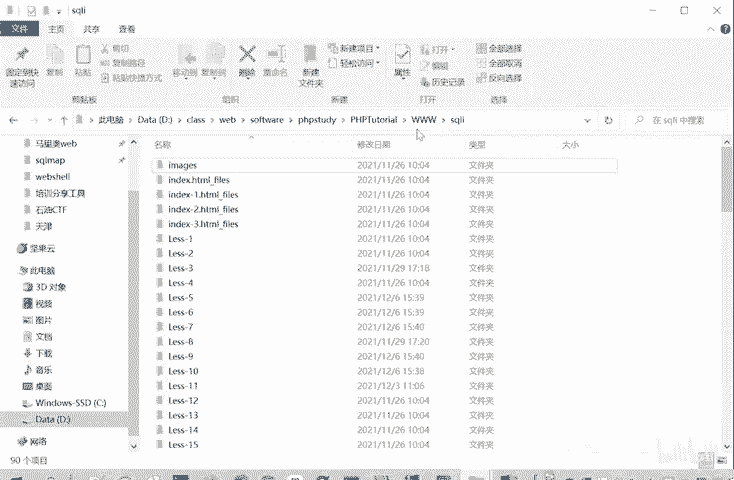

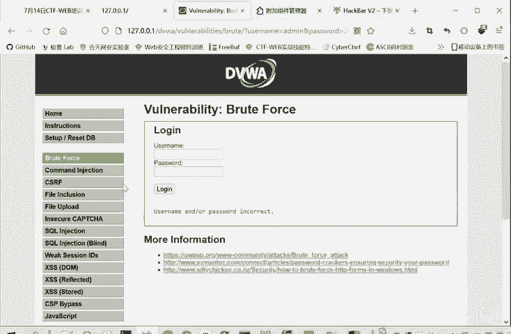

本节课中我们一起学习了Web安全中的关键后门——Webshell，并掌握了三种主流的Webshell管理工具（中国蚁剑、冰蝎、哥斯拉）的基本原理和使用场景。最后，我们学会了使用PHPStudy在本地搭建Web服务器环境，为后续的实战操作打下了坚实的基础。