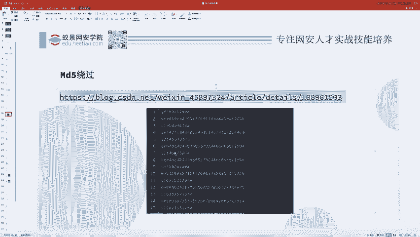
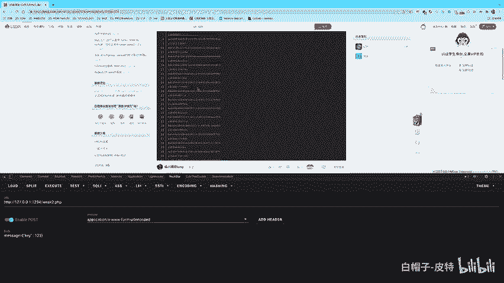
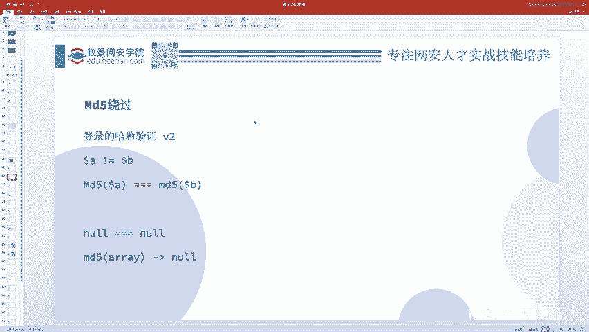
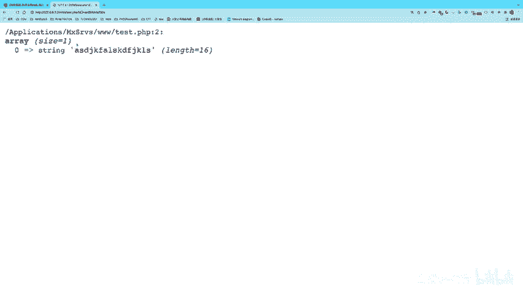
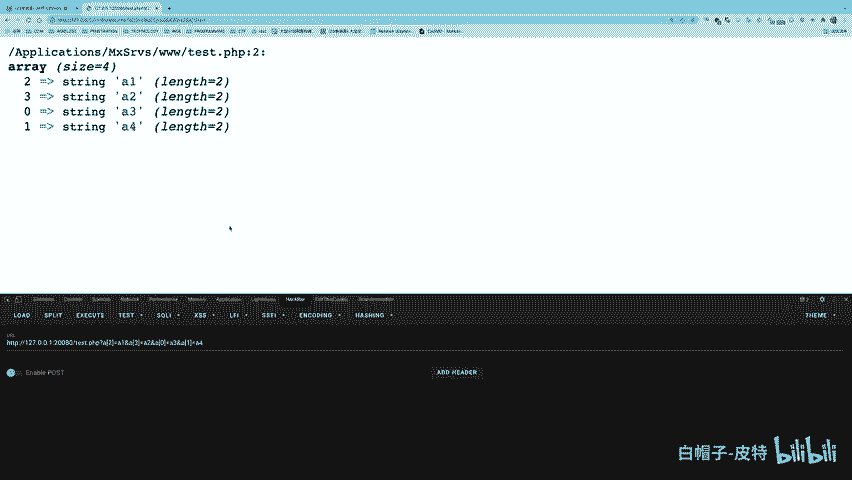
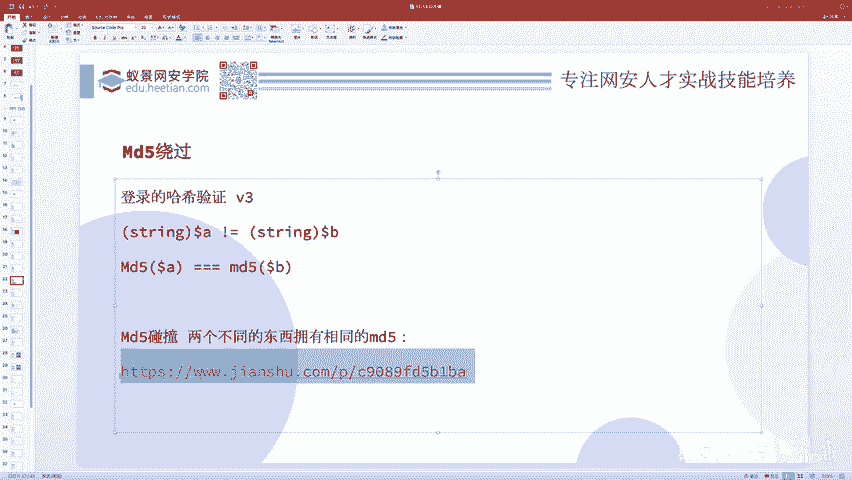
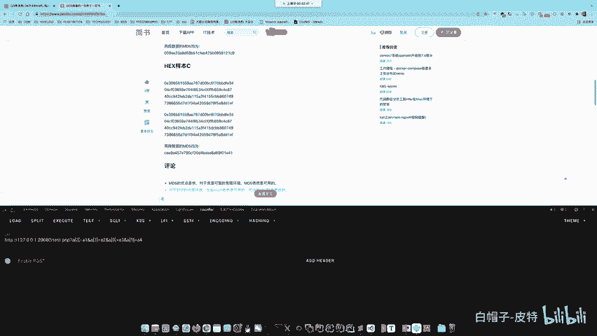
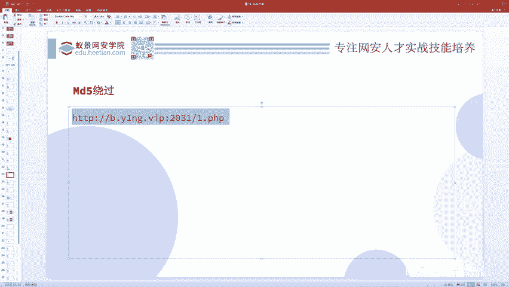
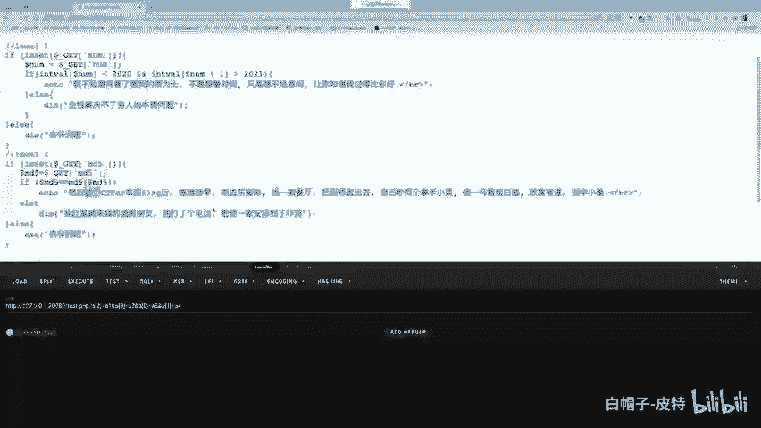

# CTF系列教程：P70：CTF-web 赛事入门基础之哈希（MD5）绕过问题 🔑

在本节课中，我们将要学习CTF-web赛事中一个非常经典的问题：哈希（MD5）绕过。我们将从弱类型的概念出发，逐步深入，学习如何利用不同的技巧来绕过MD5值的相等性检查。

## 概述

哈希绕过问题本质上是弱类型问题的一个应用与延伸。理解了弱类型，哈希绕过问题就迎刃而解。我们将通过一个典型的题目场景来展开学习：如何让两个不同的字符串，其MD5值却相等。

## 第一层：弱相等绕过

上一节我们介绍了弱类型的概念，本节中我们来看看它在MD5绕过中的具体应用。

题目要求如下：你需要提交两个变量 `$a` 和 `$b`。这两个变量本身不能相等，但它们的MD5值需要满足弱相等（`==`）。即：
```php
$a != $b && md5($a) == md5($b)
```

以下是解决此问题的第一种方法：利用科学计数法形式的字符串。

在弱类型比较中，形如 `0e123456` 的字符串会被当作科学计数法（0乘以10的123456次方）处理，其值等于0。因此，如果我们能找到两个不同的字符串，它们的MD5值恰好都是 `0e` 开头后面跟着纯数字的形式，那么这两个MD5值在弱比较时就会被认为相等（都等于0）。





例如：
- 字符串 `s878926199a` 的MD5值是 `0e545993274517709034328855841020`。
- 字符串 `s155964671a` 的MD5值是 `0e342768416822451524974117254469`。

虽然这两个MD5字符串不同，但都以 `0e` 开头，后面全是数字。在弱比较 `==` 下，它们都被视为0，因此满足 `md5($a) == md5($b)`。



为了方便大家，这里有一些现成的、MD5值为“0e+纯数字”的字符串对：
- `240610708` 与 `QNKCDZO`
- `aabg7XSs` 与 `aabC9RqS`
- ...（更多可参考相关文章）


## 第二层：强相等绕过（数组方法）

现在我们把题目难度升级。MD5值的比较不再是弱相等（`==`），而是强相等（`===`），要求两个值必须严格相同。同时，`$a` 和 `$b` 本身依然不能相等。

上一节我们介绍了利用弱比较的特性，本节中我们来看看当要求强相等时，如何利用PHP中MD5函数处理数组的特性来绕过。

以下是解决此问题的第二种方法：传入数组。

在PHP中，`md5()` 函数期望接收一个字符串参数。如果传入一个数组，函数会报出一个警告（Warning），但程序会继续执行，并且函数的返回值是 `NULL`。

因此，如果我们设置：
```php
$a = array(‘abc’);
$b = array(‘def’);
```
那么 `md5($a)` 和 `md5($b)` 的返回值都是 `NULL`。在强相等比较 `===` 下，两个 `NULL` 是严格相等的。



那么，在Web题目中如何通过URL传递一个数组参数呢？方法很简单，在参数名后加上中括号 `[]` 即可。
- 传递单个数组元素：`?a[]=123`
- 传递多个数组元素：`?a[]=123&a[]=456`，这会生成数组 `array(‘123‘， ‘456‘)`
- 指定键名：`?a[x]=123&a[y]=456`，这会生成数组 `array(‘x‘ => ‘123‘， ‘y‘ => ‘456‘)`

这个技巧在CTF中非常实用，有时可以绕过对数组特定下标的严格检查。

## 第三层：强相等绕过（哈希碰撞）

现在，我们把条件限制到最严格：`$a` 和 `$b` 必须是字符串，并且它们的MD5值需要强相等（`===`）。

上一节我们利用数组返回 `NULL` 的特性绕过了强相等，本节中我们来看看当参数必须是字符串时的终极方法。

以下是解决此问题的第三种方法：寻找真实的MD5碰撞。

MD5算法虽然曾经广泛使用，但已被证明存在碰撞漏洞。即，可以找到两个完全不同的内容（例如两张不同的图片、两个不同的字符串），但计算出的MD5哈希值却完全相同。这不再是利用PHP语言的特性，而是基于MD5算法本身的缺陷。



在实际解题或研究中，我们可以使用网络上公开的MD5碰撞实例。例如，存在两个不同的文件 `collision1.bin` 和 `collision2.bin`，它们的MD5值完全相同。在题目允许上传文件或处理特定字符串时，就可以利用这类碰撞对。



## 实战例题分析



最后，我们分析一个综合性的例题，巩固所学知识。题目代码如下：
```php
$md5 = $_GET[‘md5‘];
if ($md5 != ‘a‘ && md5($md5) == md5(‘a‘)) {
    // 通关
}
```
题目要求：传入的 `$md5` 变量不能等于字符串 `‘a‘`，但 `$md5` 的MD5值要与字符串 `‘a‘` 的MD5值弱相等。

不要被变量名 `$md5` 迷惑，它只是一个普通的字符串变量。我们的目标就是找到一个字符串，其本身不是 `‘a‘`，但其MD5值与 `md5(‘a‘)` 弱相等。



`md5(‘a‘)` 的值是 `0cc175b9c0f1b6a831c399e269772661`，这并非 `0e` 开头。因此，我们需要找一个字符串，其MD5值以 `0e` 开头且后续为纯数字，这样在弱比较中就会等于0。而 `md5(‘a‘)` 在弱比较中会被当作一个普通字符串，其值不等于0。所以，直接使用第一层的方法似乎不行。

关键在于理解 `md5($md5) == md5(‘a‘)` 这个条件。我们需要让 `md5($md5)` 的结果与 `md5(‘a‘)` 进行弱比较。`md5(‘a‘)` 的值是 `0cc...`，以 `0c` 开头，在PHP弱比较中，`0cc...` 这类字符串在与数字比较时，会尝试转换为数字，`0cc...` 转换为数字是0。

因此，我们只需要让 `md5($md5)` 的值在弱比较中也等于0即可。这又回到了第一层的方法：找一个MD5值为 `0e` 开头加纯数字的字符串 `$md5`。

例如，使用 `$md5 = ‘240610708‘`。它的MD5值是 `0e462097431906509019562988736854`。
- 条件1：`‘240610708‘ != ‘a‘`，成立。
- 条件2：`md5(‘240610708‘) == md5(‘a‘)` 即 `0e462... == 0cc175...`。在弱比较中，双方都被转换为数字0，因此 `0 == 0`，成立。

至此，题目成功解决。这个例题提醒我们，要仔细分析每一个比较的逻辑，不要被表面的变量名所误导。

## 总结



本节课中我们一起学习了CTF-web中哈希（MD5）绕过的三种核心方法：
1.  **弱相等绕过**：利用科学计数法字符串（`0e`开头+纯数字）在弱比较中等于0的特性。
2.  **强相等绕过（数组）**：利用`md5()`函数处理数组时返回`NULL`的特性，使两个`NULL`严格相等。
3.  **强相等绕过（碰撞）**：利用MD5算法的碰撞漏洞，找到两个不同但MD5值完全相同的字符串或文件。

理解这些方法的本质——弱类型和函数特性——是灵活运用的关键。在实战中，要仔细审题，避免陷入出题人设定的思维定式。