# CTF系列教程：P71：CTF-Web赛事入门基础之变量覆盖问题 🔧

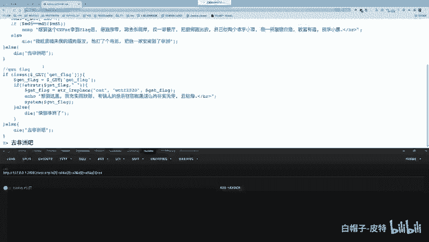

在本节课中，我们将要学习CTF-Web方向中的一个基础但重要的概念：变量覆盖问题。我们将了解什么是变量覆盖，它通常由哪些PHP函数引发，以及如何利用它来解题。

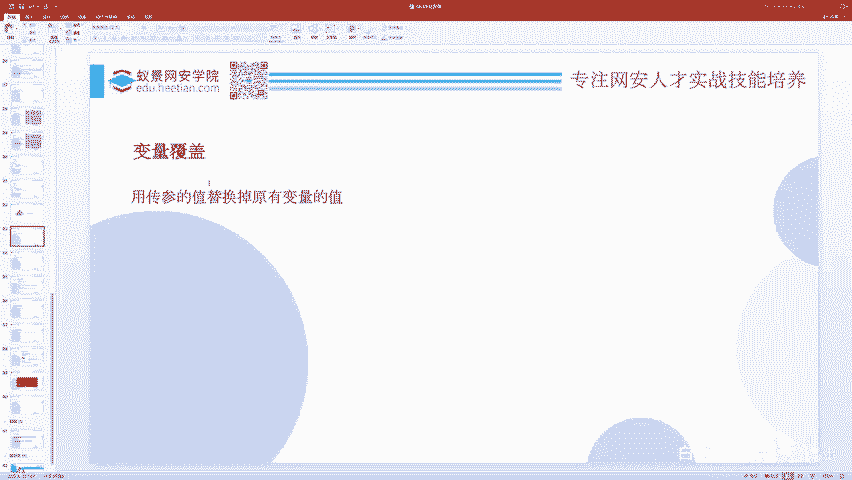

## 概述

变量覆盖是指通过某些操作，改变程序中已有变量的值，或者创建新的变量。这本身可能无害，但当后续代码逻辑依赖于这些被覆盖的变量时，就可能引发安全问题，成为CTF赛题的考点。

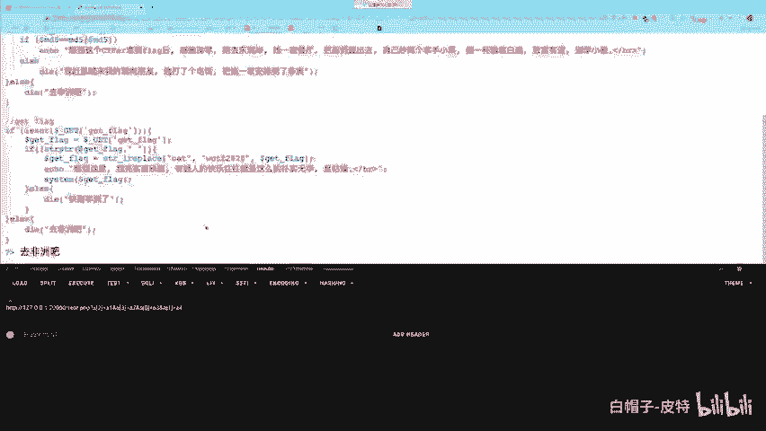

上一节我们介绍了其他Web漏洞，本节中我们来看看变量覆盖的具体原理和利用方式。

## 什么是变量覆盖？

变量覆盖，顾名思义，就是去覆盖一个已有的变量。在PHP中，变量可以被定义和赋值。例如，我们定义一个变量 `$a`。

```php
$a = "ABC";
```

然后，我们可以将这个变量的值覆盖掉。

```php
$a = "DEF";
```

此时，变量 `$a` 的值就从 “ABC” 被改成了 “DEF”，与原来的值没有任何关系了。如果在PHP代码中，我们能够改掉一些关键变量的值，而程序后续又对这些变量进行了危险操作，就可能造成安全漏洞。

## 引发变量覆盖的常见函数

变量覆盖问题通常与以下几个PHP函数有关：
*   `extract()` 函数
*   `parse_str()` 函数
*   `import_request_variables()` 函数（已在PHP 5.4.0后废弃，不再讨论）

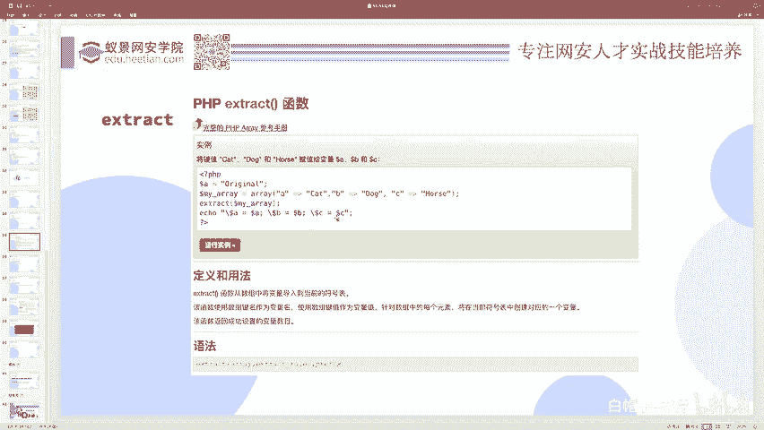

其中，`extract()` 函数是我们需要重点研究的。

### 1. extract() 函数

如果你不了解 `extract()` 函数，可以查阅PHP官方文档。它的作用是将一个数组转换为变量。数组是键值对（key-value）的关系，`extract()` 函数会使用数组的“键”（key）作为变量名，数组的“值”（value）作为该变量的值。

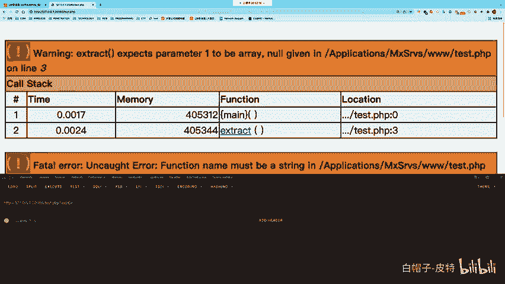

请看以下示例代码：

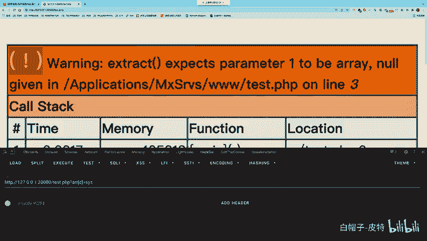

```php
$a = “origin”; // 原变量$a
$arr = array(“a”=>”cat”, “b”=>”dog”, “c”=>”horse”);
extract($arr);
echo $a; // 输出：cat
echo $b; // 输出：dog
echo $c; // 输出：horse
```

执行 `extract($arr)` 后：
*   因为数组中有键 `“a”`，所以变量 `$a` 的值被覆盖为 `“cat”`。
*   因为数组中有键 `“b”` 和 `“c”`，所以创建了新的变量 `$b` 和 `$c`，值分别为 `“dog”` 和 `“horse”`。

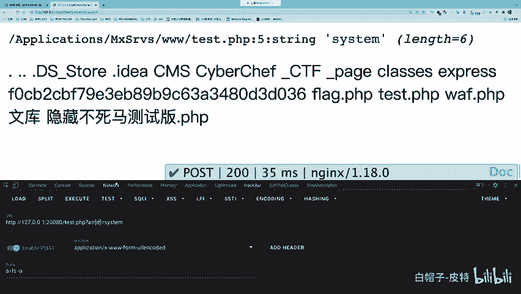

`extract()` 函数本身是为方便开发而设计的。但当开发人员不当使用它，允许用户控制传入的数组时，就可能覆盖一些本不该被修改的变量，或创建一些本不该存在的变量，从而引发安全问题。

**变量覆盖的本质**在于：覆盖行为本身不直接造成危害，危害源于后续代码对这些被覆盖变量的危险使用。

### extract() 变量覆盖实例

请看以下存在漏洞的代码：

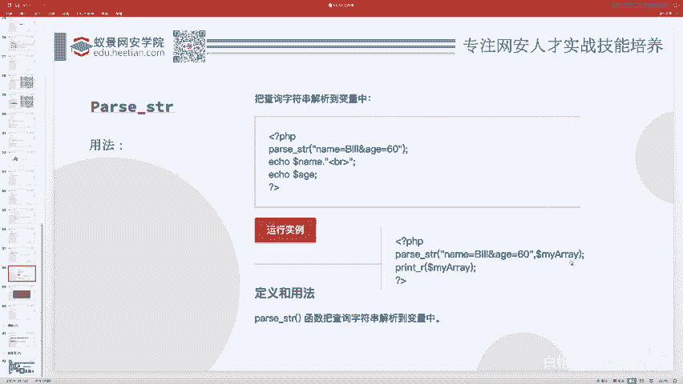

```php
$arr = $_GET[‘arr’]; // 用户通过GET参数控制$arr
extract($arr); // 将用户输入的数组转换为变量
$d($a); // 动态函数调用：以$d的值为函数名，$a的值为参数
```

这段代码的逻辑是：
1.  从GET参数 `arr` 获取一个数组。
2.  使用 `extract()` 将该数组转换为变量。
3.  动态调用函数，函数名和参数来自新生成的变量。

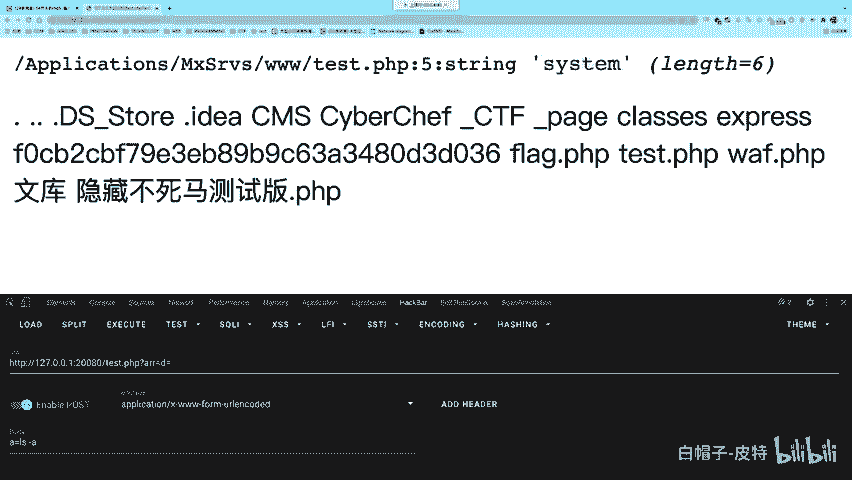

攻击者可以这样利用：
*   构造GET请求：`?arr[d]=system&a=ls`
*   `extract()` 后，会生成 `$d = “system”` 和 `$a = “ls”`。
*   代码执行 `$d($a)` 即变为 `system(“ls”)`，从而执行了系统命令。

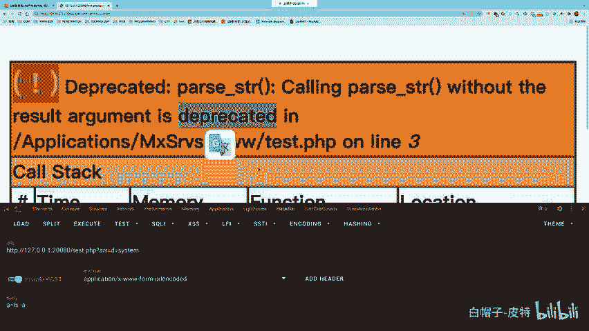

这就是一个典型的由 `extract()` 变量覆盖导致的代码执行漏洞。

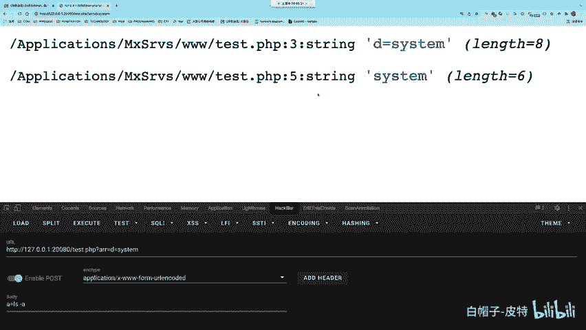

### 2. parse_str() 函数

`parse_str()` 函数与 `extract()` 功能类似，它用于将查询字符串（如 `name=Bob&age=60`）解析到变量中。

例如：
```php
parse_str(“name=Bob&age=60”);
echo $name; // 输出：Bob
echo $age; // 输出：60
```

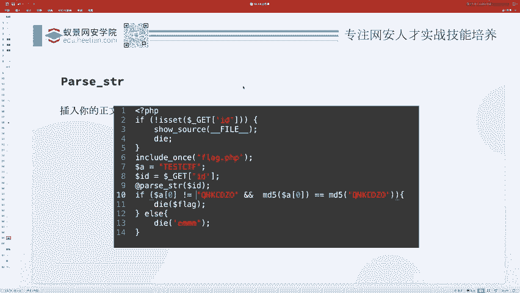

它也会创建变量 `$name` 和 `$age`。同样，如果用户能控制传入的字符串，就可能造成变量覆盖。

我们可以修改之前的漏洞代码来演示：

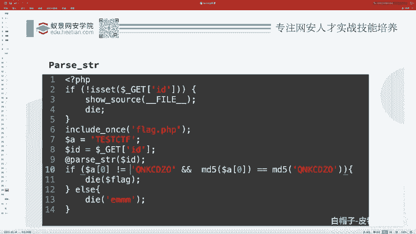

```php
$arr = $_GET[‘arr’]; // 用户输入
parse_str($arr); // 解析字符串到变量
$d($a); // 动态函数调用
```

攻击者可以构造请求：`?arr=d=system&a=ls`。`parse_str()` 解析后，同样会生成 `$d = “system”` 和 `$a = “ls”`，导致命令执行。

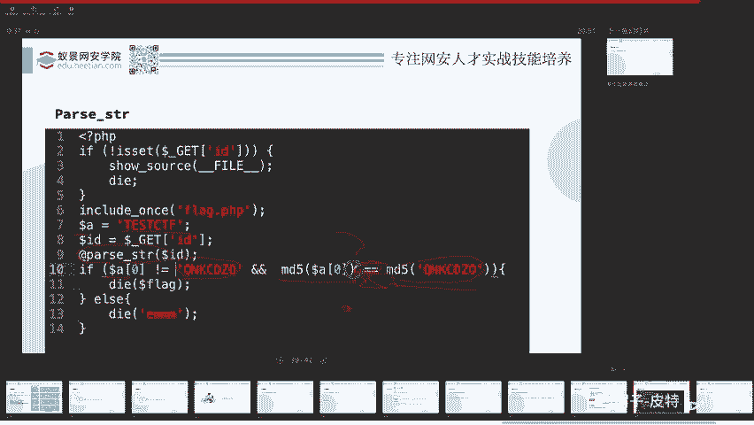

## 综合例题分析

掌握了基础知识后，我们来看一个结合了变量覆盖和PHP弱类型比较的综合例题。

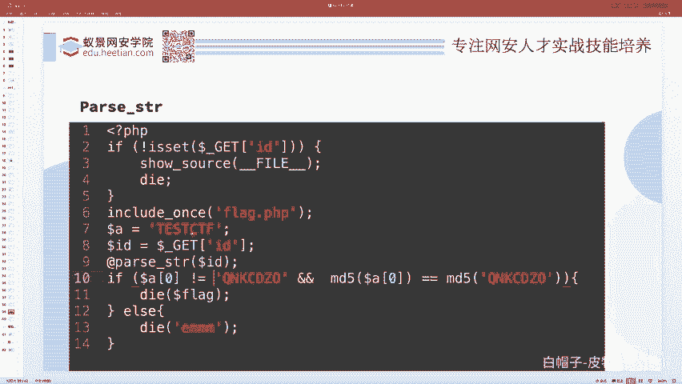

题目源码如下：
```php
$a = “tCTF”;
$id = $_GET[‘id’];
parse_str($id);
if ($a[0] != ‘QNKCDZO’ && md5($a[0]) == md5(‘QNKCDZO’)) {
    echo “flag{xxx}”;
}
```

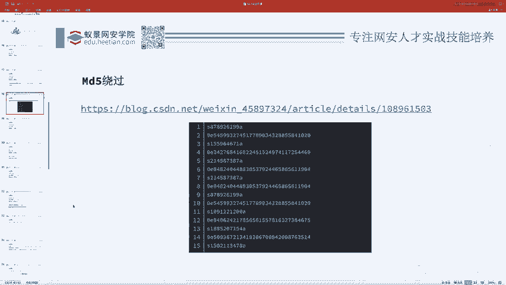

解题流程分析：
1.  **变量覆盖**：代码使用 `parse_str($id)`，我们可以通过 `id` 参数覆盖变量 `$a`。
2.  **条件判断**：覆盖后，需要满足两个条件：
    *   `$a[0] != ‘QNKCDZO’`：`$a` 数组的第一个元素不等于字符串 `‘QNKCDZO’`。
    *   `md5($a[0]) == md5(‘QNKCDZO’)`：两者MD5哈希值相等（注意是 `==` 弱比较）。

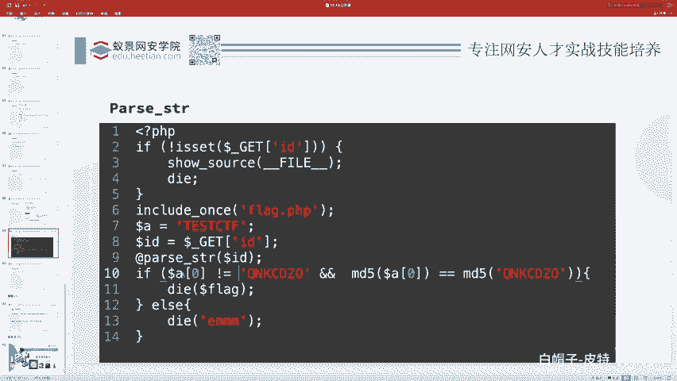

3.  **利用弱类型**：我们知道 `‘QNKCDZO’` 的MD5值是 `0e830400451993494058024219903391`，以 `0e` 开头。在PHP弱比较（`==`）中，`0e` 开头的字符串会被当作科学计数法的0。
    因此，我们需要找到另一个MD5值也是 `0e` 开头的字符串，例如 `‘s878926199a’` 的MD5是 `0e545993274517709034328855841020`。

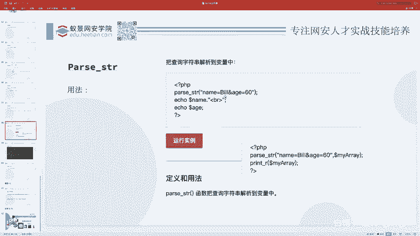

4.  **构造Payload**：
    *   为了通过 `parse_str($id)` 将 `$a` 覆盖为一个数组，并且让 `$a[0]` 等于我们选定的字符串（如 `‘s878926199a’`），我们需要构造查询字符串。
    *   在PHP中，通过GET传数组可以写成 `a[]=value` 或 `a[0]=value`。
    *   因此，最终的Payload为：`?id=a[0]=s878926199a`。
    *   提交后，`parse_str()` 会生成 `$a = array(0 => ‘s878926199a’)`。
    *   条件判断：`$a[0]` 为 `‘s878926199a’`，不等于 `‘QNKCDZO’`，满足第一个条件；两者的MD5值进行弱比较时，都被视为0，相等，满足第二个条件。从而输出flag。


## 总结

本节课中我们一起学习了CTF-Web中的变量覆盖问题。
*   我们理解了**变量覆盖**是指改变程序原有变量的值或创建新变量。
*   我们认识了两个关键函数：`extract()` 和 `parse_str()`，它们可能在不安全的使用场景下引发变量覆盖。
*   我们明确了漏洞产生的关键：**变量覆盖本身无危害，危害在于后续代码对被覆盖变量的危险利用**。
*   最后，我们通过一个综合例题，实践了如何结合变量覆盖和PHP弱类型比较来解题。

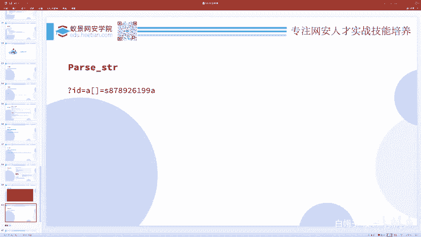

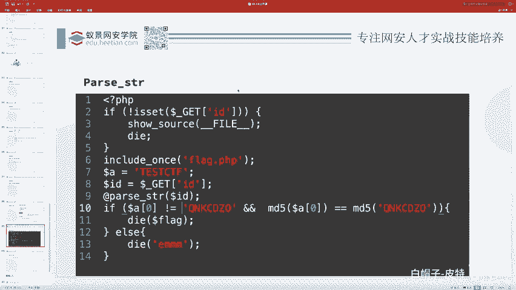

掌握这些基础概念，是进一步学习更复杂Web安全漏洞的基石。