# CTF系列教程：P72：CTF-web 命令执行漏洞 🚨

在本节课中，我们将要学习CTF中Web安全的一个重要漏洞：命令执行漏洞。我们将从基本概念入手，理解其原理、产生条件、危害以及利用方式，并通过实例帮助初学者掌握相关知识。

## 概述：什么是命令执行漏洞？

上一节我们介绍了Web安全的基础，本节中我们来看看命令执行漏洞。命令执行漏洞是指攻击者能够通过存在缺陷的Web应用程序，在服务器操作系统上执行任意系统命令的一种安全漏洞。其本质是应用程序将用户可控的数据，未经充分安全检查就拼接到了系统命令中并执行。

## 命令执行漏洞的原理

### 系统命令与代码执行

虽然本课标题涉及“远程代码执行”，但实际包含两类：执行系统命令和执行PHP代码。首先我们关注系统命令执行。

命令执行就是执行Linux系统的命令。更多人对Linux命令可能更熟悉，即使不熟悉PHP语言也可能用过。

**命令注入攻击**的目标是通过存在漏洞的应用程序，在主机操作系统上执行任意命令。所以，这个漏洞的本质就是在操作系统上执行操作系统的命令。

### 漏洞是如何产生的？

漏洞的产生是因为应用程序需要调用外部程序来处理某些内容，从而使用了一些执行系统命令的函数。

例如，开发人员想用PHP代码创建一个目录。在Linux中，创建目录只需执行一条命令：
```bash
mkdir abc
```
如果开发人员不熟悉如何用PHP代码创建目录，但知道如何使用系统命令，就可能会调用系统命令来执行`mkdir`操作。

在PHP中，可以使用以下函数执行系统命令：
```php
system(), exec(), shell_exec(), passthru(), `反引号`
```
如果执行的系统命令是固定的、写死的，例如：
```php
system('mkdir abc');
```
这行代码无论在哪里执行，都只会创建名为`abc`的目录，用户无法控制，因此不存在漏洞。

**漏洞产生的关键在于**：命令执行函数中的参数（即要执行的命令）有一部分是**用户可控**的。攻击者可以将恶意命令注入到正常的命令中，造成命令注入攻击。

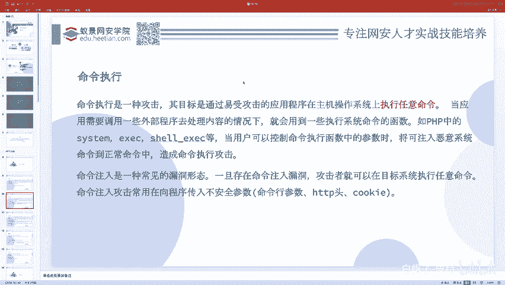

例如，以下代码存在漏洞：
```php
$username = $_GET['username'];
system("mkdir " . $username);
```
这段代码意图是根据用户输入的用户名创建目录。正常情况下，用户输入`abc`，则执行`mkdir abc`。但如果恶意用户输入`abc; cat flag`，最终拼接的命令将变为：
```bash
mkdir abc; cat flag
```
在Linux中，分号`;`用于分隔同一行中的多个命令。因此，系统不仅会执行预期的`mkdir abc`，还会执行注入的`cat flag`命令，从而泄露敏感文件内容。

另一个例子是文件复制操作：
```bash
cp /path/to/source /app/public/用户输入.jpg
```
如果用户输入部分被恶意构造，同样可能注入额外命令。

### 命令注入发生的条件

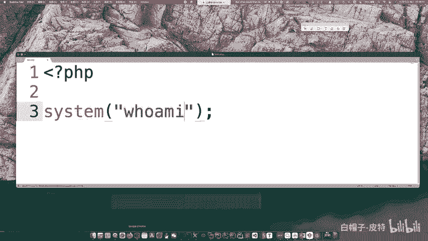

从以上例子可以看出，命令注入漏洞的发生需要满足两个条件：
1.  **存在执行系统命令的函数**。
2.  **执行的命令内容（或部分内容）是用户可控的**，通常通过传参（如GET/POST参数）实现。

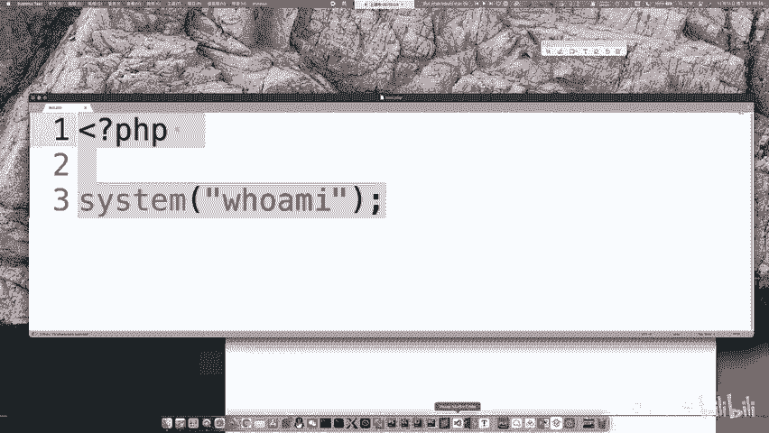

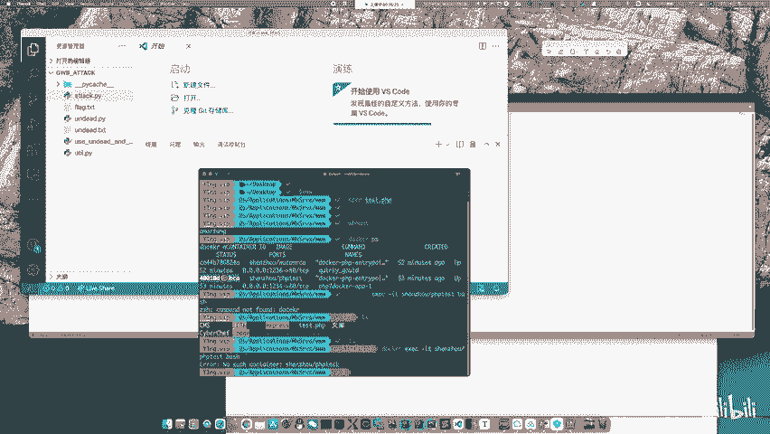

命令注入攻击常发生在向程序传入不安全参数的地方，因为这些参数最终被用来拼接成系统命令。

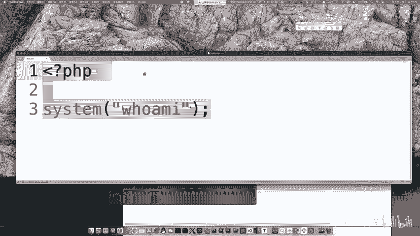

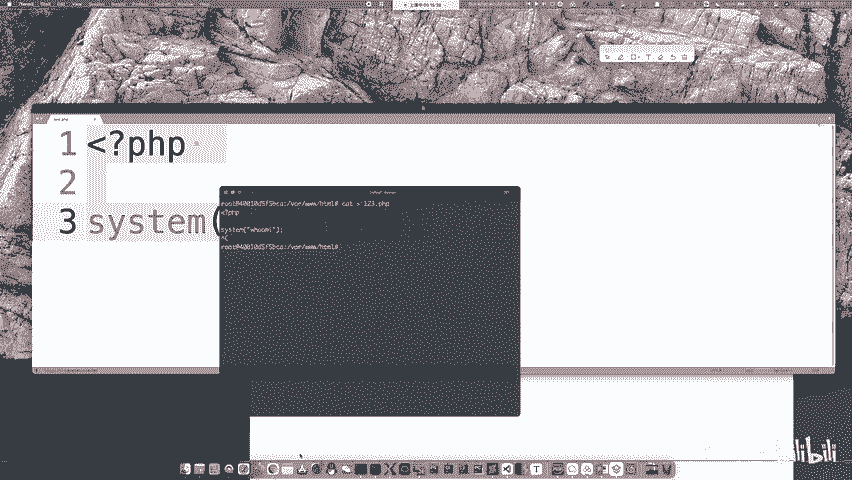

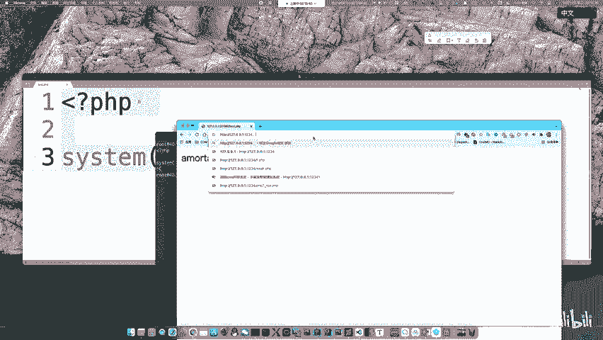

## 命令执行的权限问题

理解了漏洞原理后，我们需要关注执行命令的权限，这决定了攻击的影响范围。

命令是由PHP调用`system`等函数执行的，而PHP是由Web服务器（如Apache、Nginx）运行的。因此，最终执行系统命令的实体是**Web服务器进程**，其权限决定了命令能做什么。

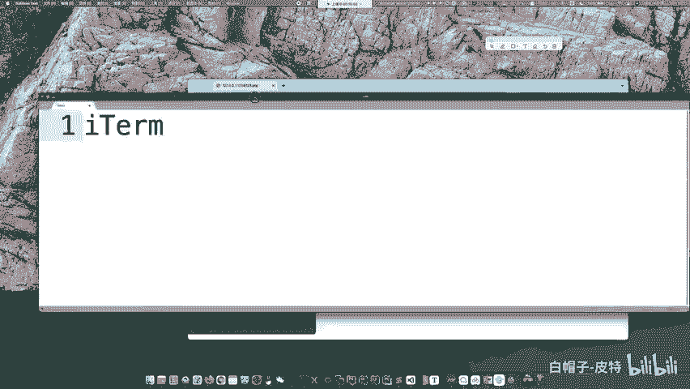

在Linux系统中，最高权限用户是`root`。但Web服务器通常不以`root`身份运行，而是使用一个权限较低的用户，常见的是`www-data`或`nobody`。

你可以通过创建一个简单的PHP文件来查看权限：
```php
<?php system('whoami'); ?>
```
在典型的CTF Docker环境或服务器中，执行结果通常是`www-data`。

### 权限与文件系统

Linux文件权限决定了用户能对文件进行何种操作。使用`ls -l`命令可以查看：
```
-rw-r--r-- 1 root root 1234 May 1 10:00 example.txt
drwxr-xr-x 2 www-data www-data 4096 May 1 10:00 webdir/
```
*   第一列的第一个字符：`-`表示文件，`d`表示目录。
*   后续9个字符每3位一组，分别表示**文件所有者**、**所属组用户**、**其他用户**的权限。
*   `r`代表读（4），`w`代表写（2），`x`代表执行（1）。

例如，`rw-r--r--`（数字表示为644）表示所有者可读可写，组用户和其他用户仅可读。

由于Web服务器进程（如`www-data`）权限较低，它通常无法执行高危害操作，例如关机、关闭关键服务或删除属于`root`用户的文件。

### 命令执行的危害

尽管权限受限，命令执行漏洞的危害依然非常严重：
*   **读取敏感文件**：如配置文件、源代码、数据库凭证、Flag（CTF比赛目标）。
*   **在可写目录写入文件**：例如写入WebShell，获取服务器控制权。
*   **进行内网探测**。
*   **反弹Shell**，建立持久化连接。

在CTF的AWD（攻防对抗）比赛中，常遇到因权限问题无法删除对手WebShell的情况。这是因为对手通过Web漏洞写入的Shell文件属于`www-data`用户，而防守方通过SSH连接使用的可能是`ctf`用户，权限不足无法删除。

**解决方案**：利用漏洞给自己也写入一个WebShell。通过这个WebShell执行删除操作时，是以`www-data`权限运行的，此时删除同属`www-data`的文件就轻而易举了。对于“不死马”（不断自我复活的进程），可以通过WebShell执行`pkill -9 -u www-data`来结束所有相关进程。

## 漏洞利用实战

下面我们通过一个简单的实例来演示如何发现和利用命令注入漏洞。

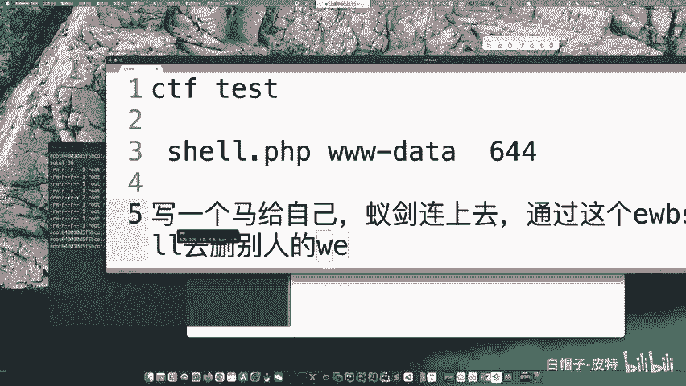

假设存在以下PHP代码（`cmd.php`）：
```php
<?php
if (isset($_GET['ip'])) {
    $ip = $_GET['ip'];
    system("ping -c 4 " . $ip);
} else {
    highlight_file(__FILE__);
}
?>
```
这段代码接收一个`ip`参数，并拼接`ping -c 4`命令来执行ping操作。

### 正常操作
访问 `http://target/cmd.php?ip=127.0.0.1`，服务器会执行：
```bash
ping -c 4 127.0.0.1
```
并返回ping的结果。

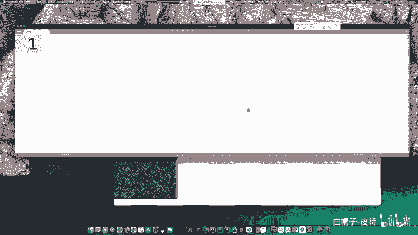

### 注入恶意命令
由于`ip`参数直接拼接到命令中，且没有过滤，我们可以注入其他命令。使用分号`;`分隔：
```
http://target/cmd.php?ip=127.0.0.1; ls -l
```
最终执行的命令变为：
```bash
ping -c 4 127.0.0.1; ls -l
```
服务器会先执行ping（可能超时或失败），然后执行`ls -l`命令，并将结果返回在网页上，从而泄露了当前目录的文件列表。

以下是其他常见的命令分隔符，可用于测试和利用：
*   **`;`**：顺序执行多条命令。
*   **`&`**：后台执行符号，前一条命令执行不影响后一条。
*   **`&&`**：逻辑与，前一条命令成功才执行后一条。
*   **`||`**：逻辑或，前一条命令失败才执行后一条。
*   **`|`**：管道符，将前一条命令的输出作为后一条命令的输入。
*   **反引号 `` ` `` 或 `$()`**：用于命令替换，先执行内部的命令。

## 总结

本节课中我们一起学习了CTF-Web中的命令执行漏洞。

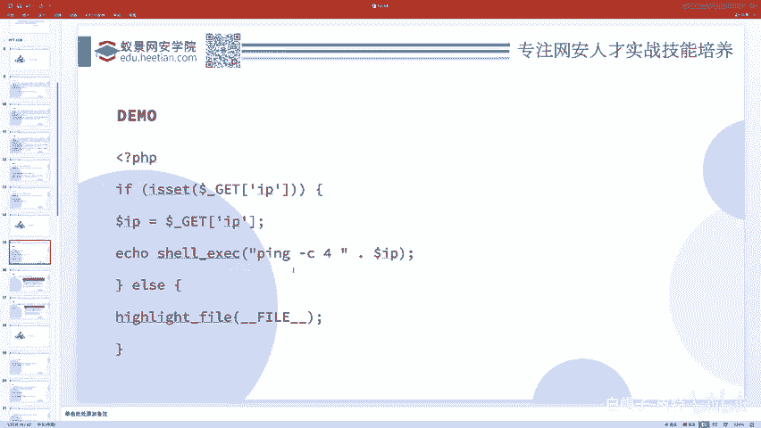

我们首先明确了命令执行漏洞的定义，即攻击者能够利用Web应用缺陷在服务器上执行任意系统命令。然后，我们深入分析了漏洞产生的两个核心条件：**存在执行系统命令的函数**和**命令参数用户可控**。

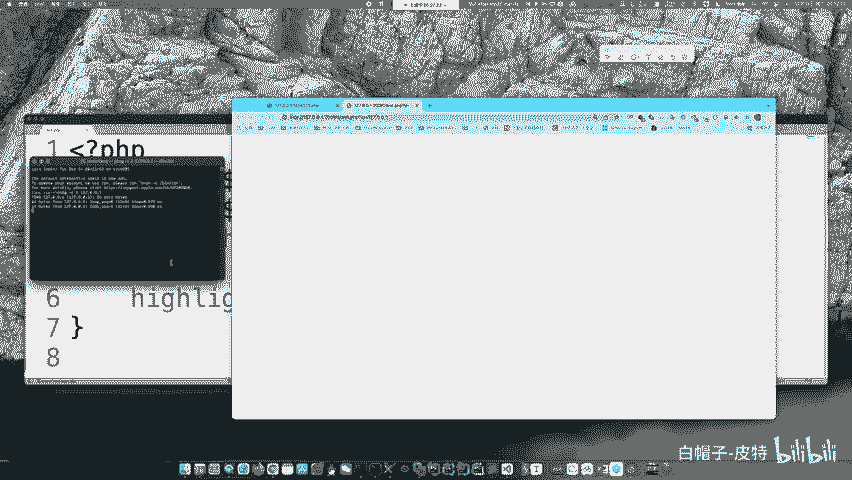

接着，我们探讨了命令执行的权限问题，了解到Web服务通常以`www-data`等低权限用户运行，这限制了攻击的直接危害，但读取敏感信息、写入WebShell等攻击仍然极具威胁。我们还结合AWD比赛场景，讲解了利用权限特性进行防御和对抗的技巧。

最后，我们通过一个ping命令注入的实战例子，演示了如何利用分号等分隔符将恶意命令注入到正常业务逻辑中，并列举了其他常用的命令连接符。

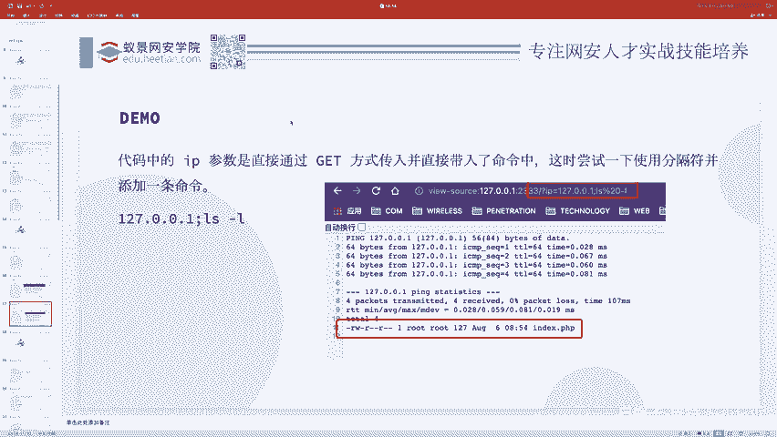

理解命令执行的原理、条件与利用方式，是Web安全学习的重要一步。在后续课程中，我们将学习如何防御此类漏洞。