# CTF系列教程：P75：CTF-web 无字母数字RCE和create_function 🚩

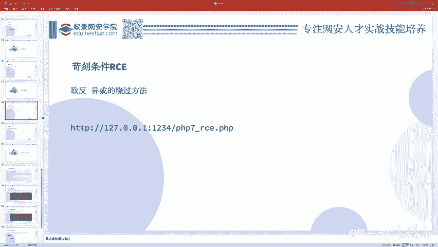

在本节课中，我们将要学习CTF-Web方向中两种特殊的代码执行（RCE）技巧：无字母数字RCE和`create_function`函数相关的漏洞利用。我们将从基础概念入手，通过实例讲解绕过限制的方法。

## 概述

上一节我们介绍了基础的代码执行漏洞。本节中我们来看看当代码执行遇到严格限制时，如何利用PHP语言的特性进行绕过。我们将重点分析两种场景：一是过滤了所有字母和数字的“无字母数字RCE”；二是利用`create_function`函数构造的代码注入。

## 无字母数字RCE

在CTF题目中，代码执行漏洞的考点往往不是直接执行命令，而是设置了各种限制需要绕过。一种常见的限制是过滤所有字母和数字。

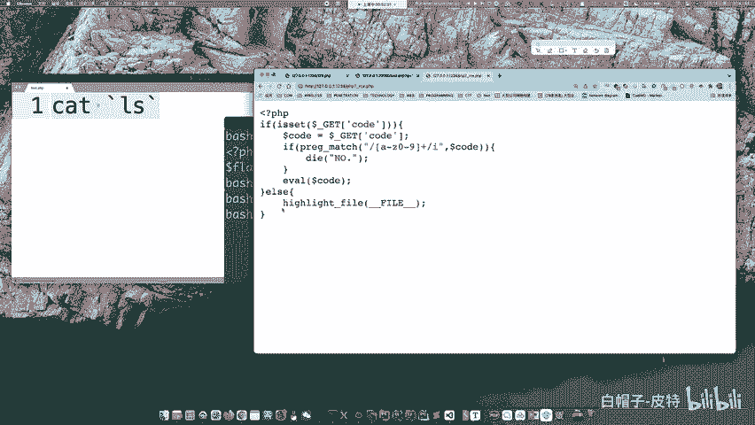

例如，题目中存在一个用户可控的参数`code`，但对其添加了过滤：如果`code`参数中包含任何字母或数字，则不允许执行。这并非针对特定关键字，而是过滤了全部字母数字字符。

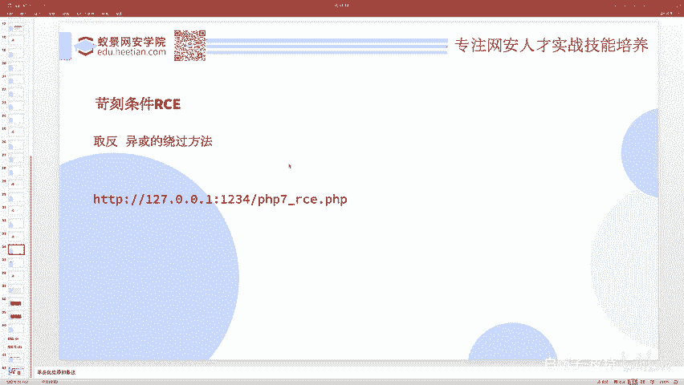

面对这种“无字母数字”的PHP代码执行环境，核心思路是进行“变换”。我们需要通过某种运算，将非字母数字的字符组合，转换成能够构成有效PHP代码的字符串。

### 利用PHP特性：动态函数调用

在讲解具体变换方法前，需要了解一个PHP7的重要特性：动态函数调用。

```php
$func = 'phpinfo';
$func(); // 这行代码将执行 phpinfo() 函数
```

原理是：将一个字符串变量加上括号`()`，PHP就会尝试调用与该字符串同名的函数。因此，我们的目标就变成了：**如何在不使用字母数字的情况下，构造出像`'phpinfo'`、`'system'`这样的字符串**。

### 方法一：异或运算（XOR）

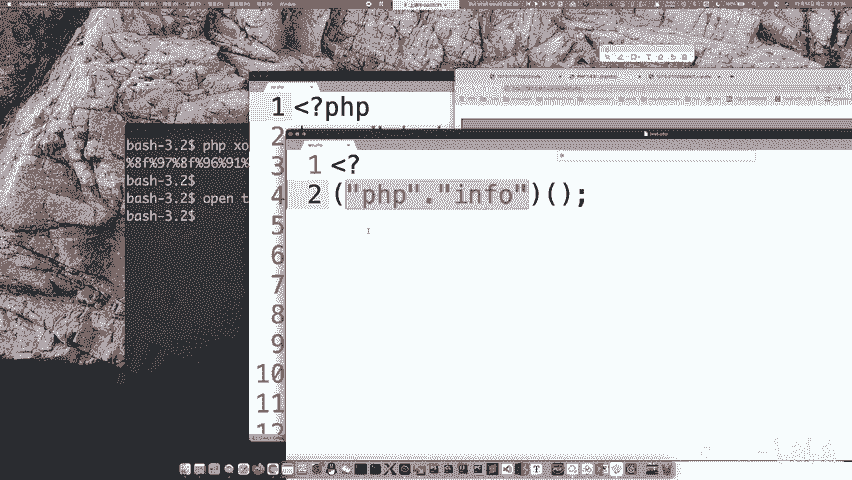

异或运算可以帮助我们生成所需的字符串。以下是一个生成异或字符串的示例代码（`xor.php`）：

```php
// 示例：生成 ‘phpinfo’ 的异或形式
// 实际利用时，需要通过多个非字母数字字符进行异或来得到目标字符串
echo "PHP XOR String Generation";
// 具体生成逻辑需根据字符的ASCII码进行异或组合
```

**利用过程**：
1.  构造出`'system'`字符串的异或形式（例如由`'%xx'`这样的URL编码字符通过异或运算得出）。
2.  同样方法构造出命令参数（如`'ls'`）的异或形式。
3.  使用动态函数调用执行命令：`($_GET['code'])();`，其中`$_GET['code']`的值就是我们构造的异或字符串。

尽管执行时可能产生一些关于未定义常量的警告（Warning），但目标函数（如`system('ls')`）确实能够成功执行。

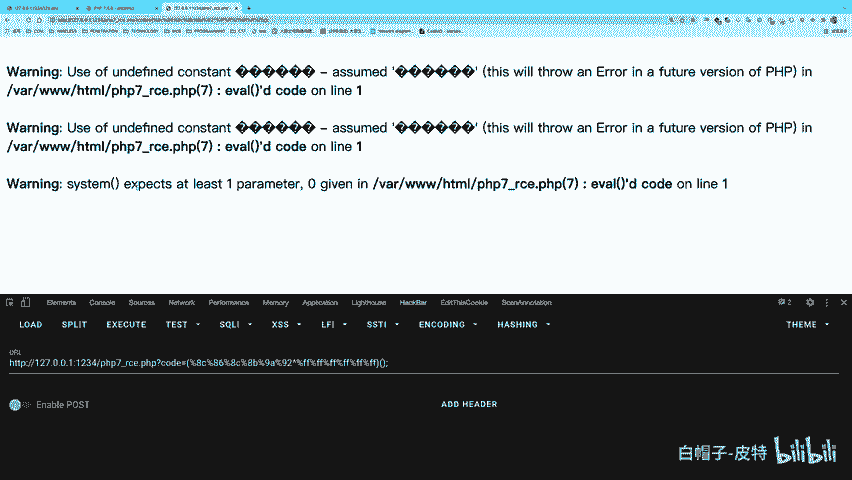

### 方法二：取反运算（~）

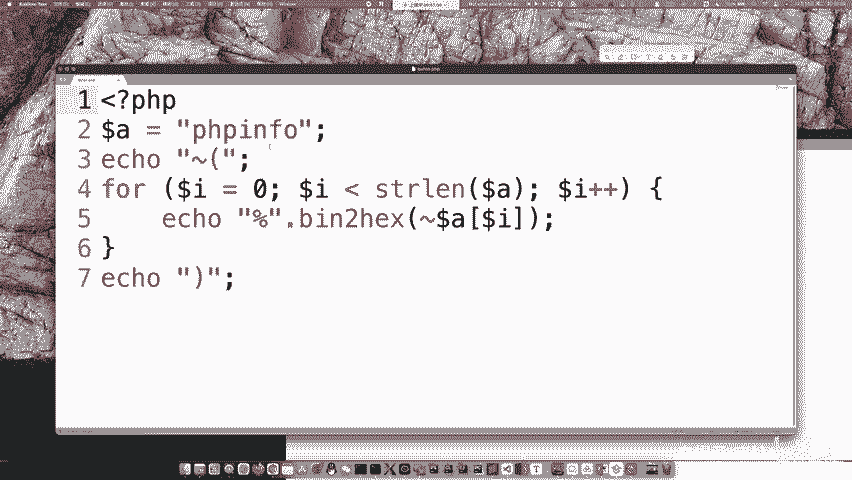

除了异或，取反运算也是常用的手段。取反运算直接对字符串的二进制位进行翻转。

```php
// 示例：生成 ‘phpinfo’ 的取反形式
// 例如: ~('some_string') 经过运算可以得到目标字符串的一部分
echo "PHP Bitwise NOT String Generation";
```

**利用过程**：
与方法一类似，通过取反运算构造出目标函数名和参数的字符串形式，然后利用动态调用执行。

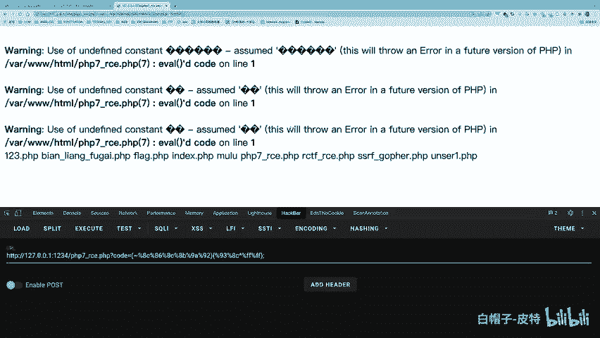

以下是两种方法的对比总结：
*   **异或(XOR)**：通过两个或多个字符进行按位异或来生成目标字符。
*   **取反(~)**：直接对字符的二进制表示取反，构造出的payload通常以`%FF`等形式出现。
这两种方法是绕过无字母数字过滤的基础且有效的方式。

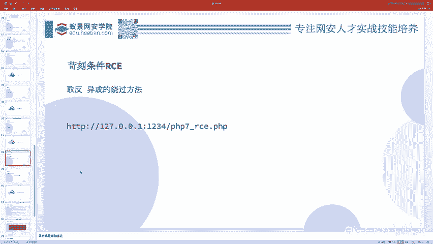

## 一道综合限制的CTF例题

接下来我们分析一道综合了多种限制的CTF题目，其过滤条件极为苛刻：
1.  输入长度不能大于18个字符。
2.  不允许出现字母、数字和下划线（`\w`）。
3.  禁止使用位运算符（`&`, `|`, `^`, `~`）。
4.  禁止使用括号`()`。
5.  禁止使用大括号`{}`、中括号`[]`。
6.  禁止使用`$`、反引号`` ` ``、点`.`等符号。

然而，这道题的解法却出乎意料的简单，只需要输入以下payload：
```
?code=?><?=`/???/???%20/???/???/????/*`;
```

提交后，服务器会执行命令并返回结果，其中包含`flag.php`的内容。

### 解题原理分析

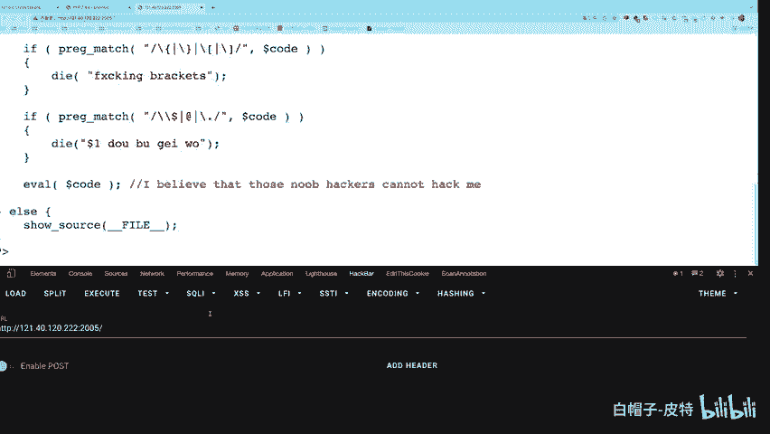

这个payload巧妙地利用了多个PHP和Shell的特性：


1.  **`?>` 和 `<?=`**：
    *   `?>` 用于闭合题目中可能已存在的PHP标签。
    *   `<?=` 是PHP的短标签（short tag），等同于 `<?php echo ... ?>`。这是关键的输出手段。

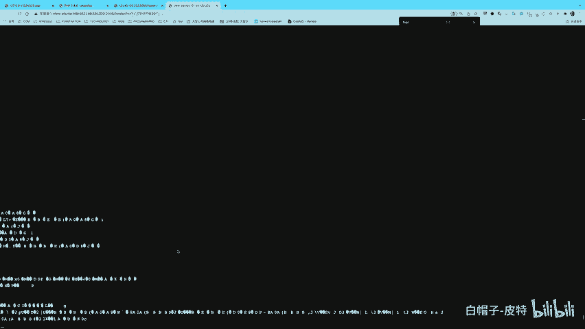

2.  **反引号 `` ` ``**：
    *   在PHP中，反引号用于执行Shell命令并返回输出。它绕过了对函数名（如`system`）的依赖。

3.  **Shell通配符**：
    *   `*` 匹配任意长度字符串。
    *   `?` 匹配单个字符。
    *   `/???/???` 可能匹配到 `/bin/cat`。
    *   `/???/???/????/*` 可能匹配到 `/var/www/html/flag.php`（路径仅供参考）。
    *   `%20` 是空格的URL编码，用于分隔命令和参数。

**整个Payload的执行逻辑**：
`<?=``/???/???%20/???/???/????/*``;`
这行代码等价于：`echo shell_exec('/bin/cat /var/www/html/flag.php');`
从而成功读取并输出flag文件的内容。长度限制通过极简的语法和通配符得以满足。

## create_function() 代码注入

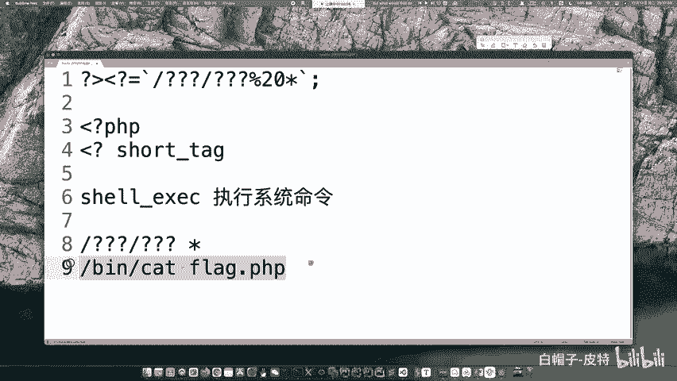

最后，我们简要介绍一个历史上存在的漏洞点：`create_function()`函数。

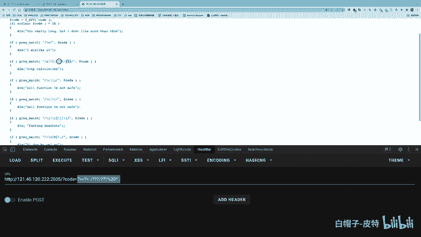

`create_function()`用于动态创建一个匿名函数。其语法如下：
```php
create_function('$a, $b', 'return $a + $b;');
```

**漏洞原理**在于，该函数的第二个参数（函数体代码）是字符串，并在内部使用`eval()`执行。如果用户输入被拼接进这个字符串，且没有妥善处理，就可能造成代码注入。

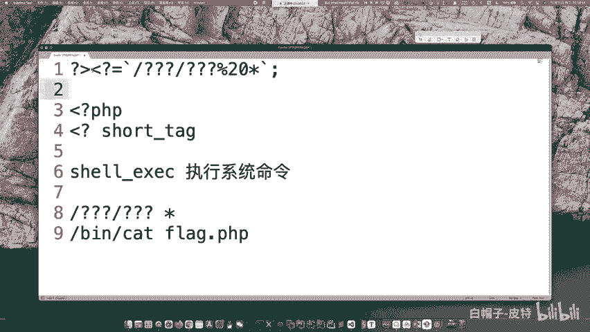

**典型的利用方式**类似于SQL注入：
```php
// 假设用户可控 $user_input
$code = "return $a + $b; } $user_input; //";
create_function('$a, $b', $code);
```
攻击者可以输入如`} phpinfo(); //`，从而提前闭合函数体，注入恶意代码，并用注释符`//`注释掉后面的原始内容。

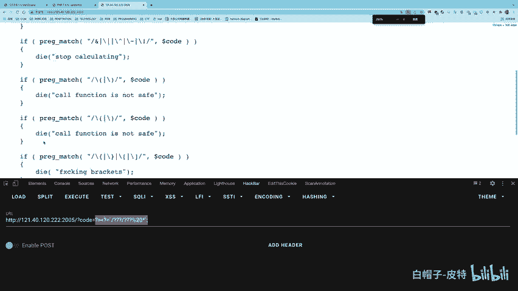

需要注意的是，`create_function()`函数由于其安全性问题，在PHP 7.2.0版本中已被弃用，并在更新版本中移除，因此在现代Web应用中已较少出现，但在一些CTF老题或特定环境中仍可能遇到。

## 总结

本节课中我们一起学习了两种高级的代码执行利用技巧。
1.  **无字母数字RCE**：核心在于利用PHP的位运算（异或、取反）和动态函数调用特性，在严格字符限制下构造出可执行的代码字符串。
2.  **综合绕过实例**：通过分析一道极端限制的题目，我们学习了如何组合使用PHP短标签、反引号执行命令以及Shell通配符，在极短的payload内实现目标。
3.  **create_function注入**：了解了该函数因内部使用`eval()`而可能产生的代码注入漏洞，其利用方式与闭合注入类似。

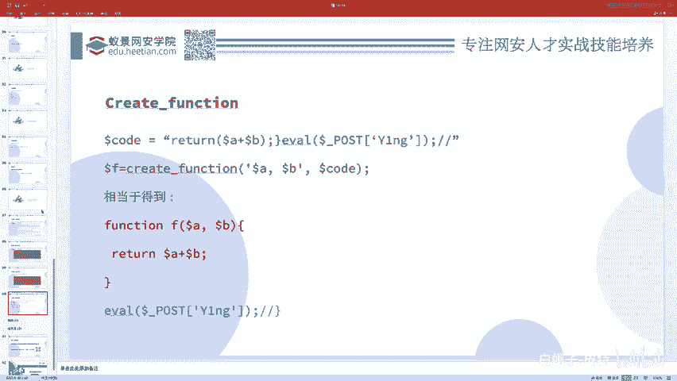

这些技巧展示了在CTF比赛中，深入理解语言特性和灵活运用知识的重要性。