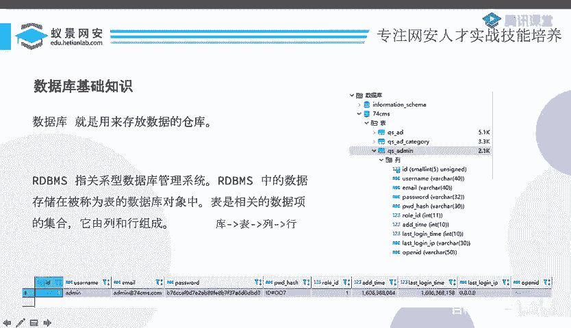
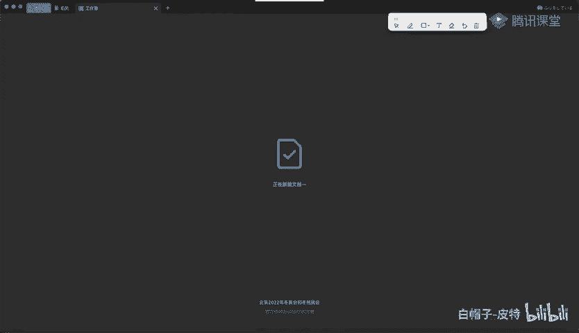
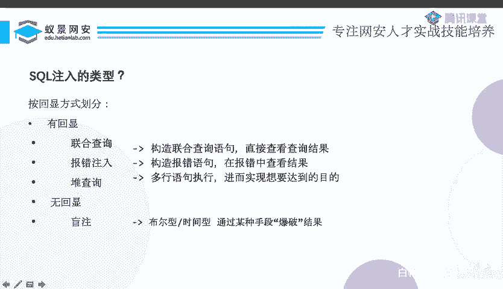

# CTF系列教程：P77：CTF web sql注入入门之MySQL基础 🗄️

在本节课中，我们将要学习CTF中Web安全方向一个非常核心的漏洞——SQL注入。我们将从MySQL数据库的基础知识开始，逐步理解SQL注入的原理与分类，为后续的实战打下坚实基础。

## 第一部分：MySQL数据库基础

上一节我们介绍了课程的整体安排，本节中我们来看看MySQL数据库的基础知识。在CTF比赛中，绝大多数题目都使用MySQL数据库，因此掌握其基础至关重要。

什么是数据库？数据库就是存放数据的仓库。它是一个存储了大量数据的系统。

关系型数据库管理系统（RDBMS）是数据库的简称。其中的数据存储在被称为“表”的数据库对象中。表是相关数据项的集合，由列和行组成。

我们可以用一个简单的结构来总结：**库 -> 表 -> 列 -> 行**。



以下是一个数据库结构的示例介绍：
*   **库**：例如 `74CMS`，这是一个数据库。
*   **表**：库的下一层是表，例如 `QS_admin` 等。
*   **列**：表下面是列，例如 `id`, `username`, `email`, `password` 等。
*   **行**：列下面是行，例如 `id=1, username=‘admin’, email=‘admin@example.com’` 等数据。



如果你没有接触过数据库，可以将其类比为Excel表格。一个Excel文件就像一个数据库，文件中的一个个工作表（Sheet）就像数据库中的表，工作表的表头（A列、B列）就是列，而表头下面的每一行数据就是行。

## 第二部分：SQL语言与SQL注入原理

上一节我们了解了数据库的结构，本节中我们来看看如何与数据库“对话”。要让数据库执行操作，需要使用一种它能理解的语言，这就是**结构化查询语言（SQL）**。

SQL用于管理关系型数据库管理系统，其操作范围包括数据的插入、查询、更新和删除，即常说的“增删改查”。

以下是几个基础的SQL操作语句示例：
```sql
SHOW DATABASES; -- 显示所有数据库
USE database_name; -- 使用某个数据库
SHOW TABLES; -- 显示当前数据库中的所有表
```

那么，什么是SQL注入呢？根据定义，SQL注入是指将SQL代码插入或添加到应用程序的输入参数中，再将这些参数传递给后台的SQL服务器加以解析并执行的攻击。

简单来说，应用程序需要让数据库执行操作，所以会构造SQL语句。如果构造SQL语句的**某一部分参数是用户可控的**，并且用户的输入**不仅仅是普通参数，而是构成了符合语法的SQL代码**，那么数据库就会将用户的输入当作代码来执行，这就导致了SQL注入。

攻击者通过SQL注入，能够获取数据库内的敏感数据信息。

SQL注入产生的核心条件是：
1.  **用户控制了SQL语句的一部分**。
2.  **用户的输入被拼接成了合法的SQL语法**。

## 第三部分：SQL注入的分类与简介

上一节我们明白了SQL注入是如何发生的，本节中我们根据攻击结果的“回显”方式，对SQL注入进行分类。回显是指应用程序将SQL查询的结果或状态反馈给用户的方式。

根据回显方式，SQL注入主要分为两大类：**有回显注入**和**无回显注入**。

有回显的注入又可以细分为以下几种常见类型：

以下是几种有回显的SQL注入类型简介：
*   **联合查询注入**：核心是利用 `UNION` 操作符，将多个 `SELECT` 查询语句的结果合并到一起返回。攻击者可以借此查询其他表的数据。
*   **报错注入**：通过故意构造错误的SQL语句，触发数据库报错，并**在报错信息中携带我们想查询的数据结果**。
*   **堆叠注入**：利用分号 `;` 一次性执行多条SQL语句。但这种注入能否成功严重依赖于数据库和应用程序的配置，并不常见。

无回显的注入主要是指**盲注**。在盲注中，页面不会直接显示数据库数据或详细的错误信息，攻击者只能通过查询返回的**真假状态**或**时间延迟**来间接推断数据。盲注是CTF比赛中更常见、更具挑战性的考点。

本节课中我们一起学习了MySQL数据库的基础结构、SQL语言的作用以及SQL注入的基本原理与分类。我们了解到，SQL注入的本质是“用户输入被当作代码执行”。下一节课，我们将深入探讨“联合查询注入”的具体利用方法。



> 本教程内容整理自视频《2024B站最系统的CTF入门教程！CTF-web,CTF逆向,CTF,misc,CTF-pwn,从基础到赛题实战，手把手带你入门CTF！！ - P77：CTF系列教程-CTF web sql注入入门之MySQL基础 - 白帽子-皮特 - BV1m64y157UX》，已去除语气词并按照要求进行结构化处理。