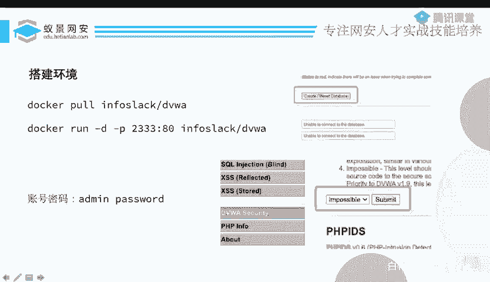
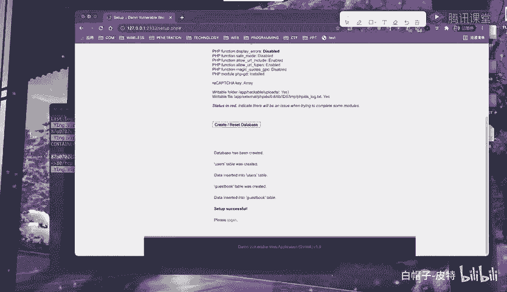
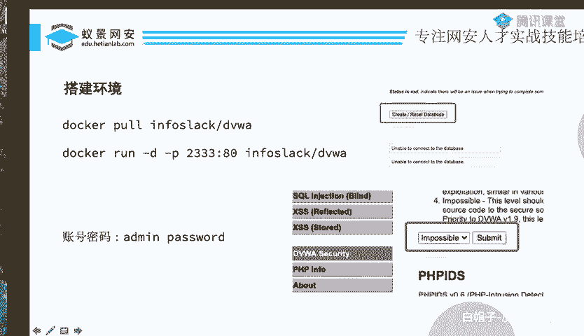
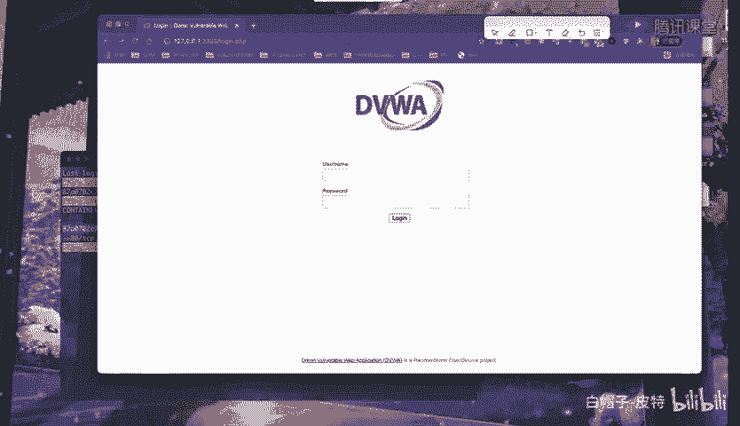
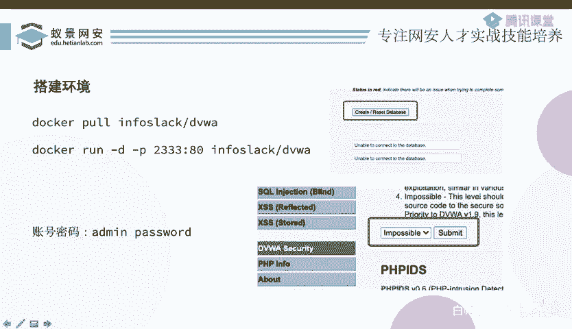

CTF入门教程：P78：DVWA靶场搭建

在本节课中，我们将学习如何搭建一个名为DVWA的Web漏洞靶场。DVWA是一个专为安全测试设计的平台，包含了SQL注入、文件上传等多种常见漏洞类型，是学习CTF-Web方向的绝佳实践环境。

上一节我们介绍了一些基础概念，本节中我们来看看如何实际操作，搭建起我们的第一个练习环境。

### 环境准备与搭建

搭建DVWA靶场有多种方式，推荐使用Docker，因为它能快速部署且环境独立。以下是具体步骤。

以下是使用Docker搭建DVWA的两种主要方法：



1.  **直接运行Docker容器**：这是最快捷的方式。在命令行中执行以下命令，Docker会自动从仓库拉取镜像并启动容器。
    ```bash
    docker run -d -p 2333:80 vulnerables/web-dvwa
    ```
    命令解析：
    *   `docker run`：运行一个新容器。
    *   `-d`：让容器在后台运行。
    *   `-p 2333:80`：将容器内部的80端口映射到宿主机的2333端口。
    *   `vulnerables/web-dvwa`：要使用的Docker镜像名称。

2.  **使用源代码或集成环境**：如果你熟悉PHP环境（如XAMPP、PHPStudy），也可以下载DVWA的源代码，将其放置在Web服务器目录下进行配置。

执行`docker run`命令后，系统会开始拉取镜像并启动容器。你可以使用以下命令查看正在运行的容器，确认DVWA是否成功启动。
```bash
docker ps
```
如果看到容器状态为“Up”，并且端口映射正确，说明启动成功。

### 靶场初始化与登录

容器启动后，我们通过浏览器访问靶场并进行初始化设置。



首先，在浏览器地址栏输入 `http://localhost:2333` 或 `http://你的服务器IP:2333`，即可看到DVWA的初始页面。

首次访问时，需要点击页面中的 **“Create / Reset Database”** 按钮来初始化数据库。点击后，系统会提示数据库创建成功，并自动跳转到登录页面。



DVWA有默认的登录凭证：
*   **用户名**：`admin`
*   **密码**：`password`



使用以上账号密码登录，即可成功进入DVWA的主界面。

### 安全等级设置

进入主界面后，在左侧菜单栏可以看到各种漏洞模块，如Brute Force（暴力破解）、Command Injection（命令注入）、SQL Injection（SQL注入）等。

在开始练习之前，有一个关键步骤：调整安全等级。在左侧菜单中找到并点击 **“DVWA Security”**。

在安全设置页面，你会看到 **“Security Level”** 选项，它默认可能设置为 **“Impossible”**。这个等级意味着所有防护措施都已开启，漏洞几乎无法被利用，不适合学习。

为了进行漏洞利用练习，我们需要将其修改为较低等级。建议初学者从 **“Low”** 开始。选择“Low”后，点击“Submit”保存设置。

至此，你的DVWA靶场已经完全搭建并配置妥当，可以开始进行各种Web安全漏洞的学习和实战演练了。



本节课中我们一起学习了如何使用Docker快速搭建DVWA漏洞靶场，完成了从环境部署、数据库初始化到登录及安全等级设置的全过程。现在，你已经拥有了一个功能完备的CTF-Web练习平台，为后续深入学习SQL注入等漏洞利用技术做好了准备。