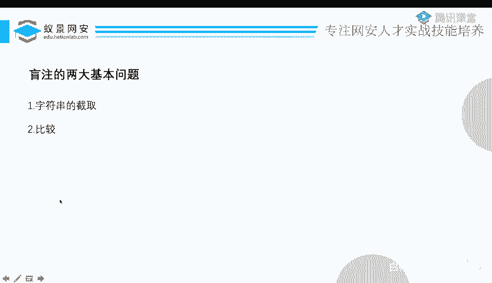
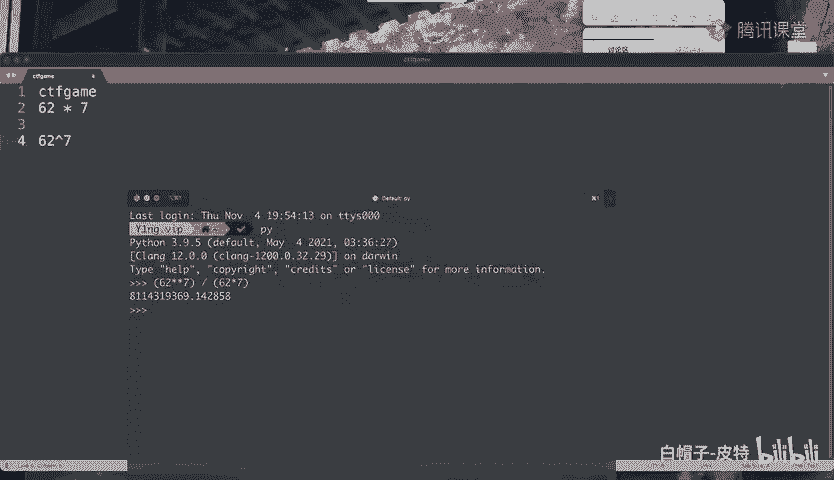
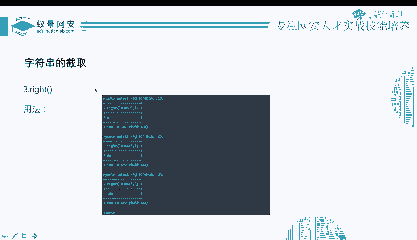
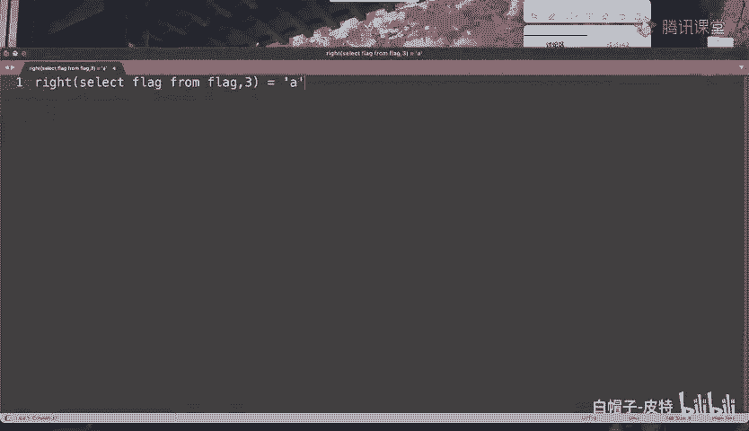
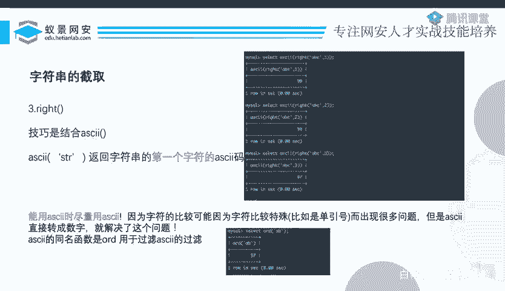
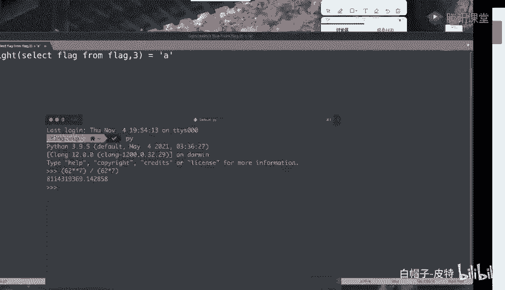
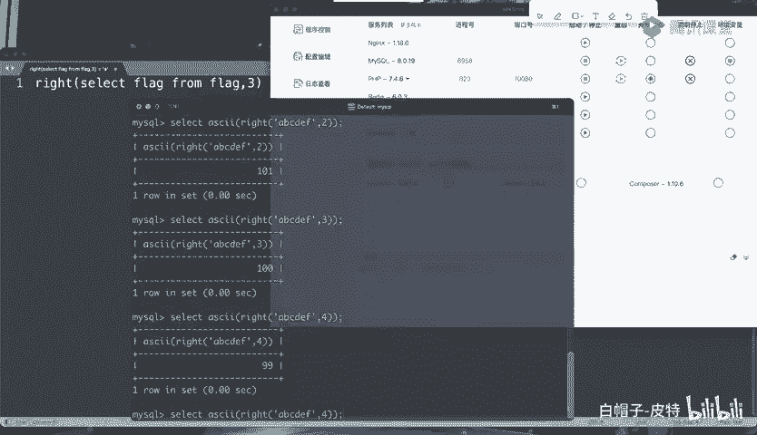

# CTF系列教程：P80：玩转SQL盲注之布尔盲注1

在本节课中，我们将要学习SQL注入中一个重要的分支——布尔盲注。我们将从基本概念入手，理解其工作原理，并学习如何通过构造布尔表达式来逐位“猜解”数据库中的信息。

## 概述：什么是布尔盲注？

上一节我们介绍了SQL注入的分类，其中提到根据回显方式可以划分为有回显注入和无回显注入。无回显注入，就是我们所说的“盲注”。

盲注需要通过某种间接手段来“爆破”查询结果。虽然标题提到了三种，但盲注主要分为两大分支：**布尔型盲注**和**时间型盲注**。本节我们将重点探讨布尔型盲注。

布尔型盲注的核心在于，页面对不同查询条件会返回**两种不同的状态**（即布尔值：真/假）。攻击者通过观察这两种状态的差异，来判断注入的SQL语句是否执行成功，从而逐步推断出数据库中的信息。

## 布尔盲注的基本原理

我们以一个简单的学生信息查询系统为例。当你输入一个正确的学号，页面会显示该学生的姓名、专业和年龄。当你输入一个不存在的学号，页面则不会显示任何学生信息。

如果我们不细看具体内容，从宏观上讲，这就产生了两种不同的页面回显。布尔（Boolean）代表的就是“真”和“假”两种状态。因此，这两种不同的回显，就可以对应两种布尔状态。

以下是几种常见的布尔状态表现形式：
*   **内容的不同**：如上述例子，查询成功显示内容，查询失败不显示或显示错误信息。
*   **HTTP状态码的不同**：例如，登录成功返回302重定向，登录失败返回200并提示错误。
*   **HTTP响应头的不同**：例如，登录成功会在响应头中设置`Set-Cookie`或`Location`字段，登录失败则没有。
*   **基于错误的盲注**：通过SQL语句执行错误与否产生的不同回显来判断。这将在后续章节详细讨论。

这些前端可见的变化，本质上反映了后端数据库执行SQL查询的**成功与失败**。布尔盲注就是利用这种“成功”与“失败”的二元状态进行信息推断。

## 从测试到利用：理解核心表达式

在寻找注入点时，我们常使用 `id=1 and 1=1` 和 `id=1 and 1=2` 这样的Payload。`1=1`恒为真，`1=2`恒为假。`AND`运算要求所有条件都为真结果才为真。因此：
*   `id=1 and 1=1` 整个条件为真，查询成功。
*   `id=1 and 1=2` 整个条件为假，查询失败。

页面回显会因此发生变化，从而帮助我们确认注入点。

在盲注中，`1=1`和`1=2`这个简单的布尔表达式变得至关重要。它影响着整个查询语句的结果。那么，我们是否可以将这个表达式替换成更复杂的内容呢？

答案是肯定的。任何最终返回真或假的布尔表达式都可以。例如，我们可以将其替换为：
```sql
id=1 and substr((select database()),1,1)='a'
```
这个表达式的含义是：查询`id`为1的记录，**并且**当前数据库名称的第一个字符等于字母‘a’。

*   如果数据库首字符确实是‘a’，则整个表达式为真，页面返回“查询成功”的状态。
*   如果不是‘a’，则表达式为假，页面返回“查询失败”的状态。

通过这种方式，我们就可以像猜密码一样，从‘a’到‘z’，从‘A’到‘Z’，从‘0’到‘9’逐个尝试。当尝试到字母‘f’时，页面返回了成功状态，那么我们就知道数据库名的第一个字符是‘f’。

## 逐位猜解：盲注的完整过程

仅仅知道首字母是不够的。接下来，我们需要获取完整的字符串。

我们将`substr`函数的参数进行修改：
*   将 `substr(...,1,1)` 改为 `substr(...,2,1)`，即可测试第二个字符。
*   再将参数改为 `substr(...,3,1)`，测试第三个字符。
*   以此类推，直到某一位的测试返回失败（说明字符串已结束）。

这个过程就是“逐位猜解”。虽然不像联合查询那样一次性获取所有信息，但通过坚持不懈地尝试，我们最终能够还原出完整的字符串，例如数据库名、表名、字段值等。

## 布尔盲注的两大基本问题

观察核心的注入表达式，我们可以将其拆解为两个部分：
1.  **`substr((select database()),1,1)`**：这部分负责**字符串截取**。
2.  **`='a'`**：这部分负责**字符串比较**。



我认为，所有的布尔盲注技术，本质上都是围绕解决这两个基本问题展开的。

### 为什么字符串截取是基本问题？

假设正确结果是 `CTFgame`（7位字符）。如果每位有62种可能（大小写字母+数字）。
*   **逐位猜解**：最多尝试次数为 `62 * 7 = 434` 次。
*   **整体猜解**（不截取）：需要尝试所有排列组合，次数为 `62^7 ≈ 3.5万亿` 次。



两者相差超过80亿倍。不进行截取而直接爆破整体结果，在实战中是绝对不可行的。因此，**将目标字符串分割成小块（通常是单个字符）是盲注的必要步骤**。

### 为什么字符串比较是基本问题？

盲注就是“猜”。我们问数据库：“第一位是不是‘a’？”、“是不是‘b’？”。这个“是不是”的过程就是比较。没有比较，我们就无法得到一个“是/否”（真/假）的答案，也就无法驱动盲注流程。因此，**进行比较是产生布尔状态的核心**。

综上所述，盲注就是在**循环执行“截取一小段 -> 比较判断 -> 记录结果”**这个过程。只要掌握了所有可能的字符串截取方法和比较方法，理论上就能解决所有布尔盲注题目。

## 字符串截取方法汇总

以下是MySQL中常用的字符串截取函数：

### 1. SUBSTRING / SUBSTR
这是最常用、最精确的截取函数。
```sql
SUBSTRING(str, start, length)
```
*   `str`：要截取的字符串（可以是`SELECT`子查询的结果）。
*   `start`：开始位置（从1开始计数）。
*   `length`：要截取的长度。

**示例**：`SUBSTRING((SELECT database()), 1, 1)` 截取数据库名的第一个字符。

**注意**：如果逗号被过滤，可以使用 `FROM ... FOR ...` 语法替代：
```sql
SUBSTRING((SELECT database()) FROM 1 FOR 1)
```

### 2. MID
`MID`函数与`SUBSTRING`功能几乎完全相同，在大多数情况下可以互换使用。在盲注中，如果`SUBSTRING`被过滤，可以尝试使用`MID`。
```sql
MID(str, start, length)
```



### 3. RIGHT / LEFT
这两个函数用于从字符串的右端或左端开始截取。
```sql
RIGHT(str, length) -- 从右向左截取指定长度
LEFT(str, length)  -- 从左向右截取指定长度
```
**局限性**：它们无法像`SUBSTRING`那样精确截取中间某一位。例如，`RIGHT(‘ABCDEF‘, 1)`得到‘F‘，`RIGHT(‘ABCDEF‘, 2)`得到‘EF‘。

虽然可以通过组合比较来猜解（例如，猜‘EF‘是否等于‘aF‘, ‘bF‘, ‘cF‘...），但这种方法效率较低，且当字符包含引号等特殊符号时容易引发语法错误，**不推荐直接使用**。

## 关键技巧：结合ASCII码函数

将`RIGHT`/`LEFT`函数与`ASCII`函数结合使用，可以完美解决其不能精确截取的问题，并且带来额外优势。

`ASCII(str)`函数返回字符串`str`**第一个字符**的ASCII码值。



**示例**：
```sql
ASCII(‘A‘)    -- 返回 65
ASCII(‘ABC‘)  -- 仍然返回第一个字符‘A‘的ASCII码 65
```





现在，我们来看一个巧妙的应用：
```sql
ASCII(RIGHT(‘ABCDEF‘, 1)) -- 返回‘F‘的ASCII码 70
ASCII(RIGHT(‘ABCDEF‘, 2)) -- 返回‘EF‘第一个字符‘E‘的ASCII码 69
ASCII(RIGHT(‘ABCDEF‘, 3)) -- 返回‘DEF‘第一个字符‘D‘的ASCII码 68
```
通过改变`RIGHT`函数的`length`参数，我们间接地获取了倒数第1位、第2位、第3位...字符的ASCII码。这样，`RIGHT`函数就实现了“精确”截取某一位（的ASCII码值）。

### 使用ASCII码的三大优势：
1.  **避免特殊字符干扰**：我们比较的是数字（ASCII码），而不是可能包含引号、括号等破坏SQL语法的原始字符。
2.  **变相精确截取**：使`RIGHT`、`LEFT`等函数具备精确截取单字符的能力。
3.  **引入更高效的比较方式**：数字之间不仅可以判断相等（`=`），还可以使用大于（`>`）、小于（`<`）进行比较。这允许我们采用**二分查找法**来大幅提升爆破效率，而不必逐个字符尝试。

例如，判断某位字符的ASCII码：
*   先问：`ASCII(...) > 100` 吗？（真/假）
*   根据回答，再问：`ASCII(...) > 150` 吗？
*   ...通过几次比较就能定位到准确的ASCII码值，将尝试次数从几十次降低到几次。

## 总结

本节课我们一起学习了布尔盲注的核心知识：
1.  **概念**：布尔盲注利用SQL查询成功与失败时页面返回的**两种不同状态**，来间接推断数据。
2.  **原理**：通过构造一个其真假能影响整个查询结果的**布尔表达式**，并将待猜解的数据（通过截取函数）嵌入到这个表达式中进行比较。
3.  **过程**：采用**逐位猜解**的方式，从目标字符串的第一位开始，依次猜解每一位，直至获取完整信息。
4.  **核心**：盲注围绕**字符串截取**和**字符串比较**两大基本问题展开。
5.  **技巧**：重点掌握了`SUBSTRING`、`MID`等截取函数，并学会了使用`ASCII()`函数配合`RIGHT`/`LEFT`进行更安全、更高效的猜解，为后续学习二分查找等优化方法打下基础。



布尔盲注虽然步骤繁琐，但思路清晰。在下一节中，我们将通过实战题目来巩固这些知识，并学习如何编写自动化脚本。