# CTF系列教程：P81：玩转SQL盲注之布尔盲注2

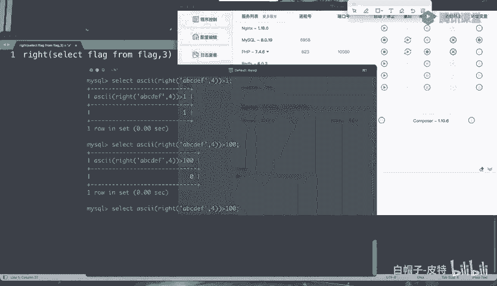

在本节课中，我们将深入学习SQL布尔盲注的高级技巧，重点探讨如何利用数字比较、二分查找法以及多种字符串截取与比较函数来提升注入效率。我们还将介绍当常见函数被过滤时的替代方案。

## 利用数字比较与二分查找法

上一节我们介绍了布尔盲注的基本原理，本节中我们来看看如何利用数字比较来优化注入过程。

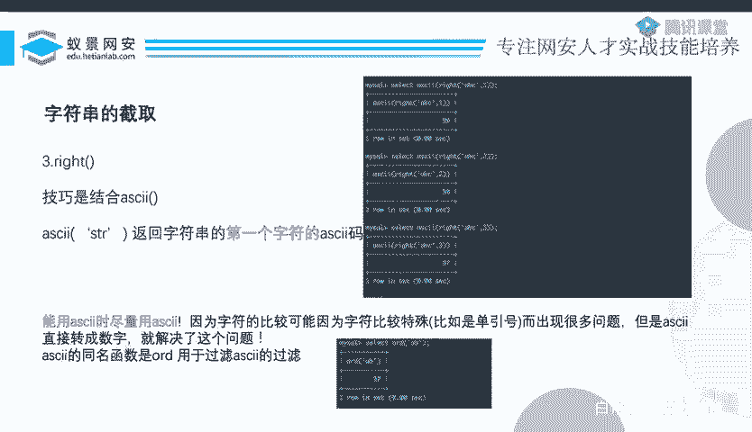

假设我们不知道目标字符的ASCII码值。我们可以通过询问一系列“大于”或“小于”的问题来逼近它。例如，询问它是否大于1，如果回答“是”，再询问是否大于100，如果回答“否”，则询问是否大于50，以此类推。

通过这种方式，我们无需从1到99逐一尝试99次。使用数字比较后，我们可以引入“二分查找”算法。对于大约120个可能的ASCII码值，使用二分查找可能只需十几次尝试即可确定目标值，这极大地减少了请求次数、时间和网络流量。

将字符转换为数字（如使用`ASCII()`函数）有三个主要优点：
1.  实现精确的逐字符截取与判断。
2.  排除特殊字符可能带来的干扰。
3.  能够应用二分查找算法，大幅提升效率。

如果`ASCII()`函数被过滤，可以使用其同名函数`ORD()`来绕过限制。

## 字符串截取函数的其他用法

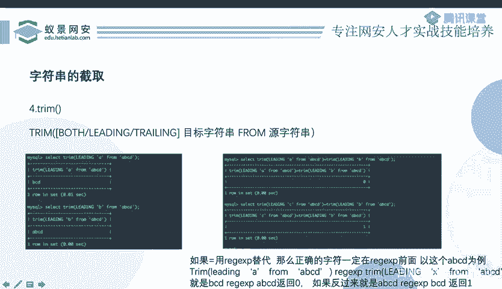

以下是几种常见的字符串截取函数及其用法。

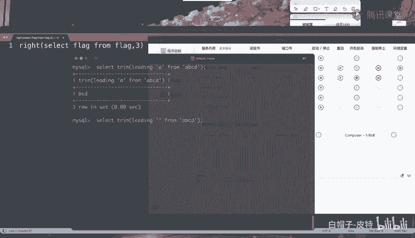

### LEFT函数与REVERSE技巧

除了`RIGHT`函数，还有一个`LEFT`函数。`LEFT(str, n)`会从字符串左侧开始截取n位。此时，变化的将是字符串的尾部字符，而非首字符。如果直接对其结果使用`ASCII()`函数，将无法有效判断，因为首字符可能固定不变。

一个技巧是结合`REVERSE()`函数使用。`REVERSE()`函数会将字符串倒序。这样，原本尾部字符的变化就变成了首字符的变化，之后便可以继续使用`ASCII()`或`ORD()`函数进行处理。

核心思路可以表示为：
```sql
ASCII(LEFT(REVERSE(column_name), 1))
```

### 利用TRIM函数进行判断

`TRIM()`函数本意是移除字符串首尾的空白字符。但其扩展用法`TRIM(LEADING/TRAILING/BOTH ‘target‘ FROM str)`可以移除首尾的特定目标字符串。

例如：
-   `TRIM(LEADING ‘A‘ FROM ‘ABCD‘)` 返回 `‘BCD‘`。
-   `TRIM(LEADING ‘B‘ FROM ‘ABCD‘)` 返回 `‘ABCD‘`（因为字符串不以‘B‘开头，故未作移除）。

虽然`TRIM`本身不能直接截取，但通过巧妙的比较，可以实现类似字符判断的功能。以下是利用`TRIM`判断首字符的一个方法：

1.  首先，遍历可能的字符`I`（如‘A‘, ‘B‘, ‘C‘…）。
2.  执行比较：`TRIM(LEADING I FROM str) = TRIM(LEADING I+1 FROM str)`。
    -   如果相等，说明`I`和`I+1`都不是字符串的正确起始字符。
    -   如果不相等，则说明正确起始字符是`I`或`I+1`中的一个。
3.  接着，用`I+1`和`I+2`执行同样的比较：`TRIM(LEADING I+1 FROM str) = TRIM(LEADING I+2 FROM str)`。
    -   如果相等，则`I+1`不是起始字符，结合步骤2的结论，可推出正确起始字符是`I`。
    -   如果不相等，则说明`I+1`是起始字符（因为步骤2已锁定范围在`I`或`I+1`）。

找到第一位字符后，即可用`TRIM(LEADING ‘已知前缀‘ FROM str)`移除已识别的部分，继续判断下一位字符。虽然逻辑稍复杂，但在特定过滤条件下是可行的。

## 其他比较方式

接下来，我们看看SQL中其他可用于布尔盲注的比较操作符和函数。

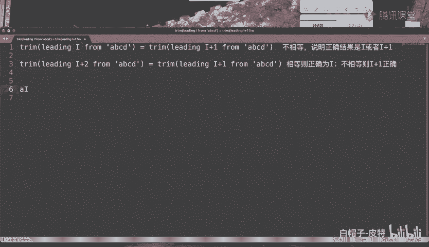

### LIKE操作符

`LIKE`操作符用于模式匹配。在布尔盲注中，如果没有百分号(`%`)，`LIKE`的功能与等号(`=`)完全相同。因此，如果等号被过滤，可以优先考虑使用`LIKE`。

例如：
```sql
‘A‘ LIKE ‘A‘  -- 结果为真
‘A‘ LIKE ‘a‘  -- 在默认情况下，结果也为真（大小写不敏感）
```

### 正则表达式匹配 (REGEXP / RLIKE)

`REGEXP`或`RLIKE`用于进行正则表达式匹配。需要注意的是，默认情况下它也是大小写不敏感的。

例如，数据库名`‘ctfgame‘`可以匹配正则表达式`‘CTF‘`。如果需要区分大小写，需要在表达式前加上`BINARY`关键字。

```sql
‘ctfgame‘ REGEXP ‘CTF‘          -- 结果为真（不敏感）
‘ctfgame‘ REGEXP BINARY ‘CTF‘   -- 结果为假（敏感）
```

### BETWEEN操作符

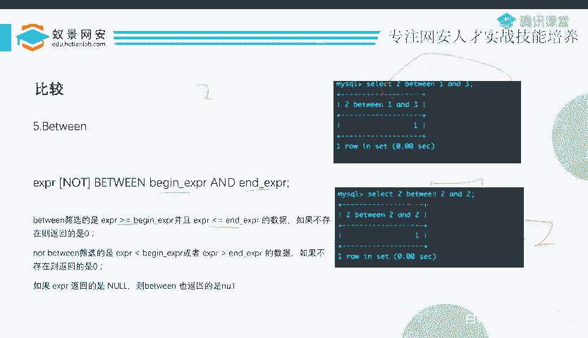

`BETWEEN a AND b`用于判断一个值是否在区间[a, b]内（包含边界）。在写注入脚本时，可以直接让上下界相等，使其退化为等值判断。

例如，判断一个值是否为2：
```sql
2 BETWEEN 2 AND 2  -- 等价于 2 = 2
```
这比写`2 BETWEEN 1 AND 3`更加精确和高效。

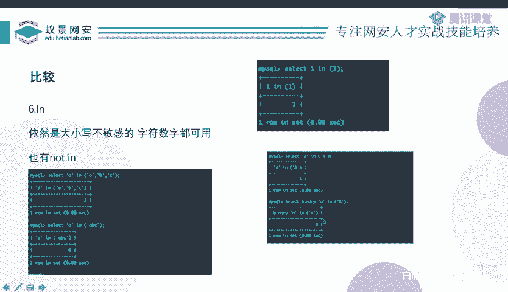

### IN操作符

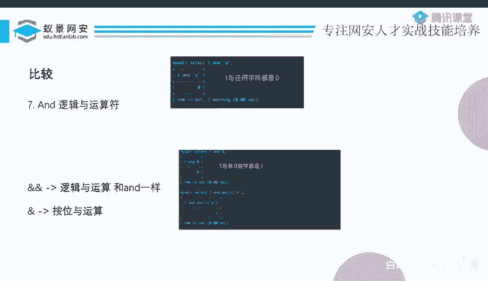

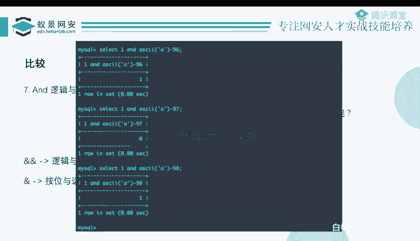

`IN`操作符用于判断一个值是否存在于一个集合中。它同样默认是大小写不敏感的。

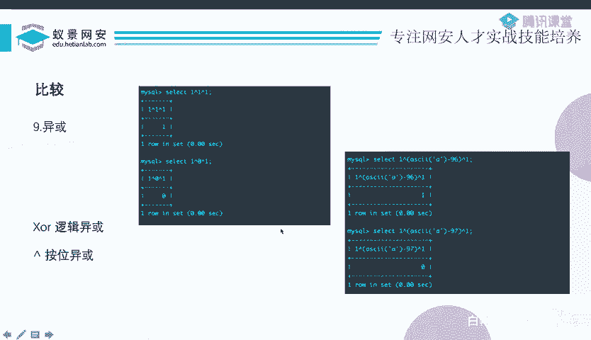

例如：
```sql
‘a‘ IN (‘A‘, ‘B‘, ‘C‘)               -- 结果为真
‘a‘ IN (BINARY ‘A‘, ‘B‘, ‘C‘)        -- 结果为假
‘a‘ IN (BINARY ‘a‘, ‘B‘, ‘C‘)        -- 结果为真
```
使用时需要注意添加`BINARY`来确保大小写敏感的判断。

### 利用逻辑运算符：异或注入

异或(`^`或`XOR`)注入是一种在无法使用注释符(`--`, `#`)闭合后续SQL语句时的技巧。

回顾一个典型的注入点：
```sql
SELECT * FROM users WHERE id=‘$id‘
```
我们输入`1‘ and ‘1‘=‘1`来构造。但如果不能使用注释符，末尾的单引号就需要被妥善处理。

此时，可以构造如下的payload：
```sql
1‘^(表达式)^‘1
```
或者使用等号：
```sql
1‘=(表达式)=‘1
```
其中，`(表达式)`是一个会返回布尔值（真为1，假为0）的注入判断语句，例如`(ASCII(SUBSTR(database(),1,1))>100)`。

整个表达式的真假就由中间的布尔表达式决定，从而实现盲注。除了异或，连等、加减运算等也可以达到类似效果。

## 总结

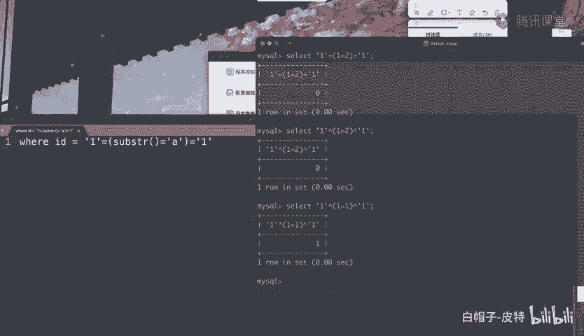

本节课中我们一起学习了SQL布尔盲注的多种高级技巧。我们掌握了利用数字比较和二分查找法来显著提升注入效率；探索了`LEFT`、`TRIM`等函数在特定场景下的截取与判断应用；并熟悉了`LIKE`、`REGEXP`、`BETWEEN`、`IN`以及异或注入等多种比较和构造方式。这些方法能帮助我们在面对不同过滤规则时，灵活地构造有效的盲注Payload。