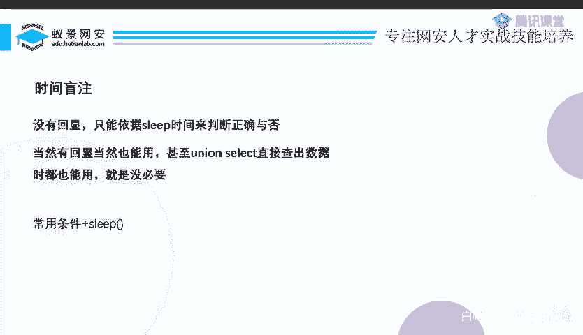
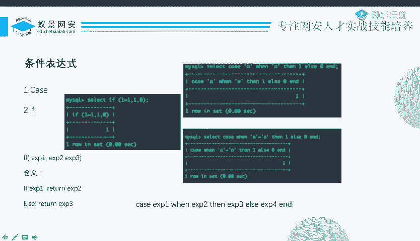
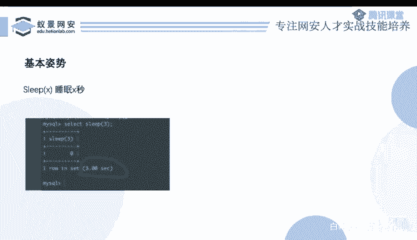

# CTF系列教程：P82：玩转SQL盲注之延时盲注 🕐

在本节课中，我们将要学习SQL注入中的延时盲注技术。当目标应用对数据库查询的响应只有一种固定回显，无法通过“真/假”状态进行判断时，延时盲注便成为了一种有效的攻击手段。

上一节我们介绍了布尔盲注，它依赖于应用对查询结果的不同回显。本节中我们来看看当这种“布尔状态”消失时，我们该如何应对。

## 延时盲注的原理

延时盲注的核心思想是：通过构造特定的SQL语句，根据我们猜测的条件是否成立，来人为地控制数据库查询的响应时间。如果猜测正确，则让数据库执行一个耗时的操作（如等待）；如果猜测错误，则立即返回。攻击者通过测量网页的响应时间长短，就能间接推断出猜测的条件是真还是假。



例如，一个登录功能，无论用户名密码是否正确，前端都只返回“登录完成”。此时，传统的布尔盲注便失效了。我们可以利用数据库的延时函数，构造如下逻辑：`如果当前数据库用户名的第一个字符是‘a’，则让数据库睡眠5秒，否则立即返回`。通过观察页面是否延迟5秒才加载完成，即可判断猜测是否正确。

## 核心条件表达式与延时函数

要实现延时判断，我们需要结合条件表达式和延时函数。以下是两种常用的SQL条件表达式写法：

**1. IF 语句**
`IF`语句的语法结构如下：
```sql
IF(condition, value_if_true, value_if_false)
```
它的含义是：如果条件 `condition` 成立，则返回 `value_if_true`，否则返回 `value_if_false`。



**2. CASE 语句**
`CASE`语句有两种常见写法：
*   **简单CASE**：`CASE column WHEN value THEN result ELSE other_result END`
    判断 `column` 是否等于 `value`。
*   **搜索CASE**：`CASE WHEN condition THEN result ELSE other_result END`
    判断条件 `condition` 是否成立。

最常用的延时函数是 `SLEEP()`。我们可以将条件表达式与 `SLEEP()` 结合，构造出延时注入的Payload。

以下是结合使用的示例：
*   使用 `IF`：`IF(1=1, SLEEP(5), 0)`。如果`1=1`成立，则睡眠5秒。
*   使用 `CASE`：`CASE WHEN 1=1 THEN SLEEP(5) ELSE 0 END`。效果同上。

当我们将这样的Payload注入到SQL查询中时，如果条件为真，数据库会执行`sleep`操作，PHP等后端服务器必须等待数据库返回结果，从而导致整个网页的响应时间变长。攻击者通过感知这种延迟，就能完成对数据的逐位推断。

## 其他延时方法简介

除了 `SLEEP()` 函数，在某些数据库或特定环境下，还可以使用其他方法制造查询延迟。



以下是几种可能的方法：
*   **BENCHMARK**：通过执行大量次数的哈希计算来消耗时间。
*   **笛卡尔积**：构造庞大的多表关联查询，使数据库进行大量计算。
*   **GET_LOCK**：利用数据库的锁机制。
*   **正则表达式**：通过计算密集型或灾难性的正则匹配来拖慢查询。

这些方法在实战中考察频率较低，但了解它们有助于应对更复杂的环境。相关细节可在课程提供的PPT资料中查阅。

## 总结


本节课中我们一起学习了SQL延时盲注技术。我们首先理解了其应用场景——当目标只有单一回显时。接着，我们掌握了其核心原理：通过**条件表达式（IF/CASE）** 控制**延时函数（如SLEEP）** 的执行，并以前端页面响应时间的长短作为判断依据。最后，我们简要了解了其他几种可能制造延迟的SQL方法。掌握延时盲注，能帮助你在CTF比赛或安全测试中攻克更多类型的SQL注入挑战。