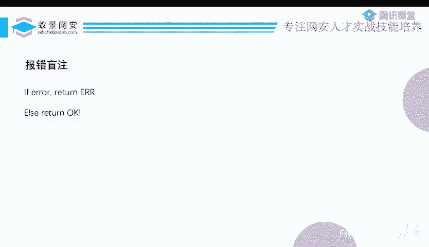
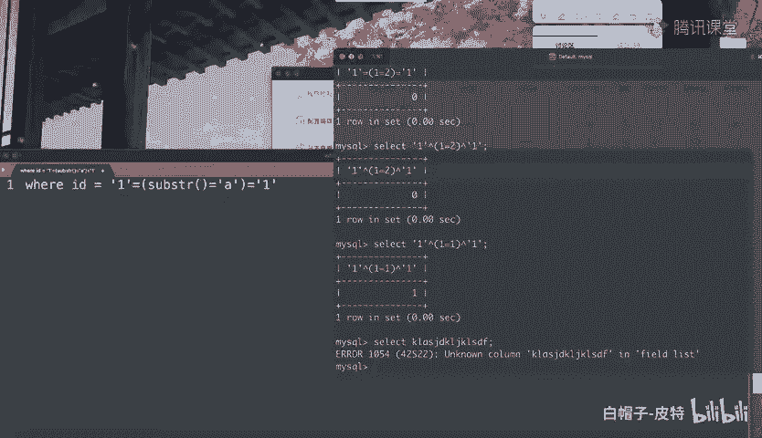
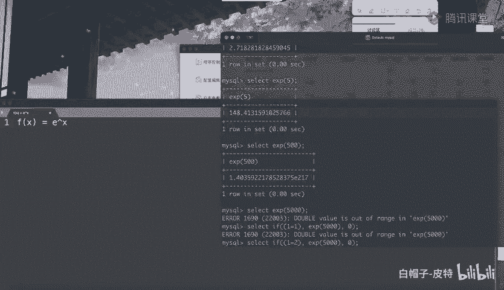

# CTF系列教程：P83：玩转SQL盲注之报错盲注 🎯

在本节课中，我们将要学习SQL注入中一个特殊的技巧——报错盲注。我们将了解它的基本原理、与普通布尔盲注的区别，并学习如何利用特定的MySQL函数来构造有条件的报错，从而实现数据盲注。

## 概述：什么是报错盲注？



上一节我们介绍了布尔盲注和延时盲注，本节中我们来看看报错盲注。报错盲注实际上是布尔盲注的一个小分支，但在实际CTF比赛中考察得比较特别。

所谓报错盲注，是指当MySQL查询出错时，应用程序会返回一个“出错”的提示；如果查询正常，则只返回“OK”。它只有这两种状态。基于这种情况，我们如何进行盲注呢？因为只要语句不出错，返回的都是“OK”。如果都返回“OK”，我们本应首选延时盲注。但如果延时盲注的常用方法（如`sleep()`）被过滤了，我们就只能尝试其他方法。而其他方法的结果，要么是“出错”，要么是“OK”。

## 核心思路：构造有条件的报错

想让MySQL出错很简单，例如执行一个无意义的语句：
```sql
select xxxx
```
但这会直接导致语法错误，这种错误没有意义。我们之前也讲过报错注入，使用`updatexml`或`extractvalue`函数可以将查询结果从报错信息中显示出来。

然而，现在讨论的报错盲注与之前不同。之前的报错注入会将错误的具体内容显示出来。但现在，出错了只会告诉你“出错了”，没出错就返回“查询完成”。既然不显示具体错误内容，之前的报错注入技巧就失去了意义。



昨天的报错注入是“一定会报错”的。包括输入乱七八糟的内容也一定会报错，并返回“出错了”。这同样没有利用价值。如果我们想利用“出错”和“不出错”作为布尔条件，就必须让报错“有选择性地出现”。如果报错一定出现或一定不出现，这道题就无法解了。


## 实现方法：利用特定函数触发条件报错

我一定是让报错选择性地出现。我需要构造一个表达式：当表达式为真时，触发一个报错；当表达式为假时，不报错。这实际上和我们刚才说的延时盲注思路很像。

延时盲注的写法是：
```sql
if((表达式), sleep(5), 0)
```
如果表达式为真，就执行`sleep(5)`；否则不执行。

现在我只需要做一个简单的变化：
```sql
if((表达式), 触发报错的函数, 0)
```
如果表达式满足，就执行某个会在执行过程中报错的函数；否则就不报错。这里的关键是，整个语句的语法必须是正确的。只有语法正确，才会执行`if`判断，进而根据条件决定是否执行那个会报错的函数。而不是直接输入非法字符导致语法错误，那样在判断前就报错了，没有意义。

现在要解决的问题是：找到这样一个函数，它能让我们“有条件地”触发报错。

## 实战函数：EXP() 与 COT()

这里不卖关子了，我们可以选择使用以下两个函数。

第一个是 **`EXP()`** 函数。它会返回自然对数底数e的指定次方值。例如，`EXP(1)` 返回 e^1 ≈ 2.718，`EXP(5)` 返回 e^5 ≈ 148.41。

那么，`EXP(500)` 是多少？大约是 1.4 × 10^217，这个数字已经很大了。如果计算 `EXP(5000)` 呢？这个值就太大了。因为指数函数 `EXP(x)` 的增长速度极快。当数值超过MySQL能处理的最大范围时，它就会报错（溢出错误）。



于是，我们就有了一个很好的工具。现在可以这样构造：
```sql
if((1=1), exp(5000), 0)
```
因为 `1=1` 成立，所以会执行 `exp(5000)`，导致溢出报错。如果条件是 `1=2`（不成立），则不会执行 `exp(5000)`，也就不会报错。

这样，我就有条件地构造了一个错误。把 `1=1` 或 `1=2` 换成截取字符串进行比较的表达式，就可以进行盲注了。这本质上是一种布尔盲注，只不过是在构造了报错条件下来进行的，所以我把它单独分出来叫做“报错盲注”。因为它考察的思路比较清晰。

第二个函数是 **`COT()`**（余切函数）。这个三角函数在参数为0时无法计算（因为涉及除以 `sin(0)`，即除以0），会导致计算趋向无穷大，同样会引发数值溢出错误。基于这个思路，你可以寻找其他数学运算，只要能让计算结果变得特别大（例如故意制造除零错误），理论上都可以用来触发条件报错。

## 总结与展望

本节课中我们一起学习了报错盲注。到此为止，我们就把SQL盲注的主要部分讲得差不多了。虽然没有像昨天一样结合具体题目实战，主要是因为时间有限。盲注要想细讲，可以讲上好几个小时。

本课程的目的主要是让大家在入门阶段，能更快地掌握核心概念。至于如何实战操作，你动手写一两次脚本就能明白。基本上，盲注脚本的框架大同小异，做一道题和做一百道题的思路是相通的。


希望通过这节课，你能理解报错盲注的原理，并掌握利用 `EXP()` 和 `COT()` 等函数构造条件报错的方法。在后续的CTF实战中，当你遇到过滤了`sleep`的布尔盲注场景时，不妨试试报错盲注这条路径。