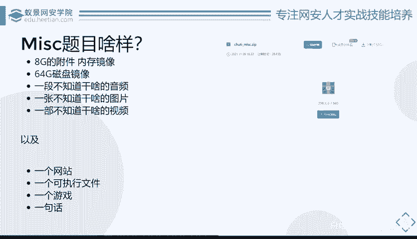
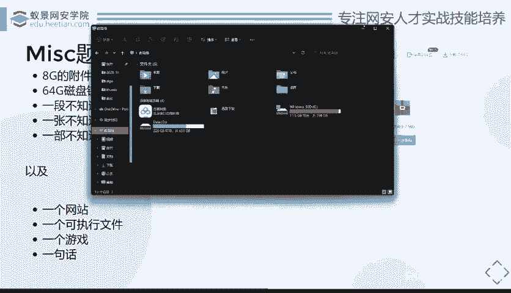
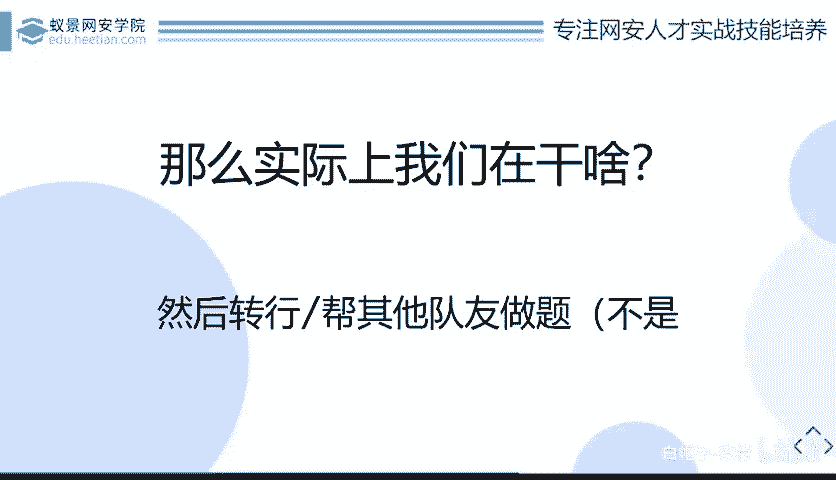

# CTF系列教程：P84：什么是MISC 🔍

在本节课中，我们将要学习CTF比赛中MISC（杂项）类别的核心概念。我们将探讨MISC的起源、MISC选手的日常工作内容以及未来的学习与发展方向。通过本次课程，你将理解MISC在CTF中的独特地位和挑战。

## MISC从哪里来？🤔

上一节我们介绍了课程概述，本节中我们来看看MISC的起源和基本定义。

什么是MISC？通俗来讲，MISC就是“大杂烩”，它包含了多种类型的题目和资源。具体来说，MISC是一个分类，涵盖了许多领域。

以下是MISC常见的细分方向：
*   **OSINT**：开源情报与信息搜集。
*   **Stego**：隐写术。
*   **Forensics**：数字取证。
*   **Encoding**：各种编码与密码学。

简而言之，所有你不知道如何归类到其他专项（如Web、Pwn）的CTF题目，都可以算作MISC。在国内的比赛环境中，由于历史原因，这些不同类型的题目通常被统一归入MISC类别，这使得国内的MISC题目范围非常广泛。

## MISC选手在干什么？💻

了解了MISC的来源后，本节中我们来看看MISC选手的日常工作和所需技能。

MISC是最有趣、最平易近人的方向。例如，通过社会工程学手段进行的盗号、恢复被删除的微信聊天记录或电脑文件、甚至通过一张照片分析出拍摄地点等信息，都属于MISC的范畴。它也是最容易入门的方向，因为你甚至可以在不会编程的情况下，依靠足够的“脑洞”和好奇心开始解题。同时，MISC也最贴近生活，许多身边的网络安全事件都与之相关。

然而，真正深入MISC后，你会发现它充满挑战。要成为一名合格的MISC选手，你需要掌握广泛的知识和工具。

以下是成为一名MISC选手需要具备的基础和工具：
*   **基础知识**：需要熟悉Linux操作系统。
*   **广泛的知识面**：需要了解计算机、音频、图像、数字信号处理，甚至人工智能、嵌入式、区块链等领域的知识。
*   **核心特质**：需要一颗热爱学习的心，因为大部分解题思路都依赖于现场学习新知识的能力。
*   **常用工具**：
    *   基础安全工具：如Kali Linux。
    *   专用工具：用于压缩包破解、磁盘取证、流量分析（如Wireshark、取证大师、Autopsy等）。
    *   专业软件：可能用到Adobe全家桶（Photoshop, After Effects）、MATLAB等。
    *   开发环境：需要准备Web、二进制逆向等多种开发调试环境。
*   **硬件要求**：需要一个容量很大的硬盘，用于存储各种学习资料、比赛附件（如巨大的内存镜像或磁盘镜像文件）。

在实战中，MISC选手的角色非常独特。有观点认为，在战队中并不存在专门的MISC选手，因为大家都可以处理MISC题目。另一种说法是，MISC选手是那些“Web不会、逆向逆不出、Pwn看不懂、密码写不出来，只能做MISC签到题”的人的自嘲。这实际上反映了MISC的难度——你需要对其他方向都有所了解，才能更好地解决MISC中融合了各类技术的题目。

MISC选手的优势在于知识面广，他们被迫学习各种新知识，其知识广度往往超过许多专精单一领域的人。例如，他们既要懂开发，能编写Python甚至MATLAB脚本；也要懂安全，了解HTTP、TCP/IP等协议；还需要掌握二进制文件结构等底层知识。当然，这种“广而不深”的特点，也意味着在职业发展上缺乏完全对口的“MISC工程师”岗位，更多是作为拓展视野和能力的途径。

## MISC的未来与总结 🚀

前面我们探讨了MISC选手的日常，最后我们来展望一下MISC的未来发展方向并总结本节课的内容。

在赛场上，MISC选手的工作状态多样。当题目常规时，他们可能在进行分析取证；当题目新颖时，他们可能在对着一道题发呆、开脑洞，甚至看起来像是在“摸鱼”——比如，当题目附件是一个《我的世界》游戏存档时，通关游戏就是解题过程。面对那些设计巧妙、难度极高的题目，解题过程可能充满挫折，但也常有拍案叫绝的乐趣。

那么，MISC选手的未来在哪里？虽然CTF本身具有游戏性质，但通过MISC学习到的技能具有实际价值。例如，数字取证的知识可以应用于体制内或协助公安办案的相关工作。更重要的是，通过MISC锻炼出的快速学习能力、宽广的知识视野和解决问题的灵活思维，是网络安全领域乃至更广泛技术行业都非常宝贵的素质。

**本节课中我们一起学习了：**
1.  **MISC的定义**：CTF中的“杂项”，包含无法归类到其他专项的各类题目。
2.  **MISC的特点**：有趣、入门门槛相对较低、贴近生活，但同时要求知识面极广。
3.  **MISC选手的画像**：需要具备广泛的知识、熟练使用各种工具、拥有强大的学习能力和足够的存储空间。
4.  **MISC的挑战与价值**：题目可能非常困难且多变，但由此培养出的综合能力对个人成长和职业发展有长远益处。

MISC是CTF世界中一个充满趣味和挑战的广阔天地，它不仅是技术的试炼场，更是思维与学习能力的锻炼营。