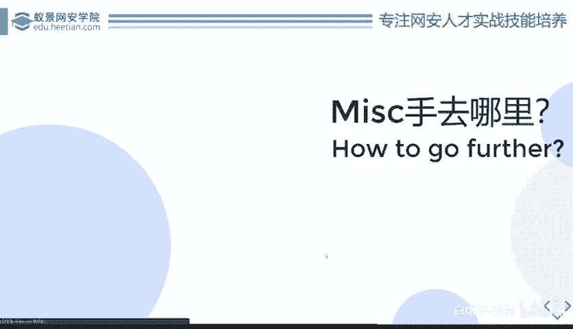
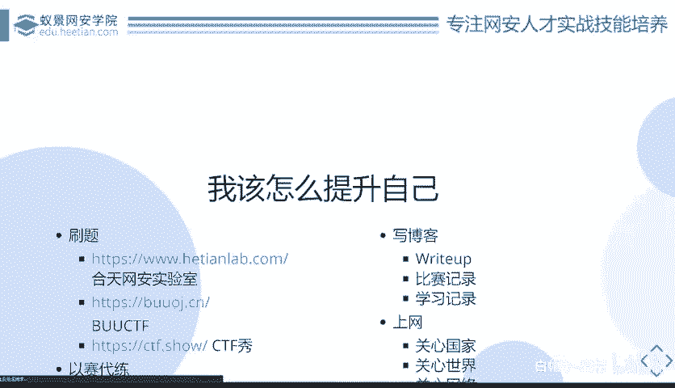
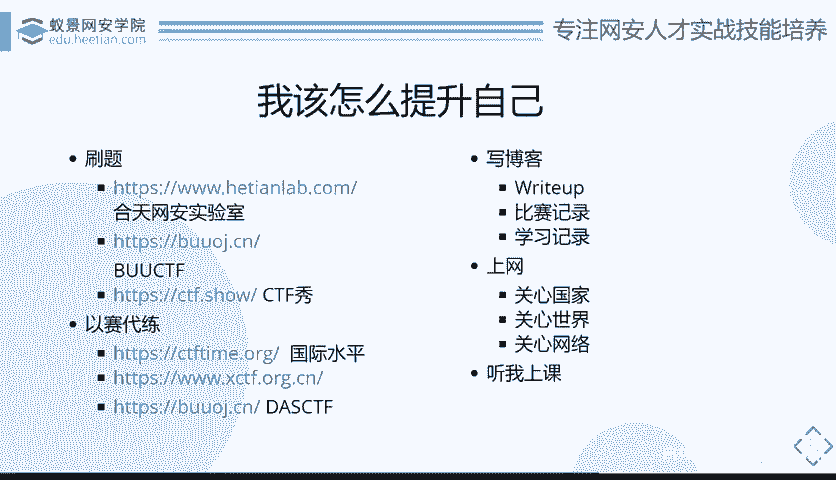

# CTF系列教程：P85：MISC该怎么去学习 🧩

在本节课中，我们将探讨如何系统性地学习CTF中的MISC（杂项）方向。我们将从短期提升和长期发展两个角度出发，介绍具体的学习路径、资源和方法，帮助你从入门走向精通。

---

## 近观：如何起步与提升

上一节我们介绍了MISC方向的特点，本节中我们来看看如何从零开始学习并取得进步。

对于MISC新手而言，明确学习方向和方法至关重要。

### 核心方法：刷题

无论学习哪个方向，刷题都是最基础且有效的方法。CTF发展多年，积累了海量题目。如果能将历年出现的MISC题目全部练习一遍，你的水平将得到极大提升。

刷题不仅能增加解题思路，还能积累知识。MISC很大程度上比拼的是脑洞和知识面的广度。当你遇到新题时，如果发现它与过去做过的某道题类似，就可以借鉴之前的经验。

以下是几个推荐的刷题平台：

*   **攻防世界（HackTheBox Lab）**：提供丰富的实战环境与题目。
*   **BUUOJ**：由赵金同学搭建的永久免费CTF平台，题目质量高。
*   **CTF秀**：部分题目需要付费，且题目质量参差不齐，建议选择性使用。

在选择题目时，建议优先练习实际比赛的真题，例如“网鼎杯”、“强网杯”等国内大型赛事的历年题目，这些题目更具参考价值。例如，Web方向的经典题目“随便注”（SQL注入），其解题思路的多样性常被用作考核标准。

### 以赛代练

通过参加比赛来练习是快速成长的方式。

*   **国际比赛（CTFtime）**：如果你想与国际接轨，可以关注CTFtime网站。上面几乎每周都有比赛。虽然精力有限，但国际赛的研究方向与国内有差异，有助于拓宽思路。有时甚至会出现比赛原题重现的情况。
*   **国内月赛（XCTF、DasCTF等）**：这些比赛通常定期举办，但难度较高。建议在具备一定基础（例如刷题半年左右）后再尝试。即使无法解出题目，参与过程本身也很有价值。

**关键点**：无论能否做出题目，都必须亲自分析一遍。赛后可以等待其他高手发布的“Writeup”（解题报告）进行学习。

### 总结与输出：写博客

看完别人的Writeup后，一定要自己动手重新做一遍，并撰写属于自己的Writeup。别人的理解永远不是你的。

写博客（技术日志）对于MISC选手尤为重要。MISC知识点非常零散，很难有系统性的框架将其全部涵盖。因此，你需要主动记录和积累。

你可以通过购买云服务器搭建WordPress，或使用GitHub Pages配合Hexo等静态博客框架，来建立个人博客。将学习笔记、工具记录、比赛心得和Writeup发布上去。

这不仅是为自己建立知识库，方便日后查阅，也能造福他人，促进技术交流。

### 主动学习：关注安全动态

MISC题目常与最新的安全事件、技术突破相关联。被动地通过题目学习知识，效率不如主动探索。

你需要学会关注网络安全界的大事，例如：
*   王小云院士的**MD5碰撞**研究成果公布后，很快就出现了相关的MISC题目。
*   **Apache**服务器爆出漏洞后，相关考点也迅速出现在赛题中。

因此，多关注安全新闻、技术论文，主动学习前沿知识，能让你在遇到相关考点时更加从容。这是一种更高效的学习方式。

### 系统学习：参加课程

最后，系统性的课程学习可以帮助你打好基础。例如参加本系列课程，或跟随其他经验丰富的老师学习。虽然不能保证听完就能“AK”（全部解出）所有比赛，但肯定能帮助你构建知识体系，显著提升整体水平。

---

## 远眺：如何进一步发展

当你已经具备一定实力后，可以考虑如何将CTF经验转化为实际价值，例如寻找相关工作。你的比赛经历、解题能力和技术博客，都是个人能力的强力证明。

---

本节课中我们一起学习了MISC方向的学习路径。我们强调了**刷题**和**写博客**的重要性，介绍了**以赛代练**和**关注安全动态**的方法。记住，学习是一个主动积累的过程，坚持练习、勤于总结、保持好奇，你就能在CTF的道路上不断前进。🚀