# CTF系列教程：P86：CTF-misc基础之需要的工具 🛠️

在本节课中，我们将要学习CTF杂项（Misc）中流量分析部分所需的基础知识和核心工具。流量分析并非拿来即用，它需要一定的计算机网络或通信协议基础。本节将简要介绍这些基础，并重点讲解进行流量分析必须掌握的工具及其基本使用方法。

## 基础知识与准备

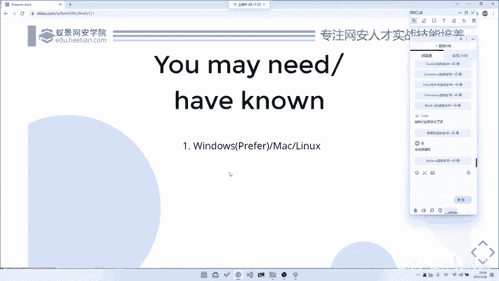

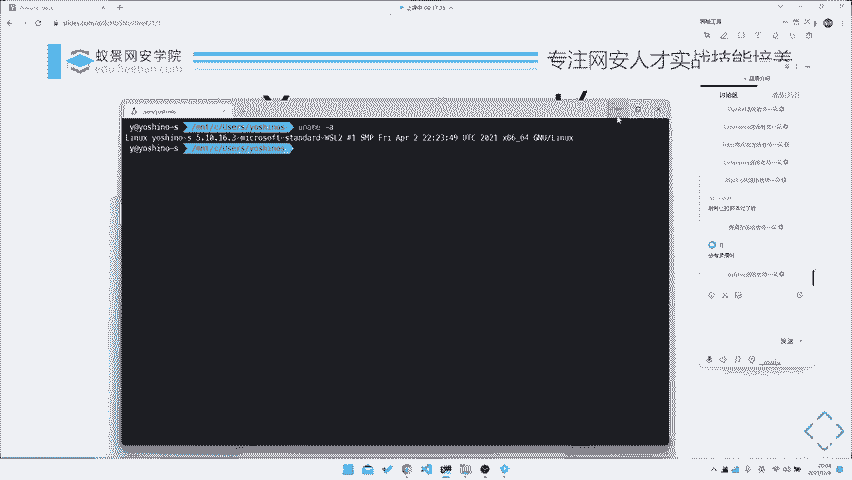

上一节我们介绍了Misc的概况，本节中我们来看看进行流量分析前需要做的准备。

进行流量分析需要你具备一些基础知识，例如计算机网络或通信协议的基础。这些基础本课程会稍作讲解。当然，若要深入学习，需要阅读厚重的计算机网络书籍，这需要你在课后投入时间自学。

首先，你需要准备相应的工具和环境。流量分析对平台的依赖性不高，因为核心工具如Wireshark、Tshark或Python的pyshark库在各大操作系统上基本通用。

以下是环境配置建议：
*   **最佳配置**：Windows系统搭配一个WSL（Windows Subsystem for Linux）环境。
*   **备选方案**：Windows或Mac系统安装Linux虚拟机。
*   环境配置的具体步骤本课程不详细展开，大家可以自行搜索教程完成。

## 流量分析的发展方向

在深入工具之前，我们先了解一下CTF中流量分析技能的最终应用方向，这有助于理解其价值。

国内的Misc分类很杂，但在国际上，流量分析通常归属于**取证（Forensics）**或**流量分析（Traffic Analysis）**这两个方向。其未来的进阶发展方向主要有三个：

以下是几个主要的发展方向：
1.  **大规模流量与异常检测**：例如，从海量数据中识别异常请求、攻击流量或爬虫行为。这在实际工作中常用于EDR（端点检测与响应）或流量审计。
2.  **数字取证**：协助进行网络犯罪调查，通过分析嫌疑人的网络访问记录和行为数据来辅助办案，例如分析中间人攻击。
3.  **协议逆向辅助**：通过抓取和分析网络数据包，来辅助理解应用程序的私有通信协议，为逆向工程提供支持。

现阶段，我们主要专注于对单个数据包文件的特定分析。但最终目标是要能处理大规模甚至实时的流量数据。在一些CTF赛题中，也会出现需要批量处理流量包的题目，这正体现了向“大数据”分析发展的趋势。

## 核心工具详解

了解了背景后，我们正式进入工具部分。首先介绍流量分析的神器——Wireshark。

Wireshark是世界上最著名、使用最广泛的网络协议分析器。它功能非常强大，可以分析海量协议。

核心功能可以概括为以下公式：
`Wireshark功能 = 协议分析（TCP/IP, HTTP, DNS...） + 实时抓包 + 数据包深度检查`

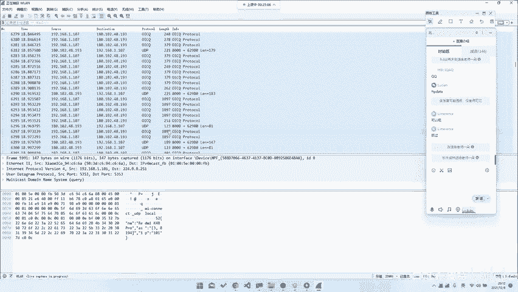

它支持从标准的TCP/IP、HTTP到更专业的Modbus、蓝牙、802.11无线协议乃至USB协议（通过插件）。安装非常简单，直接从其官网下载对应系统版本即可。

在应用上，Wireshark既可用于分析已有的流量包文件（`.pcap`），也可用于实时抓取网络接口上的流量。其图形化界面对于初学者非常友好。

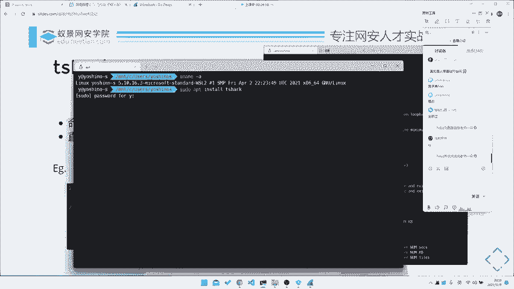

## 命令行工具：Tshark

虽然Wireshark的图形界面很好用，但在需要自动化处理或数据导出时就不太方便了。这时，我们需要它的命令行版本——Tshark。

Tshark是Wireshark的命令行版本，在Linux（如Ubuntu）上可通过 `apt install tshark` 安装。它允许我们通过命令进行抓包、过滤和导出数据。

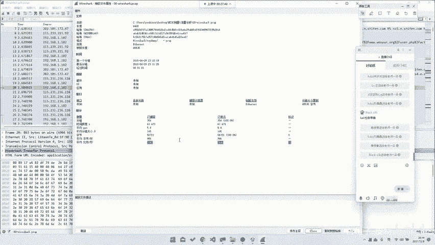

我们通过一个简单例题来演示。题目要求从一个数据包中找到登录请求的密码（即flag）。

**方法一：使用Wireshark图形界面**
1.  用Wireshark打开数据包文件。
2.  在过滤栏输入 `http` 筛选HTTP请求。
3.  找到登录请求（如 `POST /login`），右键点击该数据包，选择 `追踪流` -> `HTTP流`。
4.  在打开的流窗口中，直接查看明文传输的密码（flag）。

**方法二：使用Tshark命令行**
Tshark可以通过一行命令完成上述查找。命令的核心是过滤和字段提取。

以下是使用Tshark解题的命令示例：
```bash
# 示例1：导出所有HTTP请求的URL和POST数据
tshark -r capture.pcap -Y "http.request" -T fields -e http.request.uri -e http.file_data

# 示例2：跟随并输出特定的TCP流（例如流索引2）的内容
tshark -r capture.pcap -z "follow,tcp,ascii,2"

# 示例3：针对例题，直接过滤并提取登录请求的提交数据
tshark -r capture.pcap -Y 'http.request.uri contains "login"' -T fields -e http.file_data
```
在这些命令中：
*   `-r` 指定要读取的数据包文件。
*   `-Y` 应用显示过滤器（类似于Wireshark顶部的过滤栏）。
*   `-T fields` 指定输出格式为字段。
*   `-e` 指定要输出的具体字段（如 `http.file_data`）。

## Python集成：pyshark

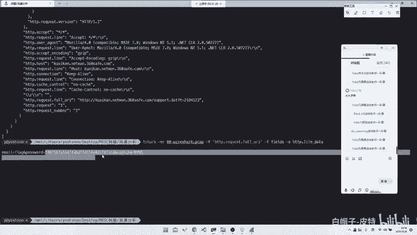

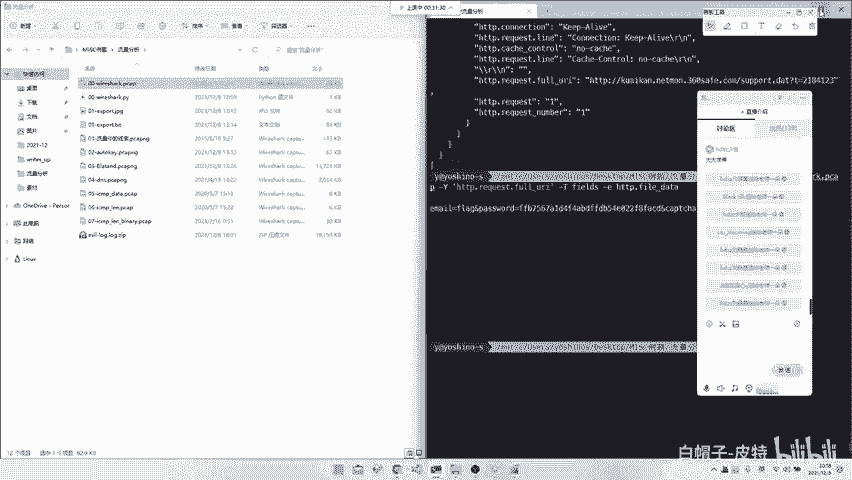

对于Misc选手，Python是必备技能。我们可以使用pyshark库在Python脚本中处理数据包，便于进行更复杂的后续分析。

pyshark是一个Python封装库，提供了对Tshark/Wireshark功能的编程接口。虽然其API有时不够直观，但结合Python强大的数据处理能力非常有效。

以下是使用pyshark完成上述例题的简单脚本示例：
```python
import pyshark

# 加载数据包文件
cap = pyshark.FileCapture('capture.pcap', display_filter='http')

for pkt in cap:
    try:
        # 检查是否有HTTP请求并打印相关数据
        if hasattr(pkt.http, 'request_uri'):
            print(pkt.http.request_uri)
        if hasattr(pkt.http, 'file_data'):
            print(pkt.http.file_data)
    except AttributeError:
        # 忽略没有HTTP层的包
        pass
```
这个脚本打开了数据包文件，应用了HTTP过滤器，并尝试打印每个HTTP包的请求URI和文件数据。在实际比赛中，你可能需要编写更复杂的脚本来解码、匹配或批量处理数据。

通常的解题流程是：先用Wireshark进行初步的宏观分析，理解流量结构；再将分析思路落地，使用Tshark命令或pyshark脚本进行精确的数据提取和处理。

## 其他辅助工具

除了Wireshark系列，还有一些其他辅助工具。例如国产的科来网络分析系统，它更侧重于流量统计和宏观分析。

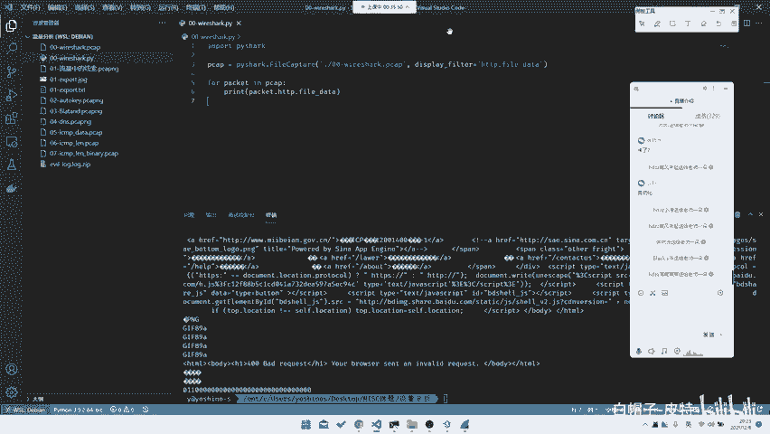

科来系统可以一键生成会话统计、流量排行、协议分布等图表，对于需要分析“访问量最大的IP”或“异常流量模式”的题目可能有所帮助。但在CTF中，绝大多数题目仍以Wireshark为主要工具。

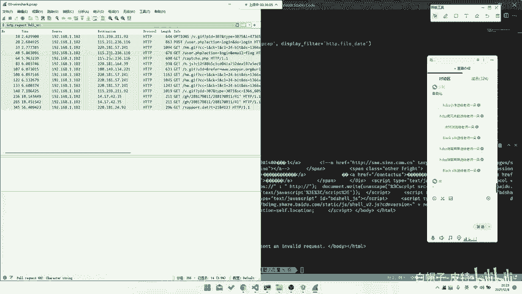

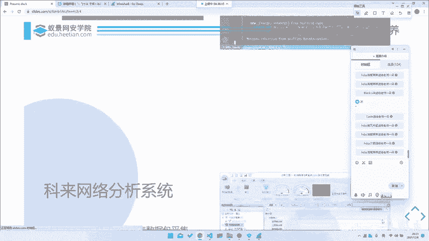

## 总结


本节课中我们一起学习了CTF-Misc中流量分析的基础。我们首先了解了所需的计算机网络背景知识和推荐的操作系统环境。接着，探讨了流量分析在取证、安全检测和协议逆向等领域的实际应用方向。

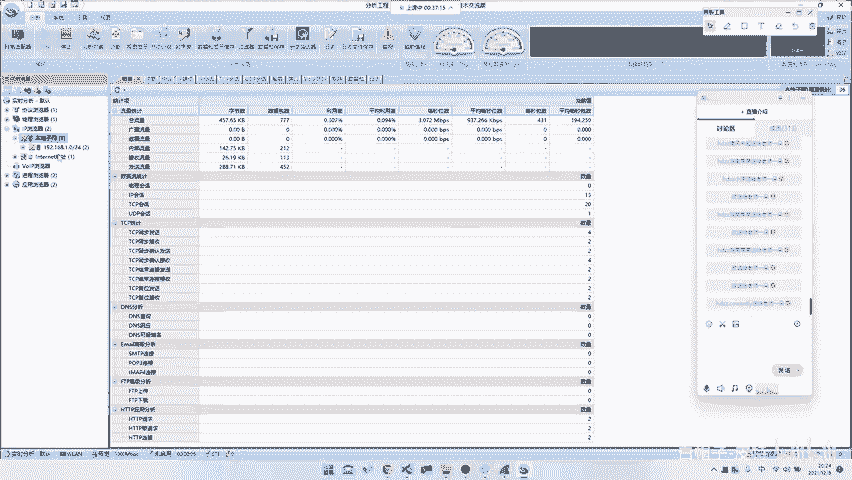

然后，我们重点讲解了三大核心工具：
1.  **Wireshark**：图形化分析神器，用于初步探查和手动分析。
2.  **Tshark**：命令行工具，用于自动化过滤和提取数据。
3.  **pyshark**：Python库，用于将流量分析集成到自定义脚本中，进行复杂处理。

掌握这些工具是解开CTF流量分析题目的第一步。在后续课程中，我们将运用这些工具，结合具体赛题，深入学习各种流量分析技巧和协议知识。