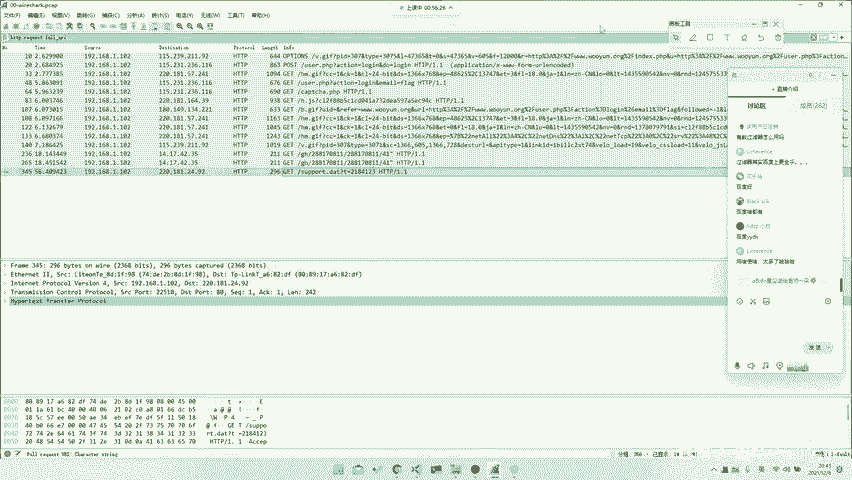
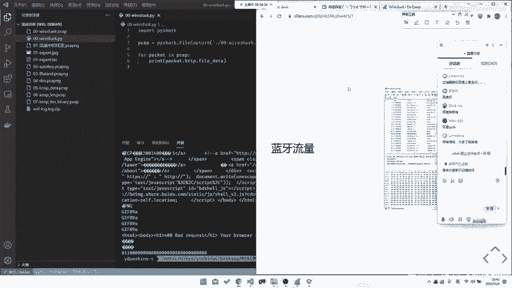

# CTF系列教程：P87：CTF-misc基础之流量种类 🕵️

在本节课中，我们将要学习CTF-misc方向中流量分析的基础知识，特别是网络流量的种类。我们将从OSI七层模型出发，了解不同协议层在CTF题目中可能出现的考察形式，并介绍USB、蓝牙等其他类型的流量。

## 概述

流量分析是CTF-misc方向的重要组成部分。广义上的“流量”不仅指常见的网络数据包，还包括USB通信、蓝牙协议甚至其他物理层通信数据。理解这些流量的种类和结构，是进行有效分析的第一步。

## 流量种类详解

上一节我们提到了流量分析的广泛性，本节中我们来看看具体的流量种类及其在CTF中的考察点。

### OSI七层模型与网络流量

最常见的流量类型是网络流量，其结构遵循OSI七层模型。虽然计算机相关专业的学习者可能对此模型比较熟悉，但我们仍会按照每一层进行简要说明。OSI模型划分得非常详细。

以下是各层协议在CTF中可能被考察的情况：

*   **物理层**：例如以太网物理层标准（如802.3）。CTF中基本不会直接考察物理层协议。
*   **数据链路层**：例如以太网帧。考察得也不多。
*   **网络层**：例如IP、ICMP协议。可能会直接考察，或在协议上设置陷阱让你分析，也可能让你统计IP地址等信息。
*   **传输层**：例如TCP、UDP协议。考察非常多，可能涉及端口号、TCP三次握手（`SYN -> SYN-ACK -> ACK`）等概念。UDP是无连接的，TCP是有连接的。
*   **会话层**：例如SMB、DNS协议。DNS常作为分析工具出现。
*   **表示层**：例如加密协议。考察不多。
*   **应用层**：例如HTTP、FTP协议。考察最多，且玩法多样。

在更简化的TCP/IP四层模型中，数据链路层通常被忽略。目前CTF中几乎没有专门考察纯以太网帧的题目，但不排除未来会出现。

### 其他协议层补充说明

当然，某些题目可能会涉及更底层的知识。例如，考察曼彻斯特编码、码分多址（CDMA）等通信知识，这些属于物理层范畴。数据链路层考察得确实不多。网络层可能是我们能考到的最底层协议，例如对ICMP或ARP协议进行分析。传输层涉及TCP/UDP的基础知识，如果不理解，建议搜索相关文章或书籍学习。

> 这里讲点题外话。Misc方向要求你什么都会一点：懂点开发、懂点网络、懂点操作系统、懂点数据库。这些知识在流量分析中都会用到。可以说“一入CTF深似海”，你可能需要会Web、会Misc、会Pwn、会逆向，甚至还得懂点区块链。

### 应用层协议考察点

最后往上走就是应用层。应用层考察较多，而且可以考得很灵活。

以下是常见的应用层协议考察方向：

*   **工控协议**：例如Modbus、S7comm。这是一个较新的方向，在工控比赛或流量分析题中可能出现，需要多加关注。
*   **HTTP协议**：例如分析SQL注入、文件上传、目录遍历等攻击流量。
*   **FTP协议**：考察不多，但可能结合其他考点。
*   **TLS/SSL协议**：例如考察中间人攻击（MITM）或协议本身的安全性。
*   **自定义协议**：这是最大的一类。题目会使用自定义的通信协议，其格式、字段都需要你自行分析。有的协议可能有前人写好的解析脚本（如乐高EV3机器人的通信协议），但更多时候需要你“手撕协议”。这需要耐心查找资料，并有一双善于发现规律的眼睛。

### 非网络流量类型

除了网络流量，CTF中还经常出现其他类型的流量数据。

以下是几种常见的非网络流量：

*   **USB流量**：USB设备主要分为三类。
    1.  **USB UART**：仅用于数据传输。
    2.  **USB HID**：人体输入设备，如鼠标、键盘。这是最常考察的类型。
    3.  **USB Mass Storage**：大容量存储设备，如U盘、移动硬盘。
    此外，还可能遇到游戏手柄（如Steam手柄、NS手柄）的流量。总之，身边任何有通信的地方都可能产生流量。
*   **蓝牙流量**：蓝牙协议栈本身也分很多层（如HCI、L2CAP等），可能被单独提取出来分析。
*   **其他协议**：例如ZigBee、I2C、SPI等通信协议的数据，也可能被封装成文件让我们分析。

### 流量包结构示例

让我们看看在Wireshark中一个流量包的具体样子。下图展示了一个完整的视图：

*   **上半部分（数据包列表）**：显示捕获到的所有流量记录。
*   **下半部分（数据包详情）**：对选中数据包进行分层解析。

例如，一个USB数据包可能包含 `Frame` -> `USB URB` 等层次，里面展示了目的地址、URB ID、类型等所有字段。

一个HTTP数据包的分层则更为典型：
1.  **Frame**：物理帧概览。
2.  **Ethernet II**：数据链路层，包含源和目的MAC地址。
3.  **Internet Protocol Version 4**：网络层，包含源和目的IP地址。
4.  **Transmission Control Protocol**：传输层，包含源/目的端口、序列号、确认号、标志位等。
5.  **Hypertext Transfer Protocol**：应用层，解析出HTTP请求/响应的具体内容。

通常我们主要分析应用层（如HTTP）的数据。但也不排除需要深入分析底层协议的情况。

### 关于过滤器的使用

有同学问到Wireshark过滤器的用法。过滤器的字段都可以在软件界面中找到提示。具体字段的含义，建议直接查询Wireshark官方文档，那里最全面。不可能记住所有过滤字段，常用的可以记下来（如 `http.request`），大多数时候随用随查即可。做题做多了自然就熟悉了。

> 善于使用搜索引擎。在Misc方向，跟群友聊两个小时，不如自己搜索十分钟。大家一定要培养这个能力。

## 总结

本节课中我们一起学习了CTF-misc中流量分析涉及的各类流量。我们了解了基于OSI七层模型的网络流量各层可能如何出题，重点认识了应用层协议（尤其是自定义协议）的挑战。此外，我们还介绍了USB、蓝牙等非网络流量的常见类型和考察方式，并通过Wireshark界面观察了流量包的实际结构。记住，流量分析的核心在于理解协议结构和善于发现数据中的规律。