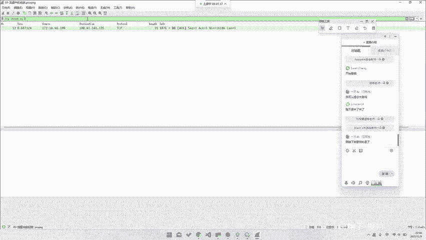
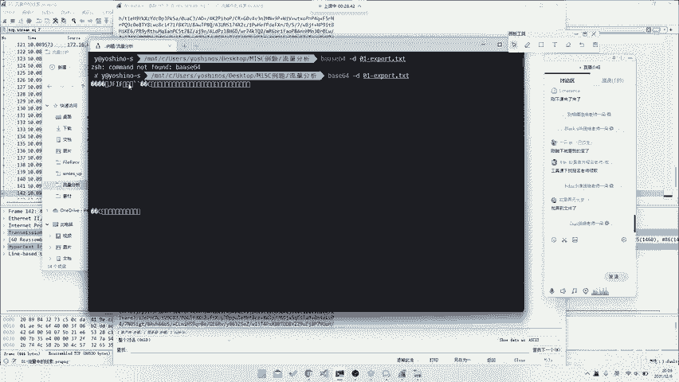
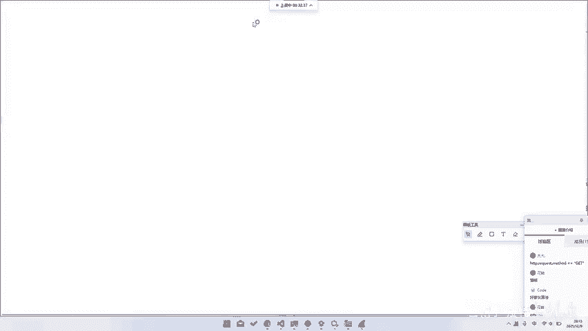
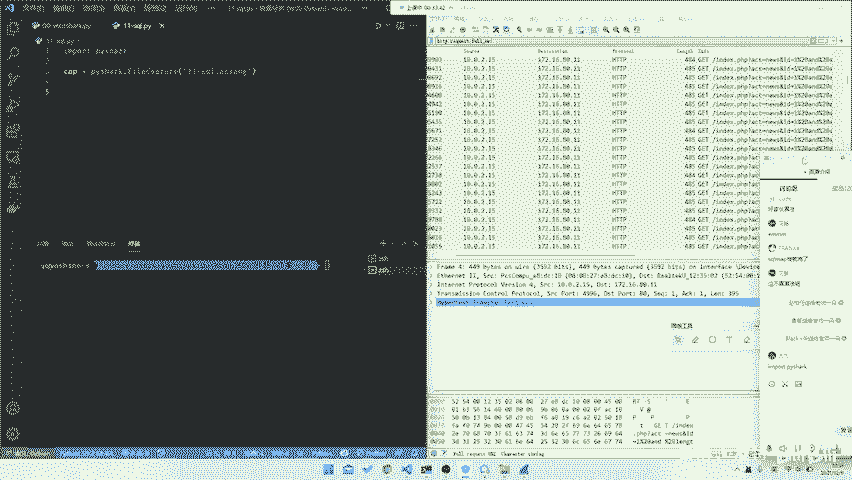
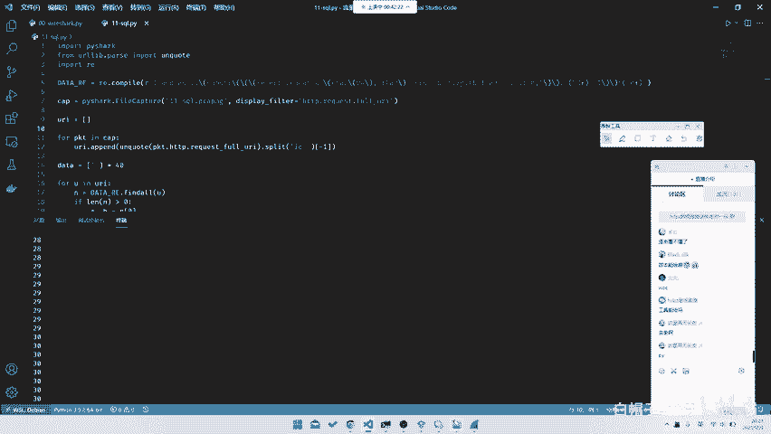
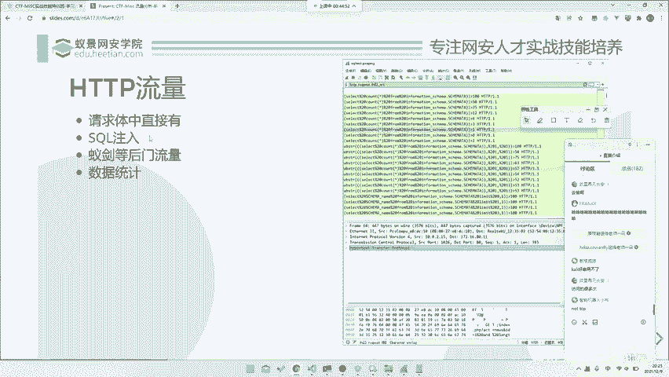

# CTF系列教程：P88：CTF-misc 网络流量篇之HTTP流量 🕵️

在本节课中，我们将学习如何从HTTP网络流量数据包中分析和提取CTF比赛的解题线索。我们将通过几个典型的例子，了解HTTP流量分析的基本方法和思路。

## 概述

HTTP流量分析是CTF比赛中Misc（杂项）类题目的常见考点。它通常要求选手从捕获的网络数据包中，发现隐藏的信息、攻击痕迹或特定协议交互，从而找到Flag。本节我们将学习几种常见的HTTP流量题型及其解法。

---



## 请求体中直接包含数据

首先，我们来看最简单的一种情况：Flag或关键数据直接包含在HTTP请求或响应的正文中。

以下是处理此类问题的基本步骤：



1.  **打开流量文件**：使用Wireshark等工具打开提供的`.pcap`或`.pcapng`流量文件。
2.  **筛选HTTP流**：在Wireshark的过滤器中输入 `http`，可以筛选出所有HTTP协议的数据包。
3.  **追踪流并查找**：右键点击某个HTTP数据包，选择“追踪流” -> “HTTP流”，在弹出的窗口中查看完整的请求和响应内容。或者，也可以直接浏览每个数据包的详情。
4.  **识别可疑数据**：在流内容中寻找可疑的字符串，例如明显的Base64编码（通常以`=`结尾，字符集为A-Z, a-z, 0-9, +, /）、十六进制数据、特殊关键字（如`flag`、`key`）或文件头（如`JFIF`表示JPG图片）。
5.  **提取并解码**：将找到的可疑数据复制出来，使用相应的工具进行解码或重组。

例如，在追踪一个HTTP流时，可能在响应体中看到一串Base64编码的数据：
```
/9j/4AAQSkZJRgABAQEAYABgAAD/2wBDAAgGBgcGBQgHBwcJCQgKDBQNDAsLDBkSEw8UHRofHh0a...
```
这串数据以`/9j/`开头，这是JPEG图片的文件头标志。我们可以使用命令行工具进行解码并保存为图片：
```bash
echo “Base64编码字符串” | base64 -d > flag.jpg
```
打开生成的`flag.jpg`图片，即可找到Flag。

**核心操作**：`base64 -d` 命令用于解码Base64数据。

上一节我们介绍了如何在HTTP流的正文中直接寻找数据，本节中我们来看看更复杂的情况：从攻击流量中提取信息。

---

## 从攻击流量（如SQL注入）中提取数据

在CTF题目中，经常会出现记录了一次网络攻击过程的数据包，例如SQL注入攻击。我们的目标是从大量的攻击请求中，还原出攻击者最终获取的数据（即Flag）。

以下是分析此类流量的方法：

1.  **观察流量特征**：首先浏览数据包，通常会看到大量相似的HTTP请求，其URL或POST数据中包含类似 `id=1' AND ...` 这样的SQL注入Payload。
2.  **使用过滤器**：为了更清晰地查看攻击请求，可以使用Wireshark过滤器。例如，过滤出所有HTTP请求的URI：`http.request.uri`。
3.  **分析注入逻辑**：观察注入的Payload。常见的盲注（Blind SQL Injection）会使用 `substr()` 或 `mid()` 函数逐位截取数据，并结合 `ascii()` 函数和二分查找法来猜测每一位字符的ASCII码。
    *   **公式示例**：`ascii(substr((select database()),1,1)) > 100` 这个Payload意在判断数据库名的第一个字符的ASCII码是否大于100。
4.  **编写提取脚本**：由于请求量巨大，手动提取不现实。需要编写Python脚本（配合`pyshark`或直接解析导出的URL列表）来自动化处理。
    *   **脚本思路**：
        a. 提取所有包含注入Payload的URL。
        b. 使用正则表达式从每个URL中提取出“当前猜测的位数（index）”和“猜测的ASCII码值（value）”。
        c. 因为攻击者通常使用二分查找，所以对于每一位字符，最后一个成功的请求（返回状态码200或页面长度不同）所对应的`value`就是该位字符正确的ASCII码。
        d. 将所有位的ASCII码转换为字符，拼接起来即为Flag。



**核心代码片段（思路示例）**：
```python
import re
import urllib.parse

# 假设 urls 是提取出的所有注入请求URL列表
urls = [...]
flag_chars = [None] * 50  # 假设Flag长度不超过50



for url in urls:
    decoded_url = urllib.parse.unquote(url)
    # 使用正则匹配Payload中的索引和ASCII值
    match = re.search(r'substr\(.*?,(\d+),1\)\)\s*[><]=\s*(\d+)', decoded_url)
    if match:
        index = int(match.group(1)) - 1  # 转为0起始索引
        ascii_val = int(match.group(2))
        # 这里需要更复杂的逻辑来判断哪个值是最终正确的，例如记录最后一次成功的值
        # flag_chars[index] = chr(ascii_val)

# 过滤掉None值并拼接
flag = ''.join([c for c in flag_chars if c is not None])
print(flag)
```

从攻击流量中提取数据需要一定的协议分析和脚本编写能力。接下来，我们看另一种常见场景：分析后门或管理工具的流量。

---

## 分析后门/管理工具流量（如“菜刀”、“蚁剑”）

在CTF中，也可能给出使用“中国菜刀”、“蚁剑”等Webshell管理工具连接后门产生的流量。这类流量的特征是存在特定的HTTP请求模式，用于传递命令和执行结果。

以下是解题方法：

1.  **识别工具特征**：不同工具的网络流量有特定特征。例如，老版本的“中国菜刀”在POST数据中会有 `z0=`、`z1=` 这样的参数，其值是经过Base64等编码的命令。
2.  **查找命令与响应**：在HTTP流中，寻找包含系统命令（如 `whoami`、`ls`、`cat flag`）的请求，以及服务器返回命令执行结果的响应。
3.  **解码参数**：找到可疑参数后，尝试对其进行Base64解码、URL解码等操作，以获取明文命令。
4.  **定位Flag**：通常，Flag会出现在某个命令的响应结果中。例如，攻击者执行了 `cat /flag` 或 `type flag.txt`，那么对应的HTTP响应体中就包含了Flag。

**示例**：在一个请求中，发现POST数据为 `z0=Y2F0IC9mbGFn`。对其进行Base64解码：
```python
import base64
cmd = base64.b64decode('Y2F0IC9mbGFn').decode('utf-8')
print(cmd)  # 输出：cat /flag
```
这表明攻击者试图读取 `/flag` 文件。接下来，就在这个请求对应的HTTP响应体中寻找该命令的输出结果，即Flag。

---

## 数据统计类题目

这类题目要求对流量中的某些信息进行统计，例如：扫描出了多少个开放端口、访问了哪些特定路径等。



以下是解题步骤：

1.  **理解题目要求**：仔细阅读题目描述，明确需要统计什么（如：`127.0.0.1`上开放了哪些TCP端口）。
2.  **分析相关流量**：题目常会给出 `nmap` 扫描流量。需要找到扫描器发送的探测包（如SYN包）和目标的回复包（如SYN-ACK包）。
3.  **使用过滤与统计**：
    *   **过滤器**：可以组合使用过滤器来缩小范围，例如 `ip.src==127.0.0.1 && tcp.flags.syn==1 && tcp.flags.ack==0` 用于找从本机发出的SYN扫描包。`ip.dst==127.0.0.1 && tcp.flags.syn==1 && tcp.flags.ack==1` 用于找目标返回的SYN-ACK包（表示端口开放）。
    *   **统计功能**：Wireshark的“统计” -> “对话”功能可以很方便地查看所有TCP/UDP会话，并看到每个会话的端口号，从而找出开放的端口列表。
4.  **提交结果**：将统计出的端口号按题目要求格式（如用逗号分隔）提交，即为Flag。

**课后思考**：如何编写Wireshark过滤器，来快速找出所有从`127.0.0.1`发出且目标端口开放的TCP连接尝试？

---

## 总结

本节课中我们一起学习了CTF中HTTP流量分析的几种常见题型：
1.  **直接提取型**：从HTTP正文中直接发现并解码Base64等编码的数据。
2.  **攻击还原型**：从SQL注入等攻击流量中，通过分析Payload模式并编写脚本，还原出被窃取的数据。
3.  **后门分析型**：识别Webshell管理工具的流量特征，解码通信内容，从中找到命令和Flag。
4.  **数据统计型**：利用Wireshark的过滤和统计功能，对扫描等流量进行信息汇总。



掌握这些基本方法，并配合Wireshark工具和Python脚本的灵活运用，是解决CTF网络流量题的关键。