# CTF系列教程：P89：CTF-misc 网络流量篇之FTP和ICMP流量

## 概述
在本节课中，我们将要学习如何分析CTF比赛中常见的两种网络流量类型：FTP和ICMP。我们将通过具体的赛题实例，学习如何从原始网络数据包中提取隐藏的flag信息，并掌握相关的分析工具和命令。

## FTP与ICMP流量的基本概念
上一节我们介绍了HTTP等基于TCP的应用层协议分析。本节中我们来看看FTP和ICMP这两种协议。

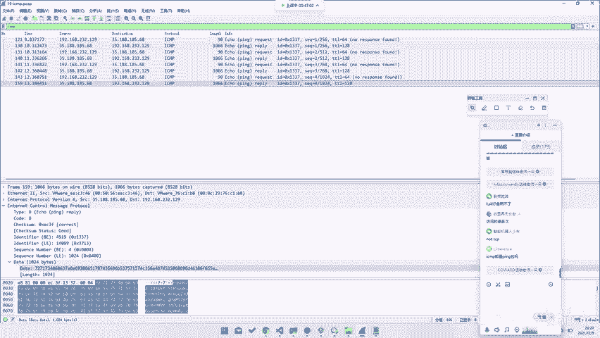

FTP或ICMP流量分析需要注意的问题是，它们与之前讨论的HTTP协议处于不同的网络层面。例如，HTTP是在TCP协议之上运行的，而FTP虽然也使用TCP，但它传输的是纯数据。ICMP协议则与TCP/IP协议族中的TCP和UDP处于同一层级，它并不承载上层应用数据，但其中的“数据”字段可以被利用来隐藏信息。

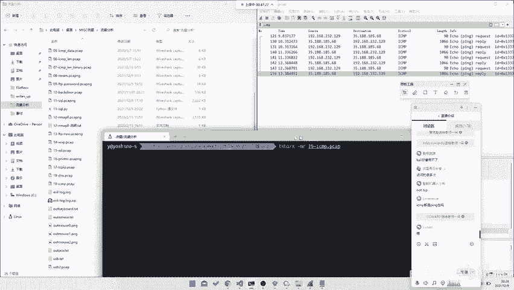

ICMP协议不只包含常见的ping包，ping包只是运行在ICMP协议上的一种报文类型。

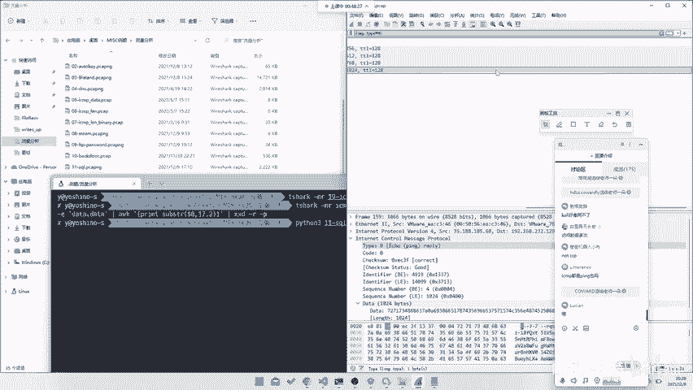

## ICMP流量分析实战
当我们分析ICMP流量时，首先需要过滤出ICMP协议的数据包。

以下是过滤ICMP数据包的基本命令：
```bash
tshark -r file.pcap -Y "icmp"
```

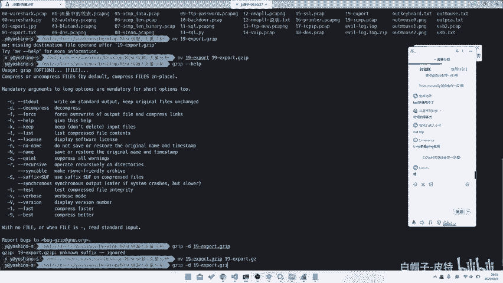

如果题目提示flag隐藏在ICMP中，我们就可以使用上述过滤条件。ICMP报文是封装在IP数据包中的，它与TCP是同一层级的协议。

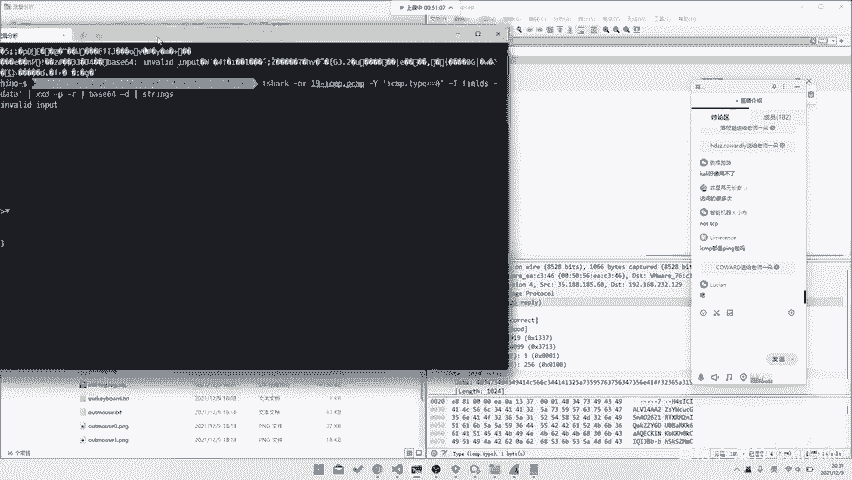

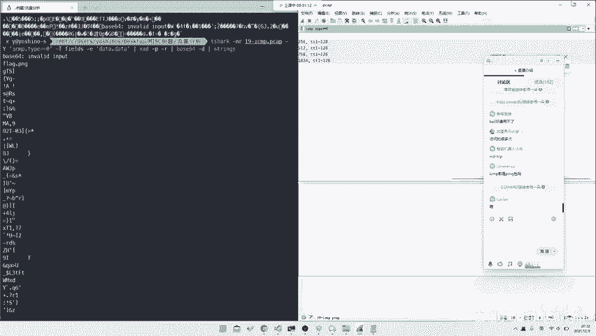

### 案例一：从ICMP响应包中提取Base64数据
对于ICMP包，我们需要找到flag隐藏的位置。例如，有些ICMP响应包（Reply）的“数据”字段可能为空（全是0），而有些则包含了Base64编码的数据。

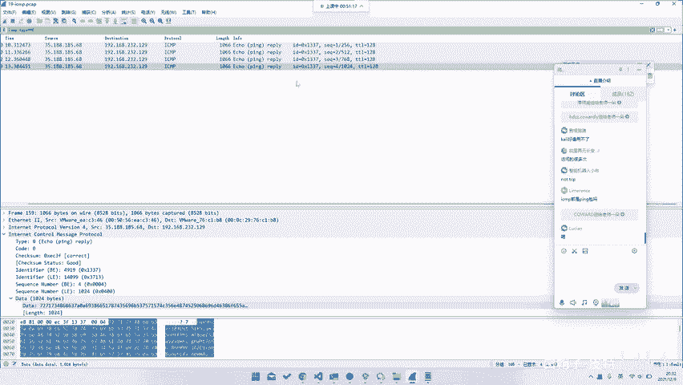

以下是提取ICMP响应包中数据的步骤：
1.  首先过滤出所有ICMP响应包（type为0）。
    ```bash
    tshark -r file.pcap -Y "icmp.type == 0"
    ```
2.  然后导出这些包的数据字段。
    ```bash
    tshark -r file.pcap -Y "icmp.type == 0" -T fields -e data.data
    ```
3.  将导出的十六进制数据转换为可读的字符串，并进行Base64解码。
    ```bash
    echo [提取的Base64字符串] | base64 -d
    ```
4.  解码后可能得到一个文件名（如`flag.png`）或经过压缩的数据，需要进一步解压或处理。

通过以上步骤，我们就能从ICMP流量中提取出隐藏的文件或信息。

### 案例二：从ICMP数据字段的特定位置提取信息
有些题目会将flag的每个字符隐藏在ICMP报文数据字段的固定位置。

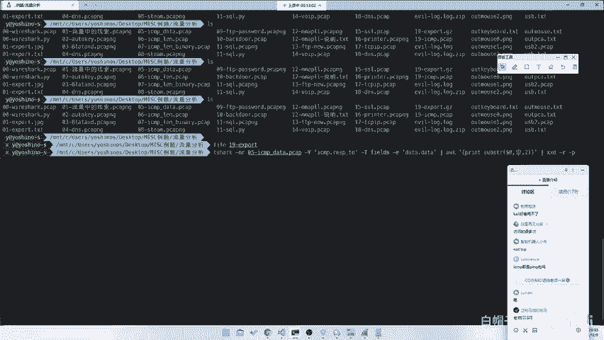

以下是解决此类问题的思路：
1.  过滤出ICMP请求或响应包。
2.  仔细观察数据字段，找到每次变化但位置固定的字符。
3.  使用命令行工具（如`awk`）提取这些特定位置的字符。
    ```bash
    tshark -r file.pcap -Y "icmp" -T fields -e data.data | awk '{print substr($0, 17, 2)}'
    ```
4.  将提取出的十六进制字符串合并，并进行解码即可得到flag。

这种方法展示了如何利用纯命令行工具高效地解决CTF题目。

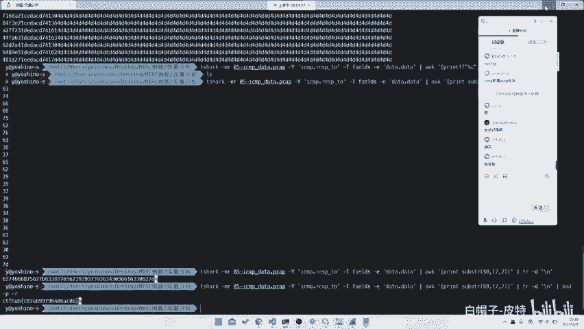

### 案例三：从ICMP长度字段提取信息
信息不仅可能藏在`data`字段，也可能隐藏在如`length`等其他字段中。

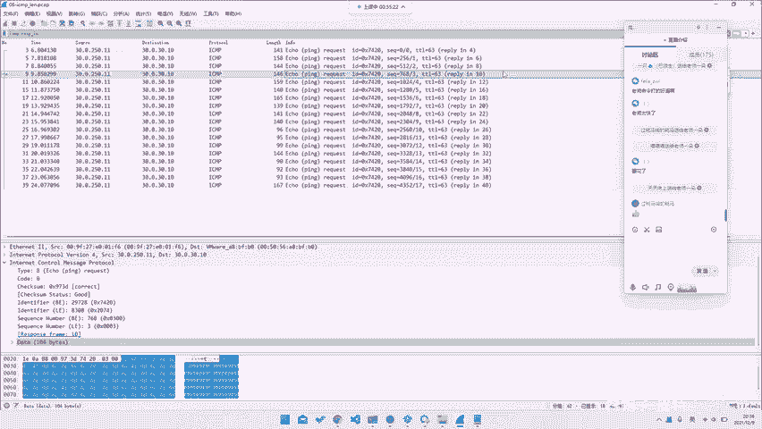

以下是分析此类题目的方法：
1.  过滤出ICMP包。
2.  查看ICMP协议详情中的长度（`len`）字段，这些数值可能对应ASCII码。
3.  提取长度字段并转换为字符。
    ```bash
    tshark -r file.pcap -Y "icmp" -T fields -e icmp.len | awk '{printf "%c", $1}'
    ```
4.  转换后得到的字符串可能就是flag。

## 使用Python脚本辅助分析
如果不熟悉复杂的命令行工具，编写Python脚本是另一种灵活有效的方法。

以下是使用Python分析ICMP流量的基本框架：
```python
import base64

# 1. 读取导出的数据文件
with open('output.txt', 'r') as f:
    lines = f.readlines()

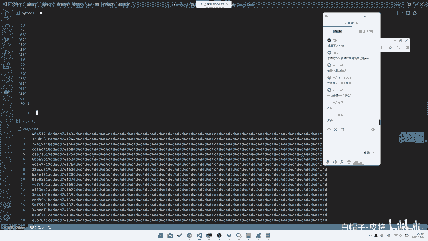

# 2. 提取每行固定位置的字符
flag_chars = []
for line in lines:
    # 例如，提取第16和17位字符（索引从0开始）
    hex_pair = line[16:18]
    flag_chars.append(hex_pair)

# 3. 将十六进制字符串转换为字节并解码
hex_string = ''.join(flag_chars)
bytes_data = bytes.fromhex(hex_string)
flag = bytes_data.decode('ascii')
print(flag)
```

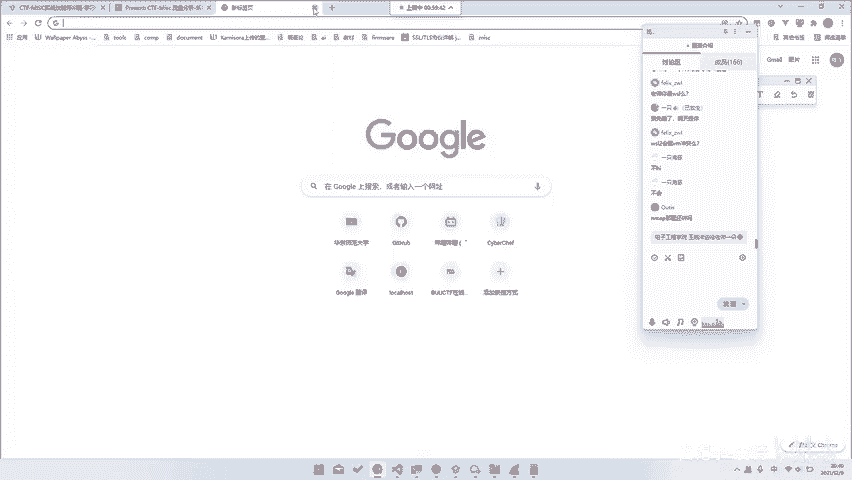

Python脚本的优势在于可读性强，便于进行更复杂的逻辑处理和调试。

## 总结
本节课中我们一起学习了CTF-misc中FTP和ICMP流量的分析方法。我们了解到：
1.  ICMP协议虽然简单，但其数据包的数据、长度等字段常被用来隐藏信息。
2.  掌握`tshark`过滤和字段提取命令是分析网络流量的核心技能。
3.  灵活运用命令行工具（如`awk`）或编写Python脚本，都能有效地从流量中提取flag。
4.  分析的关键在于仔细观察数据包的规律，找到信息隐藏的固定位置或编码方式。

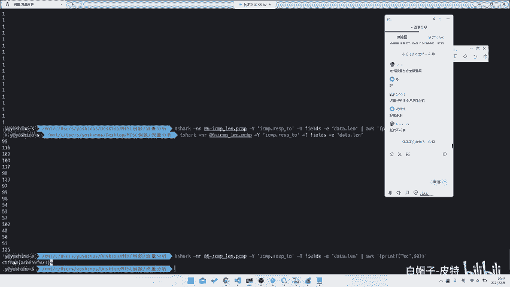

通过本课的学习，你应该具备了分析基础ICMP隐写题目的能力。课后可以通过提供的题目文件进行练习，巩固所学知识。