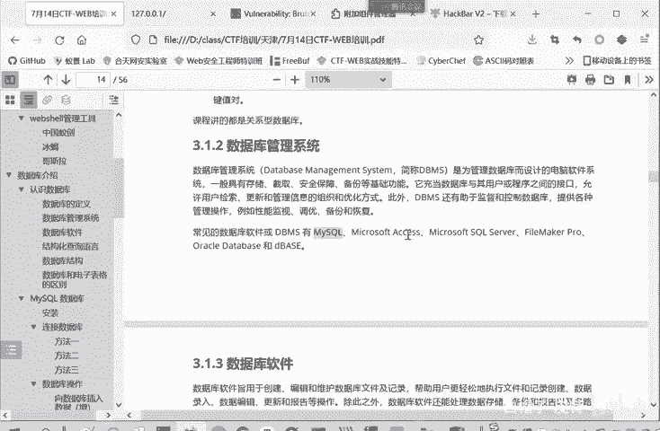

# CTF入门教程：P8：web-数据库管理系统 🗄️

在本节课中，我们将要学习Web安全领域的一个重要组成部分——数据库管理系统。理解它是如何工作的，对于后续学习SQL注入等核心Web漏洞至关重要。

## 数据库管理系统概述

上一节我们介绍了关系型数据库的基本概念。本节中我们来看看管理这些数据库的软件系统。

数据库管理系统是为了管理数据库而设计的电脑软件系统。它具有存储、截取、安全保障和备份等基础功能。它实际上是充当数据库和用户或者是程序之间的接口。用户或者程序通过数据库管理系统来使用数据库并控制数据库。

## 常见的数据库管理系统

以下是几种在Web开发和安全领域常见的数据库管理系统。

*   **MySQL**：这是我们课程重点讲解的数据库管理系统，因其开源、流行和广泛使用而成为CTF比赛中的常客。
*   **Microsoft SQL Server**：由微软开发的企业级数据库系统。
*   **Oracle Database**：功能强大的商业数据库，常用于大型企业应用。

## 核心功能与角色

数据库管理系统的核心角色可以用一个简单的模型来描述：

**用户/程序 <---> 数据库管理系统 <---> 数据库**

这个模型清晰地表明，所有对底层数据库的操作（如查询数据`SELECT * FROM users;`、插入数据等）都必须通过数据库管理系统这个“中间人”来完成。它负责解析用户的指令，安全地执行操作，并返回结果。

## 总结

本节课中我们一起学习了数据库管理系统。我们了解到它是一个管理数据库的软件，是用户程序与数据库之间的关键接口。掌握常见的数据库管理系统（尤其是MySQL）及其基本工作原理，是进一步学习Web安全，特别是SQL注入攻击与防御技术的坚实基础。在接下来的课程中，我们将基于这些知识，深入探讨如何与数据库进行交互。