# CTF系列教程：P90：CTF-misc 网络流量篇之其他网络流量

## 概述
在本节课中，我们将学习CTF杂项（Misc）类别中，除了HTTP、TCP等常见协议之外的其他网络流量分析。我们将接触到VOIP、USB流量以及一些新兴或特定设备的通信协议，并了解如何在没有现成工具或已知协议的情况下分析流量数据。

---

## VOIP协议流量分析
上一节我们介绍了常见的网络协议流量分析，本节中我们来看看一些特殊的协议。VOIP（Voice over IP）是一种用于传输实时语音的协议，通常基于RTP（Real-time Transport Protocol）传输。

在CTF题目中，可能会提供一个包含VOIP通话的流量包。解题的关键在于从RTP流中提取出音频数据。

以下是处理VOIP流量的典型步骤：
1.  使用Wireshark打开流量包文件。
2.  在菜单栏选择 `电话` -> `VOIP通话`。
3.  在弹出的窗口中，选择相应的RTP流，点击 `播放` 按钮即可收听音频。Flag可能直接以语音形式读出。

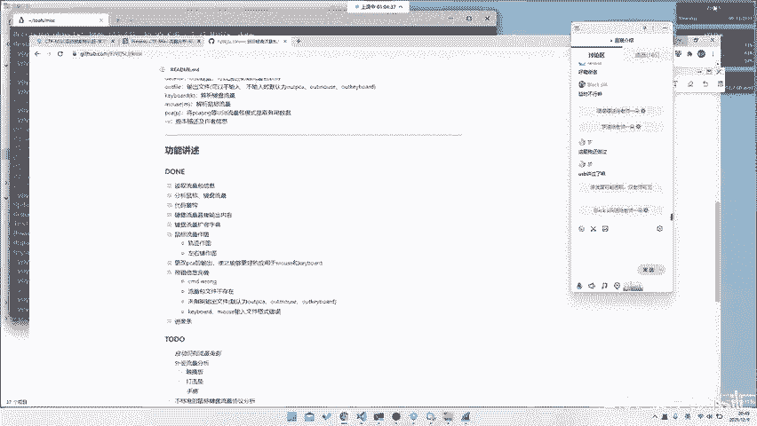

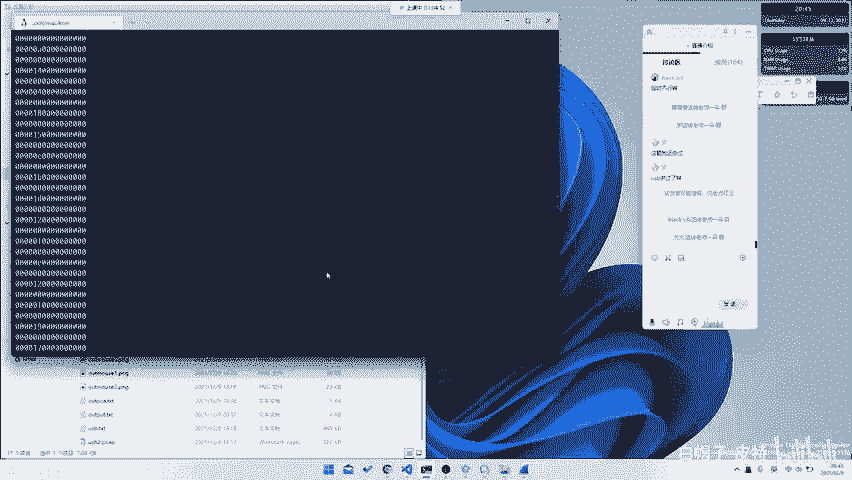

**核心操作**：在Wireshark中，可以通过 `Telephony -> VoIP Calls` 来分析和播放捕获到的语音流。

这提醒我们，网络流量分析并不仅限于HTTP、TCP或ICMP等常见协议，任何基于网络的通信协议都可能成为考点，例如SNMP或其他专有协议。

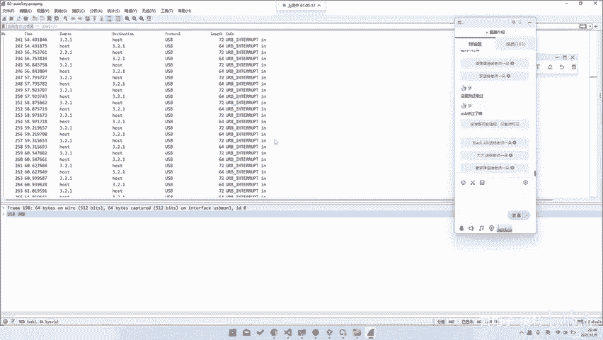

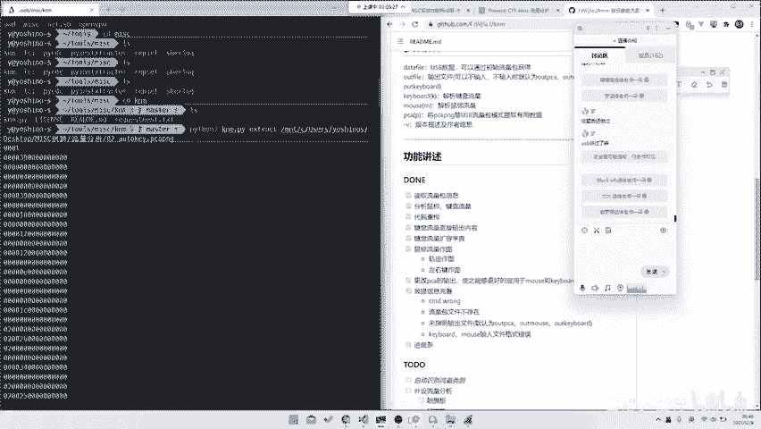

---

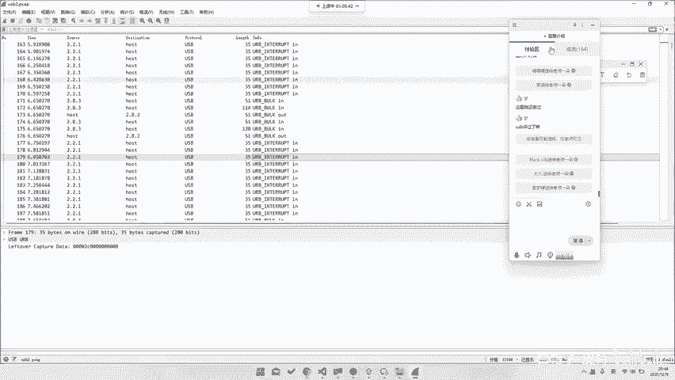

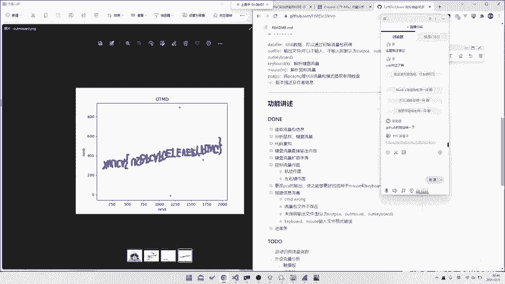

## USB流量分析基础
网络流量种类繁多，除了常规的网络协议流量，还有像USB这样的设备通信流量。USB流量中，最常见的是键盘流量和鼠标流量，通常有成熟的工具可以辅助分析。

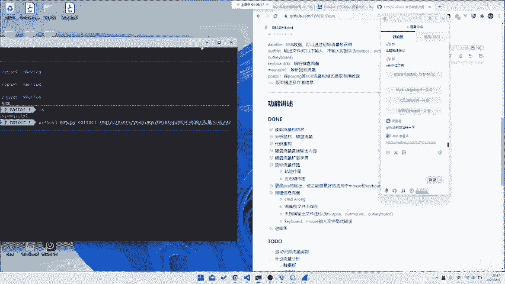

### 键盘流量分析
键盘击键数据通常包含在USB流量包的特定数据段中。

以下是分析键盘流量的一个示例方法：
1.  使用工具（如 `tshark`）过滤并提取USB中断传输（Interrupt Transfer）中的数据。
2.  键盘数据通常有固定的长度（如8字节），且有效击键信息位于数据包的特定偏移位置（例如第3个字节）。
3.  将提取出的键值对照USB HID使用表进行转换，即可得到输入的字符。

**核心概念**：键盘击键数据映射。通常需要一个将捕获的键值码（keycode）转换为实际字符的映射表。
```python
# 示例：简单的键值映射字典（部分）
keymap = {
    0x04: 'a', 0x05: 'b', 0x06: 'c', # ...
    0x1d: 'z', 0x27: '0', 0x28: '\n' # 回车
}
```

### 鼠标流量分析
鼠标流量记录了鼠标的移动、点击等事件。分析这类流量可以还原出鼠标的操作轨迹。

分析鼠标流量的目的是将移动坐标数据提取出来，并绘制成轨迹图。
1.  从USB流量中过滤出鼠标设备的数据包。
2.  解析数据包中的坐标变化量（Δx, Δy）和按键状态。
3.  累积坐标变化，并使用绘图库（如matplotlib）将移动轨迹绘制出来。

**核心操作**：通过脚本累积坐标并绘图。这可以帮助我们“看到”鼠标的操作，例如画出了一个字母或图形。

---

## 新兴与特殊设备流量分析
USB流量并不仅限于鼠标和键盘。随着CTF题目的发展，出现了许多基于其他USB设备的流量分析题，这要求我们具备协议分析和数据逆向的能力。

### 游戏手柄流量
例如，一道题目可能捕获了游戏手柄（如Steam手柄）的通信流量。解题者可能并不清楚其具体协议格式。

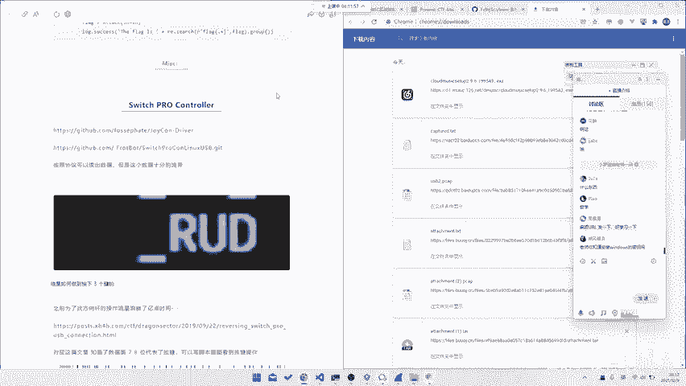

在这种情况下，解题思路可能包括：
*   **查找文档**：尝试根据设备信息（如Vendor ID, Product ID）搜索对应的协议手册。
*   **数据分析**：观察数据规律，例如时间间隔、数据包长度、固定字节等，从中寻找突破口（如一道题目通过分析按键时间间隔解出答案）。

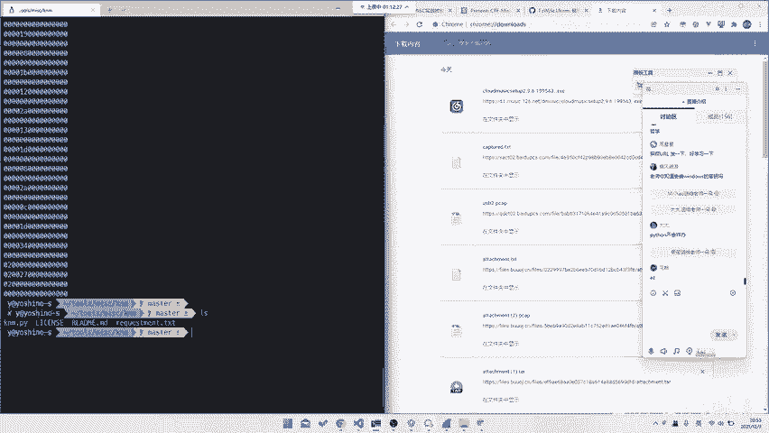

### 打印机流量
题目可能提供打印机的USB通信流量（PC向打印机发送的打印数据）。打印机通常使用特定的页面描述语言（如PCL、PostScript）。

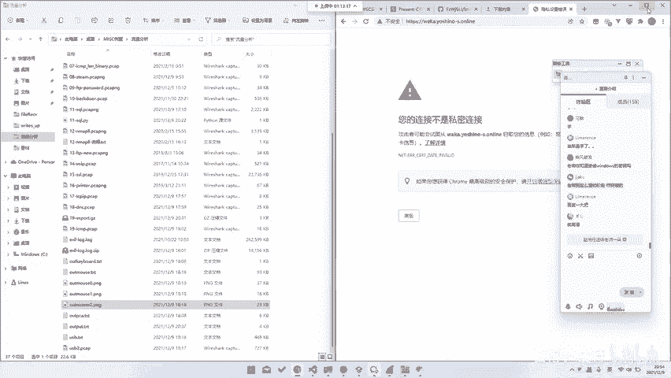

解题的关键在于：
*   **识别协议**：通过流量特征或题目提示（如文件名`printer.pcapng`）识别为打印机流量。
*   **提取数据**：从流量中提取出打印机接收到的原始数据流。
*   **解析渲染**：将提取出的数据（可能是PDL文件）通过相应的解释器或查看工具转换为可视化的图像或文档，从而发现flag。

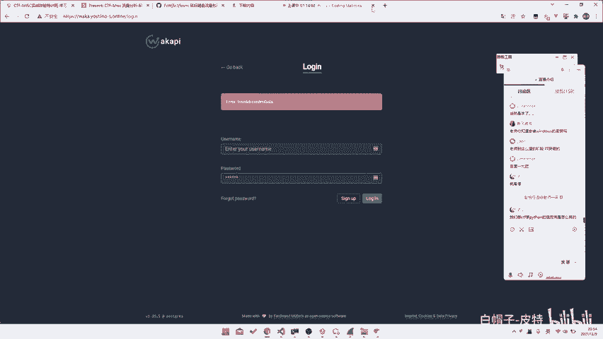

### 未知协议流量分析
面对完全未知格式的流量数据（例如来自工控机、特定硬件设备的通信），通用的解题思路如下：
1.  **观察特征**：仔细查看原始数据或解析后的字段，寻找任何可读字符串、规律性分隔符（如逗号）、有意义的单词（如`up`, `down`, `press`）。
2.  **搜索验证**：将观察到的特征字符串或数据片段在互联网上搜索，可能会找到相关的协议说明或工具。
3.  **大胆假设**：基于观察到的信息，对协议的功能和数据含义进行合理猜测（例如，`up`/`down`可能代表按键按下和释放），并编写脚本进行验证。
4.  **逆向还原**：通过分析数据与预期结果之间的关系，逐步还原出完整的通信逻辑和数据格式。

**核心方法**：对于未知协议，结合**数据观察**、**搜索引擎**和**逻辑推理**是至关重要的手段。

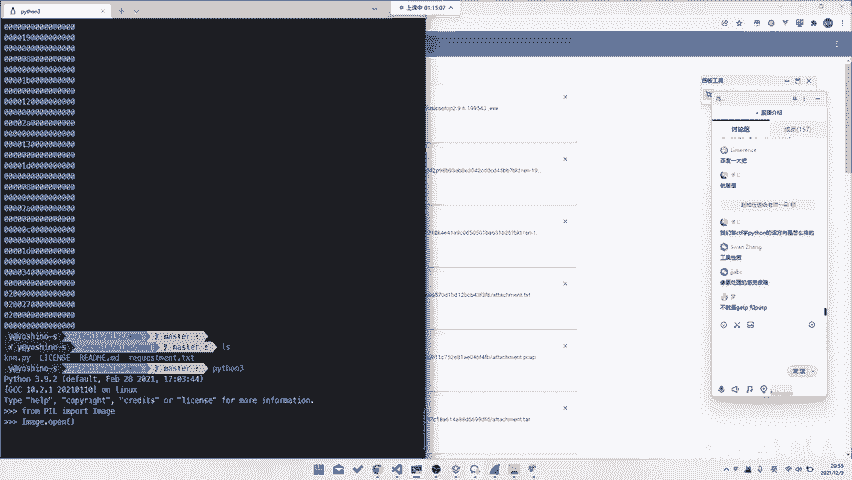

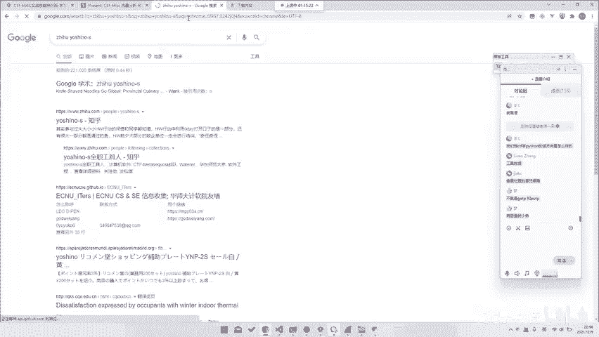

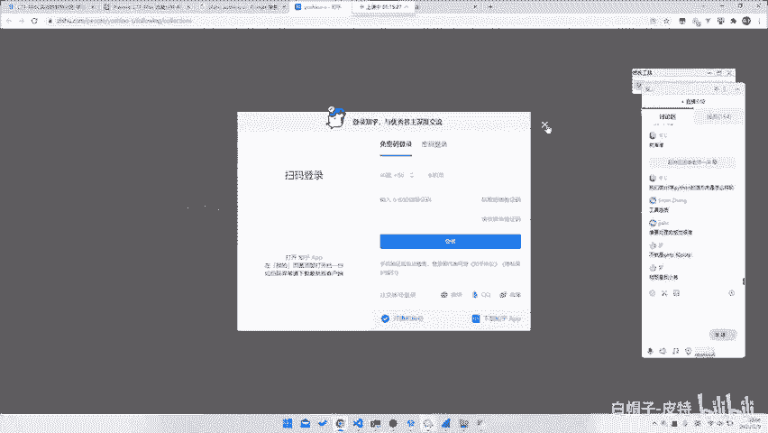

---

## 总结
本节课我们一起学习了CTF中Misc方向的其他网络流量分析。
*   我们首先了解了**VOIP协议**，知道如何从RTP流中提取并播放语音信息。
*   接着，我们探讨了**USB流量**，包括键盘和鼠标流量的常见分析方法和工具，其核心是定位数据并理解编码方式。
*   最后，我们面对了更复杂的**新兴与特殊设备流量**，如游戏手柄、打印机等。处理这类题目的关键在于培养协议分析思维：学会观察数据特征、利用搜索引擎查找资料、并基于逻辑进行假设和验证。

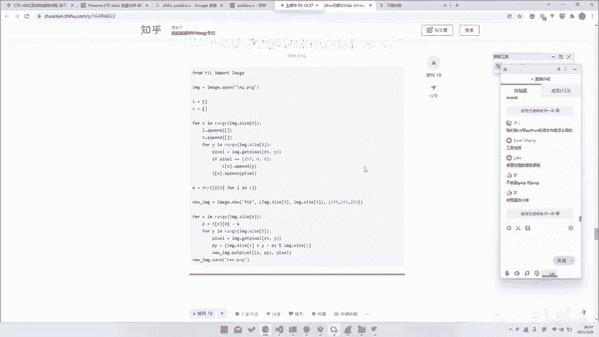

掌握从常见协议到陌生协议的分析方法过渡，能够帮助你应对CTF比赛中层出不穷的新型流量分析挑战。