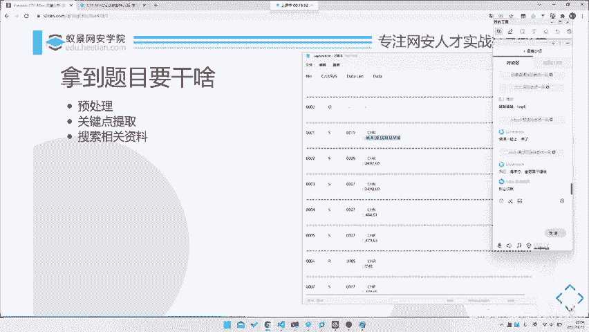
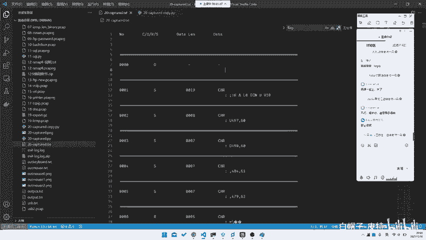
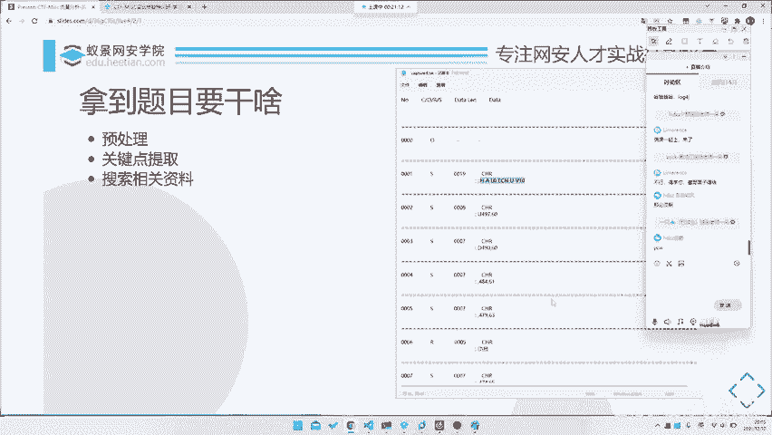
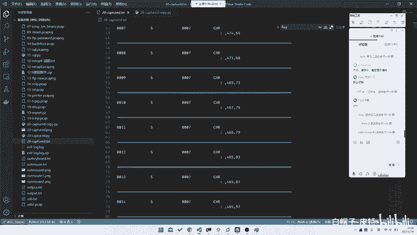
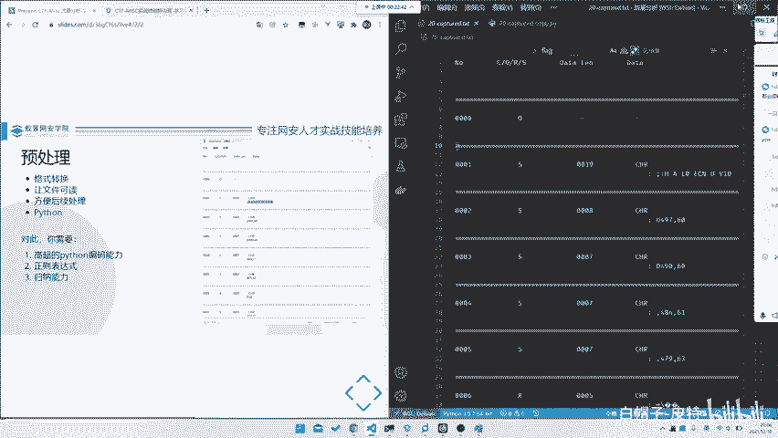
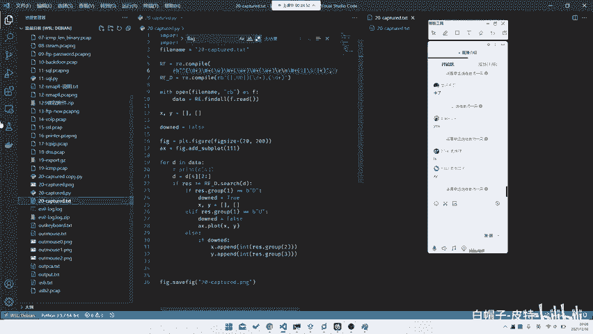
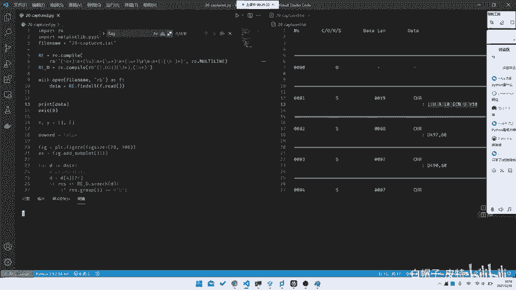
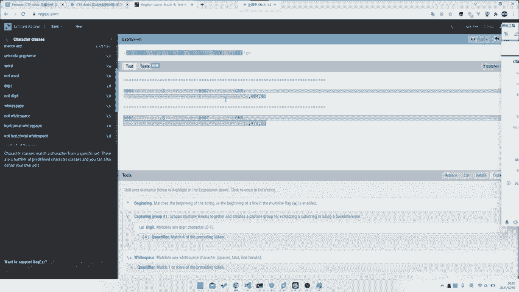
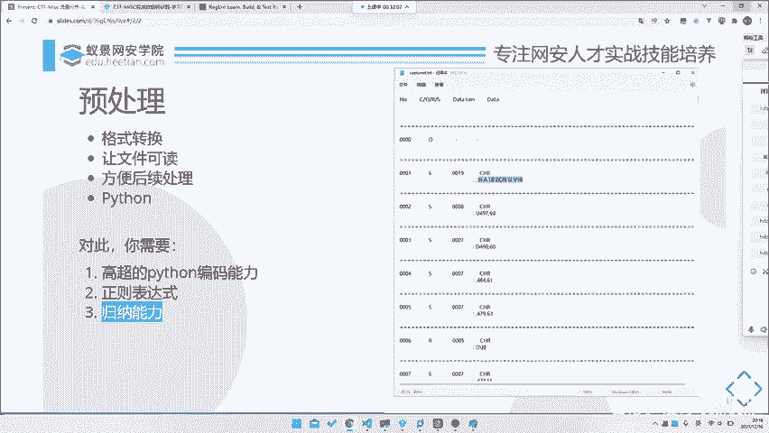

# CTF系列教程：P91：拿到题目该做什么之预处理 🧩



在本节课中，我们将学习如何入手一道全新的CTF-Misc题目。我们将通过一个具体案例，完整地讲解从拿到题目文件到完成预处理的整个流程，帮助你建立清晰的解题思路。

---

## 概述：解题的第一步



面对一道新的CTF题目，尤其是Misc类题目，直接寻找答案往往无从下手。一个系统化的处理流程至关重要。通常，我们可以将初期工作分为三个核心步骤：**预处理**、**关键点提取**和**搜索相关资料**。本节课，我们将重点深入讲解第一步——预处理。



上一节我们概述了解题的整体框架，本节中我们来看看如何具体执行预处理。

---



## 预处理：让数据变得可读

预处理的核心目标是**转化数据格式**或**让文件内容变得可读**，以便后续进行更方便、更高效的分析。很多题目提供的原始数据（如流量日志、编码文本）结构混乱，直接分析如同大海捞针。



例如，我们拿到一个名为 `challenge.txt` 的文件，内容如下所示（仅为片段）：

```
0000 CORS 1234 datalen 5 data: abcde
0001 S 5678 datalen 3 data: xyz
0002 - 9012 datalen 4 data: 1234
...
```

这个文件有近24000行。肉眼观察可以发现一些规律：每行似乎都包含编号、字母代码、数字和`data`字段。但直接全局搜索`flag`是无效的。因此，我们需要先对其进行预处理，提取出结构化的信息。

### 核心操作：使用正则表达式提取数据



为了处理这类有规律但冗长的文本，最有效的方法是编写脚本，利用**正则表达式**匹配并提取我们需要的数据字段。

以下是处理该文件的Python脚本示例：

```python
import re



pattern = re.compile(r'^(\d+)\s+(\S+)\s+(\d+)\s+datalen\s+(\d+)\s+data:\s+(.+)$', re.MULTILINE)

with open('challenge.txt', 'r', encoding='utf-8') as f:
    content = f.read()

matches = pattern.findall(content)
for match in matches:
    print(match)
```

**代码解释**：
1.  `^(\d+)`：匹配行首的数字编号（如0000）。
2.  `\s+(\S+)`：匹配一个或多个空白字符后，接着一个非空白字符序列（如CORS, S）。
3.  `\s+(\d+)`：匹配另一个数字。
4.  `datalen\s+(\d+)`：匹配“datalen”关键字后的数字（数据长度）。
5.  `data:\s+(.+)$`：匹配“data:”后的所有内容，直到行尾。

运行脚本后，原始杂乱文本被转化为整齐的元组列表，例如：`(‘0000’, ‘CORS’, ‘1234’, ‘5’, ‘abcde’)`。这就完成了数据的结构化，为下一步分析打下了坚实基础。

### 预处理所需的关键能力

要顺利完成预处理，你需要具备以下能力：

1.  **基础的编程能力**：能够使用Python等语言编写简单的文本处理脚本。无需非常精通，但应能快速实现想法。
2.  **正则表达式**：这是文本处理的利器。理解并编写正则表达式来匹配复杂模式是Misc解题的必备技能。
3.  **规律归纳能力**：能够观察原始数据，发现其排列、分隔或编码上的规律。这类似于解决“找规律”数学题。

为了学习和测试正则表达式，推荐使用在线工具如 [regex101](https://regex101.com)。它可以可视化匹配过程，解释表达式含义，并支持多种正则语法（如PCRE），非常适合学习和调试。

---



## 总结与过渡

本节课中，我们一起学习了CTF-Misc解题的第一步——**预处理**。我们通过一个实例，演示了如何将杂乱无章的文本文件，通过寻找规律并编写Python正则表达式脚本，转化为结构清晰、易于分析的数据格式。



预处理就像为混乱的数据建立索引和目录，它本身可能不会直接给出答案，但却是发现**关键点**不可或缺的前提。下一节，我们将基于预处理后的干净数据，探讨如何从中提取可能隐藏着flag的**关键信息点**。