# CTF系列教程：P92：拿到题目该做什么之关键点提取与信息收集 🎯

在本节课中，我们将学习CTF-MISC类题目中，拿到数据后如何进行关键点提取与信息收集。这是从原始数据走向解题答案的核心步骤。

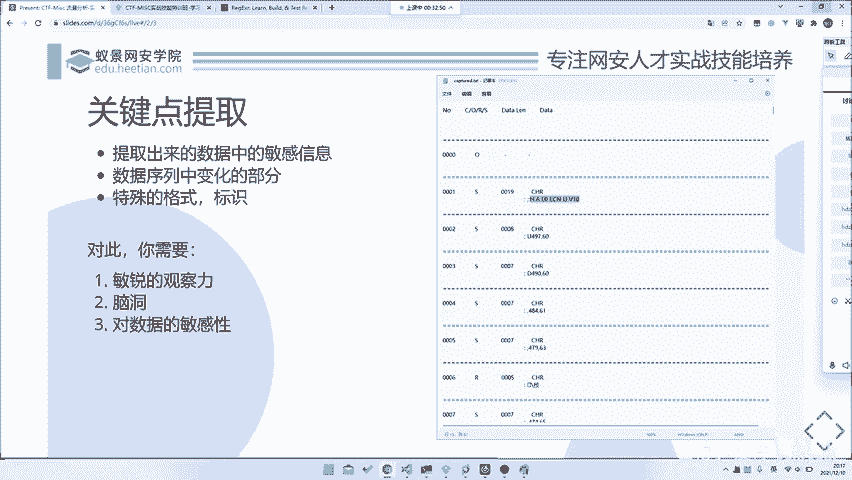

## 概述

面对一个MISC题目，我们通常会得到一份数据。在完成初步的数据预处理后，下一步就是进行关键点提取。所谓关键点提取，就是从海量数据中找出我们需要关注的核心数据。因为一个时间序列上的数据可能非常多，例如这里可能有9000多行。如果数据量更大，我们显然不可能对每一个数据点都进行详细分析。虽然所有数据都可能与最终获取flag有关，但在分析关键要点时，不可能所有数据都是重点。因此，我们需要“划重点”。

以下是关键点提取的几个主要方向：

1.  **数据中的敏感或变化部分**：例如，在我们的数据中，从头到尾有很多字段。我们需要观察哪些部分在变化。第一个是`I`，即`number`字段，它是一个递增变化的序列，通常不是我们关注的重点。`CORS`字段我们暂时不理解，且看上去都是`S`，也不关注。最后是`data line`和`data`字段。我们可以对应一下，例如`data line`为19，数一数`data`字段是不是19个字符。显然，`data`字段可能是我们的要点。
2.  **数据中的关键词或关键特征**：我们也需要关注数据中的特殊格式或关键词。为什么需要关注这些特殊格式呢？因为这些特殊格式很可能帮助我们识别出这是什么类型的流量。例如，我们可能一开始并不知道这是什么协议的数据包，但我们可以通过搜索来识别。搜索就需要关键词。因此，最后一步的搜索能力，也依赖于我们提取的关键词。

## 所需能力

要进行有效的关键点提取，需要具备以下几种能力：

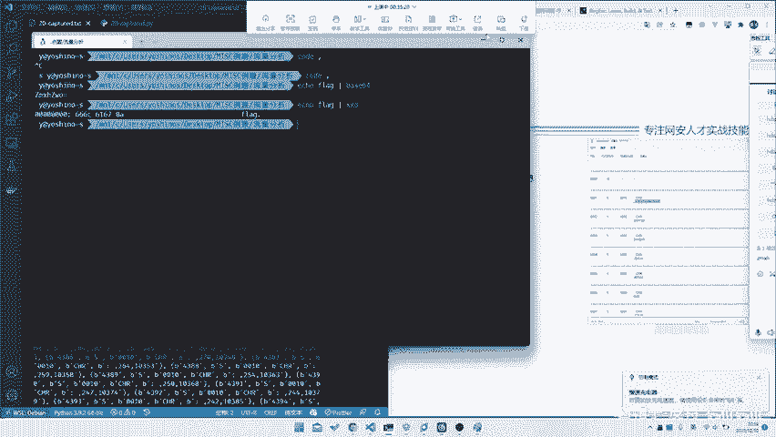

*   **敏锐的观察能力**：至少需要能看出数据中什么在变，什么不变，以及哪些字段可能是重要的。
*   **一定的“脑洞”**：有些题目相对简单，稍作观察即可。但有的题目真的需要一点联想能力，或者需要与出题人的思路对上才能解出。
*   **对数据的敏感能力**：需要对特定格式的数据有敏感性。例如，看到`666C6167`就应该敏感地联想到它可能是`flag`的十六进制表示。这种能力也体现在识别特殊格式上，因为我们需要将这些特殊格式放入搜索引擎进行查找。

## 信息搜集 🔍

上一节我们介绍了如何提取关键信息，本节中我们来看看如何利用这些信息进行信息搜集。

对于上述提取到的所有关键信息，我们需要进行信息搜集。基本原则是“不要重复造轮子”。如果前人已经解过类似的题目，甚至就是原题，那么我们通过搜索就能直接找到答案或思路，效率会高很多。

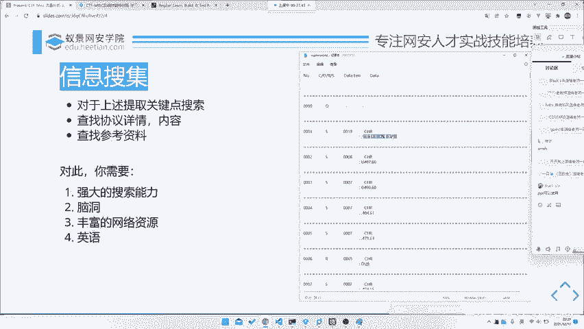

因此，我们需要先进行信息搜集。信息搜集的内容，就是基于我们提取出的关键词进行查找。

以下是信息搜集可能涉及的内容：

*   **查找协议详情**：如果是协议分析题，可能需要查找该协议的详细文档或规范。
*   **查找类似题目或Writeup**：搜索是否有原题或类似的题目解析（Writeup）。
*   **查找相关工具或脚本**：看看是否已有现成的解析工具或脚本。

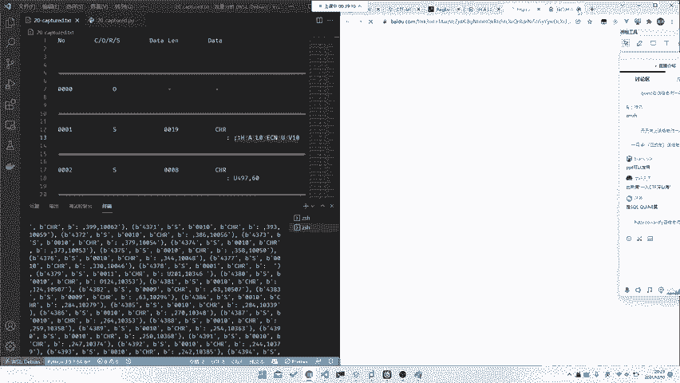

进行有效的信息搜集，同样需要一些能力：

*   **搜索技巧**：需要掌握一些高级搜索技巧，直接使用普通关键词在百度搜索可能效果不佳。
*   **脑洞**：有时需要联想才能捕获到正确的搜索点。
*   **丰富的网络资源**：拥有一个收藏了各种CTF相关网站、工具站、论坛的收藏夹会很有帮助。
*   **一定的英语能力**：甚至可能需要其他语言能力。例如，曾有一个比赛的题目，用中文和英文都搜不到，但用韩文搜索就能找到，因为那是韩国比赛的原题。因此，多掌握几门语言的基础搜索能力是有益的。

## 实战演练：搜索过程模拟 🧪

让我们以当前数据为例，完整模拟一个搜索过程。

首先，我们尝试搜索`CORS`字段，百度结果显示是关于跨域资源共享的，与本题无关。其他字段似乎也没什么用。

然后，我们看`data`字段。它后面跟着一串数字，但开头部分有一些固定的字符。我们尝试将这些固定字符作为关键词搜索。

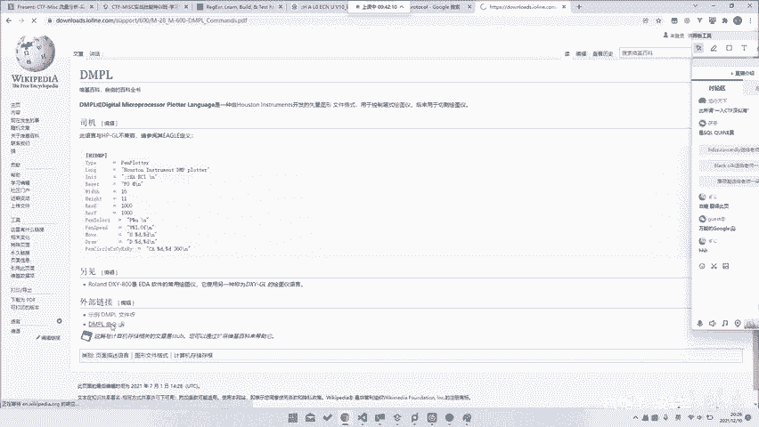

例如，搜索`DMPL`。我们发现了一篇关于“串口DMPL指令刻字机自动识别图形轮廓”的文章。这提示我们，这可能是一种用于刻字机的协议。

为了进一步理解协议，我们需要搜索协议文档。直接搜索“DMPR协议”可能找不到。这时需要英语能力，我们知道“协议”的英文是“protocol”，所以搜索“DMPL protocol”。

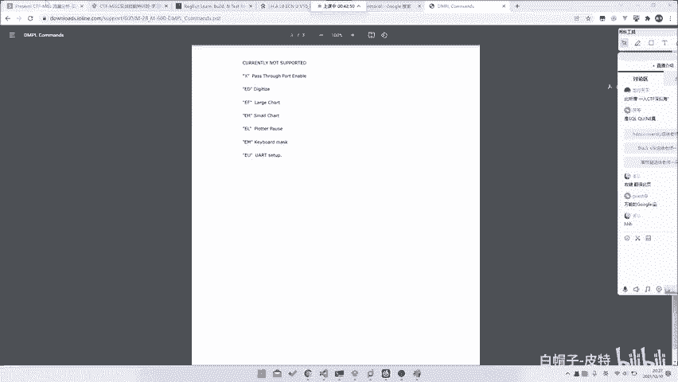

搜索“DMPL protocol”后，我们找到了相关文档，说明它是一种名为“Digital Microprocessor Plot Language”的矢量图文件格式，源于Houston Instruments公司。文档中详细定义了各种指令，如`reset`, `hat`, `re X`, `re Y`, `pen select`, `pen speed`, `move`, `down`等。

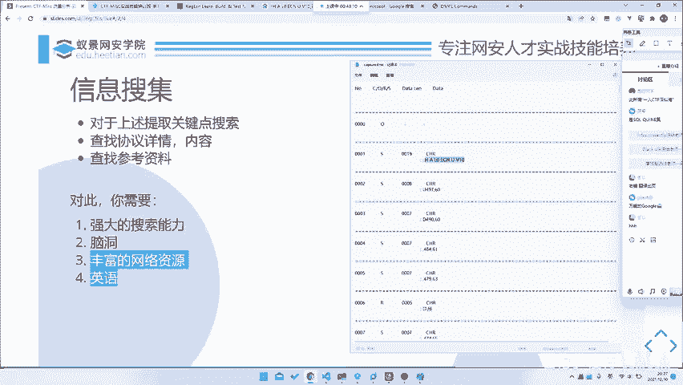

恭喜！通过搜索，我们找到了协议文档。基于这份文档，我们就可以理解数据含义，进而解题了。无论后续是手动分析还是编写脚本，有了文档，题目就相当于解决了一半。这个例子很好地印证了搜索能力、脑洞、网络资源和英语能力的重要性。

## 回归题目：数据处理与绘图 📈

现在，我们回到题目本身，看看如何利用提取和处理后的数据解题。

我们把数据提取出来，根据文档知道了`up`是抬笔，`down`是落笔，其他指令是移动。那么只需要对这些数据进行处理即可。

在数据处理中，我们只关注以逗号开头、或以`up`、`down`开头的指令。提取出这些指令后，就可以进行绘图。

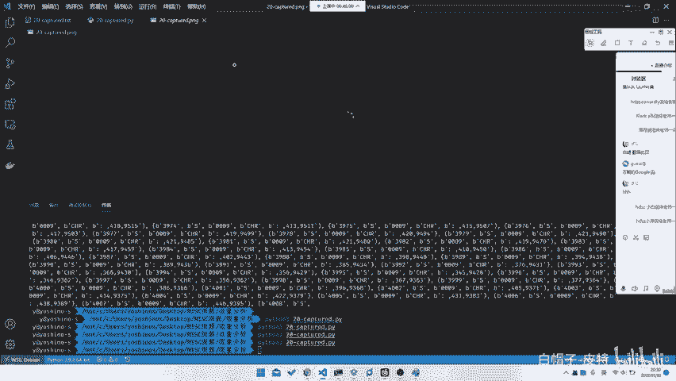

绘图过程很简单。我们甚至可以不严格区分`up`和`down`，只根据坐标点连线来尝试。将提取出的坐标点用绘图库（如matplotlib）画出来。

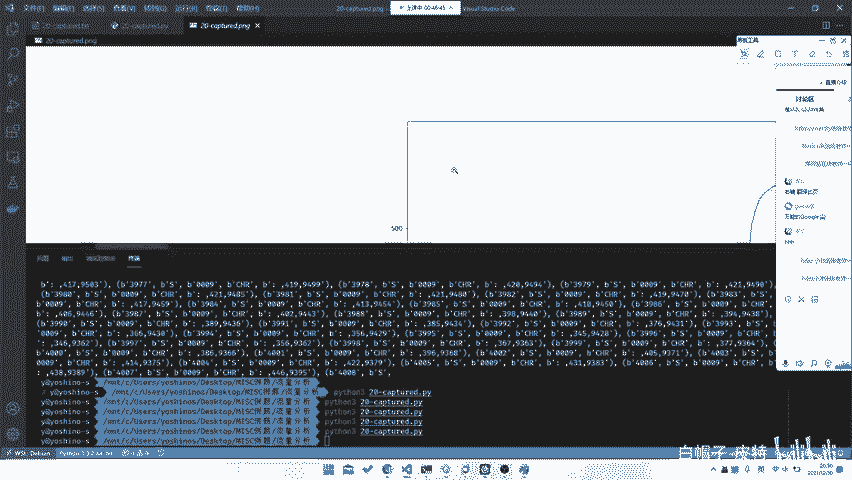

**示例代码思路：**
```python
import matplotlib.pyplot as plt

# 假设 extracted_points 是从数据中提取出的 (x, y) 坐标列表
x_coords = [point[0] for point in extracted_points]
y_coords = [point[1] for point in extracted_points]

plt.plot(x_coords, y_coords)
plt.gca().set_aspect('equal', adjustable='box') # 调整横纵坐标比例，防止图形变形
plt.show()
```

如果直接绘图发现图形是倒的或比例失调，可以调整坐标轴。例如，对Y坐标进行 `600 - y` 的变换来翻转图形。通过调整，我们就能画出一个可识别的图形，比如一个flag：`ACTF{33FB}`。

在这个简单题目中，即使不严格处理`up`/`down`也能画出flag。但如果题目更复杂，比如笔抬起后移动到别处再画，那么理解`up`/`down`指令就至关重要。彻底理解协议文档，能帮助我们应对任何混淆。

## 总结

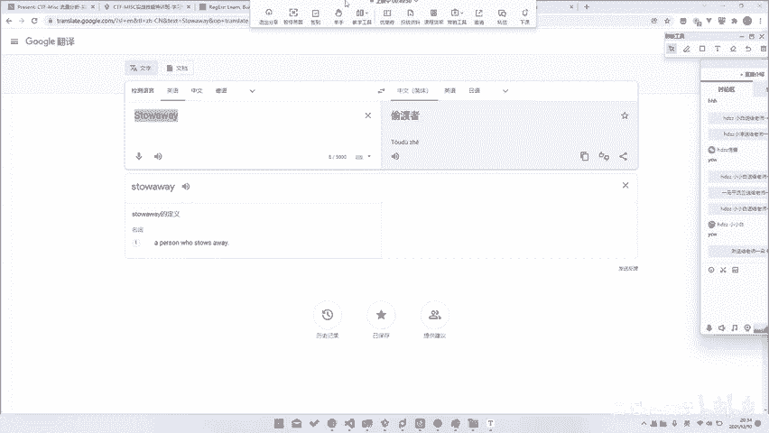

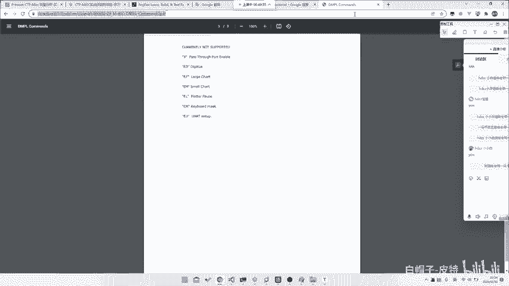

本节课中我们一起学习了CTF-MISC题目解题的三个核心步骤：

1.  **数据初步分析与预处理**：观察数据格式，进行必要的清洗和转换。
2.  **关键点提取**：从数据中找出敏感、变化的部分以及特殊格式的关键词。
3.  **信息搜集**：利用提取出的关键词，通过搜索引擎查找协议文档、类似题目或工具。

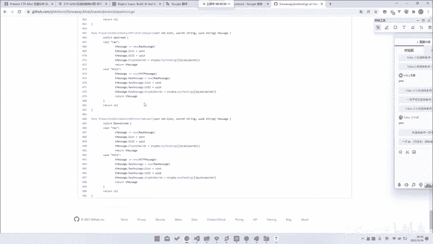

这三个步骤构成了应对大多数MISC题目的通用流程。无论是简单的题目，还是像“冷箭杯”中那种需要逆向复杂协议封装的难题，这个流程都是适用的。关键在于灵活运用观察力、联想力和搜索能力，将原始数据转化为解题的线索。