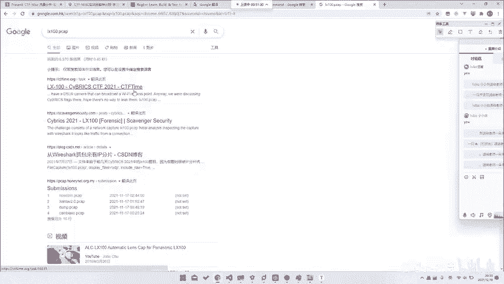
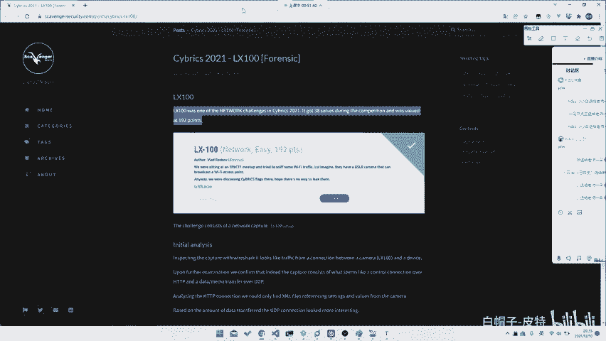
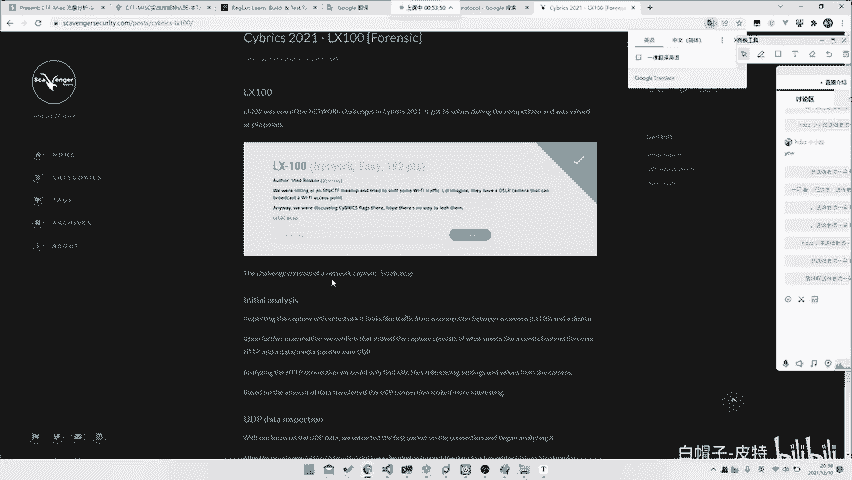
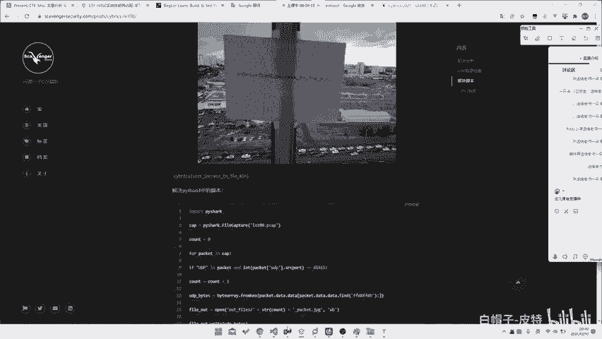
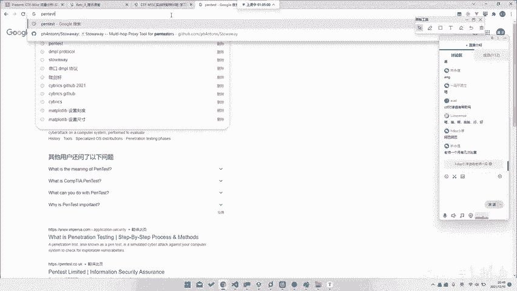

# CTF系列教程：P93：CTF-misc 一些实战分析 🧩





在本节课中，我们将通过一个具体的CTF-misc实战案例，学习流量分析类题目的解题思路。我们将重点探讨如何在没有明确协议信息的情况下，通过基础知识和工具解决问题，并总结Misc类题目的核心能力要求。

## 案例：X10题目分析

上一节我们介绍了流量分析的基础工具，本节中我们来看看一个实战案例。这个案例来自CYBRESES比赛中的一道题目，名为“X10”。


题目提供了一个网络流量包文件。我们不知道其具体的通信协议，甚至不清楚数据来源（例如是某种摄像头或视频流）。但即便如此，我们也有可能解出这道题。



我们的解题思路如下：

以下是解题的核心步骤：
1.  **导出UDP流**：在Wireshark中，将所有UDP协议的数据流导出为原始数据。
2.  **识别文件头**：我们知道JPEG图片的文件头（Magic Number）是 `FF D8`，文件尾通常是 `FF D9`。
3.  **使用foremost自动提取**：将导出的原始数据文件交给 `foremost` 工具进行处理。`foremost` 会自动识别并提取出其中所有完整的JPEG文件。
4.  **查看提取的图片**：在提取出的图片中，即可找到包含flag的图片。

**核心操作代码/命令示例**：
```bash
# 在Wireshark中过滤并导出UDP流数据为 raw.dat
# 然后使用foremost工具分析
foremost -i raw.dat -o output_directory
```

这个方法的巧妙之处在于，我们无需深入分析数据包的结构、传输协议或分包细节。IP层因为数据包过大而进行的**分包**操作，并不会影响 `foremost` 这类工具对文件内容的整体识别和重组。只要数据流中包含了完整的JPEG文件二进制数据，工具就能将其提取出来。

## 解题思路的启示



这道题目看似简单，直接使用工具就能解决，但它仍然考察了参赛者的关键能力。

以下是解出此类题目的关键点：
1.  **将目光聚焦到UDP协议**：在复杂的网络流量中，首先需要判断出关键数据可能通过哪种协议传输。这道题的关键就在于UDP流。
2.  **掌握基础文件特征**：必须知道常见文件格式（如JPEG）的**文件头**和**文件尾**特征。
3.  **善用自动化工具**：了解并熟练使用如 `foremost`、`binwalk` 等用于文件提取和分析的自动化工具。

因此，这道题的预期解法很可能就是不需要复杂分析，直接导出UDP流并用 `foremost` 提取。它考验的是选手能否想到这个“捷径”。

## CTF-misc的核心能力

通过这个案例，我们可以总结出CTF-misc方向，尤其是流量分析类题目，对选手的几点核心能力要求：

以下是成为一名优秀的Misc选手需要具备的三种核心能力：
1.  **强大的脑洞和联想能力**：能够将零散的信息（如协议、端口、数据特征）与可能的知识点或工具联系起来。脑洞对不上，可能就无从下手。
2.  **出色的信息搜索能力**：不可能掌握所有协议和知识。当遇到未知的协议（如某种私有视频流格式）时，需要快速利用搜索引擎（包括英文搜索）找到相关资料或标准文档。
3.  **快速的学习和应用能力**：Misc题目经常涉及生僻协议。你可能需要在极短时间内阅读并理解一份几十页的RFC文档或技术标准，并立即应用来解题。

所以说，Misc的学习不仅仅是积累知识点，更是锻炼一套**解决问题的方法论**。

## 如何有效提升Misc技能

那么，如何系统地提升这些能力呢？单纯刷题看Writeup（题解）可能效果有限。

以下是高效学习Misc的建议路径：
1.  **从实战中学习**：多参加限时比赛，面对全新的、没有现成题解的题目。这个过程能极大锻炼临场分析、搜索和快速学习的能力。
2.  **进行赛后复盘**：对比自己与队友或其他队伍的解法的差异。思考：“为什么他们想到了那个点？”、“我卡在了哪里？”、“下次如何避免？”。总结规律比记住答案更重要。
3.  **构建知识体系**：将遇到过的协议、工具、技巧分门别类地整理，形成自己的知识库。例如，专门总结“文件格式特征”、“常见流量协议分析手法”等。
4.  **寻求交流与指导**：如果条件允许，有一个经验丰富的人带领入门或定期讨论，可以少走很多弯路，更快地建立正确的解题思维。

“授人以鱼不如授人以渔”。掌握高效的学习方法和解题策略，远比死记硬背大量的零散知识点更为重要。我们的课程旨在带大家入门，并分享这些方法论，而真正的成长离不开个人持续的努力、思考与实战锤炼。



本节课中我们一起学习了一个CTF-misc流量分析的实战案例，理解了即使在不清楚协议细节时，利用基础知识和工具也能解题的思路。更重要的是，我们探讨了Misc方向所要求的脑洞、搜索和学习三大核心能力，以及通过实战、复盘和总结来有效提升技能的学习路径。希望这些内容能帮助大家在CTF-Misc的道路上走得更远。