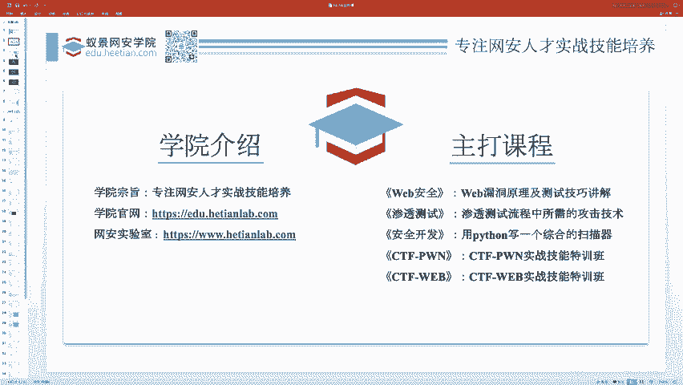
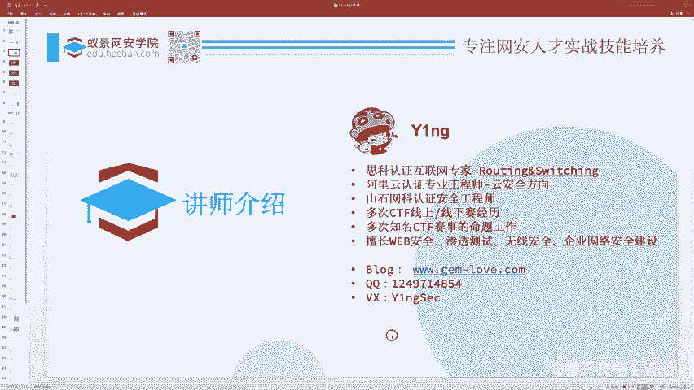
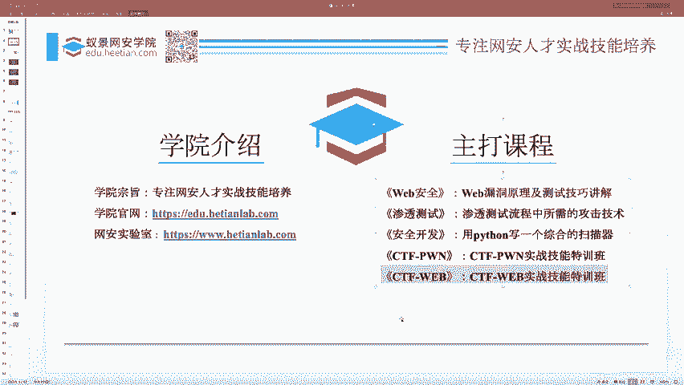
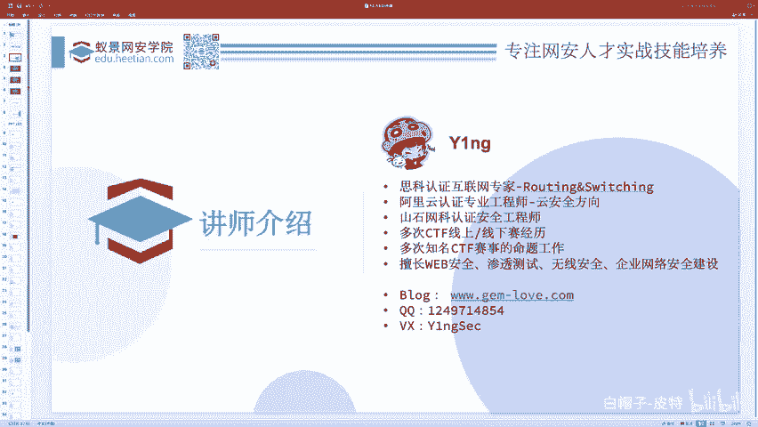
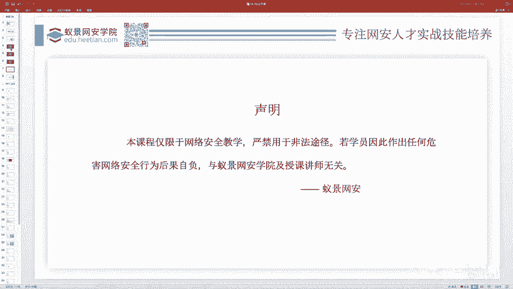
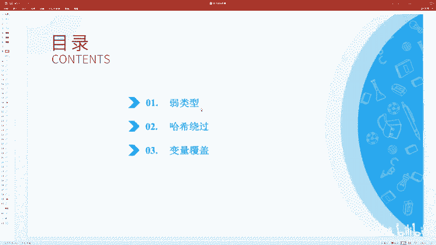

# CTF Web赛事基础：P94：简介及课程类别 🎯

在本节课中，我们将要学习CTF Web赛事的基础知识，并了解本系列课程的整体结构。课程内容设计简单，旨在帮助初学者轻松入门，并掌握一些实用的技巧。

## 学院与讲师介绍

首先，我们来介绍一下本课程的主办学院和讲师。

我们学院专注于网络安全人才实践技能的培养。学院官网和网络安全实验室提供了丰富的学习资源。除了本课程涵盖的CTF Web内容，学院还提供CTF Pwn、Misc等其他方向的课程。

我是本课程为期两天的讲师。我个人主要负责CTF Web实战技能特训班的教学，同时也讲授一些CTF Web相关的公开课。无论您是否报名课程，只要是与CTF、Web安全相关的问题，都欢迎通过我的联系方式进行交流。

**请注意**：课程中涉及的部分技术演示仅用于教学目的，请严格遵守法律法规，切勿用于非法用途，否则后果自负。

## 今日课程目录

接下来，我们来看看今天课程的具体安排。课程内容较为基础，主要面向新手赛或招新赛级别的CTF Web题目。无论水平如何，每个人都需要从这些基础知识开始积累。

以下是今天要讲解的三个核心知识点：
*   **弱类型问题**
*   **哈希绕过问题**
*   **变量覆盖问题**

本节课中，我们一起学习了CTF Web赛事的基础概况、课程来源以及今日的学习要点。这些内容是步入CTF世界的第一步。从下一节开始，我们将深入第一个知识点——弱类型问题。