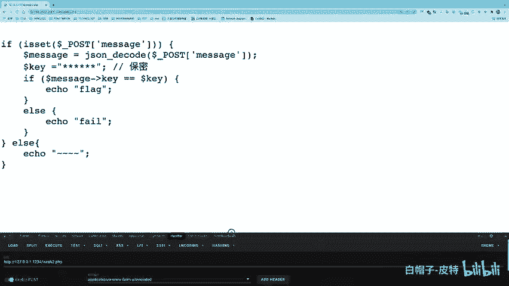
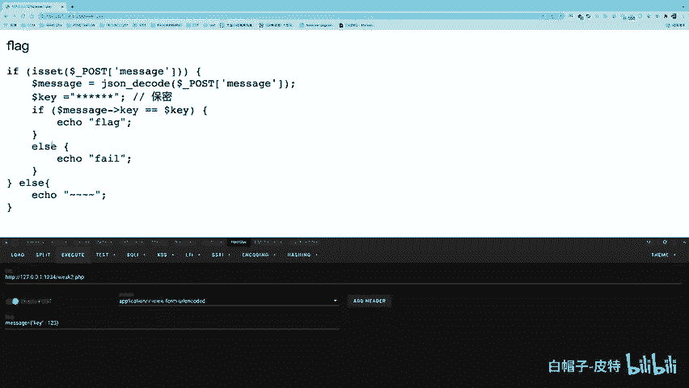
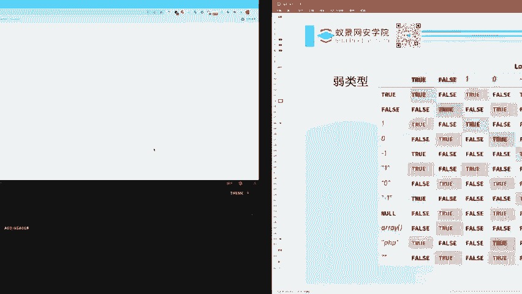

# CTF Web赛事基础：P95：弱类型


在本节课中，我们将要学习PHP语言中的弱类型问题。这是CTF Web方向中一个常见且重要的考点，理解它有助于我们解决许多相关的赛题。

## 概述

PHP语言在CTF Web题目中占有很大比重，其语法相对简单，是新手入门的良好选择。本节课的核心是理解PHP中“弱类型”比较的机制，以及开发者如何因不当使用此特性而引入安全漏洞。

## 弱类型比较的原理

上一节我们概述了课程目标，本节中我们来看看PHP中两种不同的比较运算符。

在PHP中，判断两个值是否相等有两种方式：
*   **严格比较（`===`）**：会同时比较值的类型和内容。
*   **松散比较（`==`）**：即弱类型比较，会先尝试进行类型转换，再比较内容。

松散比较的设计初衷是为了方便开发者编写代码，例如在条件判断中，数字`1`和布尔值`true`都可以表示“真”。但如果使用不当，这种“便利”就会导致安全问题，因为本不相同的值可能被判断为相等。

以下是两种比较的示例：
```php
var_dump(1 == true);   // 输出: bool(true)
var_dump(1 === true);  // 输出: bool(false)
```
第一个比较中，整数`1`和布尔`true`被判断为相等。第二个严格比较则判断它们不相等。

## 字符串与数字的弱类型比较

理解了基本概念后，我们深入探讨最常见的场景：字符串与数字的弱类型比较。

当使用`==`进行比较时，如果涉及数字和字符串，PHP会尝试将字符串转换为数值，再进行比较。

字符串转换为数值的规则如下：
1.  从字符串左侧开始读取。
2.  如果第一个字符不是数字，则转换结果为`0`。
3.  如果遇到数字，则继续读取直到遇见非数字字符为止，取这部分数字作为转换结果。

以下是应用此规则的示例：
```php
var_dump("admin" == 0);        // 输出: bool(true)，"admin"转数字为0
var_dump("1admin" == 1);       // 输出: bool(true)，"1admin"转数字为1
var_dump("admin1" == 0);       // 输出: bool(true)，"admin1"转数字为0
var_dump("admin1" == 1);       // 输出: bool(false)，"admin1"转数字为0，0不等于1
```
此外，对于科学计数法形式的字符串（如`"0e123"`），即使两边都是字符串，在弱比较时也会被当作数字处理：
```php
var_dump("0e123" == "0e456"); // 输出: bool(true)，两者都被当作0*10^n，结果均为0
```

## 实战演练：弱类型漏洞利用

掌握了理论，本节我们通过一道CTF题目来实践如何利用弱类型漏洞。

假设我们拿到以下PHP源码：
```php
$key = "某个未知的字符串"; // 实际题目中$key的值是隐藏的
$data = json_decode($_POST['message']);
if ($data->key == $key) {
    echo "flag{this_is_flag}";
} else {
    echo "Fail";
}
```
题目要求我们提交一个JSON格式的`message`参数，使其解码后对象的`key`属性值与一个未知的`$key`相等（使用`==`比较），才能获得flag。


**解题思路如下：**
1.  由于是比较是弱类型`==`，且`$key`是字符串，我们可以构造一个数字与它比较。
2.  根据字符串转数字规则，如果`$key`不是以数字开头，其转换结果将为`0`。
3.  因此，我们提交JSON数据，让`key`属性的值为数字`0`。

构造Payload并发送请求：
```
POST /challenge.php HTTP/1.1
...
message={"key":0}
```
如果服务器返回flag，说明`$key`确实不是以数字开头，我们利用成功。

## 进阶：爆破未知值

上一节我们解决了一个简单情况，但如果`$key`恰好以数字开头呢？本节中我们来看看应对方法。

假设同样的题目，我们提交`{"key":0}`后返回`Fail`，说明`$key`字符串以数字开头（例如`"123secret"`）。

此时，我们可以采用爆破的方法。因为`$key`转换后的数字是有限的（例如，`"123secret"`转数字为`123`），我们可以遍历可能的数字来碰撞出正确值。

以下是使用Python进行爆破的示例脚本：
```python
import requests

url = "http://target.com/challenge.php"
for i in range(1000):  # 假设数字在0-999之间
    data = {"message": f'{{"key":{i}}}'}
    r = requests.post(url, data=data)
    if "flag" in r.text:
        print(f"Found key: {i}")
        print(r.text)
        break
```
通过脚本，我们可以快速尝试`key`从0开始递增的数字，直到匹配成功，获取flag。



## 弱类型比较对照表

最后，我们通过一张表格来总结PHP中松散比较(`==`)的常见结果。下表展示了不同类型值之间使用`==`比较时，结果为`true`的情况（对角线是自身比较，必然为true）。

| 类型 | 与`true`比较 | 与`false`比较 | 与`1`比较 | 与`0`比较 | 与`"1"`比较 | 与`"0"`比较 | 与`"php"`比较 |
| :--- | :--- | :--- | :--- | :--- | :--- | :--- | :--- |
| **`true`** | **true** | false | true | false | true | false | false |
| **`false`** | false | **true** | false | true | false | true | true |
| **`1`** | true | false | **true** | false | true | false | false |
| **`0`** | false | true | false | **true** | false | true | true |
| **`"1"`** | true | false | true | false | **true** | false | false |
| **`"0"`** | false | true | false | true | false | **true** | false |
| **`"php"`** | false | true | false | true | false | false | **true** |




> **注意**：此表仅为部分常见情况的简化示例。实际利用时，需要结合具体的转换规则进行分析。




## 总结

本节课中我们一起学习了PHP弱类型漏洞。
*   我们理解了PHP中严格比较(`===`)与松散比较(`==`)的区别。
*   我们掌握了字符串在与数字进行弱类型比较时的转换规则。
*   我们通过实战题目，学会了如何利用`0`或科学计数法字符串`"0e123"`等特性绕过弱类型比较。
*   对于更复杂的情况，我们学会了使用爆破方法来穷举可能的正确值。
弱类型问题是CTF Web基础中的关键知识点，熟练掌握它能为解决更复杂的题目打下坚实基础。