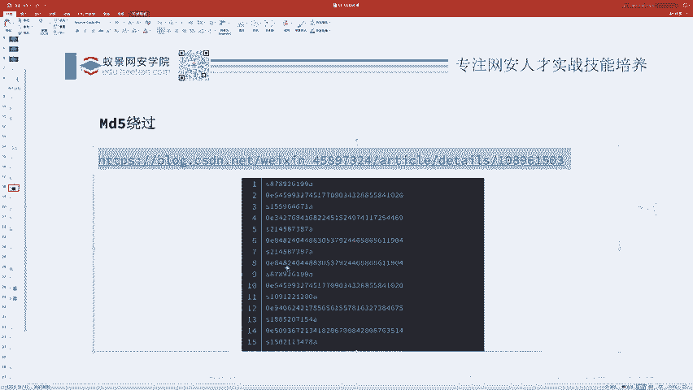
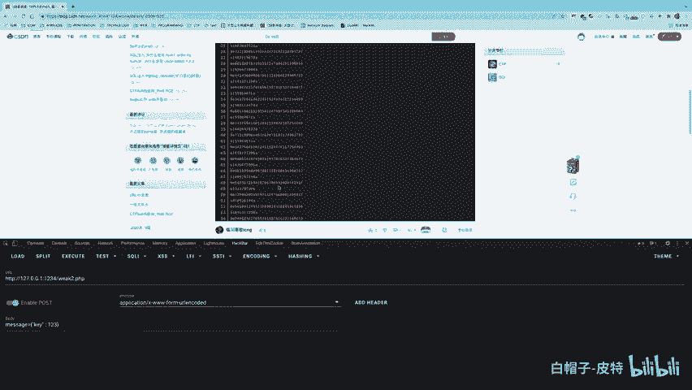
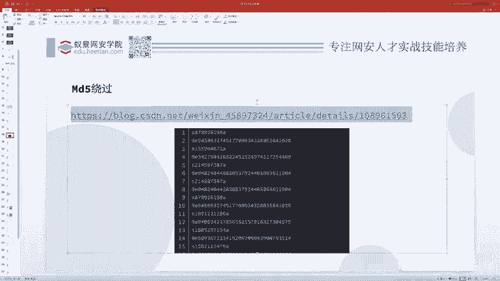
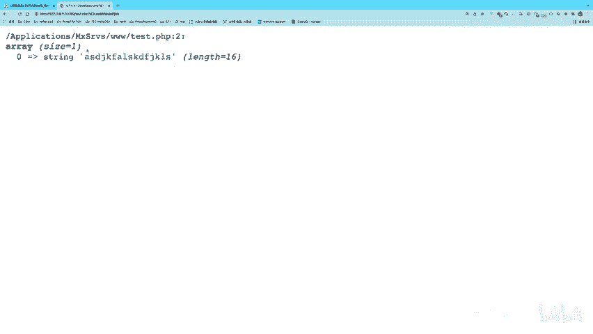
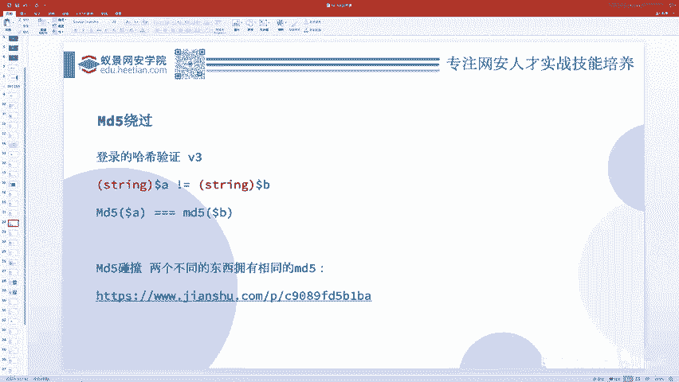
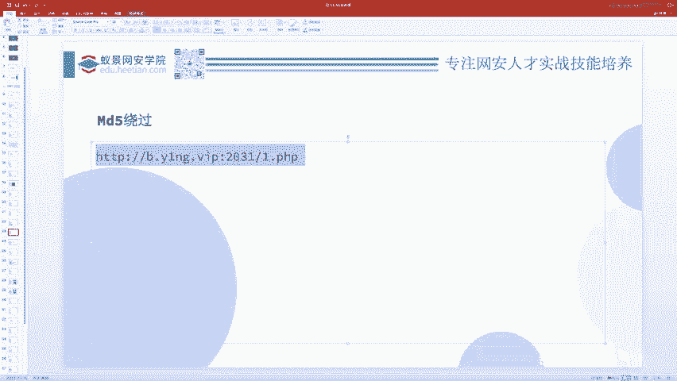
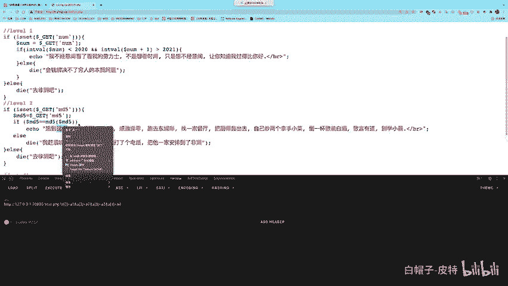

# CTF入门教程：P96：CTF web赛事基础 - 哈希绕过问题 🧩

在本节课中，我们将要学习CTF Web赛事中一个经典且重要的知识点——哈希绕过问题。我们将以MD5为例，深入探讨如何利用PHP的弱类型特性、数组以及哈希碰撞来绕过哈希值的相等性检查。

哈希绕过问题本质上是弱类型问题的一个应用与延伸。理解了弱类型，哈希绕过问题就迎刃而解。

---

## 问题场景与核心思路

假设我们遇到一个题目，要求用户提交两个变量 `$a` 和 `$b`。代码逻辑如下：
1.  `$a` 和 `$b` 的值不能相等。
2.  但 `md5($a)` 和 `md5($b)` 的值必须相等。

这通常意味着我们需要找到两个不同的输入，使它们的MD5哈希值在某种比较条件下相等。根据比较条件的不同，我们有三种主要的绕过方法。

---

## 方法一：利用弱类型与科学计数法（弱相等）

当代码使用**弱相等**（`==`）比较两个MD5值时，我们可以利用PHP的弱类型特性。




上一节我们介绍了弱类型问题，本节中我们来看看如何将其应用于MD5绕过。





在PHP中，`==` 运算符在进行比较前会尝试进行类型转换。如果一个字符串以 `0e` 开头，后面全是数字，PHP会将其视为科学计数法（即0的多少次方），其值会被转换为数字 `0`。

因此，如果我们能找到两个不同的字符串，它们的MD5值恰好都是 `0e` 开头后面跟纯数字的形式，那么 `md5($a) == md5($b)` 的结果将为 `true`，因为两者都被转换为数字 `0`。

以下是满足条件的字符串示例：
*   **字符串**：`240610708`
    *   **MD5值**：`0e462097431906509019562988736854`
*   **字符串**：`QNKCDZO`
    *   **MD5值**：`0e830400451993494058024219903391`

**核心公式/代码描述**：
```php
// 条件检查
if ($a != $b && md5($a) == md5($b)) {
    // 绕过成功
}
// 示例值
$a = “240610708”; // md5($a) = “0e462097431906509019562988736854”
$b = “QNKCDZO”;   // md5($b) = “0e830400451993494058024219903391”
// 比较时，两个MD5字符串都被转换为数字0，因此 0 == 0 成立。
```

网络上存在许多这类“魔术字符串”，在解题时可以直接使用。

---

## 方法二：利用数组绕过（强相等）

当代码升级为使用**强相等**（`===`）来比较MD5值时，科学计数法的方法将失效，因为 `===` 要求值和类型都完全相同。



此时，我们可以利用**数组**进行绕过。

以下是其原理：
PHP的 `md5()` 函数期望接收一个字符串参数。如果传入一个数组，函数会产生一个警告（Warning），但会继续执行并返回 `NULL`。

因此，如果我们传入 `$a` 和 `$b` 都是数组（即使数组内容不同），`md5($a)` 和 `md5($b)` 的结果都会是 `NULL`。那么 `NULL === NULL` 的比较结果就是 `true`。

**核心代码描述**：
```php
// 条件检查
if ($a != $b && md5($a) === md5($b)) {
    // 绕过成功
}
// 通过URL传递数组参数
// 例如：?a[]=1&b[]=2
// 此时，md5($a) 和 md5($b) 都返回 NULL，满足强相等。
```

**如何通过URL传递数组参数？**
在Web题目中，我们通常通过GET或POST方法传参。以下是传递数组的方法：
*   基础数组：`?a[]=value`
*   指定键名：`?a[key]=value`
*   多个元素：`?a[]=first&a[]=second`

一个有趣的进阶应用是控制数组的键顺序。例如，题目可能检查 `$a[0]` 和 `$a[1]`，但实际拼接执行的却是数组的前两个元素。我们可以通过 `?a[2]=payload&a[3]=payload&a[0]=1&a[1]=2` 这样的传参方式，让前两个元素（`$a[2]` 和 `$a[3]`）成为我们可控的载荷，从而绕过对 `$a[0]` 和 `$a[1]` 的严格检查。

---

## 方法三：MD5哈希碰撞（强相等且要求字符串）

如果题目要求输入必须是字符串（不能是数组），并且使用强相等比较，那么前两种方法都无效。


此时，唯一的办法是进行真正的 **MD5哈希碰撞**，即找到两个**不同的**字符串，它们计算出的MD5哈希值**完全相同**。



MD5算法已被证明存在碰撞漏洞，这意味着确实存在这样的两个不同输入对应同一个MD5输出。在实践中，我们可以使用研究者已经公开的碰撞实例，或者利用工具生成碰撞对。


**核心概念**：
寻找两个不同的明文 `M1` 和 `M2`，使得：
`md5(M1) == md5(M2)` 并且 `M1 != M2`
这利用了MD5算法的密码学弱点。

---



## 实战例题解析：不要被变量名迷惑

最后，我们分析一个容易让人困惑的例题，它综合运用了以上知识。



题目代码如下：
```php
$md5 = $_GET[‘md5’];
if ($md5 != md5($md5)) {
    die(“不对哦！”);
}
echo “成功！”;
```
题目要求：传入一个值 `$md5`，使得 `$md5 != md5($md5)` 不成立，即让 `$md5 == md5($md5)` 成立。

**解题关键**：不要被变量名 `$md5` 误导！它只是一个普通的变量，里面存放的是一个字符串，并不要求这个字符串本身是一个MD5哈希值。

我们可以将问题重写为更清晰的形式：寻找一个字符串 `$a`，使得 `$a == md5($a)`。

这正好回到了我们**方法一**讨论的场景。我们需要找一个字符串，它的MD5值是其本身的“0e纯数字”形式。例如：
*   **字符串**：`0e215962017`
*   **MD5值**：`0e291242476940776845150308577824`

计算 `md5(“0e215962017”)` 得到 `“0e291242476940776845150308577824”`。在弱比较（`==`）下，两者都被转换为数字 `0`，因此相等，绕过成功。

---

## 总结 🎯

本节课中我们一起学习了CTF Web中哈希绕过的三种核心方法：
1.  **弱类型绕过**：利用 `0e` 开头的科学计数法字符串，使它们在弱相等比较时都等于0。
2.  **数组绕过**：通过向 `md5()` 函数传入数组，使其返回 `NULL`，从而满足强相等比较。
3.  **哈希碰撞**：当输入被限制为字符串且使用强相等时，寻找或生成具有相同MD5值的两个不同字符串。


理解这些方法的本质——PHP的类型转换、函数特性及MD5算法的弱点——是灵活应对各类变种题目的关键。记住，解题时需仔细审题，明确比较方式（`==` 还是 `===`）和对输入类型的限制，从而选择正确的绕过路径。