# CTF Web赛事基础：P97：远程代码执行与命令执行 🚀


## 概述
在本节课中，我们将学习CTF Web方向中两个重要的漏洞类型：**命令执行**与**远程代码执行**。我们将了解它们的基本概念、产生原因、利用方式以及相关的权限问题，并通过简单的例子帮助初学者理解。

---

## 命令执行漏洞

上一节我们概述了本课程的内容，本节中我们来看看**命令执行漏洞**。

命令执行是一种攻击，其目标是通过存在漏洞的应用程序，在主机操作系统上执行任意命令。漏洞的本质在于应用程序能够执行操作系统的命令。

### 漏洞产生原因
漏洞的产生通常是因为应用程序需要调用外部程序处理某些内容，从而使用了执行系统命令的函数。

例如，在PHP中，开发者可能使用 `system()` 函数来执行 `mkdir` 命令创建目录。如果命令中的参数（如目录名）完全由开发者硬编码，则不存在风险。但如果参数的一部分由用户输入控制，则可能产生漏洞。

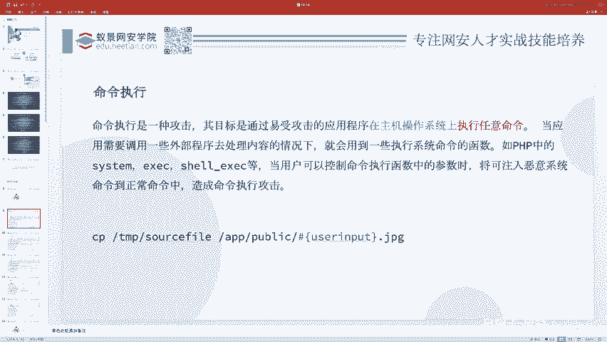

**核心概念示例：**
```php
// 安全示例：命令参数固定
system('mkdir abc');

// 危险示例：命令参数部分用户可控
$username = $_GET['username']; // 用户输入
system('mkdir ' . $username);
```
在危险示例中，如果用户输入 `abc; cat /flag`，最终执行的命令将变为 `mkdir abc; cat /flag`。分号 `;` 在Linux中用于分隔命令，从而导致除了创建目录外，还执行了读取flag文件的命令。

### 命令执行的条件
命令注入漏洞的发生需要满足两个条件：
1.  应用程序使用了可以执行系统命令的函数。
2.  执行的命令或其参数是用户可控的，例如通过GET/POST参数传入。

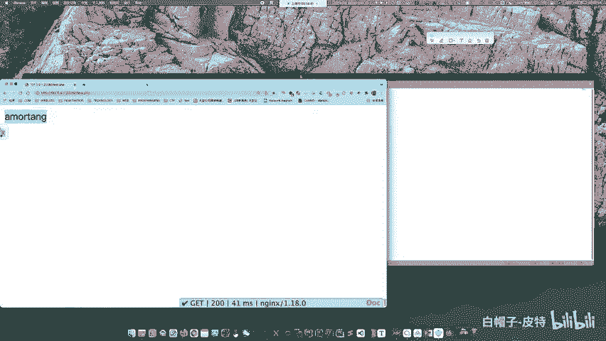

### 执行权限问题
执行系统命令的身份是运行Web服务的用户（如 `www-data`），而非最高权限的 `root` 用户。这意味着攻击者能执行的操作受该用户权限的限制。

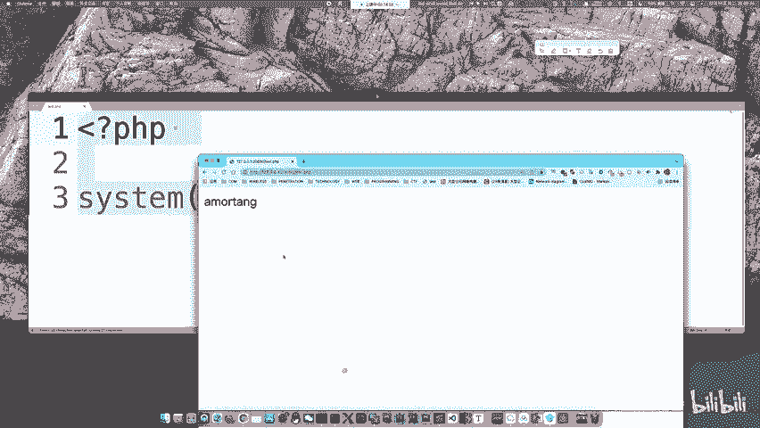

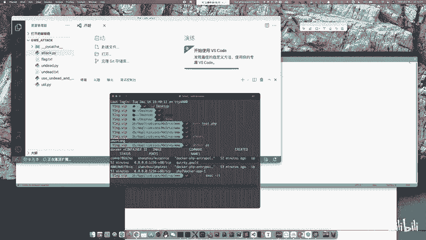

**权限检查示例：**
在终端中执行 `whoami` 命令可以查看当前用户。Web应用执行的命令通常以 `www-data` 用户身份运行，该用户一般无法执行关机、删除系统文件等高危操作，但可以读取文件、在可写目录创建文件，危害依然很大。

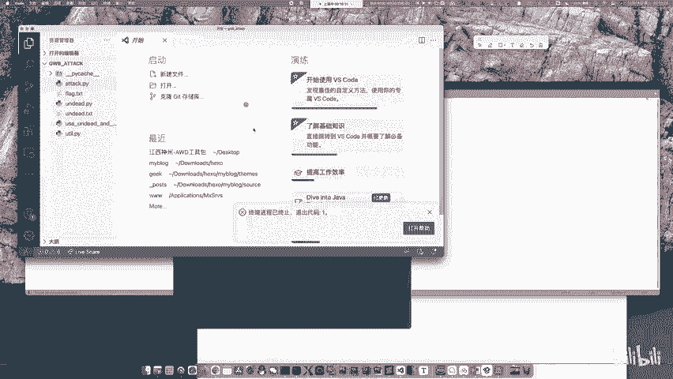

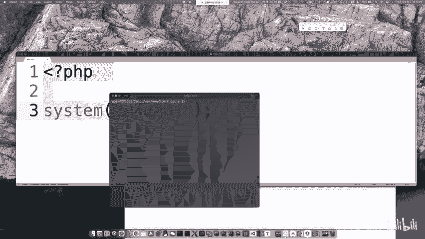

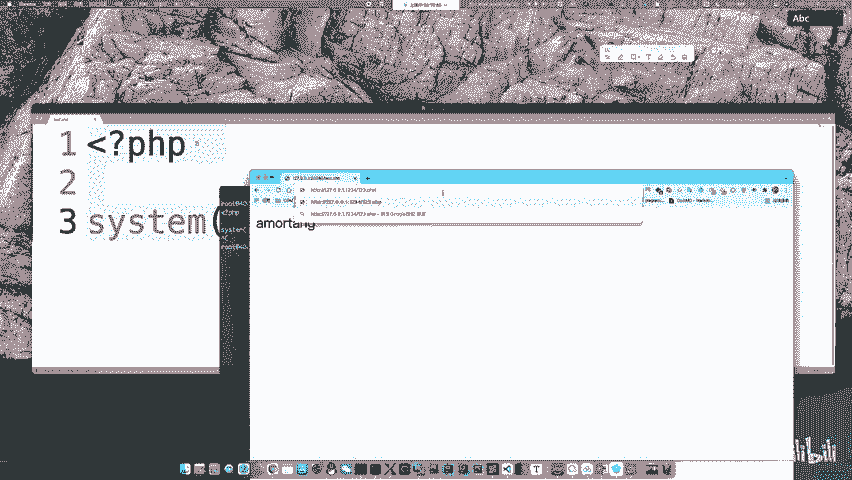

---

## 远程代码执行漏洞


了解了命令执行后，我们来看看另一种类型：**远程代码执行**。

远程代码执行是指攻击者能够使应用程序执行其注入的任意代码（如PHP代码），而不仅仅是系统命令。

### 相关危险函数
以下是PHP中一些常见的危险函数，遇到时需要警惕：

**代码执行类函数：**
*   `eval()`： 将字符串作为PHP代码执行。
*   `assert()`： 检查断言，在特定条件下也可执行代码。
*   `preg_replace()` + `/e`修饰符： 在较老版本PHP中，可导致代码执行。
*   `create_function()`： 创建匿名函数。
*   `array_map()`： 为数组每个元素应用回调函数。
*   `call_user_func()` / `call_user_func_array()`： 调用回调函数。

**命令执行类函数：**
*   `system()`： 执行外部程序并显示输出。
*   `exec()`： 执行外部程序。
*   `shell_exec()`： 通过shell执行命令。
*   `passthru()`： 执行外部程序并显示原始输出。
*   `popen()` / `proc_open()`： 打开进程文件指针。
*   **反引号 `` ` ``**： 是`shell_exec()`的别名，同样用于执行命令。

---

## 漏洞利用实例

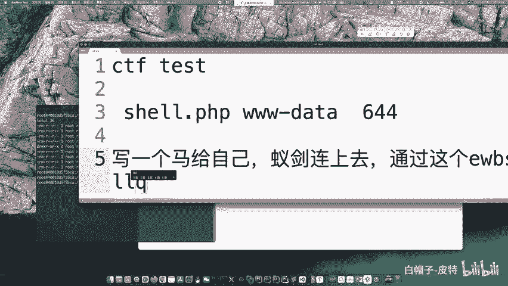

理论需要结合实际，下面我们通过一个简单的实例来看如何利用命令注入漏洞。

假设存在以下PHP代码片段：
```php
<?php
if (isset($_GET['ip'])) {
    $ip = $_GET['ip'];
    system('ping -c 4 ' . $ip);
} else {
    highlight_file(__FILE__);
}
?>
```
这段代码接收一个`ip`参数，并将其拼接到`ping -c 4`命令后执行，用于ping用户指定的地址。

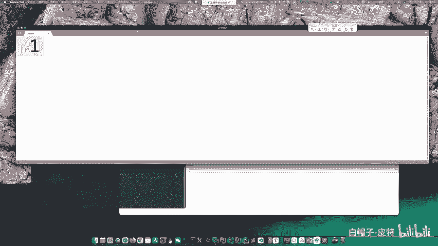

### 漏洞利用
由于参数`$ip`未经任何过滤就直接拼接进命令，攻击者可以注入额外的命令。

**正常输入：**
```
http://target.com/vuln.php?ip=127.0.0.1
```
执行命令：`ping -c 4 127.0.0.1`

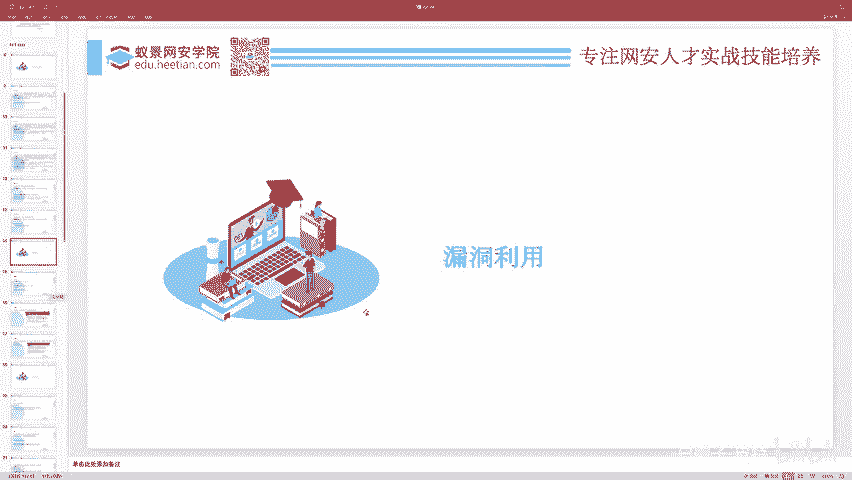

**恶意输入：**
```
http://target.com/vuln.php?ip=127.0.0.1; ls -l
```
执行命令：`ping -c 4 127.0.0.1; ls -l`
这里的分号`;`使得系统在执行完ping命令后，继续执行`ls -l`命令，从而列出当前目录下的文件。

---

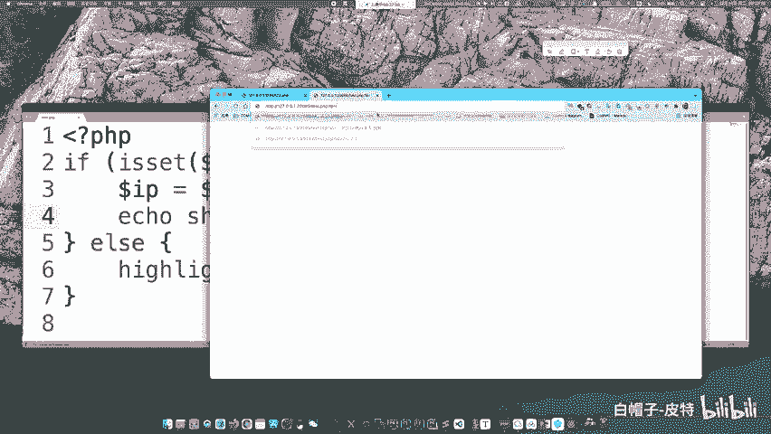

## 总结

本节课我们一起学习了CTF Web中的两个基础漏洞：
1.  **命令执行**： 攻击者能够注入并执行非预期的系统命令。关键在于存在执行命令的函数且参数用户可控。
2.  **远程代码执行**： 攻击者能够注入并执行任意应用程序代码（如PHP），危害通常更大。需要关注`eval()`等危险函数。
3.  **权限认知**： 理解命令执行时的上下文权限（如`www-data`用户）对于评估漏洞影响至关重要。
4.  **简单利用**： 通过命令分隔符（如`;`、`&&`、`|`）将恶意命令拼接到正常参数中，是常见的利用手段。

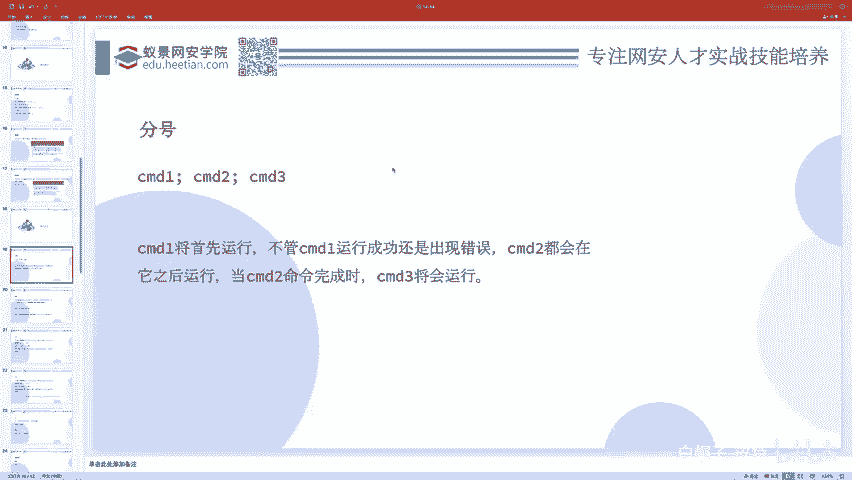

对于初学者而言，识别代码中是否存在未过滤的用户输入与危险函数结合的情况，是发现这类漏洞的第一步。