# 软件逆向安全：01：易语言软件作者如何利用Themida保护软件

在本节课中，我们将学习易语言软件作者如何使用Themida保护壳来增强软件的安全性，防止被轻易破解。我们将从攻击者的视角分析未保护程序的脆弱性，然后逐步讲解如何通过源代码层面添加保护和利用Themida进行混淆，从而显著增加破解难度。

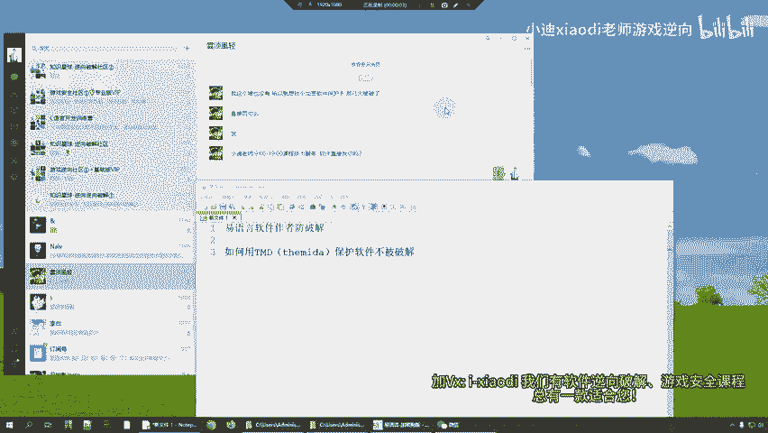

## 未保护程序的脆弱性分析

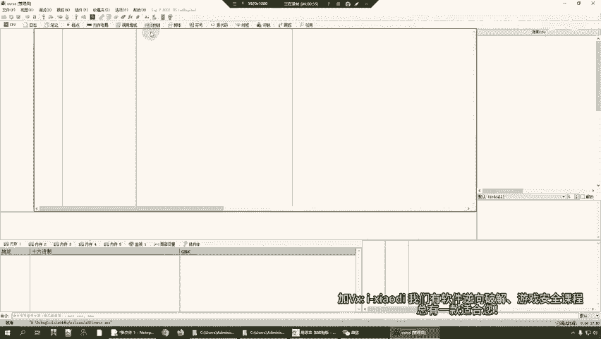

上一节我们介绍了课程目标，本节中我们来看看一个未受保护的易语言程序在攻击者面前是多么脆弱。

首先，我们分析一个未加保护的程序。攻击者通常会使用调试工具（如OD或x64dbg）进行分析。以下是攻击者可能采取的步骤：

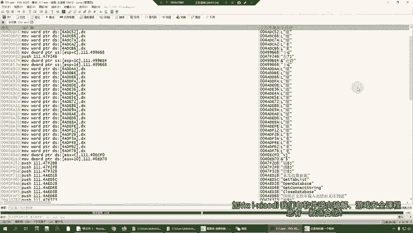

1.  **运行并附加程序**：攻击者运行目标程序，然后使用调试工具的“附加”功能连接到该进程。
2.  **查看字符串与代码**：附加成功后，程序模块中的字符串（如“功能启动成功”、“登录成功”等）会一览无余。攻击者可以通过搜索字符串快速定位到关键代码段。
3.  **定位与修改代码**：双击找到的字符串，调试器会跳转到对应的代码位置。攻击者可以在函数头部下断点，通过单步执行分析程序逻辑。更危险的是，攻击者可以直接修改这些字符串或附近的代码。例如，将“功能启动成功”修改为任意其他文本，程序执行时就会显示被篡改后的信息。

这个过程表明，未受保护的软件其内部逻辑和关键信息对攻击者是完全透明的，可以轻易被分析和篡改。

## 受保护程序的效果对比

了解了未保护程序的危险后，我们来看看经过Themida保护后的程序会有何不同。

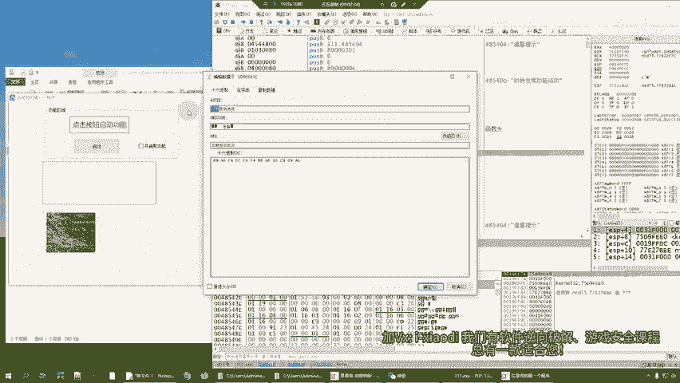

当攻击者尝试分析一个受Themida保护的程序时，会遇到以下困难：

1.  **代码不可读**：在调试器中，原本清晰的函数头部和逻辑代码会变成难以理解的数据或乱码，无法直接进行静态分析。
2.  **字符串被隐藏**：使用调试器搜索当前模块的字符串时，可能一无所获，关键信息已被隐藏或加密。
3.  **分析受阻**：由于无法看到清晰的代码逻辑和字符串提示，攻击者难以定位核心功能代码，从而大大增加了动态分析和修改的难度。

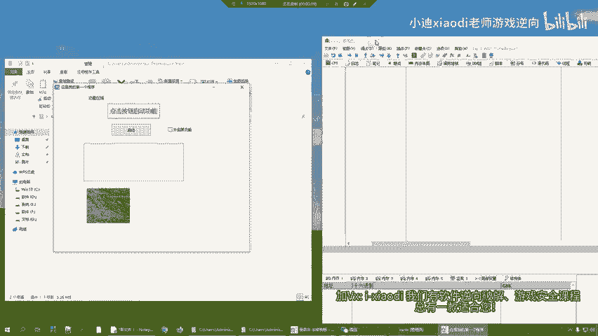

这种保护直接从心理和技术层面给初级攻击者制造了巨大障碍。

## 实施保护：源代码层面准备

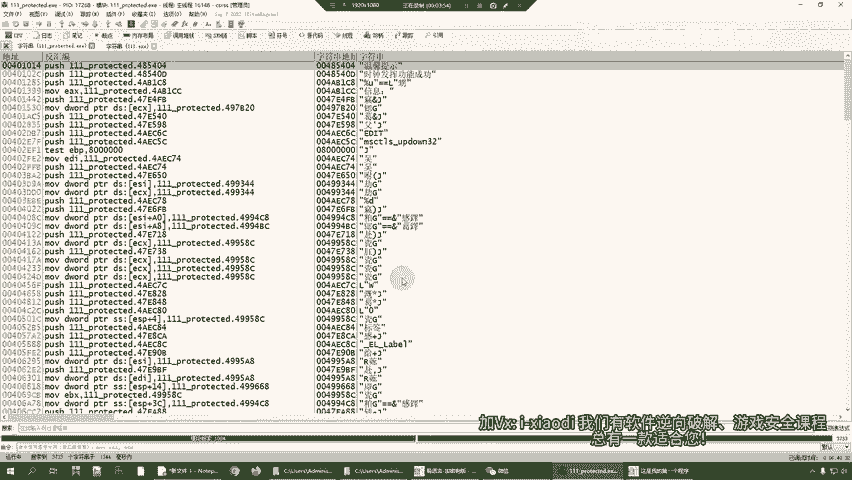

上一节我们看到了保护的效果，本节中我们来看看如何实现它。由于我们是软件作者，拥有源代码，因此可以从源头进行加固。

保护的核心是在需要保护的函数头部和尾部插入特定的机器码指令，这些指令是Themida保护壳的识别标记。

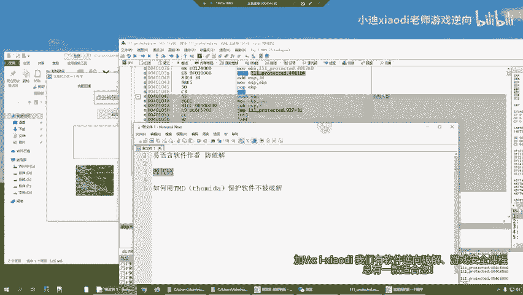

以下是操作步骤：

1.  在易语言源代码中，定位到需要保护的功能函数（例如按钮点击事件）。
2.  在该函数的**开头**插入以下置入代码：
    ```assembly
    置入代码 ({ 235, 16, 86, 77, 80, 114, 111, 116, 101, 99, 116, 32, 98, 101, 103, 105, 110, 0 })
    ```
3.  在该函数的**结尾**插入以下置入代码：
    ```assembly
    置入代码 ({ 235, 14, 86, 77, 80, 114, 111, 116, 101, 99, 116, 32, 101, 110, 100, 0 })
    ```
4.  静态编译源代码，生成可执行文件（例如 `protected.exe`）。

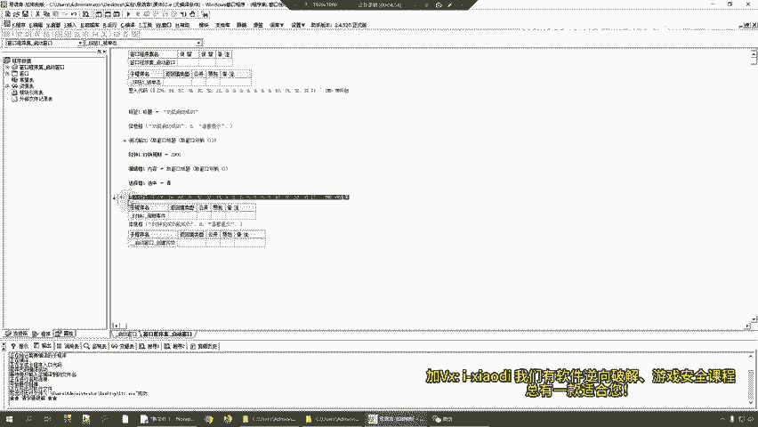

**代码说明**：这两段置入代码是告诉Themida保护壳的标记，`VMProtect begin` 和 `VMProtect end` 的十六进制形式，用于划定需要混淆保护的代码范围。

## 实施保护：使用Themida进行加壳

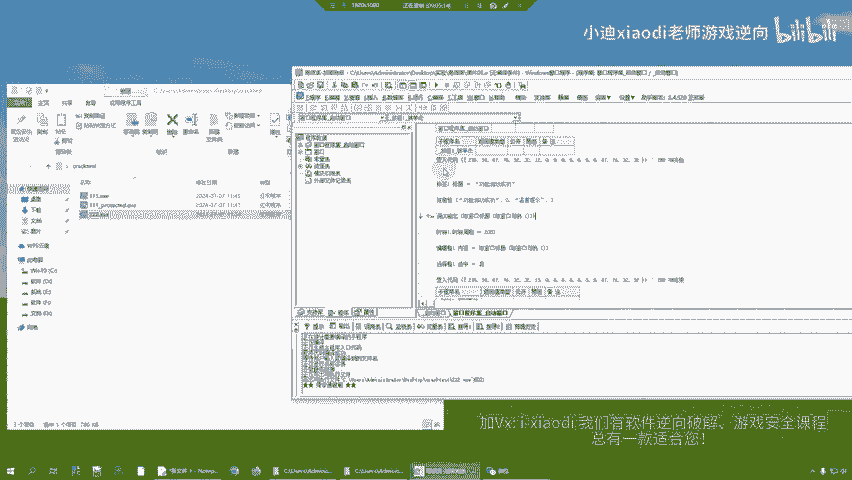

在源代码中做好标记后，下一步就是使用Themida保护壳对编译好的程序进行加固处理。

以下是操作流程：

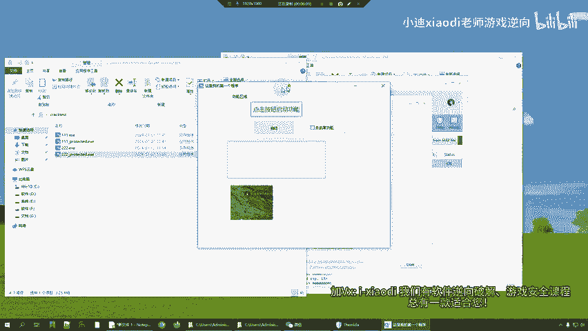

1.  运行Themida保护壳工具。
2.  将上一步生成的程序文件（如 `protected.exe`）直接拖入Themida窗口。
3.  在保护选项中，勾选关键的保护功能（通常包括反调试、代码虚拟化等）。确保 `Protection Macros` 选项识别到了我们代码中插入的标记（显示为 `VM` 或 `OK`）。
4.  点击 `Protect` 按钮开始加壳过程。Themida会对标记的代码段进行虚拟化混淆。
5.  处理完成后，会生成一个新的、受保护的可执行文件。

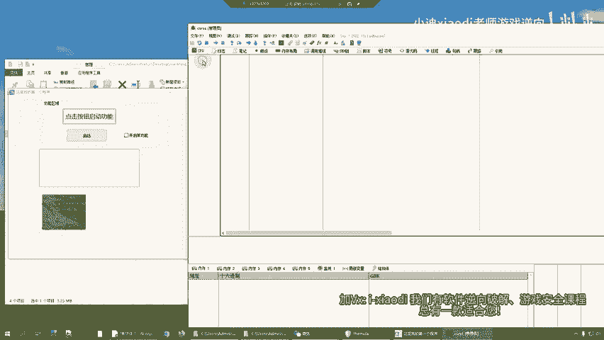

此时，运行这个新程序，功能应保持正常，但使用调试器分析时会发现代码已被有效混淆。

## 扩展保护范围

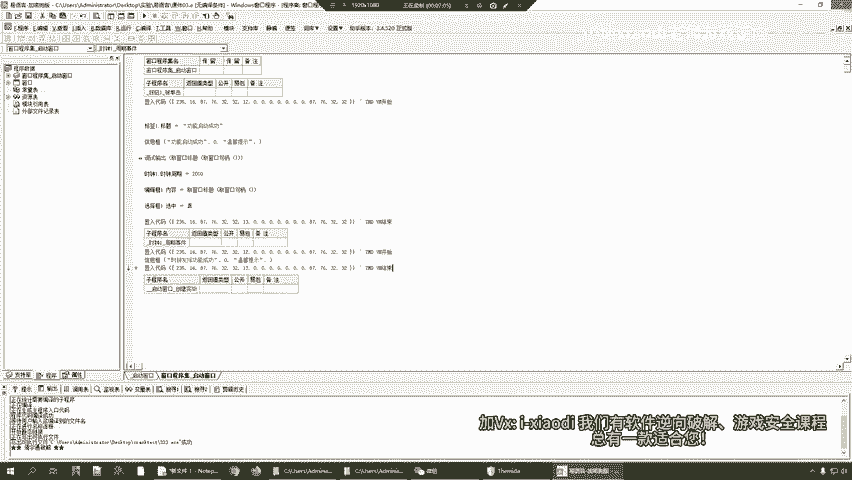

如果你想保护程序中的多个函数（例如，一个启动函数和一个验证函数），方法是一样的。

在每一个需要保护的函数的头部和尾部，都插入上述两段置入代码标记。然后使用Themida重新加壳，它就会识别并混淆所有被标记的代码区域，从而扩大保护范围。

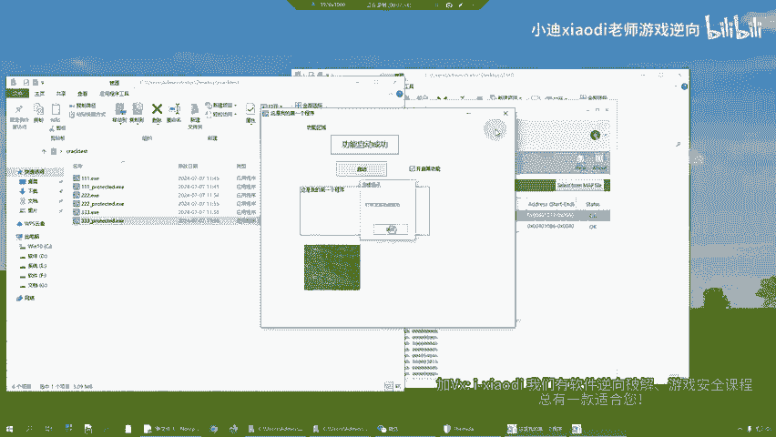

## 总结与注意事项

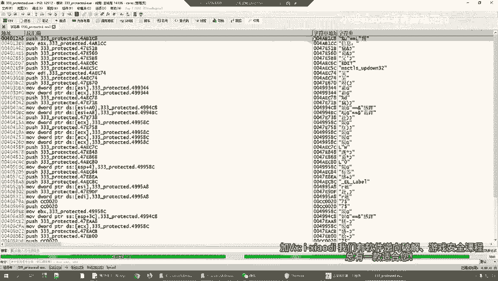

本节课中我们一起学习了易语言软件作者利用Themida进行软件保护的基本流程。

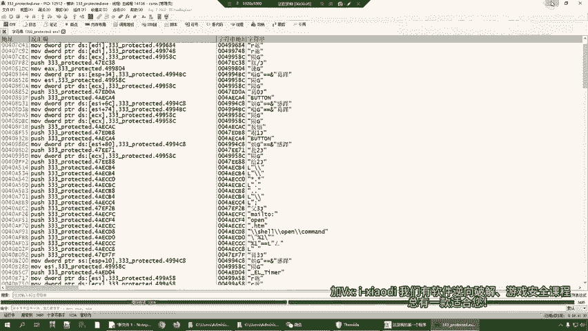

我们首先分析了未保护程序易被破解的原因，然后对比了受保护程序的效果。接着，我们分两步完成了保护操作：一是在源代码的关键函数插入识别标记；二是使用Themida工具对程序进行加壳混淆。

**重要提示**：
*   软件安全是相对的，没有绝对无法破解的程序。Themida这类高强度保护壳的主要作用是**极大提高破解门槛**，能够有效抵御大多数初级和中级攻击者。
*   此方法主要针对本地静态和动态分析进行防护。
*   对于高级攻击者，可能需要结合其他安全策略（如服务器验证、代码混淆、定期更新等）来构建更全面的防御体系。

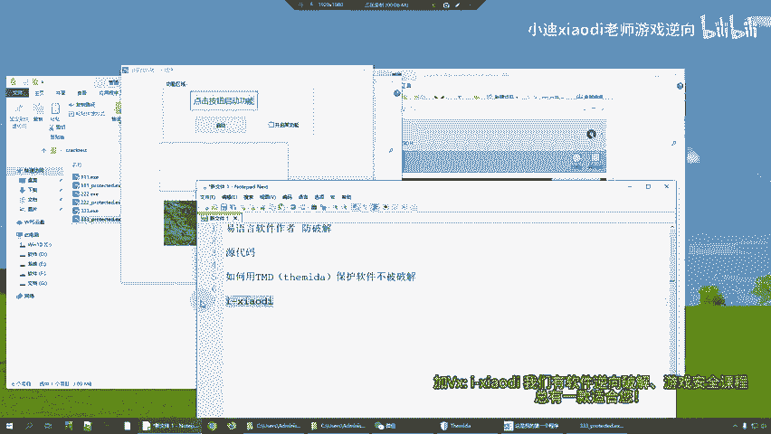

通过本教程介绍的方法，你可以为你的易语言软件增加一层有力的防护，保护自己的劳动成果。