# Kali Linux 渗透测试：P10：Linux 开关机与重启命令详解 🔄

在本节课中，我们将学习在 Linux 系统中，特别是没有图形化界面的情况下，如何使用命令行进行关机、重启和定时操作。掌握这些基础命令是进行系统管理和后续渗透测试工作的前提。

## 概述

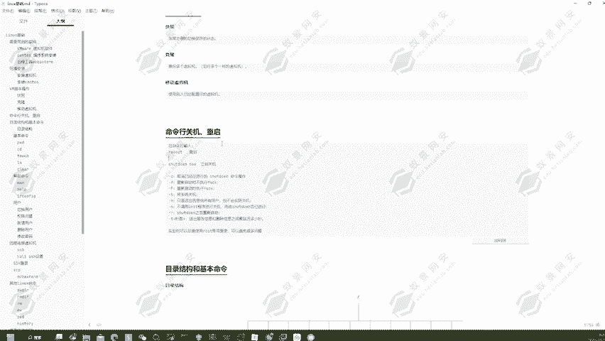

Linux 系统提供了多种命令行工具来控制系统的电源状态。默认的图形化关机操作会有 60 秒的延迟，而通过命令行，我们可以实现更精确和立即的控制。本节将重点介绍 `reboot` 和 `shutdown` 这两个核心命令。

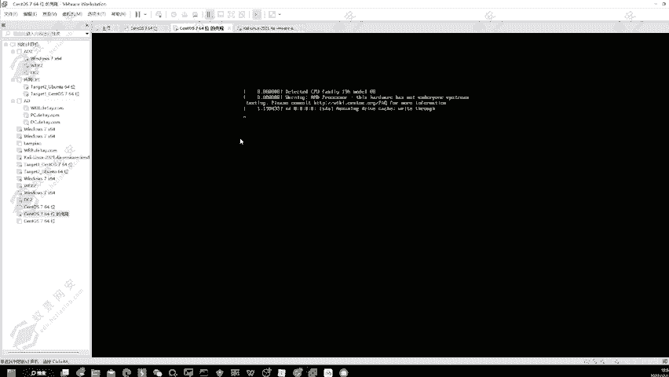

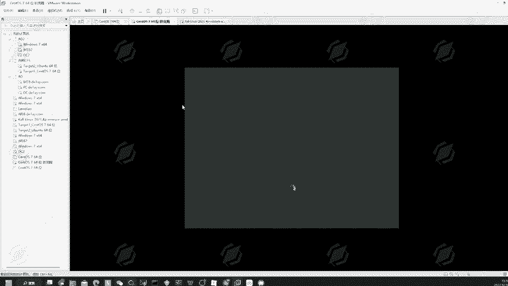

## 图形化界面与命令行的对比

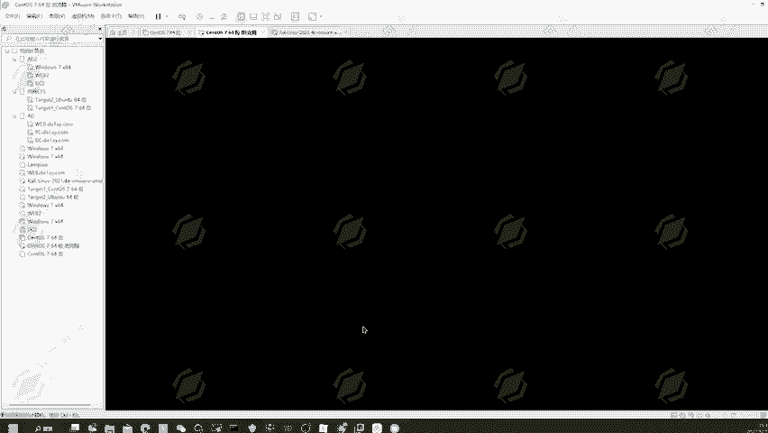

在带有图形化界面的 Kali Linux 中，点击电源按钮通常会触发一个 60 秒后关机的倒计时。这个延迟是系统默认设置。

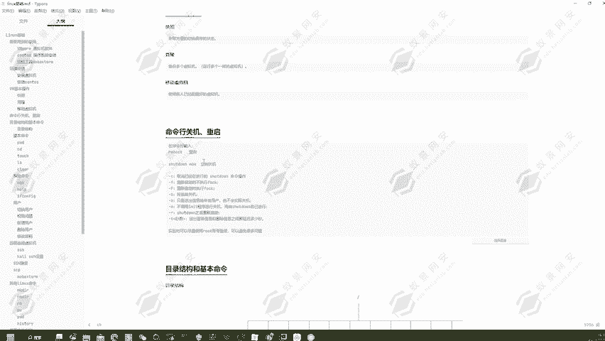


然而，在服务器环境或某些渗透测试场景中，我们可能只能通过命令行来操作系统。这时，就需要使用终端命令。

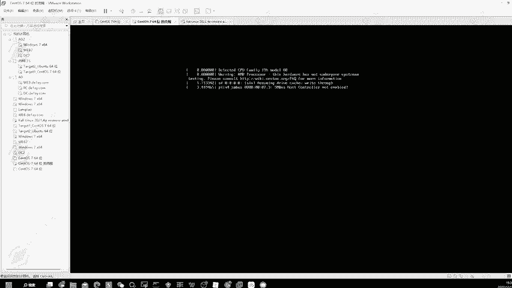

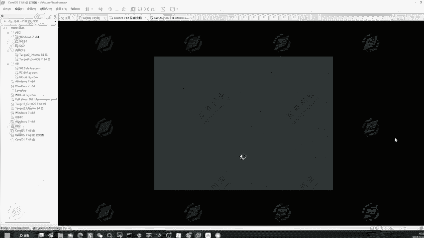

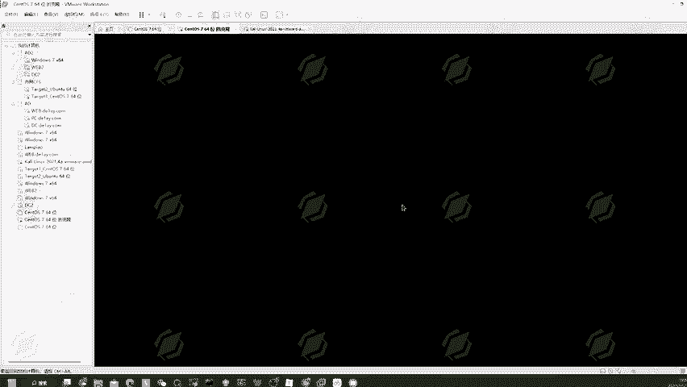

## 使用 `reboot` 命令重启系统

`reboot` 命令是最直接的重启系统的方式。它的作用等同于图形化界面中的“重启”选项。

在终端中，输入以下命令即可立即重启系统：
```bash
reboot
```
执行该命令后，系统将开始重启流程，并最终回到登录界面。

## 使用 `shutdown` 命令进行高级控制

`shutdown` 命令功能更为强大，不仅可以关机、重启，还能实现定时操作和发送警告信息。

以下是 `shutdown` 命令的一些常用参数和操作：

### 立即关机
使用 `-h` 参数配合 `now` 关键字，可以实现立即关机，不设延迟。
```bash
shutdown -h now
```

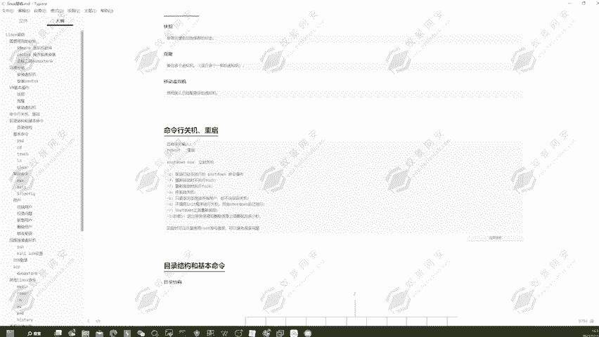

### 定时关机
可以指定一个具体的时间点让系统关机。时间格式为 `HH:MM`。
```bash
shutdown -h 23:45
```
此命令表示系统将在晚上 11 点 45 分自动关机。

### 取消计划中的关机/重启
如果设置了定时关机但想取消，可以使用 `-c` 参数。
```bash
shutdown -c
```


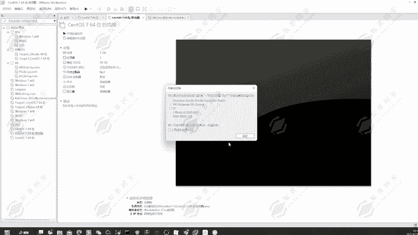

### 立即重启系统
使用 `-r` 参数配合 `now` 关键字，可以立即重启系统。
```bash
shutdown -r now
```

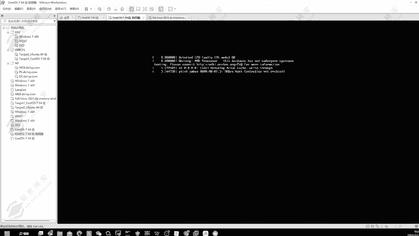

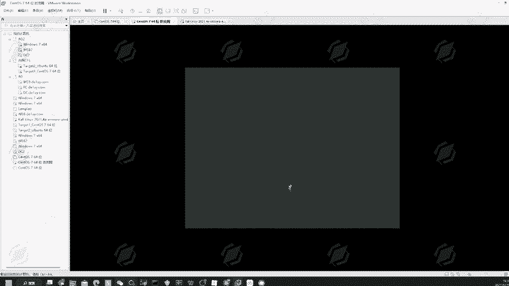

### 发送警告信息而不实际操作
`-k` 参数允许管理员向所有登录用户广播关机/重启警告，但并不会真正执行操作。这在维护前通知用户时非常有用。
```bash
shutdown -k +5 “系统将于5分钟后重启进行维护。”
```

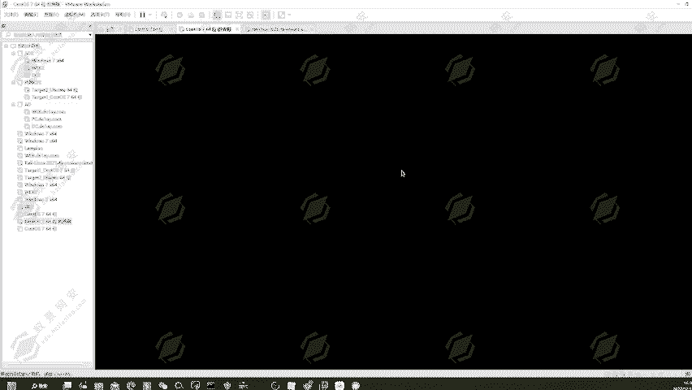

## 权限问题：使用 `root` 用户

在执行 `shutdown` 等系统级命令时，你可能会遇到“需要 root 权限”的提示。这是因为这些命令会影响整个系统，普通用户无权执行。

**在 Kali Linux 或渗透测试学习中，强烈建议直接使用 `root`（超级管理员）用户进行操作。** 这可以避免许多权限不足导致的麻烦。

### 切换到 `root` 用户
在终端中，你可以使用 `su` 命令并输入 `root` 用户的密码来切换身份。
```bash
su root
```
输入密码后，命令提示符通常会从 `$` 变为 `#`，表示你已拥有最高权限。

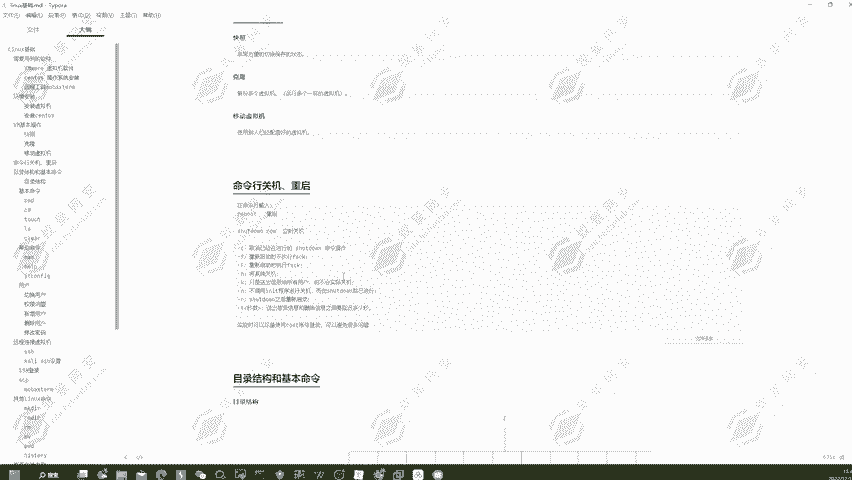

### 直接以 `root` 用户登录图形界面
在登录界面，选择“未列出”或类似选项，然后直接输入用户名 `root` 和密码，即可全程以管理员身份使用系统。

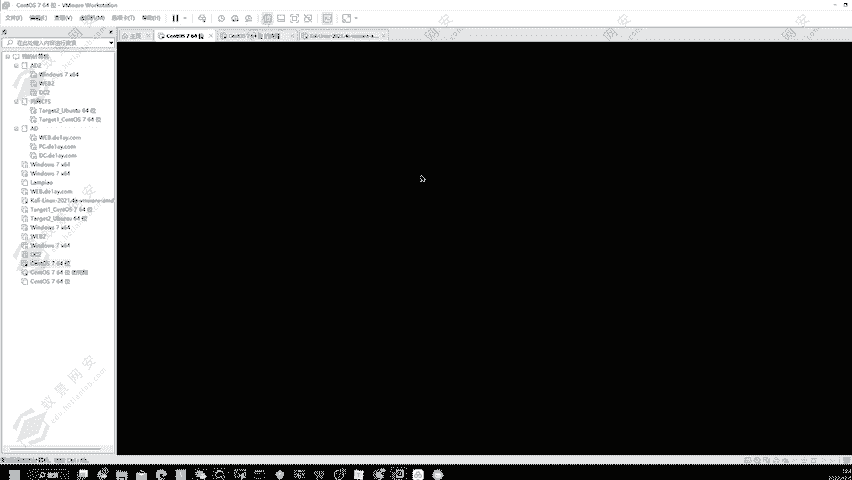

## 总结

本节课我们一起学习了 Linux 系统下关键的电源管理命令。我们介绍了 `reboot` 命令用于快速重启，以及功能更全面的 `shutdown` 命令，它支持立即/定时关机重启、取消操作和发送警告。同时，我们强调了在渗透测试环境中使用 `root` 用户的重要性，它能确保命令顺利执行，避免权限障碍。掌握这些基础操作，是流畅进行后续系统管理和安全测试的基石。