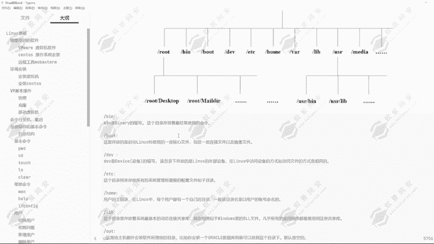
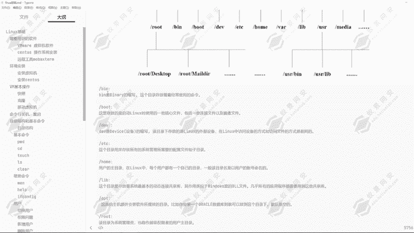
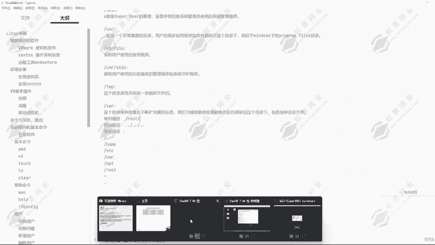

# Kali Linux渗透测试：P11：Linux目录结构 📁

在本节课中，我们将学习Linux操作系统的基础——目录结构。理解目录结构是掌握Linux系统操作、文件管理和后续渗透测试工具部署的关键第一步。

## 概述

Linux系统采用一种层次化的目录结构，所有文件和目录都从一个称为“根目录”的起点开始。本节将详细介绍这些核心目录的作用，并解释“绝对路径”与“相对路径”的概念，帮助你高效地在文件系统中导航。





---

## Linux目录结构详解

Linux的目录结构从一个根目录（`/`）开始，其下包含多个重要的二级目录。每个目录都有其特定的用途。

以下是Linux系统中一些核心目录及其功能的说明：

*   **`/bin`**：该目录是“binary”的缩写，存放着系统最常用的一些命令（可执行文件）。如果此目录下的文件被删除，对应的命令将无法运行。
*   **`/boot`**：这里存放着启动Linux系统所必需的核心文件，包括内核文件、引导加载程序（如GRUB）的配置文件等。**此目录至关重要，如果损坏或文件缺失，将导致系统无法启动。** 请不要随意修改此目录下的内容。
*   **`/dev`**：该目录是“device”的缩写，存放着Linux系统的外部设备文件。在Linux中，访问设备的方式和访问文件的方式是相同的，这体现了 **“一切皆文件”** 的设计哲学。
*   **`/etc`**：这个目录用来存放系统管理所需的所有**配置文件和子目录**。系统服务和大多数应用程序的默认配置文件通常都位于此处。
*   **`/home`**：这是普通用户的**主目录**。在Linux中，每个用户都有一个以自己的账号命名的专属目录，通常位于`/home`下。例如，用户`ye`的主目录就是`/home/ye`。
*   **`/lib`** 与 **`/lib64`**：这些目录存放着系统最基本的**动态链接共享库**，其作用类似于Windows系统中的`.dll`文件。几乎所有的应用程序都需要调用这些共享库才能正常运行。
*   **`/opt`**：该目录是“optional”的缩写，用于给主机**额外安装大型应用程序**。例如，安装Oracle数据库或某些第三方商业软件时，通常会放置在此目录下。默认情况下，此目录为空。
*   **`/root`**：该目录是**系统管理员（root用户）的主目录**。它与普通用户的`/home`目录概念类似，但独立于`/home`之外。
*   **`/sbin`**：这里存放的是**系统管理员（root用户）** 使用的系统管理程序。
*   **`/usr`**：这是一个非常重要的目录，类似于Windows系统中的`C:\Program Files`。用户的很多**应用程序和文件**都放在这个目录下。
    *   `/usr/bin`：系统用户使用的应用程序存放目录。
    *   `/usr/sbin`：超级用户使用的比较高级的管理程序和系统守护程序。
*   **`/tmp`**：这个目录用来存放**临时文件**。该目录的权限设置是**所有用户都可以进行读取、写入和删除操作**。
*   **`/var`**：该目录存放着**经常变动的内容**，例如各种**日志文件**、邮件、缓存数据等。

---

## 绝对路径与相对路径

理解了目录结构后，我们需要掌握如何在其中定位文件或目录，这就涉及到“路径”的概念。路径分为两种：绝对路径和相对路径。

### 绝对路径

**绝对路径**是从**根目录（`/`）** 开始写起的完整路径。无论当前位于哪个目录，使用绝对路径都能准确指向目标。

**示例**：假设当前在`/home/ye`目录，要切换到`/root`目录。
```bash
cd /root
```
无论当前目录在哪里，`cd /root`命令都会直接进入根目录下的`root`文件夹。

### 相对路径


**相对路径**是相对于**当前工作目录**的路径。它使用以下符号表示：
*   `.` 代表**当前目录**。
*   `..` 代表**上一级目录**。



**示例**：假设当前在`/root`目录。
1.  返回上一级目录（即根目录 `/`）：
    ```bash
    cd ..
    ```
2.  从根目录进入`/home/ye`目录：
    ```bash
    cd ./home/ye
    # 或者更简单地
    cd home/ye
    ```
    这里的`./`可以省略，因为默认就是从当前目录开始。

### 路径操作实践

上一节我们介绍了路径的概念，本节中我们通过一个例子来加深理解。假设目录结构如下，当前位于`/home/ye/Documents`：
```
/
├── home/
│   └── ye/
│       └── Documents/  (当前在此)
├── root/
└── var/
```
以下是切换目录的几种方式：
*   前往`/root`（使用绝对路径）：
    ```bash
    cd /root
    ```
*   前往`/home/ye`（使用相对路径）：
    ```bash
    cd ..          # 先回到 /home/ye
    # 或者
    cd ../..       # 先回到 /home，但这不是目标
    ```
*   从`/home/ye`前往`/root`（组合使用）：
    ```bash
    cd ../../root  # 上两级到根目录，再进入root
    ```

---

## 常用目录与命令

在日常操作和渗透测试中，以下几个目录会频繁使用：
*   **`/`**：根目录，一切操作的起点。
*   **`/home`** 与 **`/root`**：用户工作空间。
*   **`/etc`**：修改系统和服务配置。
*   **`/var/log`**：**查看系统和服务日志**，是渗透测试中信息收集的关键位置。
*   **`/opt`** 与 **`/usr`**：安装和查找第三方工具、应用程序。
*   **`/tmp`**：存放临时数据，所有用户可写，常被用于某些攻击的临时存储。

可以使用 `pwd` 命令查看当前所在的**绝对路径**。
```bash
pwd
```

---

## 总结


本节课中，我们一起学习了Linux系统的目录结构。我们了解了从根目录（`/`）开始的各个核心目录（如`/bin`， `/etc`， `/home`， `/var`等）的特定用途。同时，我们掌握了**绝对路径**（从`/`开始）和**相对路径**（使用`.`和`..`）的区别与使用方法，这是高效管理Linux文件系统的基础。理解这些概念，将为后续学习Linux命令和部署安全工具打下坚实的基础。