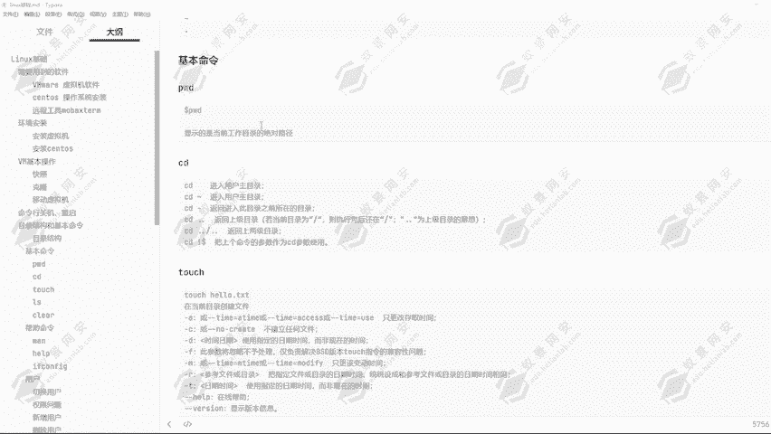
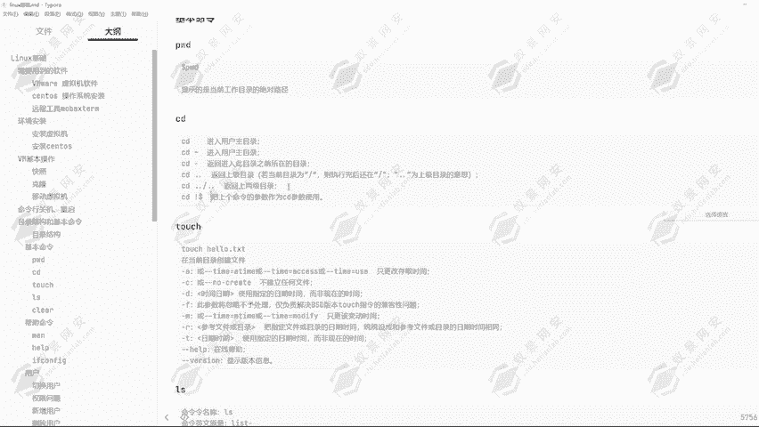
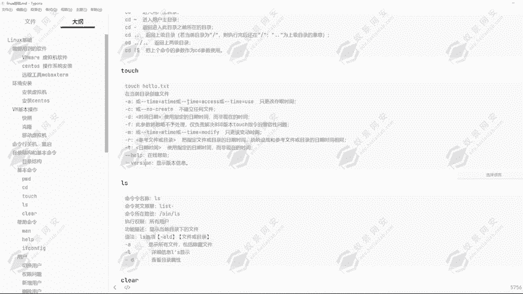
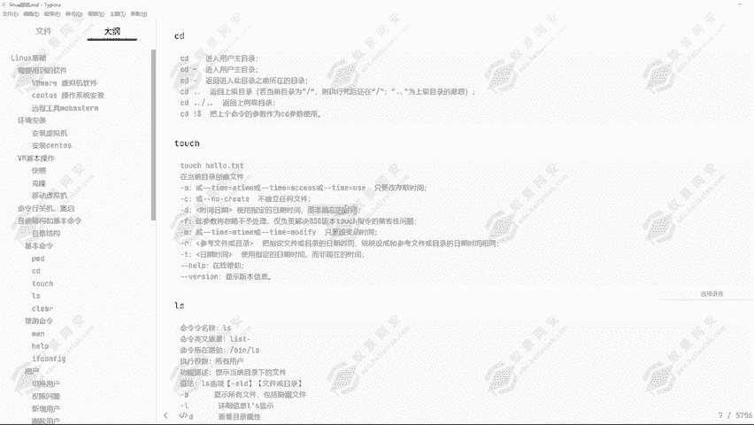
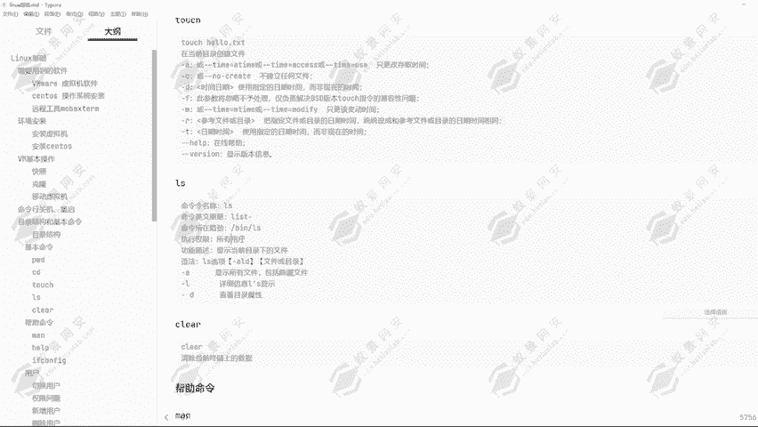
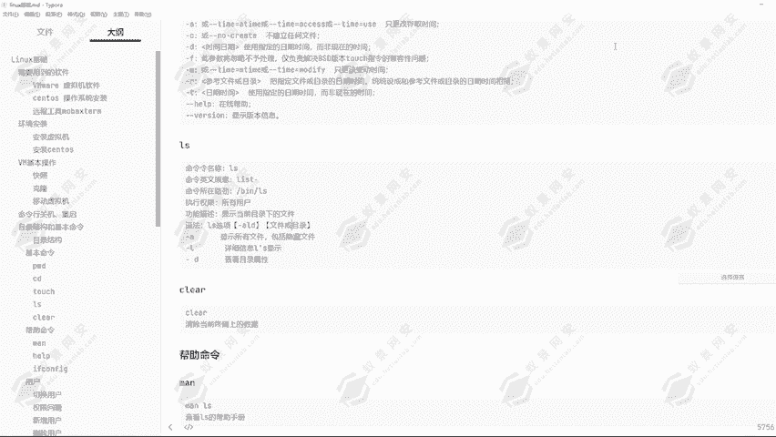

# Linux基础命令教程：P12：6.Linux基本命令

## 📖 概述
在本节课中，我们将学习Linux操作系统中最基础且最常用的一些命令。掌握这些命令是进行后续渗透测试、系统管理和网络安全操作的基础。我们将从查看当前目录开始，逐步学习如何切换目录、创建文件、查看文件列表、清屏以及获取命令帮助。



---

## 📂 1. 定位与导航：PWD与CD命令

上一节我们介绍了Linux系统的目录结构，本节中我们来看看如何确定自己所在的位置以及如何在目录间移动。

### PWD命令：显示当前目录
`pwd`命令用于显示当前工作目录的绝对路径。当你不确定自己位于文件系统的哪个位置时，可以使用此命令。

**命令格式：**
```bash
pwd
```
执行该命令后，终端会打印出你当前所在目录的完整路径。

### CD命令：切换目录
`cd`命令用于改变当前工作目录。它是导航文件系统的主要工具。

以下是`cd`命令的一些常见用法：

*   **`cd` 或 `cd ~`**：切换到当前用户的主目录（例如 `/home/ye` 或 `/root`）。
*   **`cd ..`**：返回上一级目录。
*   **`cd ../..`**：返回上两级目录。
*   **`cd -`**：切换到上一个工作目录。
*   **`cd !$`**：将上一个命令的参数作为`cd`的参数使用（需在支持历史扩展的shell中）。

通过结合`pwd`和`cd`命令，你可以在Linux文件系统中自由定位和移动。

---

## 📄 2. 文件操作：TOUCH命令



在熟悉了目录导航后，我们来看看如何创建文件。`touch`命令的主要用途是创建新的空文件或更新现有文件的时间戳。

**命令格式：**
```bash
touch [选项] 文件名
```

**基本用法：**
*   在当前目录创建文件：`touch 张三.txt`
*   在指定路径创建文件：`touch /home/ye/ye.txt`

`touch`命令包含许多参数，用于精细控制文件的时间属性，这在某些特定场景（如渗透测试中伪造文件时间）非常有用。

以下是`touch`命令的部分参数列表：
*   `-a`：只更改文件的访问时间。
*   `-c`：如果文件不存在，则不创建它。
*   `-d`：使用指定的日期时间，而非当前时间。
*   `-m`：只更改文件的修改时间。

---

## 📋 3. 查看内容：LS命令


创建了文件之后，我们需要查看目录下有哪些内容。`ls`命令用于列出目录中的文件和子目录。

**命令格式：**
```bash
ls [选项] [目录或文件]
```





如果不指定目录或文件，`ls`会显示当前目录下的所有**非隐藏**项目。

以下是`ls`命令的一些常用选项：

*   **`ls -a`**：显示所有文件和目录，包括以点`.`开头的隐藏文件。
*   **`ls -l`**：以长格式显示详细信息，包括权限、所有者、大小和修改时间。
*   **`ls -la`**：结合了`-a`和`-l`的功能，显示所有文件（含隐藏文件）的详细信息。
*   **`ls -la 文件名`**：查看指定文件的详细信息。



在Linux中，任何以点`.`开头的文件或目录都被视为“隐藏”的，普通的`ls`命令不会显示它们，必须使用`-a`选项。

---

## 🧹 4. 终端管理：CLEAR命令



在使用终端时，屏幕上可能会积累大量历史命令和输出，显得杂乱。`clear`命令用于清除当前终端屏幕上的所有内容，给你一个干净的起点。

**命令格式：**
```bash
clear
```
执行后，之前的所有输入和输出都会被清空，光标回到屏幕左上角。

---

## ❓ 5. 获取帮助：MAN与--HELP

Linux系统为几乎所有命令都提供了详细的帮助文档。对于初学者，学会查阅帮助是至关重要的技能。

主要有两种获取命令帮助的方式：

1.  **`man`命令**：查看命令的完整手册页（manual page）。
    ```bash
    man ls
    ```
    在手册页中，你可以用**回车键**逐行浏览，用**空格键**翻页，查看完毕后按 **`q`** 键退出。

2.  **`--help`选项**：大多数命令都支持此选项，提供一份更简洁的使用说明。
    ```bash
    ls --help
    ```


---

## 🌐 6. 网络信息：IFCONFIG命令

最后，我们了解一个查看网络配置的命令。`ifconfig`（interface configuration）用于显示和配置网络接口参数。

**命令格式：**
```bash
ifconfig
```
执行该命令会列出所有活跃的网络接口（如 `eth0`, `ens33`）信息，包括：
*   **IP地址**：设备的网络地址。
*   **MAC地址**：设备的物理硬件地址。
*   **子网掩码**：定义网络范围。
*   接收/发送的数据包统计。

如果某个接口没有分配IP地址（例如显示`inet`地址为空），则表明该接口尚未连接到网络或未正确配置。

---

## 📝 总结
本节课我们一起学习了Linux系统中最核心的一组基础命令：
*   **`pwd`** 和 **`cd`** 用于在文件系统中定位和导航。
*   **`touch`** 用于创建文件或修改文件时间戳。
*   **`ls`** 用于列出目录内容，配合 `-a` 和 `-l` 选项可以查看详细信息。
*   **`clear`** 用于清理终端屏幕。
*   **`man`** 和 **`--help`** 是获取命令使用帮助的两种主要途径。
*   **`ifconfig`** 用于查看网络接口的配置信息。


熟练运用这些命令是掌握Linux操作的第一步。下节课，我们将深入讲解Linux中的用户切换与权限管理。