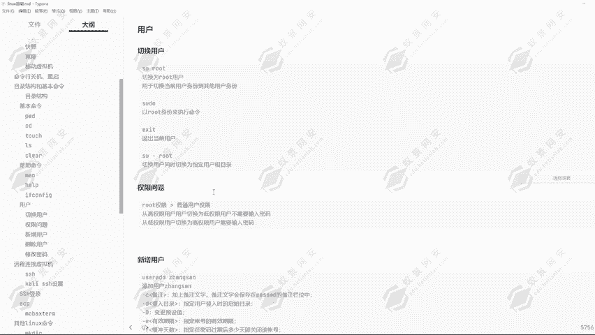
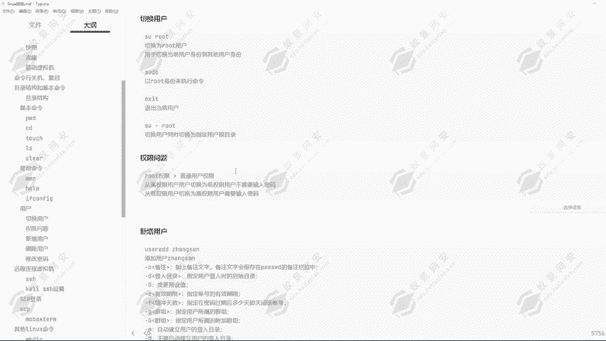
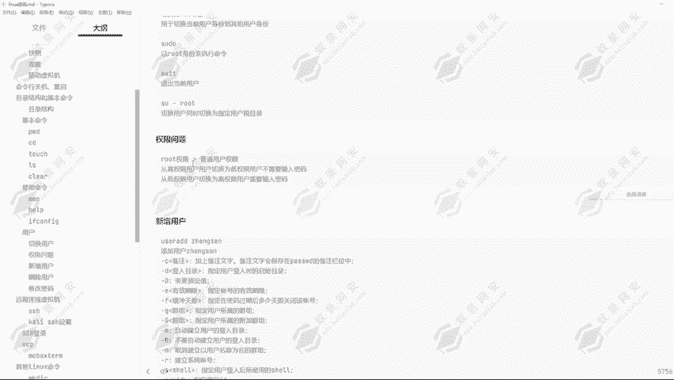
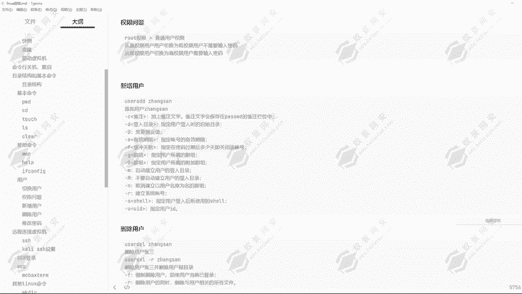
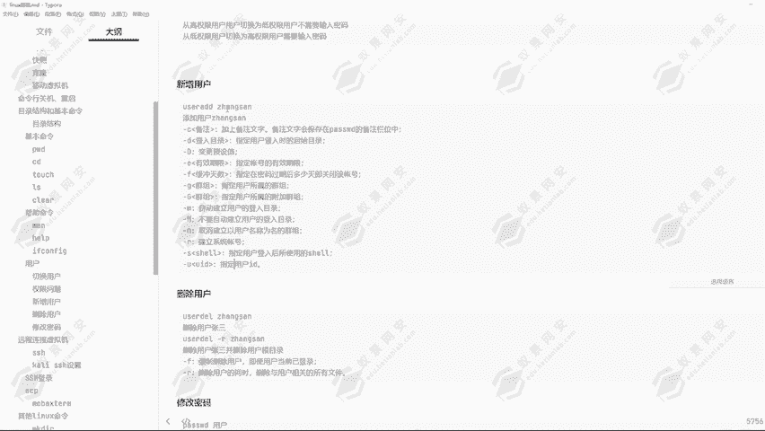
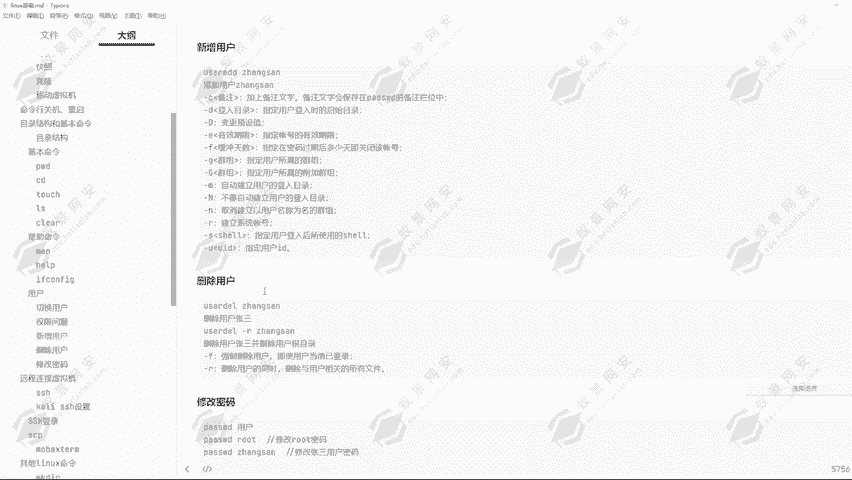
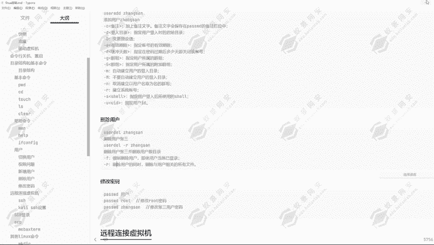
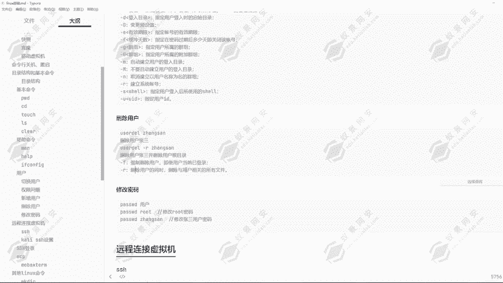
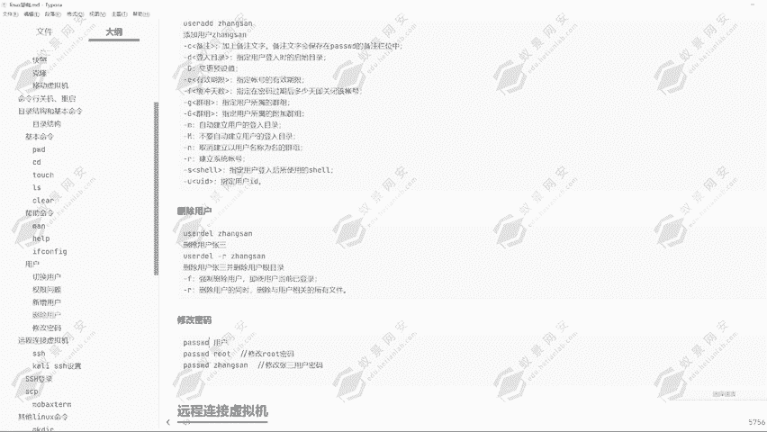

# Kali Linux渗透测试：P13：Linux用户操作 🔐

在本节课中，我们将学习Linux系统中的用户管理操作，包括用户切换、权限原理、用户创建与删除以及密码修改。理解这些基础概念对于后续的渗透测试和安全操作至关重要。

---

## 用户切换与权限原理 🔄

上一节我们介绍了Linux的基本命令，本节中我们来看看如何切换用户以及背后的权限逻辑。

通过 `su` 命令可以切换当前用户身份到其他用户身份。例如，从 `root` 用户切换到 `yeyan` 用户。

```bash
su yeyan
```

从 `root` 用户切换到普通用户（如 `yeyan`）时，**不需要输入密码**。但从普通用户切换回 `root` 用户时，**需要输入 `root` 用户的密码**。

```bash
su root
```

这背后的原理是权限高低问题。**从高权限用户切换到低权限用户不需要密码，但从低权限用户切换到高权限用户需要验证高权限用户的密码。**

使用 `exit` 命令可以退出当前用户，返回到上一个用户身份。

---

## 以root身份执行命令 ⚡

有时，普通用户需要临时执行一些需要 `root` 权限的命令，这时可以使用 `sudo` 命令。



`sudo` 命令允许授权用户以 `root` 身份执行命令。例如，普通用户尝试执行关机命令：

```bash
sudo shutdown -h now
```

系统会提示输入**当前用户的密码**（而非 `root` 密码）。能否使用 `sudo` 取决于用户是否在 `/etc/sudoers` 配置文件中。Kali Linux 的默认 `kali` 用户通常拥有 `sudo` 权限。

如果用户不在 `sudoers` 文件中，则会收到 “user is not in the sudoers file” 的提示。



---

## 切换用户并跳转目录 📂

使用 `su` 命令时，可以配合 `-` 参数，在切换用户的同时，将工作目录切换到目标用户的**家目录**。



例如，从任何位置切换到 `root` 用户并进入 `/root` 目录：

```bash
su - root
```

输入密码后，执行 `pwd` 命令，会显示当前位于 `/root`。

---



## 用户管理：创建与删除 👤



只有 `root` 用户拥有创建和删除其他用户的权限。

以下是创建用户的相关命令和参数：

*   `useradd [用户名]`：创建新用户。
*   `-c`：添加备注。
*   `-d`：指定用户的家目录。
*   `-g`：指定用户所属的初始组。
*   `-s`：指定用户登录后使用的shell。
*   `-u`：指定用户的UID。

**创建用户示例：**
创建一个名为 `zhangsan` 的用户，系统会自动在 `/home` 目录下创建其家目录 `/home/zhangsan`。

```bash
useradd zhangsan
```

**删除用户示例：**
删除用户时，如果只使用 `userdel [用户名]`，只会删除用户账户，其家目录会保留。

```bash
userdel zhangsan
```



若要**同时删除用户及其家目录**，需要使用 `-r` 参数。



```bash
userdel -r zhangsan
```

参数说明：
*   `-r`：删除用户的同时，删除其家目录及邮件池。
*   `-f`：强制删除，即使用户当前已登录。

---



## 密码管理 🔑

修改密码使用 `passwd` 命令，但 `root` 用户和普通用户的权限不同。

**`root` 用户修改密码：**
`root` 用户可以为任何用户修改密码，且**不受密码复杂度规则限制**，也无需知道原密码。

```bash
passwd yeyan
# 随后直接输入新密码即可
```

**普通用户修改密码：**
普通用户只能修改自己的密码，且必须遵守系统的密码策略（如最小长度、复杂度等）。

```bash
passwd
# 首先输入当前密码，然后按照要求设置新密码
```

---

## 总结 📝

本节课中我们一起学习了Linux用户操作的核心知识：
1.  使用 `su` 命令切换用户，并理解了高/低权限切换时的密码验证逻辑。
2.  使用 `sudo` 命令以 `root` 身份执行特定命令。
3.  使用 `su -` 在切换用户时同时跳转到其家目录。
4.  使用 `useradd` 和 `userdel -r` 命令创建和彻底删除用户。
5.  区分了 `root` 用户和普通用户使用 `passwd` 命令修改密码的不同权限和规则。



掌握这些用户管理操作是进行系统管理和后续安全测试的基础。下一节课，我们将学习如何通过SSH远程连接到虚拟机。