# Kali Linux渗透测试：P14：Linux远程连接 🔗

## 概述
在本节课中，我们将学习如何配置并使用SSH远程连接Linux虚拟机。掌握这项技能后，您无需每次都打开虚拟机软件，可以直接通过远程工具管理您的系统，这对于日常操作和未来管理云服务器都至关重要。

---

## 开启CentOS的SSH服务

上一节我们介绍了Linux的基本网络命令，本节中我们来看看如何配置SSH服务以实现远程连接。

首先，我们需要在虚拟机中开启并配置SSH服务。请确保您已使用`root`用户权限进行操作，因为修改系统配置文件需要最高权限。

以下是配置SSH服务的具体步骤：

1.  使用`vim`编辑器打开SSH服务配置文件。
    ```bash
    vim /etc/ssh/sshd_config
    ```
2.  在配置文件中，找到 `#PermitRootLogin yes` 这一行。开头的 `#` 符号表示该行被注释。
3.  按 `i` 键进入编辑模式，删除 `#` 符号以取消注释，允许root用户远程登录。
4.  按 `ESC` 键退出编辑模式，然后输入 `:wq` 并按回车，保存文件并退出vim编辑器。

配置文件修改完成后，我们需要启动SSH服务。

```bash
systemctl start sshd
```

服务启动后，可以使用以下命令检查22号端口是否已处于监听状态，这表示SSH服务已就绪。

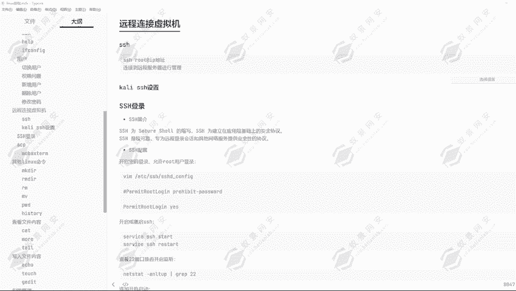

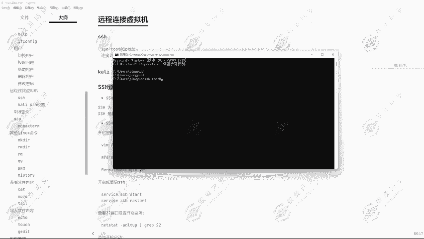

```bash
netstat -anp | grep :22
```

如果看到 `0.0.0.0:22` 或 `:::22` 的监听状态，说明SSH服务已成功开启。

---

## 使用系统命令行连接SSH

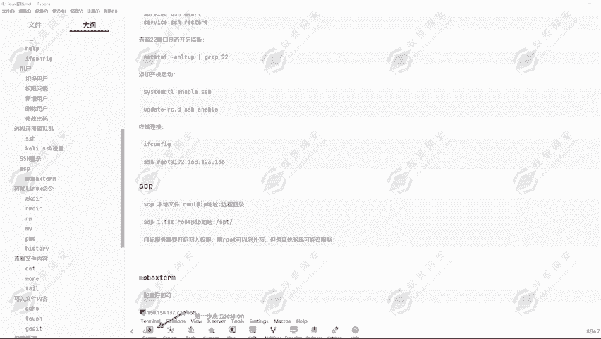

服务端配置好后，我们就可以从客户端进行连接了。首先，我们需要获取虚拟机的IP地址。

在虚拟机终端中执行：
```bash
ifconfig
```
记下 `ens33` 或类似网卡对应的IP地址（例如 `192.168.234.5`）。

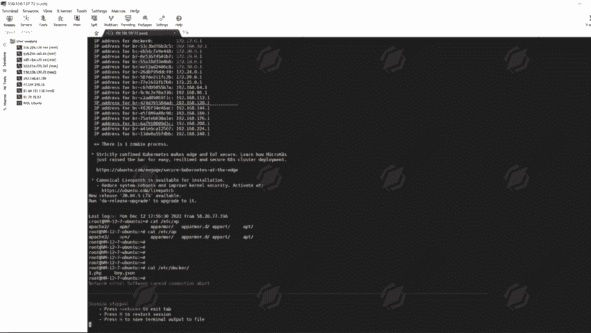

接下来，在您的Windows物理机上打开命令提示符（CMD），使用以下命令格式进行连接：
```bash
ssh root@[虚拟机IP地址]
```
例如：
```bash
ssh root@192.168.234.5
```
首次连接时会提示确认主机密钥，输入 `yes` 即可。然后输入root用户的密码（例如 `123456`）。连接成功后，您将进入虚拟机的终端，可以执行 `ls`、`pwd` 等命令进行操作。

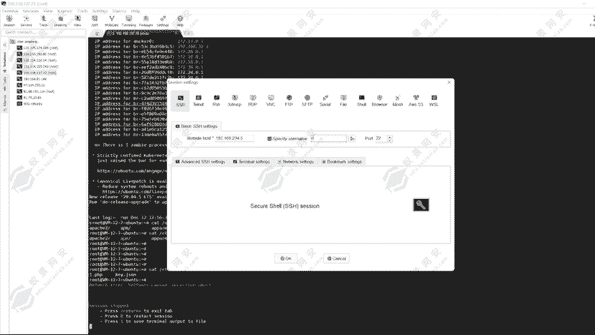

---

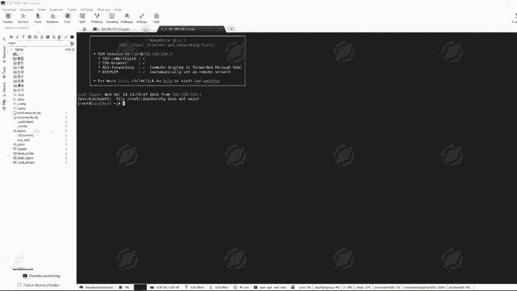

## 使用MobaXterm进行图形化远程管理

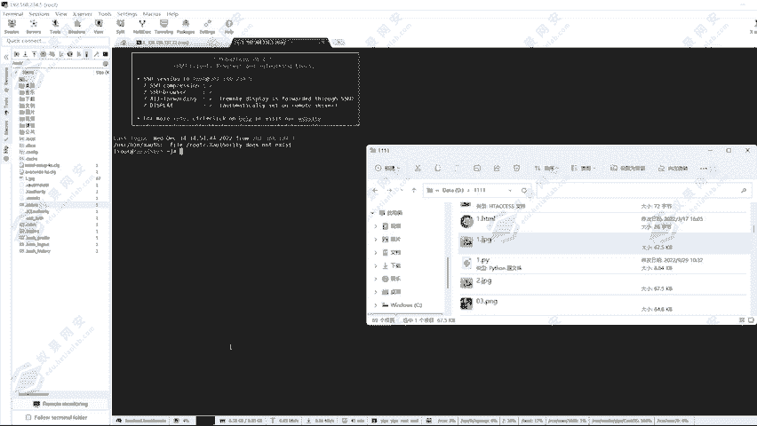

虽然命令行可以连接，但使用专业的远程管理工具会更加方便。下面我们介绍如何使用MobaXterm。

1.  打开MobaXterm，点击左上角的 **Session** 按钮。
2.  在弹出的窗口中选择 **SSH**。
3.  在 **Remote host** 栏中输入虚拟机的IP地址（如 `192.168.234.5`）。
4.  在 **Username** 栏中输入 `root`。
5.  点击 **OK**，输入密码后即可连接。

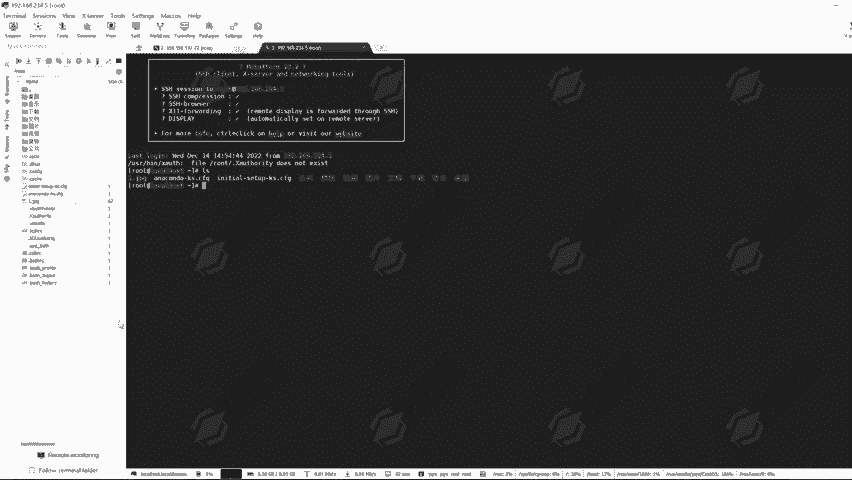

连接成功后，界面左侧会显示服务器端的文件目录结构。您可以直接通过拖拽的方式上传文件到服务器，也可以从服务器下载文件，并享受复制粘贴等便利功能。

---

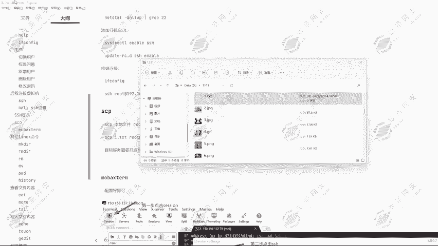

## 使用SCP命令传输文件

除了图形化工具，我们还可以通过命令行工具 `scp` 在本地和远程服务器之间安全地传输文件。

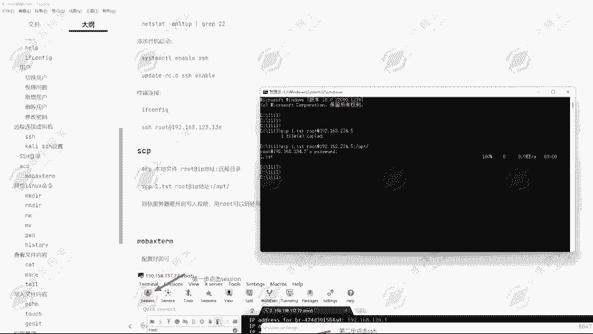

以下是文件传输命令的示例：

*   **将本地文件上传到远程服务器**：
    ```bash
    scp [本地文件路径] root@[远程服务器IP]:[远程目标路径]
    ```
    例如，将本地的 `2.txt` 上传到远程服务器的 `/opt` 目录：
    ```bash
    scp ./2.txt root@192.168.234.5:/opt
    ```

*   **从远程服务器下载文件到本地**：
    ```bash
    scp root@[远程服务器IP]:[远程文件路径] [本地目标路径]
    ```
    例如，将远程服务器 `/opt/2.txt` 下载到本地当前目录：
    ```bash
    scp root@192.168.234.5:/opt/2.txt ./
    ```

执行命令后输入密码，即可完成传输。您可以在相应目录下使用 `ls` 和 `cat` 命令验证文件是否传输成功。

---

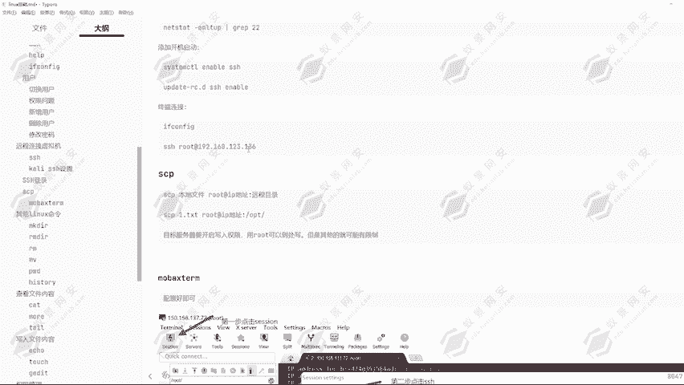

## 总结
本节课中我们一起学习了Linux远程连接的核心技能。我们首先在CentOS上配置并启动了SSH服务，然后分别使用系统自带的命令行工具和图形化工具MobaXterm成功连接到远程虚拟机。最后，我们还掌握了使用 `scp` 命令在本地与远程服务器间传输文件的方法。这些技能是进行后续渗透测试和系统管理的基础。下一节课，我们将学习更多Linux文件操作命令，如创建、删除文件和目录等。