# Kali Linux渗透测试教程：P15：Linux其他基本命令

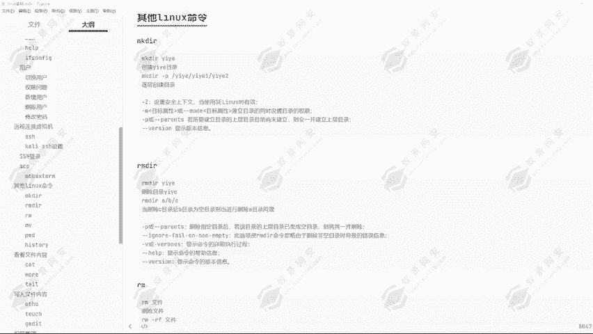

## 概述
在本节课中，我们将学习Linux系统中几个非常实用的基本命令，包括创建目录、删除目录与文件、移动/重命名文件，以及查看命令历史。这些命令是日常操作和系统管理的基础。

---

## 创建目录：`mkdir`命令
上一节我们介绍了创建文件的命令，但创建文件只能创建文件。本节中我们来看看如何创建目录。

`mkdir`命令的作用是帮助创建对应的目录。例如，要创建一个以“yiyi”为名的目录，就可以通过`mkdir yiyi`来创建。

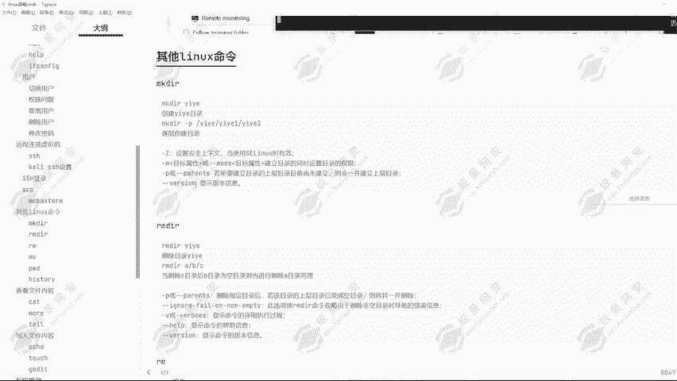

这个命令的功能不止于此。我们可以进行逐层创建目录。例如，现在想要在`/etc`下创建一个`yiyi`目录，`yiyi`下面又想创建一个`yiyi1`目录，`yiyi1`目录下又想创建一个`yiyi2`目录。这时就可以使用`-p`参数进行逐层创建。

`mkdir`命令还有其他参数：
*   `-Z`：设置安全上下文，在使用SELinux时有效。
*   `-m`：建立目录的同时设置目录的权限。
*   `-p`：逐层创建目录。
*   `-v`：显示详细信息。
*   `--version`：显示版本信息。

下面进行演示。

**操作演示：**
1.  切换到`/opt`目录，尝试创建目录`yiyi`：
    ```bash
    mkdir yiyi
    ```
    提示权限不够，这再次说明操作Linux服务器时常需要root权限。使用`su root`切换为root用户。
2.  使用`mkdir`创建`yiyi`目录：
    ```bash
    mkdir yiyi
    ```
    `yiyi`目录已创建在根目录下。可以进入该目录并创建文件。
3.  使用`-p`参数一次性创建多层目录：
    ```bash
    mkdir -p yiyi/yiyi1/yiyi2/yiyi3
    ```
    执行后，当前目录下会出现`yiyi`目录，其下包含`yiyi1`，`yiyi1`下包含`yiyi2`，`yiyi2`下包含`yiyi3`。这就是`mkdir`创建目录的方式。

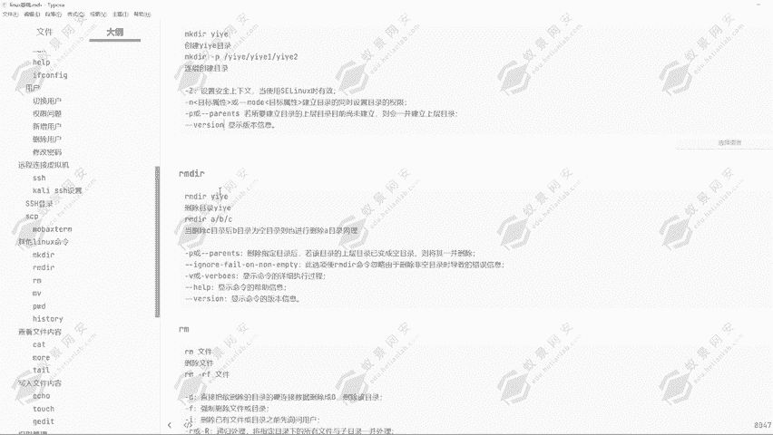

---

## 删除目录：`rmdir`命令
既然能够创建目录，肯定也能够删除目录。删除目录可以使用`rmdir`命令。

**操作演示：**
1.  回到根目录，尝试删除`yiyi`目录：
    ```bash
    rmdir yiyi
    ```
    删除失败。因为`yiyi`目录下包含`yiyi1`目录，`yiyi1`目录下又包含文件。每个目录下都有内容会导致删除失败。
2.  进入`yiyi3`目录（该目录为空），尝试删除：
    ```bash
    rmdir yiyi3
    ```
    能够正常删除。因为`yiyi3`目录下没有任何文件，可以直接删除，无需添加参数。
3.  使用`rmdir`删除递归目录（即同时删除多个目录），这与创建目录时使用的方式类似。

我们可以一次性创建多层目录`yiyi/yiyi1/yiyi2/yiyi3`，也可以通过`rmdir`同时删除`yiyi1`、`yiyi2`、`yiyi3`三个目录。当然，前提是目录为空。可以使用`-p`参数进行逐层删除。

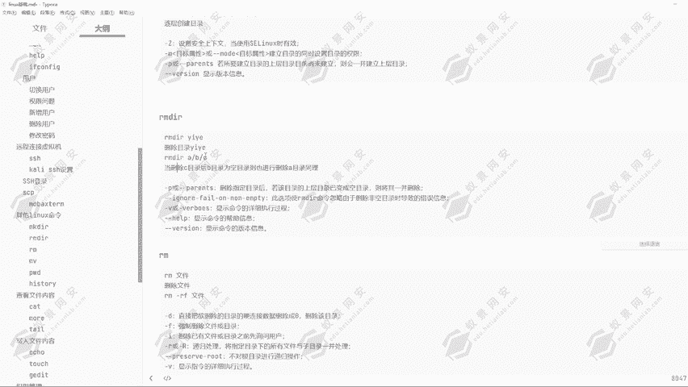

**操作演示：**
1.  回到根目录，使用`rmdir -p`进行逐层删除：
    ```bash
    rmdir -p yiyi/yiyi1/yiyi2
    ```
    提示`yiyi`目录删除失败，因为`yiyi`目录下有一个`passwd.txt`文件。但`yiyi`目录下的`yiyi1`和`yiyi2`目录已删除成功。
2.  如果目录为空，删除就能成功。先删除`passwd.txt`文件，再执行上述命令，`yiyi`目录就能被正常删除。

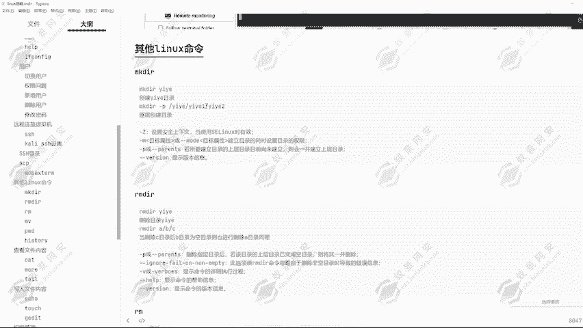

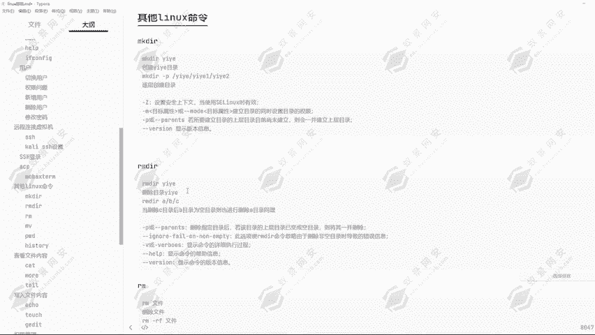

这就是`rmdir`命令。

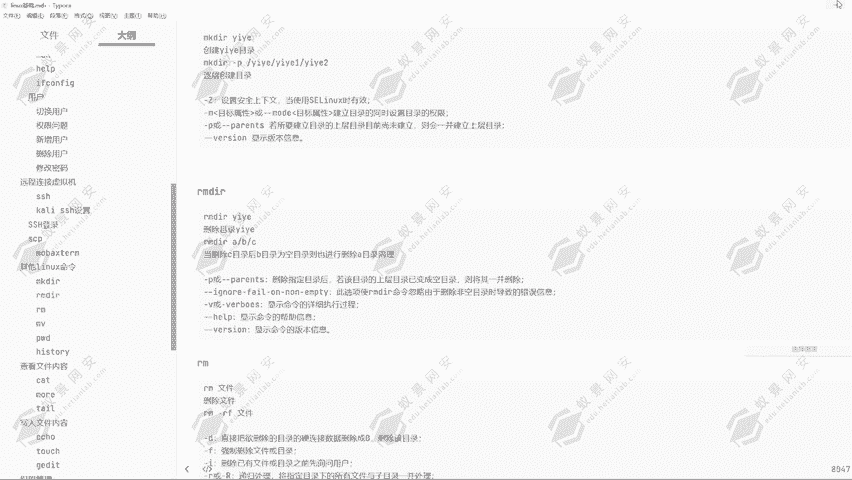

---

## 删除文件与目录：`rm`命令
`rm`命令用于删除文件。例如，通过`rm`选定对应的文件进行删除。之前演示过，通过`rm`能直接删除`passwd.txt`文件。

`rm`命令的参数：
*   `-r`：递归处理，将指定目录下的所有文件与子目录一并删除。
*   `-f`：强制删除文件或目录。
*   `-v`：显示指令执行过程。

只要使用`rm -r`参数，不管目标是目录还是文件，都可以进行强制全部删除。

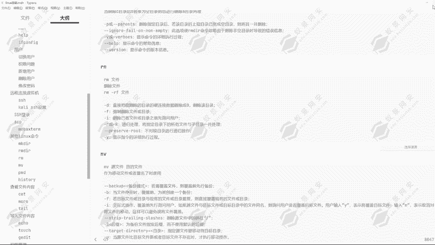

**操作演示：**
1.  创建一个多层目录和文件结构：
    ```bash
    mkdir -p yiyi/yiyi1/yiyi2
    cd yiyi/yiyi1
    touch 1.txt
    cd ../yiyi2
    touch 2.txt
    cd ../..
    touch yiyi.txt
    ```
2.  使用`rm -rf`命令删除`yiyi`目录及其下所有内容：
    ```bash
    rm -rf yiyi
    ```
    `yiyi`目录及其所有子目录和文件被全部删除，且不会进行任何确认询问。

> **重要警告**：`rm -rf /*`这条命令**绝对不要执行**。它的意思是删除根目录下的所有内容。无论你是做运维还是安全，在入侵到服务器后也不允许执行此命令，这会导致系统崩溃。

---

## 移动与重命名：`mv`命令
`mv`命令一般用于重命名操作，相当于Windows操作系统里的剪切功能。它能把文件进行复制，同时销毁原文件，移动到指定目录。通过这个命令可以进行重命名。

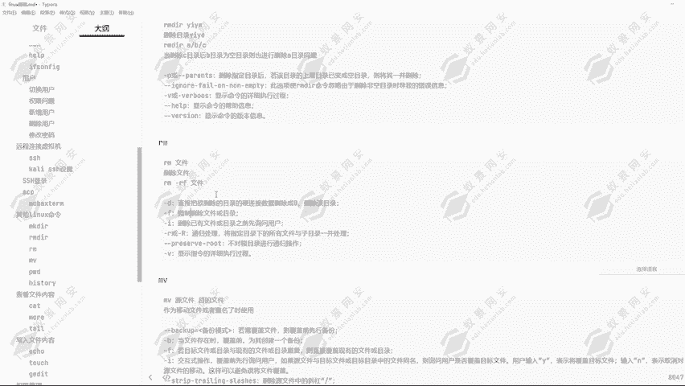

**操作演示：**
1.  创建一个文件`yiyi.txt`。
2.  使用`cp`命令将其复制到`/opt`目录下：
    ```bash
    cp yiyi.txt /opt
    ```
    此时当前目录和`/opt`目录下都有`yiyi.txt`文件。
3.  如果不希望根目录下有`yiyi.txt`文件，想直接移动到其他地方并改名，可以使用`mv`命令：
    ```bash
    mv yiyi.txt /tmp/yiyi666.txt
    ```
    执行后，原`yiyi.txt`文件消失。进入`/tmp`目录，可以看到`yiyi666.txt`文件已存在。
4.  使用`mv`命令仅进行重命名（不移动）：
    ```bash
    mv yiyi666.txt yiyi.txt
    ```
    文件位置不变，但名称已更改。

这就是`mv`命令在日常中的主要操作。它还有很多其他参数可供选择。

---

## 查看路径与命令历史
接下来看看另外两个常用命令。

**`pwd`命令**
`pwd`命令用于显示当前所在的路径。

**`history`命令**
`history`命令用于显示当前的历史命令。它的常用参数有：
*   `-c`：清空当前历史命令。
*   `-a`：将历史命令缓冲区中的命令写入历史命令文件。
*   `-r`：将历史命令文件中的命令读入当前历史命令缓冲区。
*   `-w`：将当前历史命令缓冲区命令写入历史命令文件。

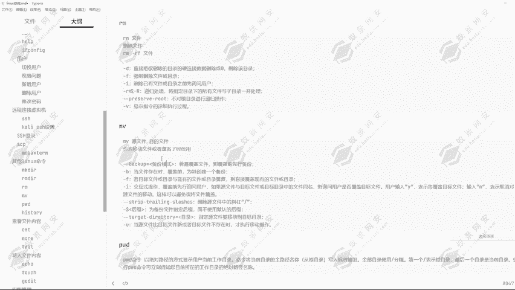

实际上，这些参数不经常使用。我们主要用它来查看之前输入过的命令。通过这条命令，可以看到之前运行过哪些命令。

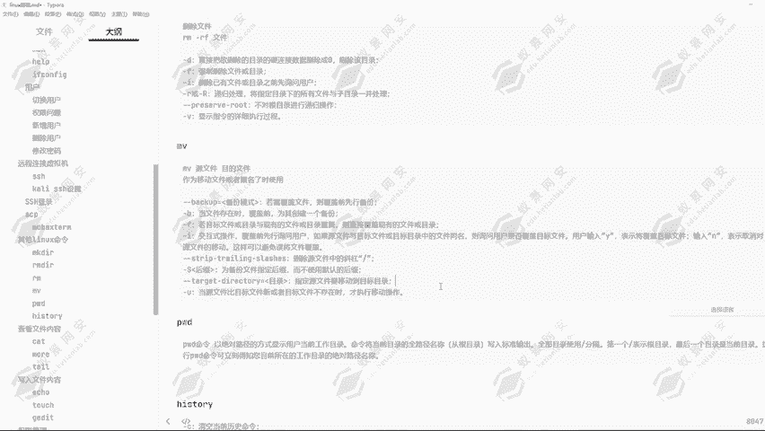

**操作演示：**
```bash
history
```
执行后，可以详细看到之前输入的历史命令。

这条命令在做应急排查时也有重要性。因为别人入侵后可能没有清除历史操作命令，这时我们就能知道他在电脑上运行了哪些命令，操作了哪些手段。

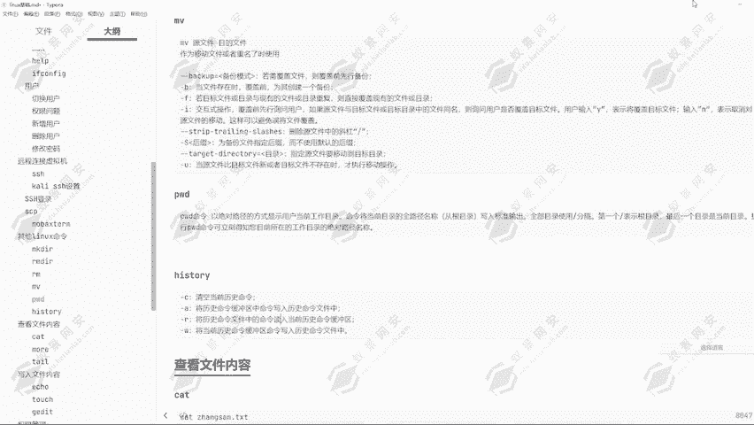

---

## 总结
本节课我们一起学习了Linux系统中的几个基础命令：使用`mkdir`创建目录（特别是`-p`参数创建多层目录），使用`rmdir`删除空目录，使用`rm`删除文件或目录（**特别注意`rm -rf`的危险性**），使用`mv`移动或重命名文件，以及使用`pwd`查看当前路径和`history`查看命令历史。这些是进行后续文件操作和系统管理的基础。

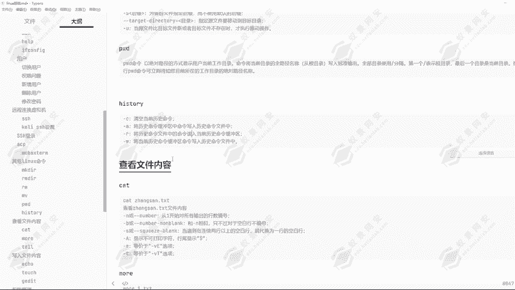

下节课我们将为大家讲解查看文件内容的方式。